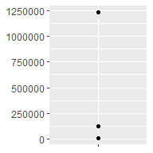

# 10 Function factories
\index{function factories}

## 10.1 Introduction

A __function factory__ is a function that makes functions. Here's a very simple example: we use a function factory (`power1()`) to make two child functions (`square()` and `cube()`):


```r
power1 <- function(exp) {
  function(x) {
    x ^ exp
  }
}

square <- power1(2)
cube <- power1(3)
```

Don't worry if this doesn't make sense yet, it should by the end of the chapter!

\index{manufactured functions}
\index{functions!manufactured}
I'll call `square()` and `cube()` __manufactured functions__, but this is just a term to ease communication with other humans: from R's perspective they are no different to functions created any other way. 


```r
square(3)
```

```
## [1] 9
```

```r
cube(3)
```

```
## [1] 27
```

You have already learned about the individual components that make function factories possible:

* In Section \@ref(first-class-functions), you learned about R's first-class 
  functions. In R, you bind a function to a name in the same way as you bind
  any object to a name: with `<-`.

* In Section \@ref(function-environments), you learned that a function
  captures (encloses) the environment in which it is created.

* In Section \@ref(execution-environments), you learned that a function 
  creates a new execution environment every time it is run. This environment
  is usually ephemeral, but here it becomes the enclosing environment of 
  the manufactured function.

In this chapter, you'll learn how the non-obvious combination of these three features leads to the function factory. You'll also see examples of their usage in visualisation and statistics.

Of the three main functional programming tools (functionals, function factories, and function operators), function factories are the least used. Generally, they don't tend to reduce overall code complexity but instead partition complexity into more easily digested chunks. Function factories are also an important building block for the very useful function operators, which you'll learn about in Chapter \@ref(function-operators).

### Outline {-}

* Section \@ref(factory-fundamentals) begins the chapter with an explanation
  of how function factories work, pulling together ideas from scoping and 
  environments. You'll also see how function factories can be used to implement
  a memory for functions, allowing data to persist across calls.

* Section \@ref(graph-fact) illustrates the use of function factories with 
  examples from ggplot2. You'll see two examples of how ggplot2 works
  with user supplied function factories, and one example of where ggplot2 
  uses a function factory internally.

* Section \@ref(stat-fact) uses function factories to tackle three challenges from
  statistics: understanding the Box-Cox transform, solving maximum likelihood
  problems, and drawing bootstrap resamples. 

* Section \@ref(functional-factories) shows how you can combine function 
  factories and functionals to rapidly generate a family of functions from data.

### Prerequisites {-}

Make sure you're familiar with the contents of Sections \@ref(first-class-functions) (first-class functions), \@ref(function-environments) (the function environment), and \@ref(execution-environments) (execution environments) mentioned above.

Function factories only need base R. We'll use a little [rlang](https://rlang.r-lib.org) to peek inside of them more easily, and we'll use [ggplot2](https://ggplot2.tidyverse.org) and [scales](https://scales.r-lib.org) to explore the use of function factories in visualisation.


```r
library(rlang)
library(ggplot2)
library(scales)
```

## 10.2 Factory fundamentals

The key idea that makes function factories work can be expressed very concisely:

> The enclosing environment of the manufactured function is an execution
> environment of the function factory. 

It only takes few words to express these big ideas, but it takes a lot more work to really understand what this means. This section will help you put the pieces together with interactive exploration and some diagrams.

### 10.2.1 Environments

Let's start by taking a look at `square()` and `cube()`:


```r
square
```

```
## function(x) {
##     x ^ exp
##   }
## <environment: 0x000001e510effdb0>
```

```r
cube
```

```
## function(x) {
##     x ^ exp
##   }
## <bytecode: 0x000001e5118005c0>
## <environment: 0x000001e510f84d38>
```

It's obvious where `x` comes from, but how does R find the value associated with `exp`? Simply printing the manufactured functions is not revealing because the bodies are identical; the contents of the enclosing environment are the important factors. We can get a little more insight by using `rlang::env_print()`. That shows us that we have two different environments (each of which was originally an execution environment of `power1()`). The environments have the same parent, which is the enclosing environment of `power1()`, the global environment.


```r
env_print(square)
```

```
## <environment: 0x000001e510effdb0>
## Parent: <environment: global>
## Bindings:
## • exp: <dbl>
```

```r
env_print(cube)
```

```
## <environment: 0x000001e510f84d38>
## Parent: <environment: global>
## Bindings:
## • exp: <dbl>
```

`env_print()` shows us that both environments have a binding to `exp`, but we want to see its value[^env_print]. We can do that by first getting the environment of the function, and then extracting the values:


```r
fn_env(square)$exp
```

```
## [1] 2
```

```r
fn_env(cube)$exp
```

```
## [1] 3
```

This is what makes manufactured functions behave differently from one another: names in the enclosing environment are bound to different values.

[^env_print]: A future version of `env_print()` is likely to do better at summarising the contents so you don't need this step.

### 10.2.2 Diagram conventions

We can also show these relationships in a diagram:


There's a lot going on this diagram and some of the details aren't that important. We can simplify considerably by using two conventions:

* Any free floating symbol lives in the global environment.

* Any environment without an explicit parent inherits from the global 
  environment.


This view, which focuses on the environments, doesn't show any direct link between `cube()` and `square()`. That's because the link is the through the body of the function, which is identical for both, but is not shown in this diagram.

To finish up, let's look at the execution environment of `square(10)`. When `square()` executes `x ^ exp` it finds `x` in the execution environment and `exp` in its enclosing environment.


```r
square(10)
```

```
## [1] 100
```


### 10.2.3 Forcing evaluation
\indexc{lazy evaluation}
\indexc{force()}

There's a subtle bug in `power1()` caused by lazy evaluation. To see the problem we need to introduce some indirection:


```r
x <- 2
square <- power1(x)
x <- 3
```

What should `square(2)` return? You would hope it returns 4:


```r
square(2)
```

```
## [1] 8
```

Unfortunately it doesn't because `x` is only evaluated lazily when `square()` is run, not when `power1()` is run. In general, this problem will arise whenever a binding changes in between calling the factory function and calling the manufactured function. This is likely to only happen rarely, but when it does, it will lead to a real head-scratcher of a bug. 

We can fix this problem by __forcing__ evaluation with `force()`:


```r
power2 <- function(exp) {
  force(exp)
  function(x) {
    x ^ exp
  }
}

x <- 2
square <- power2(x)
x <- 3
square(2)
```

```
## [1] 4
```

Whenever you create a function factory, make sure every argument is evaluated, using `force()` as necessary if the argument is only used by the manufactured function.

### 10.2.4 Stateful functions {#stateful-funs}
\indexc{<<-} 
\index{copy-on-modify!exceptions}

Function factories also allow you to maintain state across function invocations, which is generally hard to do because of the fresh start principle described in Section \@ref(fresh-start).

There are two things that make this possible:

* The enclosing environment of the manufactured function is unique and constant.
  
* R has a special assignment operator, `<<-`, which modifies bindings in the 
  enclosing environment.
  
The usual assignment operator, `<-`, always creates a binding in the current environment. The __super assignment operator__, `<<-` rebinds an existing name found in a parent environment.

The following example shows how we can combine these ideas to create a function that records how many times it has been called:


```r
new_counter <- function() {
  i <- 0
  
  function() {
    i <<- i + 1
    i
  }
}

counter_one <- new_counter()
counter_two <- new_counter()
```


When the manufactured function is run `i <<- i + 1` will modify `i` in its enclosing environment. Because manufactured functions have independent enclosing environments, they have independent counts:


```r
counter_one()
```

```
## [1] 1
```

```r
counter_one()
```

```
## [1] 2
```

```r
counter_two()
```

```
## [1] 1
```


Stateful functions are best used in moderation. As soon as your function starts managing the state of multiple variables, it's better to switch to R6, the topic of Chapter \@ref(r6).

### 10.2.5 Garbage collection {#factory-pitfalls}
\index{garbage collector!manufactured functions}

With most functions, you can rely on the garbage collector to clean up any large temporary objects created inside a function. However, manufactured functions hold on to the execution environment, so you'll need to explicitly unbind any large temporary objects with `rm()`. Compare the sizes of `g1()` and `g2()` in the example below:


```r
f1 <- function(n) {
  x <- runif(n)
  m <- mean(x)
  function() m
}

g1 <- f1(1e6)
lobstr::obj_size(g1)
```

```
## 8.01 MB
```

```r
f2 <- function(n) {
  x <- runif(n)
  m <- mean(x)
  rm(x)
  function() m
}

g2 <- f2(1e6)
lobstr::obj_size(g2)
```

```
## 12.96 kB
```

### 10.2.6 Exercises

1.  The definition of `force()` is simple:

    
    ```r
    force
    ```
    
    ```
    ## function (x) 
    ## x
    ## <bytecode: 0x000001e50eb87bf0>
    ## <environment: namespace:base>
    ```
    
    Why is it better to `force(x)` instead of just `x`?
    
> Bugs might be created in manufactured function caused by lazy evaluation. In general, this problem will arise whenever a binding changes in between calling the factory function and calling the manufactured function. Using this function clearly indicates that you’re forcing evaluation. 

> Whenever you create a function factory, make sure every argument is evaluated, using force() as necessary if the argument is only used by the manufactured function.

2.  Base R contains two function factories, `approxfun()` and `ecdf()`. 
    Read their documentation and experiment to figure out what the functions 
    do and what they return.


```r
#?approxfun
```

> Interpolation Functions

Description:

Return a list of points which linearly interpolate given data points, or a function performing the linear (or constant) interpolation.

Usage
`approx   (x, y = NULL, xout, method = "linear", n = 50, yleft, yright, rule = 1, f = 0, ties = mean, na.rm = TRUE)`

`approxfun(x, y = NULL, method = "linear", yleft, yright, rule = 1, f = 0, ties = mean, na.rm = TRUE)`

> approxfun() takes a combination of data points (x and y values) as input and returns a stepwise linear (or constant) interpolation function. To find out what this means exactly, we first create a few random data points.


```r
x <- 1:10
y <- rnorm(10)
par(mfrow = c(2,1))
plot(x, y, main = "approx(.) and approxfun(.)")
points(approx(x, y), col = 2, pch = "*")
points(approx(x, y, method = "constant"), col = 4, pch = "*")

f <- approxfun(x, y)
curve(f(x), 0, 11, col = "green2")
points(x, y)
is.function(fc <- approxfun(x, y, method = "const")) # TRUE
```

```
## [1] TRUE
```

```r
curve(fc(x), 0, 10, col = "darkblue", add = TRUE)

## different extrapolation on left and right side :
plot(approxfun(x, y, rule = 2:1), 0, 11,
     col = "tomato", add = TRUE, lty = 3, lwd = 2)
```

<!-- -->


```r
#?ecdf()
```

Empirical Cumulative Distribution Function
Description
Compute an empirical cumulative distribution function, with several methods for plotting, printing and computing with such an “ecdf” object.

Usage
ecdf(x)

> S3 method for class 'ecdf'

plot(x, ..., ylab="Fn(x)", verticals = FALSE,
     col.01line = "gray70", pch = 19)

> S3 method for class 'ecdf'

print(x, digits= getOption("digits") - 2, ...)

> S3 method for class 'ecdf'

summary(object, ...)

> S3 method for class 'ecdf'

quantile(x, ...)

Details
The e.c.d.f. (empirical cumulative distribution function) is a step function with jumps i/ni/n at observation values, where ii is the number of tied observations at that value. Missing values are ignored.


```r
##-- Simple didactical  ecdf  example :
x <- rnorm(12)
Fn <- ecdf(x)
Fn     # a *function*
```

```
## Empirical CDF 
## Call: ecdf(x)
##  x[1:12] = -2.3601, -1.535, -1.1668,  ..., 1.6105, 1.7841
```

```r
Fn(x)  # returns the percentiles for x
```

```
##  [1] 0.91666667 0.83333333 0.75000000 0.58333333 0.66666667 0.08333333
##  [7] 0.16666667 0.50000000 1.00000000 0.33333333 0.25000000 0.41666667
```

```r
tt <- seq(-2, 2, by = 0.1)
12 * Fn(tt) # Fn is a 'simple' function {with values k/12}
```

```
##  [1]  1  1  1  1  1  2  2  2  2  3  3  3  3  3  3  4  5  6  6  6  6  6  6  6  6
## [26]  6  8  8  9  9  9  9  9  9  9 10 10 11 12 12 12
```

```r
summary(Fn)
```

```
## Empirical CDF:	  12 unique values with summary
##     Min.  1st Qu.   Median     Mean  3rd Qu.     Max. 
## -2.36011 -0.68807  0.08287  0.02177  0.91497  1.78408
```

```r
##--> see below for graphics
knots(Fn)  # the unique data values {12 of them if there were no ties}
```

```
##  [1] -2.3601125 -1.5349945 -1.1667758 -0.5285040 -0.4741588 -0.3617964
##  [7]  0.5275458  0.5709501  0.7327014  1.4617939  1.6105165  1.7840846
```


3.  Create a function `pick()` that takes an index, `i`, as an argument and 
    returns a function with an argument `x` that subsets `x` with `i`.

    
    ```r
    pick(1)(x)
    # should be equivalent to
    x[[1]]
    
    lapply(mtcars, pick(5))
    # should be equivalent to
    lapply(mtcars, function(x) x[[5]])
    ```


```r
pick <- function(i) {
  force(i)
  function(x) x[[i]]
}
```


```r
x <- 1:3
identical(x[[1]], pick(1)(x))
```

```
## [1] TRUE
```


```r
identical(
  lapply(mtcars, function(x) x[[5]]),
  lapply(mtcars, pick(5))
)
```

```
## [1] TRUE
```


4.  Create a function that creates functions that compute the i^th^
    [central moment](http://en.wikipedia.org/wiki/Central_moment) of a numeric 
    vector. You can test it by running the following code:

    
    ```r
    m1 <- moment(1)
    m2 <- moment(2)
    
    x <- runif(100)
    stopifnot(all.equal(m1(x), 0))
    stopifnot(all.equal(m2(x), var(x) * 99 / 100))
    ```

central moment

In probability theory and statistics, a central moment is a moment of a probability distribution of a random variable about the random variable's mean; that is, it is the expected value of a specified integer power of the deviation of the random variable from the mean. The various moments form one set of values by which the properties of a probability distribution can be usefully characterized. Central moments are used in preference to ordinary moments, computed in terms of deviations from the mean instead of from zero, because the higher-order central moments relate only to the spread and shape of the distribution, rather than also to its location.

Sets of central moments can be defined for both univariate and multivariate distributions.


```r
moment <- function(i) {
  force(i)
  function(x) sum((x - mean(x)) ^ i) / length(x)
}
```


```r
m1 <- moment(1)
m2 <- moment(2)

x <- runif(100)
all.equal(m1(x), 0)
```

```
## [1] TRUE
```

```r
all.equal(m2(x), var(x) * 99 / 100)
```

```
## [1] TRUE
```

```r
stopifnot(all.equal(m1(x), 0))
stopifnot(all.equal(m2(x), var(x) * 99 / 100))
```


5.  What happens if you don't use a closure? Make predictions, then verify with 
    the code below.

    
    ```r
    i <- 0
    new_counter2 <- function() {
      i <<- i + 1
      i
    }
    ```


```r
new_counter2()
```

```
## [1] 1
```

```r
i
```

```
## [1] 1
```


```r
new_counter2()
```

```
## [1] 2
```

```r
i
```

```
## [1] 2
```


```r
i <- 5
new_counter2()
```

```
## [1] 6
```

```r
i
```

```
## [1] 6
```

> Without the captured and encapsulated environment of a closure the counts will be stored in the global environment. Here they can be overwritten or deleted as well as interfere with other counters.

6.  What happens if you use `<-` instead of `<<-`? Make predictions, then verify 
    with the code below.

    
    ```r
    new_counter3 <- function() {
      i <- 0
      function() {
        i <- i + 1
        i
      }
    }
    ```


```r
new_counter_3 <- new_counter3()
new_counter_3()
```

```
## [1] 1
```


```r
new_counter_3()
```

```
## [1] 1
```

> If you use `<-` instead of `<<-`, the counter will always return 1. 

> The counter always starts in a new execution environment within the same enclosing environment, which contains an unchanged value for i (in this case it remains 0).

## 10.3 Graphical factories {#graph-fact}

We'll begin our exploration of useful function factories with a few examples from ggplot2. 

### 10.3.1 Labelling

One of the goals of the [scales](http://scales.r-lib.org) package is to make it easy to customise the labels on ggplot2. It provides many functions to control the fine details of axes and legends. The formatter functions[^suffix] are a useful class of functions which make it easier to control the appearance of axis breaks. The design of these functions might initially seem a little odd: they all return a function, which you have to call in order to format a number.


```r
y <- c(12345, 123456, 1234567)
comma_format()(y)
```

```
## [1] "12,345"    "123,456"   "1,234,567"
```

```r
number_format(scale = 1e-3, suffix = " K")(y)
```

```
## [1] "12 K"    "123 K"   "1 235 K"
```

[^suffix]: It's an unfortunate accident of history that scales uses function suffixes instead of function prefixes. That's because it was written before I understood the autocomplete advantages to using common prefixes instead of common suffixes.

In other words, the primary interface is a function factory. At first glance, this seems to add extra complexity for little gain. But it enables a nice interaction with ggplot2's scales, because they accept functions in the `label` argument:


```r
df <- data.frame(x = 1, y = y)
core <- ggplot(df, aes(x, y)) + 
  geom_point() + 
  scale_x_continuous(breaks = 1, labels = NULL) +
  labs(x = NULL, y = NULL)
  
core
```



```r
core + scale_y_continuous(
  labels = comma_format()
)
```


```r
core + scale_y_continuous(
  labels = number_format(scale = 1e-3, suffix = " K")
)
```


```r
core + scale_y_continuous(
  labels = scientific_format()
)
```


### 10.3.2 Histogram bins

A little known feature of `geom_histogram()` is that the `binwidth` argument can be a function. This is particularly useful because the function is executed once for each group, which means you can have different binwidths in different facets, which is otherwise not possible.

To illustrate this idea, and see where variable binwidth might be useful, I'm going to construct an example where a fixed binwidth isn't great.


```r
# construct some sample data with very different numbers in each cell
sd <- c(1, 5, 15)
n <- 100

df <- data.frame(x = rnorm(3 * n, sd = sd), sd = rep(sd, n))

ggplot(df, aes(x)) + 
  geom_histogram(binwidth = 2) + 
  facet_wrap(~ sd, scales = "free_x") + 
  labs(x = NULL)
```


Here each facet has the same number of observations, but the variability is very different. It would be nice if we could request that the binwidths vary so we get approximately the same number of observations in each bin. One way to do that is with a function factory that inputs the desired number of bins (`n`), and outputs a function that takes a numeric vector and returns a binwidth:


```r
binwidth_bins <- function(n) {
  force(n)
  
  function(x) {
    (max(x) - min(x)) / n
  }
}

ggplot(df, aes(x)) + 
  geom_histogram(binwidth = binwidth_bins(20)) + 
  facet_wrap(~ sd, scales = "free_x") + 
  labs(x = NULL)
```


We could use this same pattern to wrap around the base R functions that automatically find the so-called optimal[^optimal] binwidth, `nclass.Sturges()`, `nclass.scott()`, and `nclass.FD()`:


```r
base_bins <- function(type) {
  fun <- switch(type,
    Sturges = nclass.Sturges,
    scott = nclass.scott,
    FD = nclass.FD,
    stop("Unknown type", call. = FALSE)
  )
  
  function(x) {
    (max(x) - min(x)) / fun(x)
  }
}

ggplot(df, aes(x)) + 
  geom_histogram(binwidth = base_bins("FD")) + 
  facet_wrap(~ sd, scales = "free_x") + 
  labs(x = NULL)
```


[^optimal]: ggplot2 doesn't expose these functions directly because I don't think the definition of optimality needed to make the problem mathematically tractable is a good match to the actual needs of data exploration.

### 10.3.3 `ggsave()`
\indexc{ggsave()}

Finally, I want to show a function factory used internally by ggplot2. `ggplot2:::plot_dev()` is used by `ggsave()` to go from a file extension (e.g. `png`, `jpeg` etc) to a graphics device function (e.g. `png()`, `jpeg()`). The challenge here arises because the base graphics devices have some minor inconsistencies which we need to paper over:

* Most have `filename` as first argument but some have `file`.

* The `width` and `height` of raster graphic devices use pixels units
  by default, but the vector graphics use inches.

A mildly simplified version of `plot_dev()` is shown below:


```r
plot_dev <- function(ext, dpi = 96) {
  force(dpi)
  
  switch(ext,
    eps =  ,
    ps  =  function(path, ...) {
      grDevices::postscript(
        file = filename, ..., onefile = FALSE, 
        horizontal = FALSE, paper = "special"
      )
    },
    pdf = function(filename, ...) grDevices::pdf(file = filename, ...),
    svg = function(filename, ...) svglite::svglite(file = filename, ...),
    emf = ,
    wmf = function(...) grDevices::win.metafile(...),
    png = function(...) grDevices::png(..., res = dpi, units = "in"),
    jpg = ,
    jpeg = function(...) grDevices::jpeg(..., res = dpi, units = "in"),
    bmp = function(...) grDevices::bmp(..., res = dpi, units = "in"),
    tiff = function(...) grDevices::tiff(..., res = dpi, units = "in"),
    stop("Unknown graphics extension: ", ext, call. = FALSE)
  )
}

plot_dev("pdf")
```

```
## function(filename, ...) grDevices::pdf(file = filename, ...)
## <bytecode: 0x000001e51974e8f8>
## <environment: 0x000001e5194d1ae8>
```

```r
plot_dev("png")
```

```
## function(...) grDevices::png(..., res = dpi, units = "in")
## <bytecode: 0x000001e5198be738>
## <environment: 0x000001e519b472b0>
```

### 10.3.4 Exercises

1.  Compare and contrast `ggplot2::label_bquote()` with 
    `scales::number_format()`
    

```r
# ?ggplot2::label_bquote()
```

Label with mathematical expressions
Description
label_bquote() offers a flexible way of labelling facet rows or columns with plotmath expressions. Backquoted variables will be replaced with their value in the facet.

Usage
label_bquote(rows = NULL, cols = NULL, default)
Arguments
rows	
Backquoted labelling expression for rows.

cols	
Backquoted labelling expression for columns.

default	
Unused, kept for compatibility.


```r
# The variables mentioned in the plotmath expression must be
# backquoted and referred to by their names.
p <- ggplot(mtcars, aes(wt, mpg)) + geom_point()
p + facet_grid(vs ~ ., labeller = label_bquote(alpha ^ .(vs)))
```

<!-- -->

```r
p + facet_grid(. ~ vs, labeller = label_bquote(cols = .(vs) ^ .(vs)))
```

<!-- -->

```r
p + facet_grid(. ~ vs + am, labeller = label_bquote(cols = .(am) ^ .(vs)))
```

<!-- -->


```r
#?scales::number_format()
```

Superseded interface to label_number()/label_comma()
Description
[Superseded]

These functions are kept for backward compatibility; you should switch to label_number()/label_comma() for new code.

Usage
comma(
  x,
  accuracy = NULL,
  scale = 1,
  prefix = "",
  suffix = "",
  big.mark = ",",
  decimal.mark = ".",
  trim = TRUE,
  digits,
  ...
)

number_format(
  accuracy = NULL,
  scale = 1,
  prefix = "",
  suffix = "",
  big.mark = " ",
  decimal.mark = ".",
  style_positive = c("none", "plus"),
  style_negative = c("hyphen", "minus", "parens"),
  scale_cut = NULL,
  trim = TRUE,
  ...
)

comma_format(
  accuracy = NULL,
  scale = 1,
  prefix = "",
  suffix = "",
  big.mark = ",",
  decimal.mark = ".",
  trim = TRUE,
  digits,
  ...
)

scales::number() and help us format numbers appropriately. It will return a simple function.
