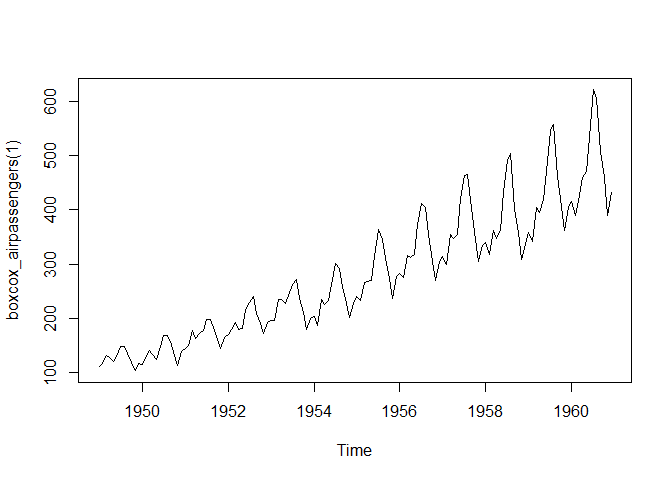
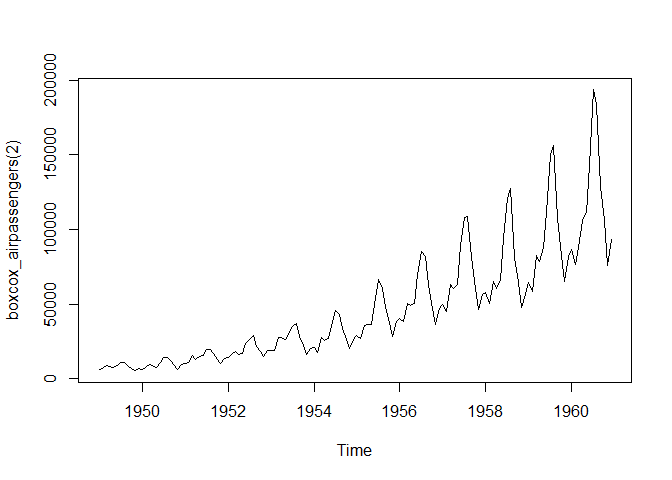
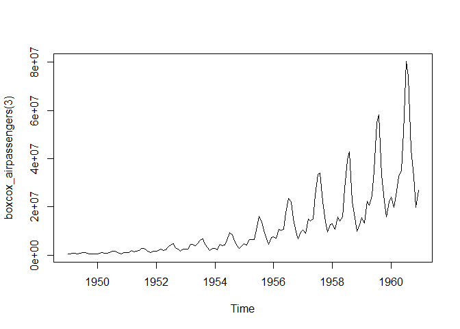

```r
library(rlang)
library(ggplot2)
library(scales)
library(purrr)
```

```
## 
## Attaching package: 'purrr'
```

```
## The following object is masked from 'package:scales':
## 
##     discard
```

```
## The following objects are masked from 'package:rlang':
## 
##     %@%, flatten, flatten_chr, flatten_dbl, flatten_int, flatten_lgl,
##     flatten_raw, invoke, splice
```

```r
library(tidyverse)
```

```
## ── Attaching packages ─────────────────────────────────────── tidyverse 1.3.2
## ──
```

```
## ✔ tibble  3.1.8      ✔ dplyr   1.0.10
## ✔ tidyr   1.2.1      ✔ stringr 1.5.0 
## ✔ readr   2.1.3      ✔ forcats 1.0.0 
## ── Conflicts ────────────────────────────────────────── tidyverse_conflicts() ──
## ✖ purrr::%@%()         masks rlang::%@%()
## ✖ readr::col_factor()  masks scales::col_factor()
## ✖ purrr::discard()     masks scales::discard()
## ✖ dplyr::filter()      masks stats::filter()
## ✖ purrr::flatten()     masks rlang::flatten()
## ✖ purrr::flatten_chr() masks rlang::flatten_chr()
## ✖ purrr::flatten_dbl() masks rlang::flatten_dbl()
## ✖ purrr::flatten_int() masks rlang::flatten_int()
## ✖ purrr::flatten_lgl() masks rlang::flatten_lgl()
## ✖ purrr::flatten_raw() masks rlang::flatten_raw()
## ✖ purrr::invoke()      masks rlang::invoke()
## ✖ dplyr::lag()         masks stats::lag()
## ✖ purrr::splice()      masks rlang::splice()
```


```r
power1 <- function(exp) {
  function(x) {
    x ^ exp
  }
}

square <- power1(2)
cube <- power1(3)
```

## 10.4 Statistical factories {#stat-fact}

More motivating examples for function factories come from statistics:

* The Box-Cox transformation.
* Bootstrap resampling. 
* Maximum likelihood estimation. 

All of these examples can be tackled without function factories, but I think function factories are a good fit for these problems and provide elegant solutions. These examples expect some statistical background, so feel free to skip if they don't make much sense to you.

### 10.4.1 Box-Cox transformation
\index{Box-Cox transformation}

The Box-Cox transformation (a type of [power transformation](https://en.wikipedia.org/wiki/Power_transform)) is a flexible transformation often used to transform data towards normality. It has a single parameter, $\lambda$, which controls the strength of the transformation. We could express the transformation as a simple two argument function:


```r
boxcox1 <- function(x, lambda) {
  stopifnot(length(lambda) == 1)
  
  if (lambda == 0) {
    log(x)
  } else {
    (x ^ lambda - 1) / lambda
  }
}
```

But re-formulating as a function factory makes it easy to explore its behaviour with `stat_function()`:


```r
boxcox2 <- function(lambda) {
  if (lambda == 0) {
    function(x) log(x)
  } else {
    function(x) (x ^ lambda - 1) / lambda
  }
}

stat_boxcox <- function(lambda) {
  stat_function(aes(colour = lambda), fun = boxcox2(lambda), size = 1)
}

ggplot(data.frame(x = c(0, 5)), aes(x)) + 
  lapply(c(0.5, 1, 1.5), stat_boxcox) + 
  scale_colour_viridis_c(limits = c(0, 1.5))
```

```
## Warning: Using `size` aesthetic for lines was deprecated in ggplot2 3.4.0.
## ℹ Please use `linewidth` instead.
```


```r
# visually, log() does seem to make sense as the transformation
# for lambda = 0; as values get smaller and smaller, the function
# gets close and closer to a log transformation
ggplot(data.frame(x = c(0.01, 1)), aes(x)) + 
  lapply(c(0.5, 0.25, 0.1, 0), stat_boxcox) + 
  scale_colour_viridis_c(limits = c(0, 1.5))
```


In general, this allows you to use a Box-Cox transformation with any function that accepts a unary transformation function: you don't have to worry about that function providing `...` to pass along additional arguments. I also think that the partitioning of `lambda` and `x` into two different function arguments is natural since `lambda` plays quite a different role than `x`. 

### 10.4.2 Bootstrap generators
\index{bootstrapping}

Function factories are a useful approach for bootstrapping. Instead of thinking about a single bootstrap (you always need more than one!), you can think about a bootstrap __generator__, a function that yields a fresh bootstrap every time it is called:


```r
boot_permute <- function(df, var) {
  n <- nrow(df)
  force(var)
  
  function() {
    col <- df[[var]]
    col[sample(n, replace = TRUE)]
  }
}

boot_mtcars1 <- boot_permute(mtcars, "mpg")
head(boot_mtcars1())
```

```
## [1] 15.2 32.4 21.4 19.7 21.0 15.2
```

```r
head(boot_mtcars1())
```

```
## [1] 30.4 19.7 15.2 14.7 33.9 18.7
```

The advantage of a function factory is more clear with a parametric bootstrap where we have to first fit a model. We can do this setup step once, when the factory is called, rather than once every time we generate the bootstrap:


```r
boot_model <- function(df, formula) {
  mod <- lm(formula, data = df)
  fitted <- unname(fitted(mod))
  resid <- unname(resid(mod))
  rm(mod)

  function() {
    fitted + sample(resid)
  }
} 

boot_mtcars2 <- boot_model(mtcars, mpg ~ wt)
head(boot_mtcars2())
```

```
## [1] 29.26369 20.03675 27.35032 18.01670 18.84990 17.76576
```

```r
head(boot_mtcars2())
```

```
## [1] 25.74698 20.03675 25.03800 20.05240 21.25010 19.66013
```

I use `rm(mod)` because linear model objects are quite large (they include complete copies of the model matrix and input data) and I want to keep the manufactured function as small as possible.

### 10.4.3 Maximum likelihood estimation {#MLE}
\index{maximum likelihood}
\indexc{optimise()}
\indexc{optim()}

The goal of maximum likelihood estimation (MLE) is to find the parameter values for a distribution that make the observed data most likely. To do MLE, you start with a probability function. For example, take the Poisson distribution. If we know $\lambda$, we can compute the probability of getting a vector $\mathbf{x}$ of values ($x_1$, $x_2$, ..., $x_n$) by multiplying the Poisson probability function as follows:

\[ P(\lambda, \mathbf{x}) = \prod_{i=1}^{n} \frac{\lambda ^ {x_i} e^{-\lambda}}{x_i!} \]

In statistics, we almost always work with the log of this function. The log is a monotonic transformation which preserves important properties (i.e. the extrema occur in the same place), but has specific advantages:

* The log turns a product into a sum, which is easier to work with.

* Multiplying small numbers yields even smaller numbers, which makes the 
  floating point approximation used by a computer less accurate.

Let's apply a log transformation to this probability function and simplify it as much as possible:

\[ \log(P(\lambda, \mathbf{x})) = \sum_{i=1}^{n} \log(\frac{\lambda ^ {x_i} e^{-\lambda}}{x_i!}) \]

\[ \log(P(\lambda, \mathbf{x})) = \sum_{i=1}^{n} \left( x_i \log(\lambda) - \lambda - \log(x_i!) \right) \]

\[ \log(P(\lambda, \mathbf{x})) = 
     \sum_{i=1}^{n} x_i \log(\lambda)
   - \sum_{i=1}^{n} \lambda 
   - \sum_{i=1}^{n} \log(x_i!) \]

\[ \log(P(\lambda, \mathbf{x})) = 
   \log(\lambda) \sum_{i=1}^{n} x_i - n \lambda - \sum_{i=1}^{n} \log(x_i!) \]

We can now turn this function into an R function. The R function is quite elegant because R is vectorised and, because it's a statistical programming language, R comes with built-in functions like the log-factorial (`lfactorial()`).


```r
lprob_poisson <- function(lambda, x) {
  n <- length(x)
  (log(lambda) * sum(x)) - (n * lambda) - sum(lfactorial(x))
}
```

Consider this vector of observations:


```r
x1 <- c(41, 30, 31, 38, 29, 24, 30, 29, 31, 38)
```

We can use `lprob_poisson()` to compute the (logged) probability of `x1` for different values of `lambda`. 


```r
lprob_poisson(10, x1)
```

```
## [1] -183.6405
```

```r
lprob_poisson(20, x1)
```

```
## [1] -61.14028
```

```r
lprob_poisson(30, x1)
```

```
## [1] -30.98598
```

So far we’ve been thinking of `lambda` as fixed and known and the function told us the probability of getting different values of `x`. But in real-life, we observe `x` and it is `lambda` that is unknown. The likelihood is the probability function seen through this lens: we want to find the `lambda` that makes the observed `x` the most likely. That is, given `x`, what value of `lambda` gives us the highest value of `lprob_poisson`()?

In statistics, we highlight this change in perspective by writing $f_{\mathbf{x}}(\lambda)$ instead of $f(\lambda, \mathbf{x})$. In R, we can use a function factory. We provide `x` and generate a function with a single parameter, `lambda`:


```r
ll_poisson1 <- function(x) {
  n <- length(x)

  function(lambda) {
    log(lambda) * sum(x) - n * lambda - sum(lfactorial(x))
  }
}
```

(We don't need `force()` because `length()` implicitly forces evaluation of `x`.)

One nice thing about this approach is that we can do some precomputation: any term that only involves `x` can be computed once in the factory. This is useful because we're going to need to call this function many times to find the best `lambda`.


```r
ll_poisson2 <- function(x) {
  n <- length(x)
  sum_x <- sum(x)
  c <- sum(lfactorial(x))

  function(lambda) {
    log(lambda) * sum_x - n * lambda - c
  }
}
```

Now we can use this function to find the value of `lambda` that maximizes the (log) likelihood:


```r
ll1 <- ll_poisson2(x1)

ll1(10)
```

```
## [1] -183.6405
```

```r
ll1(20)
```

```
## [1] -61.14028
```

```r
ll1(30)
```

```
## [1] -30.98598
```

Rather than trial and error, we can automate the process of finding the best value with `optimise()`. It will evaluate `ll1()` many times, using mathematical tricks to narrow in on the largest value as quickly as possible. The results tell us that the highest value is `-30.27` which occurs when `lambda = 32.1`:


```r
optimise(ll1, c(0, 100), maximum = TRUE)
```

```
## $maximum
## [1] 32.09999
## 
## $objective
## [1] -30.26755
```

Now, we could have solved this problem without using a function factory because `optimise()` passes `...` on to the function being optimised. That means we could use the log-probability function directly:


```r
optimise(lprob_poisson, c(0, 100), x = x1, maximum = TRUE)
```

```
## $maximum
## [1] 32.09999
## 
## $objective
## [1] -30.26755
```

The advantage of using a function factory here is fairly small, but there are two niceties:

* We can precompute some values in the factory, saving computation time
  in each iteration.
  
* The two-level design better reflects the mathematical structure of 
  the underlying problem.

These advantages get bigger in more complex MLE problems, where you have multiple parameters and multiple data vectors. 

<!-- GVW: stepping back, what patterns in existing code should people look for that suggest "Hey, maybe use a function factory here"? -->

### 10.4.4 Exercises

1.  In `boot_model()`, why don't I need to force the evaluation of `df` 
    or `model`?
    
> In `boot_model()`, we use df and formula in lm() before returning the function, so we don’t need to force the evaluation of df or model.
    

```r
boot_model <- function(df, formula) {
  mod <- lm(formula, data = df)
  fitted <- unname(fitted(mod))
  resid <- unname(resid(mod))
  rm(mod)
  
  function() {
    fitted + sample(resid)
  }
} 
```


    
2.  Why might you formulate the Box-Cox transformation like this?

    
    ```r
    boxcox3 <- function(x) {
      function(lambda) {
        if (lambda == 0) {
          log(x)
        } else {
          (x ^ lambda - 1) / lambda
        }
      }  
    }
    ```


```r
AirPassengers
```

```
##      Jan Feb Mar Apr May Jun Jul Aug Sep Oct Nov Dec
## 1949 112 118 132 129 121 135 148 148 136 119 104 118
## 1950 115 126 141 135 125 149 170 170 158 133 114 140
## 1951 145 150 178 163 172 178 199 199 184 162 146 166
## 1952 171 180 193 181 183 218 230 242 209 191 172 194
## 1953 196 196 236 235 229 243 264 272 237 211 180 201
## 1954 204 188 235 227 234 264 302 293 259 229 203 229
## 1955 242 233 267 269 270 315 364 347 312 274 237 278
## 1956 284 277 317 313 318 374 413 405 355 306 271 306
## 1957 315 301 356 348 355 422 465 467 404 347 305 336
## 1958 340 318 362 348 363 435 491 505 404 359 310 337
## 1959 360 342 406 396 420 472 548 559 463 407 362 405
## 1960 417 391 419 461 472 535 622 606 508 461 390 432
```

```r
boxcox_airpassengers <- boxcox3(AirPassengers)

plot(boxcox_airpassengers(0))
```

<!-- -->

```r
plot(boxcox_airpassengers(1))
```

<!-- -->

```r
plot(boxcox_airpassengers(2))
```

<!-- -->

```r
plot(boxcox_airpassengers(3))
```

<!-- -->

3.  Why don't you need to worry that `boot_permute()` stores a copy of the 
    data inside the function that it generates?
    

```r
boot_permute <- function(df, var) {
  n <- nrow(df)
  force(var)
  
  function() {
    col <- df[[var]]
    col[sample(n, replace = TRUE)]
  }
}
```

We don’t need to worry that it stores a copy of the data, because it actually doesn’t store one; it’s just a name that points to the same underlying object in memory.


```r
boot_mtcars1 <- boot_permute(mtcars, "mpg")

lobstr::obj_size(mtcars)
```

```
## 7.21 kB
```

```r
lobstr::obj_size(boot_mtcars1)
```

```
## 20.23 kB
```

```r
lobstr::obj_sizes(mtcars, boot_mtcars1)
```

```
## *  7.21 kB
## * 13.02 kB
```


4.  How much time does `ll_poisson2()` save compared to `ll_poisson1()`?
    Use `bench::mark()` to see how much faster the optimisation occurs.
    How does changing the length of `x` change the results?


```r
ll_poisson1 <- function(x) {
  n <- length(x)
  
  function(lambda) {
    log(lambda) * sum(x) - n * lambda - sum(lfactorial(x))
  }
}

ll_poisson2 <- function(x) {
  n <- length(x)
  sum_x <- sum(x)
  c <- sum(lfactorial(x))
  
  function(lambda) {
    log(lambda) * sum_x - n * lambda - c
  }
}

x1 <- c(41, 30, 31, 38, 29, 24, 30, 29, 31, 38)
```


```r
library(bench)

bench::mark(
  llp1 = optimise(ll_poisson1(x1), c(0, 100), maximum = TRUE),
  llp2 = optimise(ll_poisson2(x1), c(0, 100), maximum = TRUE)
)
```

```
## # A tibble: 2 × 6
##   expression      min   median `itr/sec` mem_alloc `gc/sec`
##   <bch:expr> <bch:tm> <bch:tm>     <dbl> <bch:byt>    <dbl>
## 1 llp1         32.2µs   51.3µs    18056.        0B     6.18
## 2 llp2         15.5µs   22.8µs    39289.        0B    11.8
```


## 10.5 Function factories + functionals {#functional-factories}

To finish off the chapter, I'll show how you might combine functionals and function factories to turn data into many functions. The following code creates many specially named power functions by iterating over a list of arguments:


```r
names <- list(
  square = 2, 
  cube = 3, 
  root = 1/2, 
  cuberoot = 1/3, 
  reciprocal = -1
)
funs <- purrr::map(names, power1)

funs$root(64)
```

```
## [1] 8
```

```r
funs$root
```

```
## function(x) {
##     x ^ exp
##   }
## <bytecode: 0x000001a4b63975f8>
## <environment: 0x000001a4bbed8b40>
```

This idea extends in a straightforward way if your function factory takes two (replace `map()` with `map2()`) or more (replace with `pmap()`) arguments.

\indexc{with()}
\indexc{attach()}
\indexc{env\_bind\_*}

One downside of the current construction is that you have to prefix every function call with `funs$`. There are three ways to eliminate this additional syntax:

*   For a very temporary effect, you can use `with()`: 

    
    ```r
    with(funs, root(100))
    ```
    
    ```
    ## [1] 10
    ```
    
    I recommend this because it makes it very clear when code is being 
    executed in a special context and what that context is.

*   For a longer effect, you can `attach()` the functions to the search path, 
    then `detach()` when you're done:

    
    ```r
    attach(funs)
    ```
    
    ```
    ## The following objects are masked _by_ .GlobalEnv:
    ## 
    ##     cube, square
    ```
    
    ```r
    root(100)
    ```
    
    ```
    ## [1] 10
    ```
    
    ```r
    detach(funs)
    ```
    
    You've probably been told to avoid using `attach()`, and that's generally
    good advice. However, the situation is a little different to the usual
    because we're attaching a list of functions, not a data frame. It's less 
    likely that you'll modify a function than a column in a data frame, so the
    some of the worst problems with `attach()` don't apply.

*   Finally, you could copy the functions to the global environment with 
    `env_bind()` (you'll learn about `!!!` in Section \@ref(tidy-dots)). 
    This is mostly permanent:
    
    
    ```r
    rlang::env_bind(globalenv(), !!!funs)
    root(100)
    ```
    
    ```
    ## [1] 10
    ```
  
    You can later unbind those same names, but there's no guarantee that 
    they haven't been rebound in the meantime, and you might be deleting an
    object that someone else created.
    
    
    ```r
    rlang::env_unbind(globalenv(), names(funs))
    ```

You'll learn an alternative approach to the same problem in Section \@ref(new-function). Instead of using a function factory, you could construct the function with quasiquotation. This requires additional knowledge, but generates functions with readable bodies, and avoids accidentally capturing large objects in the enclosing scope. We use that idea in Section \@ref(tag-functions) when we work on tools for generating HTML from R.

### 10.5.1 Exercises

1. Which of the following commands is equivalent to `with(x, f(z))`?

    (a) `x$f(x$z)`.
    (b) `f(x$z)`.
    (c) `x$f(z)`.
    (d) `f(z)`.
    (e) It depends.
    
> (e) It depends.


```r
z <- 100 
x <- list(f = funs, z = 100)
```


```r
    with(funs, root(x$z))
```

```
## [1] 10
```
    (a) `x$f(x$z)`.


```r
funs$root(x$z)
```

```
## [1] 10
```

    (b) `f(x$z)`.
    

```r
attach(funs)
root(x$z)
```

```
## [1] 10
```

```r
detach(funs)
```

(c) `x$f(z)`.


```r
funs$root(100)
```

```
## [1] 10
```

(d) `f(z)`.


```r
attach(funs)
root(100)
```

```
## [1] 10
```

```r
detach(funs)
```


```r
f <- mean
z <- 1
x <- list(f = mean, z = 1)

identical(with(x, f(z)), x$f(x$z))
```

```
## [1] TRUE
```

```r
identical(with(x, f(z)), f(x$z))
```

```
## [1] TRUE
```

```r
identical(with(x, f(z)), x$f(z))
```

```
## [1] TRUE
```

```r
identical(with(x, f(z)), f(z))
```

```
## [1] TRUE
```


2. Compare and contrast the effects of `env_bind()` vs. `attach()` for the 
   following code.
   
    
    ```r
    funs <- list(
      mean = function(x) mean(x, na.rm = TRUE),
      sum = function(x) sum(x, na.rm = TRUE)
    )
    
    attach(funs)
    ```
    
    ```
    ## The following objects are masked from package:base:
    ## 
    ##     mean, sum
    ```
    
    ```r
    mean <- function(x) stop("Hi!")
    detach(funs)
    
    env_bind(globalenv(), !!!funs)
    mean <- function(x) stop("Hi!") 
    env_unbind(globalenv(), names(funs))
    ```


```r
attach(funs)
```

```
## The following objects are masked from package:base:
## 
##     mean, sum
```

```r
attach(funs)
```

```
## The following objects are masked from funs (pos = 3):
## 
##     mean, sum
## 
## The following objects are masked from package:base:
## 
##     mean, sum
```

```r
attach(funs)
```

```
## The following objects are masked from funs (pos = 3):
## 
##     mean, sum
```

```
## The following objects are masked from funs (pos = 4):
## 
##     mean, sum
```

```
## The following objects are masked from package:base:
## 
##     mean, sum
```

```r
head(search())
```

```
## [1] ".GlobalEnv"      "funs"            "funs"            "funs"           
## [5] "package:bench"   "package:forcats"
```

```r
detach(funs)

detach(funs)

detach(funs)

head(search())
```

```
## [1] ".GlobalEnv"      "package:bench"   "package:forcats" "package:stringr"
## [5] "package:dplyr"   "package:readr"
```


```r
env_bind(globalenv(), !!!funs)
head(search())
```

```
## [1] ".GlobalEnv"      "package:bench"   "package:forcats" "package:stringr"
## [5] "package:dplyr"   "package:readr"
```


