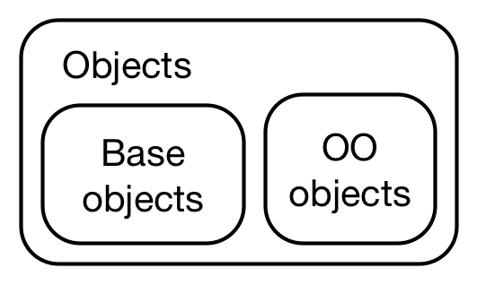

# (PART) Object-oriented programming {-}
\index{object-oriented programming}

# Introduction {#oo .unnumbered}

In the following five chapters you'll learn about __object-oriented programming__ (OOP). OOP is a little more challenging in R than in other languages because:

* There are multiple OOP systems to choose from. In this book, I'll focus 
  on the three that I believe are most important: __S3__,  __R6__, and __S4__. 
  S3 and S4 are provided by base R. R6 is provided by the R6 package, and is 
  similar to the Reference Classes, or __RC__ for short, from base R.

* There is disagreement about the relative importance of the OOP systems. 
  I think S3 is most important, followed by R6, then S4. Others believe that 
  S4 is most important, followed by RC, and that S3 should be avoided. This 
  means that different R communities use different systems.

* S3 and S4 use generic function OOP which is rather different from the 
  encapsulated OOP used by most languages popular today[^julia]. We'll come 
  back to precisely what those terms mean shortly, but basically, while the 
  underlying ideas of OOP are the same across languages, their expressions are
  rather different. This means that you can't immediately transfer your 
  existing OOP skills to R.

[^julia]: The exception is Julia, which also uses generic function OOP. Compared to R, Julia's implementation is fully developed and extremely performant.

Generally in R, functional programming is much more important than object-oriented programming, because you typically solve complex problems by decomposing them into simple functions, not simple objects. Nevertheless, there are important reasons to learn each of the three systems:

* S3 allows your functions to return rich results with user-friendly display
  and programmer-friendly internals. S3 is used throughout base R, so it's 
  important to master if you want to extend base R functions to work with new 
  types of input.

* R6 provides a standardised way to escape R's copy-on-modify semantics. 
  This is particularly important if you want to model objects that exist
  independently of R. Today, a common need for R6 is to model data that comes
  from a web API, and where changes come from inside or outside of R.

* S4 is a rigorous system that forces you to think carefully about program 
  design. It's particularly well-suited for building large systems that evolve 
  over time  and will receive contributions from many programmers. This is
  why it is used by the Bioconductor project, so another reason to learn S4
  is to equip you to contribute to that project.

The goal of this brief introductory chapter is to give you some important vocabulary and some tools to identify OOP systems in the wild. The following chapters then dive into the details of R's OOP systems:

1.  Chapter \@ref(base-types) details the base types which form the foundation
    underlying all other OO system.
    
1.  Chapter \@ref(s3) introduces S3, the simplest and most commonly used
    OO system.
  
1.  Chapter \@ref(r6) discusses R6, an encapsulated OO system built on 
    top of environments.

1.  Chapter \@ref(s4) introduces S4, which is similar to S3 but more formal and 
    more strict. 
    
1.  Chapter \@ref(oo-tradeoffs) compares these three main OO systems. By
    understanding the trade-offs of each system you can appreciate when to use 
    one or the other. 

This book focusses on the mechanics of OOP, not its effective use, and it may be challenging to fully understand if you have not done object-oriented programming before. You might wonder why I chose not to provide more immediately useful coverage. I have focused on mechanics here because they need to be well described somewhere (writing these chapters required a considerable amount of reading, exploration, and synthesis on my behalf), and using OOP effectively is sufficiently complex to require a book-length treatment; there's simply not enough room in *Advanced R* to cover it in the depth required.

## OOP systems {-}

Different people use OOP terms in different ways, so this section provides a quick overview of important vocabulary. The explanations are necessarily compressed, but we will come back to these ideas multiple times.

The main reason to use OOP is __polymorphism__ (literally: many shapes). Polymorphism means that a developer can consider a function's interface separately from its implementation, making it possible to use the same function form for different types of input. This is closely related to the idea of __encapsulation__: the user doesn't need to worry about details of an object because they are encapsulated behind a standard interface. 

To be concrete, polymorphism is what allows `summary()` to produce different outputs for numeric and factor variables:

```{r}
diamonds <- ggplot2::diamonds

summary(diamonds$carat)

summary(diamonds$cut)
```

You could imagine `summary()` containing a series of if-else statements, but that would mean only the original author could add new implementations. An OOP system makes it possible for any developer to extend the interface with implementations for new types of input. 

To be more precise, OO systems call the type of an object its __class__, and an implementation for a specific class is called a __method__. Roughly speaking, a class defines what an object _is_ and methods describe what that object can _do_. 
The class defines the __fields__, the data possessed by every instance of that class. Classes are organised in a hierarchy so that if a method does not exist for one class, its parent's method is used, and the child is said to __inherit__ behaviour. For example, in R, an ordered factor inherits from a regular factor, and a generalised linear model inherits from a linear model. The process of finding the correct method given a class is called __method dispatch__.

There are two main paradigms of object-oriented programming which differ in how methods and classes are related. In this book, we'll borrow the terminology of _Extending R_ [@extending-R] and call these paradigms encapsulated and functional:

*   In __encapsulated__ OOP, methods belong to objects or classes, and method 
    calls typically look like `object.method(arg1, arg2)`. This is called 
    encapsulated because the object encapsulates both data (with fields) and 
    behaviour (with methods), and is the paradigm found in most popular 
    languages.
    
*   In __functional__ OOP, methods belong to __generic__ functions, and method 
    calls look like ordinary function calls: `generic(object, arg2, arg3)`. 
    This is called functional because from the outside it looks like a regular
    function call, and internally the components are also functions.

With this terminology in hand, we can now talk precisely about the different OO systems available in R.

## OOP in R {-}

Base R provides three OOP systems: S3, S4, and reference classes (RC):

*   __S3__ is R's first OOP system, and is described in _Statistical Models 
    in S_ [@white-book]. S3 is an informal implementation of functional OOP
    and relies on common conventions rather than ironclad guarantees. 
    This makes it easy to get started with, providing a low cost way of 
    solving many simple problems.

*   __S4__ is a formal and rigorous rewrite of S3, and was introduced in 
    _Programming with Data_ [@programming-with-data]. It requires more upfront 
    work than S3, but in return provides more guarantees and greater
    encapsulation. S4 is implemented in the base __methods__ package, which is
    always installed with R.
    
    (You might wonder if S1 and S2 exist. They don't: S3 and S4 were named 
    according to the versions of S that they accompanied. The first two 
    versions of S didn't have any OOP framework.)

*   __RC__ implements encapsulated OO. RC objects are a special type of S4 
    objects that are also __mutable__, i.e., instead of using R's usual
    copy-on-modify semantics, they can be modified in place. This makes them
    harder to reason about, but allows them to solve problems that are difficult
    to solve in the functional OOP style of S3 and S4.

A number of other OOP systems are provided by CRAN packages:

*   __R6__ [@R6] implements encapsulated OOP like RC, but resolves some 
    important issues. In this book, you'll learn about R6 instead of RC, for
    reasons described in Section \@ref(why-r6).
    
*   __R.oo__ [@R.oo] provides some formalism on top of S3, and makes it 
    possible to have mutable S3 objects.

*   __proto__ [@proto] implements another style of OOP based on the idea of 
    __prototypes__, which blur the distinctions between classes and instances 
    of classes (objects). I was briefly enamoured with prototype based 
    programming [@mutatr] and used it in ggplot2, but now think it's better to
    stick with the standard forms.

Apart from R6, which is widely used, these systems are primarily of theoretical interest. They do have their strengths, but few R users know and understand them, so it is hard for others to read and contribute to your code. 

## sloop {-}

Before we go on I want to introduce the sloop package:

```{r}
library(sloop)
```

The sloop package (think "sail the seas of OOP") provides a number of helpers that fill in missing pieces in base R. The first of these is `sloop::otype()`. It makes it easy to figure out the OOP system used by a wild-caught object: 

```{r}
otype(1:10)

otype(mtcars)

mle_obj <- stats4::mle(function(x = 1) (x - 2) ^ 2)
otype(mle_obj)
```

Use this function to figure out which chapter to read to understand how to work with an existing object.

# Base types {#base-types}

## Introduction
\index{base objects}
\index{OO objects}

To talk about objects and OOP in R we first need to clear up a fundamental confusion about two uses of the word "object". So far in this book, we've used the word in the general sense captured by John Chambers' pithy quote: "Everything that exists in R is an object". However, while everything _is_ an object, not everything is object-oriented. This confusion arises because the base objects come from S, and were developed before anyone thought that S might need an OOP system. The tools and nomenclature evolved organically over many years without a single guiding principle.

Most of the time, the distinction between objects and object-oriented objects is not important. But here we need to get into the nitty gritty details so we'll use the terms __base objects__ and __OO objects__ to distinguish them.

```{r, out.width = NULL, echo = FALSE}

```

### Outline {-} 

* Section \@ref(base-vs-oo) shows you how to identify base and OO objects.

* Section \@ref(base-types-2) gives a complete set of the base types used to build all objects.

## Base versus OO objects {#base-vs-oo}
\indexc{is.object()}
\indexc{otype()}
\index{attributes!class}
\indexc{class()}

To tell the difference between a base and OO object, use `is.object()` or `sloop::otype()`:

```{r}
# A base object:
is.object(1:10)
sloop::otype(1:10)

# An OO object
is.object(mtcars)
sloop::otype(mtcars)
```

Technically, the difference between base and OO objects is that OO objects have a "class" attribute:

```{r}
attr(1:10, "class")

attr(mtcars, "class")
```

You may already be familiar with the `class()` function. This function is safe to apply to S3 and S4 objects, but it returns misleading results when applied to base objects. It's safer to use `sloop::s3_class()`, which returns the implicit class that the S3 and S4 systems will use to pick methods. You'll learn more about `s3_class()` in Section \@ref(implicit-class).

```{r}
x <- matrix(1:4, nrow = 2)
class(x)
sloop::s3_class(x)
```

## Base types {#base-types-2}
\indexc{typeof()}
\index{base type|see {\texttt{typeof()}}}

While only OO objects have a class attribute, every object has a __base type__:

```{r}
typeof(1:10)

typeof(mtcars)
```

Base types do not form an OOP system because functions that behave differently for different base types are primarily written in C code that uses switch statements. This means that only R-core can create new types, and creating a new type is a lot of work because every switch statement needs to be modified to handle a new case. As a consequence, new base types are rarely added. The most recent change, in 2011, added two exotic types that you never see in R itself, but are needed for diagnosing memory problems. Prior to that, the last type added was a special base type for S4 objects added in 2005.

<!-- 
https://github.com/wch/r-source/blob/f5bb85782509ddadbcec94ab7648886c2d008bda/src/main/util.c#L185-L211-->

In total, there are 25 different base types. They are listed below, loosely grouped according to where they're discussed in this book. These types are most important in C code, so you'll often see them called by their C type names. I've included those in parentheses.

*   Vectors, Chapter \@ref(vectors-chap), include types `NULL` (`NILSXP`), 
    `logical` (`LGLSXP`), `integer` (`INTSXP`), `double` (`REALSXP`), `complex`
    (`CPLXSXP`), `character` (`STRSXP`), `list` (`VECSXP`), and `raw` (`RAWSXP`).
    
    ```{r}
    typeof(NULL)
    typeof(1L)
    typeof(1i)
    ```

*   Functions, Chapter \@ref(functions), include types `closure` (regular R 
    functions, `CLOSXP`), `special` (internal functions, `SPECIALSXP`), and 
    `builtin` (primitive functions, `BUILTINSXP`).
    
    ```{r}
    typeof(mean)
    typeof(`[`)
    typeof(sum)    
    ```
    
    Internal and primitive functions are described in Section 
    \@ref(primitive-functions).

*   Environments, Chapter \@ref(environments), have type `environment` 
    (`ENVSXP`).

    ```{r}
    typeof(globalenv())
    ```

*   The `S4` type (`S4SXP`), Chapter \@ref(s4), is used for S4 classes that 
    don't inherit from an existing base type.
   
    ```{r}
    mle_obj <- stats4::mle(function(x = 1) (x - 2) ^ 2)
    typeof(mle_obj)
    ```

*   Language components, Chapter \@ref(expressions), include `symbol` (aka 
    name, `SYMSXP`), `language` (usually called calls, `LANGSXP`), and 
    `pairlist` (used for function arguments, `LISTSXP`) types.

    ```{r}
    typeof(quote(a))
    typeof(quote(a + 1))
    typeof(formals(mean))
    ```
 
    `expression` (`EXPRSXP`) is a special purpose type that's only returned by
    `parse()` and `expression()`. Expressions are generally not needed in user 
    code.
 
*   The remaining types are esoteric and rarely seen in R. They are important 
    primarily for C code: `externalptr` (`EXTPTRSXP`), `weakref` (`WEAKREFSXP`), 
    `bytecode` (`BCODESXP`), `promise` (`PROMSXP`), `...` (`DOTSXP`), and 
    `any` (`ANYSXP`).

\indexc{mode()}
You may have heard of `mode()` and `storage.mode()`. Do not use these functions: they exist only to provide type names that are compatible with S. 

### Numeric type {#numeric-type}
\index{numeric vectors}
\index{vectors!numeric|see {numeric vectors}}

Be careful when talking about the numeric type, because R uses "numeric" to mean three slightly different things:

1.  In some places numeric is used as an alias for the double type. For 
    example `as.numeric()` is identical to `as.double()`, and `numeric()` is
    identical to `double()`.
    
    (R also occasionally uses real instead of double; `NA_real_` is the one 
    place that you're likely to encounter this in practice.)
    
1.  In the S3 and S4 systems, numeric is used as a shorthand for either 
    integer or double type, and is used when picking methods:

    ```{r}
    sloop::s3_class(1)
    sloop::s3_class(1L)
    ```

1.  `is.numeric()` tests for objects that _behave_ like numbers. For example, 
    factors have type "integer" but don't behave like numbers (i.e. it doesn't
    make sense to take the mean of factor).

    ```{r}
    typeof(factor("x"))
    is.numeric(factor("x"))
    ```

In this book, I consistently use numeric to mean an object of type integer or double.
