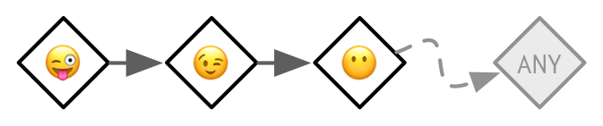
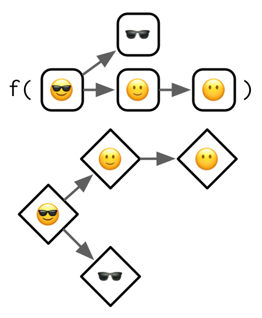

## 15.4 Generics and methods {#s4-generics}
\index{S4!generics} 
\index{generics!S4} 
\indexc{setGeneric()}
\indexc{standardGeneric()}

The job of a generic is to perform method dispatch, i.e. find the specific implementation for the combination of classes passed to the generic. Here you'll learn how to define S4 generics and methods, then in the next section we'll explore precisely how S4 method dispatch works.

To create a new S4 generic, call `setGeneric()` with a function that calls `standardGeneric()`:

```{r}
setGeneric("myGeneric", function(x) standardGeneric("myGeneric"))
```

By convention, new S4 generics should use `lowerCamelCase`.

It is bad practice to use `{}` in the generic as it triggers a special case that is more expensive, and generally best avoided.

```{r}
# Don't do this!
setGeneric("myGeneric", function(x) {
  standardGeneric("myGeneric")
})
```

### 15.4.1 Signature
\index{signature}

Like `setClass()`, `setGeneric()` has many other arguments. There is only one that you need to know about: `signature`. This allows you to control the arguments that are used for method dispatch. If `signature` is not supplied, all arguments (apart from `...`) are used. It is occasionally useful to remove arguments from dispatch. This allows you to require that methods provide arguments like `verbose = TRUE` or `quiet = FALSE`, but they don't take part in dispatch.

```{r}
setGeneric("myGeneric", 
  function(x, ..., verbose = TRUE) standardGeneric("myGeneric"),
  signature = "x"
)
```

### 15.4.2 Methods
\indexc{setMethod()}
\index{methods!S4}
\index{S4!methods} 

A generic isn't useful without some methods, and in S4 you define methods with `setMethod()`. There are three important arguments: the name of the generic, the name of the class, and the method itself. 

```{r}
setMethod("myGeneric", "Person", function(x) {
  # method implementation
})
```

More formally, the second argument to `setMethod()` is called the __signature__. In S4, unlike S3, the signature can include multiple arguments. This makes method dispatch in S4 substantially more complicated, but avoids having to implement double-dispatch as a special case. We'll talk more about multiple dispatch in the next section. `setMethod()` has other arguments, but you should never use them.

To list all the methods that belong to a generic, or that are associated with a class, use `methods("generic")` or `methods(class = "class")`; to find the implementation of a specific method, use `selectMethod("generic", "class")`.

### 15.4.3 Show method
\indexc{show()}
\index{S4!show()@\texttt{show()}}

The most commonly defined S4 method that controls printing is `show()`, which controls how the object appears when it is printed. To define a method for an existing generic, you must first determine the arguments. You can get those from the documentation or by looking at the `args()` of the generic:

```{r}
args(getGeneric("show"))
```

Our show method needs to have a single argument `object`:

```{r}
setMethod("show", "Person", function(object) {
  cat(is(object)[[1]], "\n",
      "  Name: ", object@name, "\n",
      "  Age:  ", object@age, "\n",
      sep = ""
  )
})
john
```

### 15.4.4 Accessors
\index{S4!accessors}

Slots should be considered an internal implementation detail: they can change without warning and user code should avoid accessing them directly. Instead, all user-accessible slots should be accompanied by a pair of __accessors__. If the slot is unique to the class, this can just be a function:

```{r}
person_name <- function(x) x@name
```

Typically, however, you'll define a generic so that multiple classes can use the same interface:

```{r}
setGeneric("name", function(x) standardGeneric("name"))
setMethod("name", "Person", function(x) x@name)

name(john)
```

If the slot is also writeable, you should provide a setter function. You should always include `validObject()` in the setter to prevent the user from creating invalid objects.

```{r, error = TRUE}
setGeneric("name<-", function(x, value) standardGeneric("name<-"))
setMethod("name<-", "Person", function(x, value) {
  x@name <- value
  validObject(x)
  x
})

name(john) <- "Jon Smythe"
name(john)

name(john) <- letters
```

(If the `name<-` notation is unfamiliar, review Section \@ref(function-forms).)

### 15.4.5 Exercises

1.  Add `age()` accessors for the `Person` class.

```{r}
setGeneric("age", function(x) standardGeneric("age"))
setGeneric("age<-", function(x, value) standardGeneric("age<-"))
```

```{r}
setMethod("age", "Person", function(x) x@age)
setMethod("age<-", "Person", function(x, value) {
  x@age <- value
  validObject(x)
  x
})
```

```{r}
age(john) <- 50
age(john)
```


2.  In the definition of the generic, why is it necessary to repeat the
    name of the generic twice?
    
> In this syntax, the first argument is the name of the generic, and the second argument is a function that will define the default behavior of the method. The name explicitly incorporates method dispatch via standardGeneric() within the generic’s body (def parameter of setGeneric()). This behaviour is similar to UseMethod() in S3.

```{r}
setGeneric("myGeneric", function(x) standardGeneric("myGeneric"))
```

    
3.  Why does the `show()` method defined in Section \@ref(show-method) use
    `is(object)[[1]]`? (Hint: try printing the employee subclass.)
    
```{r}
setMethod("show", "Person", function(object) {
  cat(is(object)[[1]], "\n",
      "  Name: ", object@name, "\n",
      "  Age:  ", object@age, "\n",
      sep = ""
  )
})
```

```{r}
john
```

```{r}
is(john)
```

> is(object) returns the class of the object. is(object) also contains the superclass, for subclasses like Employee. In order to always return the most specific class (the subclass), show() returns the first element of is(object).

4.  What happens if you define a method with different argument names to
    the generic?
    
> We first create the object hadley of class Person:

```{r}
.Person <- setClass(
  "Person",
  slots = c(name = "character", age = "numeric")
)

setMethod("show", "Person", function(object) {
  cat(is(object)[[1]], "\n",
      "  Name: ", object@name, "\n",
      "  Age:  ", object@age, "\n",
      sep = ""
  )
})

hadley <- .Person(name = "Hadley", age = 30)
hadley
```

> Now let’s see which arguments can be supplied to the show() generic.

```{r}
formals("show")
```

> Usually, we would use this argument when defining a new method.

```{r}
setMethod("show", "Person", function(object) {
  cat(object@name, "creates hard exercises")
})

hadley
```

When we supply another name as a first element of our method (e.g. x instead of object), this element will be matched to the correct object argument and we receive a warning. Our method will work, though:

```{r}
setMethod("show", "Person", function(x) {
  cat(x@name, "creates hard exercises")
})

hadley
```

If we add more arguments to our method than our generic can handle, we will get an error.

```{r}
setMethod("show", "Person", function(x, y) {
  cat(x@name, "is", x@age, "years old")
})
```

If we do this with arguments added to the correctly written object argument, we will receive an informative error message. It states that we could add other argument names for generics, which can take the ... argument.

```{r}
setMethod("show", "Person", function(object, y) {
  cat(object@name, "is", object@age, "years old")
})
```

correct version:

```{r}
setMethod("show", "Person", function(object) {
  cat(object@name, "is", object@age, "years old")
})

hadley
```


## 15.5 Method dispatch {#s4-dispatch}
\index{S4!method dispatch}
\index{method dispatch!S4}

S4 dispatch is complicated because S4 has two important features:

* Multiple inheritance, i.e. a class can have multiple parents, 
* Multiple dispatch, i.e. a generic can use multiple arguments to pick a method. 

These features make S4 very powerful, but can also make it hard to understand which method will get selected for a given combination of inputs. In practice, keep method dispatch as simple as possible by avoiding multiple inheritance, and reserving multiple dispatch only for where it is absolutely necessary.

But it's important to describe the full details, so here we'll start simple with single inheritance and single dispatch, and work our way up to the more complicated cases. To illustrate the ideas without getting bogged down in the details, we'll use an imaginary __class graph__ based on emoji:

```{r, echo = FALSE, out.width = NULL}
knitr::include_graphics("diagrams/s4/emoji.png")
```

```{r}
library(emoji)
```

> Emoji give us very compact class names that evoke the relationships between the classes. It should be straightforward to remember that `r emoji("stuck_out_tongue_winking_eye")` inherits from `r emoji("wink")` which inherits from `r emoji("no_mouth")`, and that `r emoji("sunglasses")` inherits from both `r emoji("dark_sunglasses")` and `r emoji("slightly_smiling_face")`.

### 15.5.1 Single dispatch
\index{S4!single dispatch}

Let's start with the simplest case: a generic function that dispatches on a single class with a single parent. The method dispatch here is simple so it's a good place to define the graphical conventions we'll use for the more complex cases.

```{r, echo = FALSE, out.width = NULL}
knitr::include_graphics("diagrams/s4/single.png")
```

There are two parts to this diagram:

* The top part, `f(...)`, defines the scope of the diagram. Here we have a 
  generic with one argument, that has a class hierarchy that is three levels 
  deep.
  
* The bottom part is the __method graph__ and  displays all the possible methods 
  that could be defined. Methods that exist, i.e. that have been defined with 
  `setMethod()`, have a grey background. 

To find the method that gets called, you start with the most specific class of the actual arguments, then follow the arrows until you find a method that exists. For example, if you called the function with an object of class `r emoji("wink")` you would follow the arrow right to find the method defined for the more general `r emoji("no_mouth")` class. If no method is found, method dispatch has failed and an error is thrown. In practice, this means that you should alway define methods defined for the terminal nodes, i.e. those on the far right. 

\index{S4!pseudo-classes}
\indexc{ANY}
There are two __pseudo-classes__ that you can define methods for. These are called pseudo-classes because they don't actually exist, but allow you to define useful behaviours. The first pseudo-class is `ANY` which matches any class[^s3-default]. For technical reasons that we'll get to later, the link to the `ANY` method is longer than the links between the other classes:

[^s3-default]: The S4 `ANY` pseudo-class plays the same role as the S3 `default` pseudo-class.

```{r, echo = FALSE, out.width = NULL}

```

\indexc{MISSING}
The second pseudo-class is `MISSING`. If you define a method for this pseudo-class, it will match whenever the argument is missing. It's not useful for single dispatch, but is important for functions like `+` and `-` that use double dispatch and behave differently depending on whether they have one or two arguments.

### 15.5.2 Multiple inheritance
\index{S4!multiple inheritance}
\index{multiple inheritance}

Things get more complicated when the class has multiple parents.

```{r, echo = FALSE, out.width = NULL}

```

The basic process remains the same: you start from the actual class supplied to the generic, then follow the arrows until you find a defined method. The wrinkle is that now there are multiple arrows to follow, so you might find multiple methods. If that happens, you pick the method that is closest, i.e. requires travelling the fewest arrows. 

NB: While the method graph is a powerful metaphor for understanding method dispatch, implementing it in this way would be rather inefficient, so the actual approach that S4 uses is somewhat different. You can read the details in `?Methods_Details`.

What happens if methods are the same distance? For example, imagine we've defined methods for `r emoji("dark_sunglasses")` and `r emoji("slightly_smiling_face")`, and we call the generic with `r emoji("sunglasses")`. Note that no method can be found for the `r emoji("no_mouth")` class, which I'll highlight with a red double outline.

```{r, echo = FALSE, out.width = NULL}
knitr::include_graphics("diagrams/s4/multiple-ambig.png")
```

This is called an __ambiguous__ method, and in diagrams I'll illustrate it with a thick dotted border. When this happens in R, you'll get a warning, and the method for the class that comes earlier in the alphabet will be picked (this is effectively random and should not be relied upon). When you discover ambiguity you should always resolve it by providing a more precise method:

```{r, echo = FALSE, out.width = NULL}
knitr::include_graphics("diagrams/s4/multiple-ambig-2.png")
```

The fallback `ANY` method still exists but the rules are little more complex. As indicated by the wavy dotted lines, the `ANY` method is always considered further away than a method for a real class. This means that it will never contribute to ambiguity.

```{r, echo = FALSE, out.width = NULL}
knitr::include_graphics("diagrams/s4/multiple-any.png")
```

With multiple inheritances it is hard to simultaneously prevent ambiguity, ensure that every terminal method has an implementation, and minimise the number of defined methods (in order to benefit from OOP). For example, of the six ways to define only two methods for this call, only one is free from problems. For this reason, I recommend using multiple inheritance with extreme care: you will need to carefully think about the method graph and plan accordingly.

```{r, echo = FALSE, out.width = NULL}
knitr::include_graphics("diagrams/s4/multiple-all.png")
```

### 15.5.3 Multiple dispatch
\index{S4!multiple dispatch}
\index{multiple dispatch}

Once you understand multiple inheritance, understanding multiple dispatch is straightforward. You follow multiple arrows in the same way as previously, but now each method is specified by two classes (separated by a comma).

```{r, echo = FALSE, out.width = NULL}
knitr::include_graphics("diagrams/s4/single-single.png")
```

I'm not going to show examples of dispatching on more than two arguments, but you can follow the basic principles to generate your own method graphs.

The main difference between multiple inheritance and multiple dispatch is that there are many more arrows to follow. The following diagram shows four defined methods which produce two ambiguous cases:

```{r, echo = FALSE, out.width = NULL}
knitr::include_graphics("diagrams/s4/single-single-ambig.png")
```

Multiple dispatch tends to be less tricky to work with than multiple inheritance because there are usually fewer terminal class combinations. In this example, there's only one. That means, at a minimum, you can define a single method and have default behaviour for all inputs.

### 15.5.4 Multiple dispatch and multiple inheritance

Of course you can combine multiple dispatch with multiple inheritance:

```{r, echo = FALSE, out.width = NULL}
knitr::include_graphics("diagrams/s4/single-multiple.png")
```

A still more complicated case dispatches on two classes, both of which have multiple inheritance:

```{r, echo = FALSE, out.width = NULL}
knitr::include_graphics("diagrams/s4/multiple-multiple.png")
```

As the method graph gets more and more complicated it gets harder and harder to predict which method will get called given a combination of inputs, and it gets harder and harder to make sure that you haven’t introduced ambiguity. If you have to draw diagrams to figure out what method is actually going to be called, it’s a strong indication that you should go back and simplify your design.

### 15.5.5 Exercises

1.  Draw the method graph for 
    `r paste0(code("f("), emoji("sweat_smile"), ", ", emoji("kissing_cat"), code(")"))`.


2.  Draw the method graph for 
    `r paste0(code("f("), emoji("smiley"), ", ", emoji("wink"), ", ", emoji("kissing_smiling_eyes"), code(")"))`.


3.  Take the last example which shows multiple dispatch over two classes that
    use multiple inheritance. What happens if you define a method for all
    terminal classes? Why does method dispatch not save us much work here?
    


## 15.6 S4 and S3 {#s4-s3}
\index{S4!working with S3}
\index{S3!working with S4}

When writing S4 code, you'll often need to interact with existing S3 classes and generics. This section describes how S4 classes, methods, and generics interact with existing code.

### 15.6.1 Classes
\indexc{setOldClass()}

In `slots` and `contains` you can use S4 classes, S3 classes, or the implicit class (Section \@ref(implicit-class)) of a base type.  To use an S3 class, you must first register it with `setOldClass()`. You call this function once for each S3 class, giving it the class attribute. For example, the following definitions are already provided by base R:

```{r, eval = FALSE}
setOldClass("data.frame")
setOldClass(c("ordered", "factor"))
setOldClass(c("glm", "lm"))
```

However, it's generally better to be more specific and provide a full S4 definition with `slots` and a `prototype`:

```{r, eval = FALSE}
setClass("factor",
  contains = "integer",
  slots = c(
    levels = "character"
  ),
  prototype = structure(
    integer(),
    levels = character()
  )
)
setOldClass("factor", S4Class = "factor")
```

Generally, these definitions should be provided by the creator of the S3 class. If you're trying to build an S4 class on top of an S3 class provided by a package, you should request that the package maintainer add this call to their package, rather than adding it to your own code. 

If an S4 object inherits from an S3 class or a base type, it will have a special virtual slot called `.Data`. This contains the underlying base type or S3 object: \indexc{.Data}

```{r}
RangedNumeric <- setClass(
  "RangedNumeric",
  contains = "numeric",
  slots = c(min = "numeric", max = "numeric"),
  prototype = structure(numeric(), min = NA_real_, max = NA_real_)
)
rn <- RangedNumeric(1:10, min = 1, max = 10)
rn@min
rn@.Data
```

It is possible to define S3 methods for S4 generics, and S4 methods for S3 generics (provided you've called `setOldClass()`). However, it's more complicated than it might appear at first glance, so make sure you thoroughly read `?Methods_for_S3`.

### 15.6.2 Generics
\indexc{setGeneric()}

As well as creating a new generic from scratch, it's also possible to convert an existing S3 generic to an S4 generic:

```{r}
setGeneric("mean")
```

In this case, the existing function becomes the default (`ANY`) method:
 
```{r}
selectMethod("mean", "ANY")
```
 
NB: `setMethod()` will automatically call `setGeneric()` if the first argument isn't already a generic, enabling you to turn any existing function into an S4 generic. It is OK to convert an existing S3 generic to S4, but you should avoid converting regular functions to S4 generics in packages because that requires careful coordination if done by multiple packages.

### 15.6.3 Exercises

1.  What would a full `setOldClass()` definition look like for an ordered 
    factor (i.e. add `slots` and `prototype` the definition above)?

> The purpose of setOldClass() lies in registering an S3 class as a “formally defined class,” so that it can be used within the S4 object-oriented programming system. When using it, we may provide the argument S4Class, which will inherit the slots and their default values (prototype) to the registered class.

Let’s build an S4 OrderedFactor on top of the S3 factor in such a way.

```{r}
setOldClass("factor")    # use build-in definition for brevity

OrderedFactor <- setClass(
  "OrderedFactor",
  contains = "factor",   # inherit from registered S3 class
  slots = c(
    levels = "character",
    ordered = "logical"  # add logical order slot
  ),
  prototype = structure(
    integer(),
    levels = character(),
    ordered = logical()  # add default value
  )
)
```

We can now register the (S3) ordered-class, while providing an “S4 template.” We can also use the S4-class to create new object directly.

```{r}
setOldClass("ordered", S4Class = "OrderedFactor")

x <- OrderedFactor(
  c(1L, 2L, 2L),
  levels = c("a", "b", "c"),
  ordered = TRUE
)
str(x)
#> Formal class 'OrderedFactor' [package ".GlobalEnv"] with 4 slots
#>   ..@ .Data   : int [1:3] 1 2 2
#>   ..@ levels  : chr [1:3] "a" "b" "c"
#>   ..@ ordered : logi TRUE
#>   ..@ .S3Class: chr "factor"
```


2.  Define a `length` method for the `Person` class.

> We keep things simple and will just return "180cm" when the length() method is called on a Person object. The method can be defined either as an S3 or S4 method.

```{r}
length.Person <- function(x) "180cm"  # S3
setMethod("length", "Person", function(x) "180cm")  # S4
```


[SO-Morgan]: http://stackoverflow.com/search?tab=votes&q=user%3a547331%20%5bs4%5d%20is%3aanswe
[bioc-courses]: https://bioconductor.org/help/course-materials/
[bioc-s4-class]: https://bioconductor.org/help/course-materials/2017/Zurich/S4-classes-and-methods.html
[bioc-s4-overview]: https://bioconductor.org/packages/devel/bioc/vignettes/S4Vectors/inst/doc/S4QuickOverview.pdf