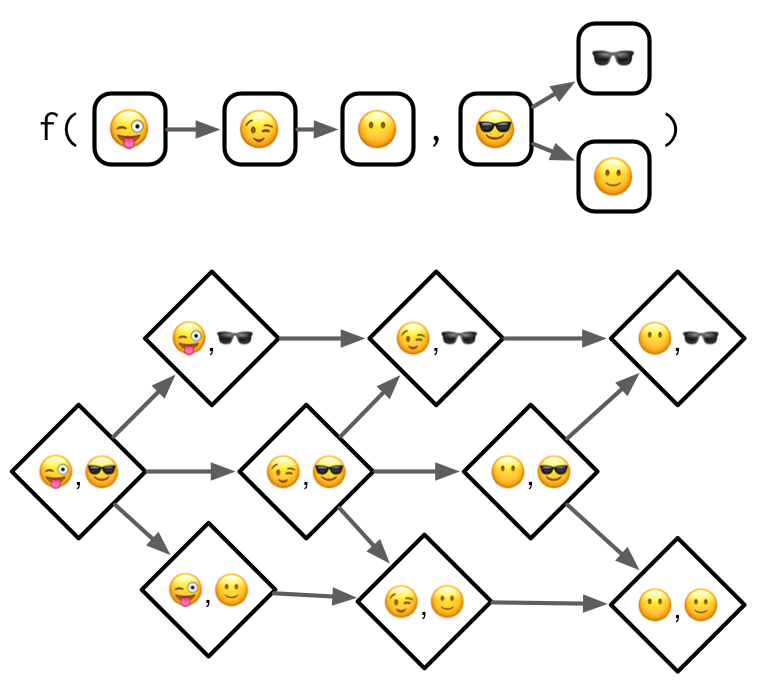

```r
library(tidyverse)
```

```
## ── Attaching core tidyverse packages ──────────────────────── tidyverse 2.0.0 ──
## ✔ dplyr     1.1.0     ✔ readr     2.1.4
## ✔ forcats   1.0.0     ✔ stringr   1.5.0
## ✔ ggplot2   3.4.1     ✔ tibble    3.2.1
## ✔ lubridate 1.9.2     ✔ tidyr     1.3.0
## ✔ purrr     1.0.1     
## ── Conflicts ────────────────────────────────────────── tidyverse_conflicts() ──
## ✖ dplyr::filter() masks stats::filter()
## ✖ dplyr::lag()    masks stats::lag()
## ℹ Use the ]8;;http://conflicted.r-lib.org/conflicted package]8;; to force all conflicts to become errors
```


# 15 S4

## 15.1 Introduction

S4 provides a formal approach to functional OOP. The underlying ideas are similar to S3 (the topic of Chapter \@ref(s3)), but implementation is much stricter and makes use of specialised functions for creating classes (`setClass()`), generics (`setGeneric()`), and methods (`setMethod()`). Additionally, S4 provides both multiple inheritance (i.e. a class can have multiple parents) and multiple dispatch (i.e. method dispatch can use the class of multiple arguments).

An important new component of S4 is the __slot__, a named component of the object that is accessed using the specialised subsetting operator `@` (pronounced at). The set of slots, and their classes, forms an important part of the definition of an S4 class.

### Outline {-}

* Section \@ref(s4-basics) gives a quick overview of the main components of S4:
  classes, generics, and methods.
  
* Section \@ref(s4-classes) dives into the details of S4 classes, including
  prototypes, constructors, helpers, and validators.
  
* Section \@ref(s4-generics) shows you how to create new S4 generics, and 
  how to supply those generics with methods. You'll also learn about
  accessor functions which are designed to allow users to safely inspect and 
  modify object slots.
  
* Section \@ref(s4-dispatch) dives into the full details of method dispatch
  in S4. The basic idea is simple, then it rapidly gets more complex once
  multiple inheritance and multiple dispatch are combined.
  
* Section \@ref(s4-s3) discusses the interaction between S4 and S3, showing
  you how to use them together.

### Learning more {-}

Like the other OO chapters, the focus here will be on how S4 works, not how to deploy it most effectively. If you do want to use it in practice, there are two main challenges:

* There is no one reference that will answer all your questions about S4.

* R's built-in documentation sometimes clashes with community best practices.

As you move towards more advanced usage, you will need to piece together needed information by carefully reading the documentation, asking questions on StackOverflow, and performing experiments. Some recommendations:

*   The Bioconductor community is a long-term user of S4 and has produced much of
    the best material about its effective use. Start with [S4 classes and
    methods][bioc-s4-class] taught by Martin Morgan and Hervé Pagès, or
    check for a newer version at [Bioconductor course materials][bioc-courses].
  
    Martin Morgan is a member of R-core and the project lead of Bioconductor.
    He's a world expert on the practical use of S4, and I recommend reading
    anything he has written about it, starting with the questions he has 
    answered on [stackoverflow][SO-Morgan].

*   John Chambers is the author of the S4 system, and provides an overview      
    of its motivation and historical context in _Object-oriented programming,
    functional programming and R_ [@chambers-2014]. For a fuller exploration
    of S4, see his book _Software for Data Analysis_ [@s4da].

### Prerequisites {-}

All functions related to S4 live in the methods package. This package is always available when you're running R interactively, but may not be available when running R in batch mode, i.e. from `Rscript`[^Rscript]. For this reason, it's a good idea to call `library(methods)` whenever you use S4. This also signals to the reader that you'll be using the S4 object system.

[^Rscript]: This is a historical quirk introduced because the methods package used to take a long time to load and `Rscript` is optimised for fast command line invocation.


```r
library(methods)
```

## 15.2 Basics {#s4-basics}

We'll start with a quick overview of the main components of S4. You define an S4 class by calling `setClass()` with the class name and a definition of its slots, and the names and classes of the class data:


```r
setClass("Person", 
  slots = c(
    name = "character", 
    age = "numeric"
  )
)
```

Once the class is defined, you can construct new objects from it by calling `new()` with the name of the class and a value for each slot:


```r
john <- new("Person", name = "John Smith", age = NA_real_)
```

\indexc{"@}
\indexc{slot()}
\index{subsetting!S4} 
\index{S4!subsetting}

Given an S4 object you can see its class with `is()` and access slots with `@` (equivalent to `$`) and `slot()` (equivalent to `[[`):


```r
is(john)
```

```
## [1] "Person"
```

```r
john@name
```

```
## [1] "John Smith"
```

```r
slot(john, "age")
```

```
## [1] NA
```

Generally, you should only use `@` in your methods. If you're working with someone else's class, look for __accessor__ functions that allow you to safely set and get slot values. As the developer of a class, you should also provide your own accessor functions. Accessors are typically S4 generics allowing multiple classes to share the same external interface.

Here we'll create a setter and getter for the `age` slot by first creating generics with `setGeneric()`:


```r
setGeneric("age", function(x) standardGeneric("age"))
```

```
## [1] "age"
```

```r
setGeneric("age<-", function(x, value) standardGeneric("age<-"))
```

```
## [1] "age<-"
```

And then defining methods with `setMethod()`:


```r
setMethod("age", "Person", function(x) x@age)
setMethod("age<-", "Person", function(x, value) {
  x@age <- value
  x
})

age(john) <- 50
age(john)
```

```
## [1] 50
```

If you're using an S4 class defined in a package, you can get help on it with `class?Person`. To get help for a method, put `?` in front of a call (e.g. `?age(john)`) and  `?` will use the class of the arguments to figure out which help file you need.

Finally, you can use sloop functions to identify S4 objects and generics found in the wild:


```r
sloop::otype(john)
```

```
## [1] "S4"
```

```r
sloop::ftype(age)
```

```
## [1] "S4"      "generic"
```

### 15.2.1 Exercises

1.  `lubridate::period()` returns an S4 class. What slots does it have?
    What class is each slot? What accessors does it provide?

> `period()` creates or parses a period object with the specified values.


```r
library(lubridate)

period(c(90, 5), c("second", "minute"))
```

```
## [1] "5M 90S"
```

```r
period(-1, "days")
```

```
## [1] "-1d 0H 0M 0S"
```

```r
period(c(3, 1, 2, 13, 1), c("second", "minute", "hour", "day", "week"))
```

```
## [1] "20d 2H 1M 3S"
```

```r
period(c(1, -60), c("hour", "minute"))
```

```
## [1] "1H -60M 0S"
```

```r
period(0, "second")
```

```
## [1] "0S"
```

```r
test_period <- lubridate::period(
  c(1, 2, 3, 4, 5, 6, 7), 
  c("year", "month", "week", "day", "hour", "minute", "second")
)

test_period
```

```
## [1] "1y 2m 25d 5H 6M 7S"
```


```r
str(test_period)
```

```
## Formal class 'Period' [package "lubridate"] with 6 slots
##   ..@ .Data : num 7
##   ..@ year  : num 1
##   ..@ month : num 2
##   ..@ day   : num 25
##   ..@ hour  : num 5
##   ..@ minute: num 6
```

> getElement(object, name)


```r
per <- lubridate::period()
str(per)
```

```
## Formal class 'Period' [package "lubridate"] with 6 slots
##   ..@ .Data : num(0) 
##   ..@ year  : num(0) 
##   ..@ month : num(0) 
##   ..@ day   : num(0) 
##   ..@ hour  : num(0) 
##   ..@ minute: num(0)
```

```r
tibble(name=slotNames(per),
       class=map_chr(name, ~ class(getElement(per, .x))))
```

```
## # A tibble: 6 × 2
##   name   class  
##   <chr>  <chr>  
## 1 .Data  numeric
## 2 year   numeric
## 3 month  numeric
## 4 day    numeric
## 5 hour   numeric
## 6 minute numeric
```


```r
second(test_period)
```

```
## [1] 7
```


What slots does it have?
>  Objects of the S4 Period class have six slots named year, month, day, hour, minute, and .Data.

What class is each slot?
> numbers (double)

What accessors does it provide?
> Besides the main constructor and parser period(), period objects can also be created with the specialized functions years(), months(), weeks(), days(), hours(), minutes(), and seconds(). 

2.  What other ways can you find help for a method? Read `?"?"` and
    summarise the details.
    
> Besides adding ? in front of a function call (i.e. ?method()), we may find:

* general documentation for a generic via `?genericName`
* general documentation for the methods of a generic via `methods?genericName`
* documentation for a specific method via `ClassName?methodName`.

## 15.3 Classes {#s4-classes}
\index{classes!S4}
\index{S4!classes}
\indexc{setClass()}

To define an S4 class, call `setClass()` with three arguments:

* The class __name__. By convention, S4 class names use `UpperCamelCase`.

* A named character vector that describes the names and classes of the 
  __slots__ (fields). For example, a person might be represented by a character 
  name and a numeric  age: `c(name = "character", age = "numeric")`. The 
  pseudo-class `ANY` allows a slot to accept objects of any type.

* A __prototype__, a list of default values for each slot. Technically,
  the prototype is optional[^prototype-docs], but you should always provide it.

[^prototype-docs]: `?setClass` recommends that you avoid the `prototype` argument, but this is generally considered to be bad advice.

The code below illustrates the three arguments by creating a `Person` class with character `name` and numeric `age` slots.


```r
setClass("Person", 
  slots = c(
    name = "character", 
    age = "numeric"
  ), 
  prototype = list(
    name = NA_character_,
    age = NA_real_
  )
)

me <- new("Person", name = "Hadley")
str(me)
```

```
## Formal class 'Person' [package ".GlobalEnv"] with 2 slots
##   ..@ name: chr "Hadley"
##   ..@ age : num NA
```

### 15.3.1 Inheritance
\index{S4!inheritance}
\index{inheritance!S4}

There is one other important argument to `setClass()`: `contains`. This specifies a class (or classes) to inherit slots and behaviour from. For example, we can create an `Employee` class that inherits from the `Person` class, adding an extra slot that describes their `boss`.


```r
setClass("Employee", 
  contains = "Person", 
  slots = c(
    boss = "Person"
  ),
  prototype = list(
    boss = new("Person")
  )
)

str(new("Employee"))
```

```
## Formal class 'Employee' [package ".GlobalEnv"] with 3 slots
##   ..@ boss:Formal class 'Person' [package ".GlobalEnv"] with 2 slots
##   .. .. ..@ name: chr NA
##   .. .. ..@ age : num NA
##   ..@ name: chr NA
##   ..@ age : num NA
```

`setClass()` has 9 other arguments but they are either deprecated or not recommended.

### 15.3.2 Introspection
\index{S4!introspection}
\indexc{is()}

To determine what classes an object inherits from, use `is()`:


```r
is(new("Person"))
```

```
## [1] "Person"
```

```r
is(new("Employee"))
```

```
## [1] "Employee" "Person"
```

To test if an object inherits from a specific class, use the second argument of `is()`:


```r
is(john, "Person")
```

```
## [1] TRUE
```

### 15.3.3 Redefinition

In most programming languages, class definition occurs at compile-time and object construction occurs later, at run-time. In R, however, both definition and construction occur at run time. When you call `setClass()`, you are registering a class definition in a (hidden) global variable. As with all state-modifying functions you need to use `setClass()` with care. It's possible to create invalid objects if you redefine a class after already having instantiated an object:


```r
setClass("A", slots = c(x = "numeric"))
a <- new("A", x = 10)

setClass("A", slots = c(a_different_slot = "numeric"))
# a <- new("A", a_different_slot = 10)
a
```

```
## An object of class "A"
## Slot "a_different_slot":
```

```
## Error in slot(object, what): no slot of name "a_different_slot" for this object of class "A"
```

This can cause confusion during interactive creation of new classes. (R6 classes have the same problem, as described in Section \@ref(r6-important-methods).)

### 15.3.4 Helper
\index{helpers!S4}
\index{constructors!S4}
\index{S4!helpers}
\indexc{new()}

`new()` is a low-level constructor suitable for use by you, the developer. User-facing classes should always be paired with a user-friendly helper. A helper should always:

* Have the same name as the class, e.g. `myclass()`.

* Have a thoughtfully crafted user interface with carefully chosen default
  values and useful conversions.

* Create carefully crafted error messages tailored towards an end-user.

* Finish by calling `methods::new()`.

The `Person` class is so simple so a helper is almost superfluous, but we can use it to clearly define the contract: `age` is optional but `name` is required. We'll also coerce age to a double so the helper also works when passed an integer.


```r
Person <- function(name, age = NA) {
  age <- as.double(age)
  
  new("Person", name = name, age = age)
}

Person("Hadley")
```

```
## An object of class "Person"
## Slot "name":
## [1] "Hadley"
## 
## Slot "age":
## [1] NA
```

### 15.3.5 Validator
\index{validators!S4}
\index{S4!validators}
\indexc{setValidity()}

The constructor automatically checks that the slots have correct classes:


```r
Person(mtcars)
```

```
## Error in validObject(.Object): invalid class "Person" object: invalid object for slot "name" in class "Person": got class "data.frame", should be or extend class "character"
```

You will need to implement more complicated checks (i.e. checks that involve lengths, or multiple slots) yourself. For example, we might want to make it clear that the Person class is a vector class, and can store data about multiple people. That's not currently clear because `@name` and `@age` can be different lengths:


```r
Person("Hadley", age = c(30, 37))
```

```
## An object of class "Person"
## Slot "name":
## [1] "Hadley"
## 
## Slot "age":
## [1] 30 37
```

To enforce these additional constraints we write a validator with `setValidity()`. It takes a class and a function that returns `TRUE` if the input is valid, and otherwise returns a character vector describing the problem(s):


```r
setValidity("Person", function(object) {
  if (length(object@name) != length(object@age)) {
    "@name and @age must be same length"
  } else {
    TRUE
  }
})
```

```
## Class "Person" [in ".GlobalEnv"]
## 
## Slots:
##                           
## Name:       name       age
## Class: character   numeric
## 
## Known Subclasses: "Employee"
```

Now we can no longer create an invalid object:


```r
Person("Hadley", age = c(30, 37))
```

```
## Error in validObject(.Object): invalid class "Person" object: @name and @age must be same length
```

NB: The validity method is only called automatically by `new()`, so you can still create an invalid object by modifying it:


```r
alex <- Person("Alex", age = 30)
alex@age <- 1:10
```

\indexc{validObject()}
You can explicitly check the validity yourself by calling `validObject()`:


```r
validObject(alex)
```

```
## Error in validObject(alex): invalid class "Person" object: @name and @age must be same length
```

In Section \@ref(accessors), we'll use `validObject()` to create accessors that can not create invalid objects.

### 15.3.6 Exercises

1.  Extend the Person class with fields to match `utils::person()`.
    Think about what slots you will need, what class each slot should have,
    and what you'll need to check in your validity method.

> The Person class from Advanced R contains the slots name and age. The person class from the {utils} package contains the slots given (vector of given names), family, role, email and comment.


```r
# ?utils::person
```

## Usage


```r
person(given = NULL, family = NULL, middle = NULL,
       email = NULL, role = NULL, comment = NULL,
       first = NULL, last = NULL)
## Default S3 method:
as.person(x)
## S3 method for class 'person'
format(x,
       include = c("given", "family", "email", "role", "comment"),
       braces = list(given = "", family = "", email = c("<", ">"),
                     role = c("[", "]"), comment = c("(", ")")),
       collapse = list(given = " ", family = " ", email = ", ",
                       role = ", ", comment = ", "),
       ...,
       style = c("text", "R")
       )
```

what slots you will need?

> "given", "family", "email", "role", "comment"

what class each slot should have?

> All slots from utils::person() besides role must be of type character and length 1. Age need to be numeric.


```r
# Definition of the Person class
setClass("Person",
  slots = c(
    age = "numeric",
    given = "character",
    family = "character",
    role = "character",
    email = "character",
    comment = "character"
  ),
  prototype = list(
    age = NA_real_,
    given = NA_character_,
    family = NA_character_,
    role = NA_character_,
    email = NA_character_,
    comment = NA_character_
  )
)
```


```r
# Helper to create instances of the Person class
Person <- function(given, family,
                   age = NA_real_,
                   role = NA_character_,
                   email = NA_character_,
                   comment = NA_character_) {
  age <- as.double(age)

  new("Person",
    age = age,
    given = given,
    family = family,
    role = role,
    email = email,
    comment = comment
  )
}
```

what you'll need to check in your validity method

> The entries in the role slot must match one of the following abbreviations “aut,” “com,” “cph,” “cre,” “ctb,” “ctr,” “dtc,” “fnd,” “rev,” “ths,” “trl.” Therefore, role might be of different length than the other slots and we’ll add a corresponding constraint within the validator.


```r
# Validator to ensure that each slot is of length one
setValidity("Person", function(object) {
  invalids <- c()
  if (length(object@age)     != 1 ||
      length(object@given)   != 1 ||
      length(object@family)  != 1 ||
      length(object@email)   != 1 ||
      length(object@comment) != 1) {
    invalids <- paste0("@name, @age, @given, @family, @email, ",
                       "@comment must be of length 1")
  } 
  
  known_roles <- c(
    NA_character_, "aut", "com", "cph", "cre", "ctb",
    "ctr", "dtc", "fnd", "rev", "ths", "trl"
  )
  
  if (!all(object@role %in% known_roles)) {
    paste(
      "@role(s) must be one of", 
      paste(known_roles, collapse = ", ")
    )
  }
  
  if (length(invalids)) return(invalids)  
  TRUE
})
```

```
## Class "Person" [in ".GlobalEnv"]
## 
## Slots:
##                                                                   
## Name:        age     given    family      role     email   comment
## Class:   numeric character character character character character
```


2.  What happens if you define a new S4 class that doesn't have any slots?
    (Hint: read about virtual classes in `?setClass`.)

> It depends on the other arguments. 

> If we don’t inherit from an existing class. We get a virtual class. If the class is virtual, an attempt to generate an object from either the generator or new() will result in an error.
    

```r
setClass("Human")
new("Human")
```

```
## Error in new("Human"): trying to generate an object from a virtual class ("Human")
```

> If we inherit from another class, we get the same slots.

But can be inherited from:


```r
setClass("Programmer", contains = "Human")
new("Programmer")
```

```
## An object of class "Programmer"
## <S4 Type Object>
```

```r
Programmer <- new("Programmer")
str(Programmer)
```

```
## Formal class 'Programmer' [package ".GlobalEnv"] with 0 slots
##  list()
```


3.  Imagine you were going to reimplement factors, dates, and data frames in 
    S4. Sketch out the `setClass()` calls that you would use to define the 
    classes. Think about appropriate `slots` and `prototype`.

> For all these classes we need one slot for the data and one slot per attribute. Keep in mind, that inheritance matters for ordered factors and dates. For data frames, special checks like equal lengths of the underlying list’s elements should be done within a validator.

> For simplicity we don’t introduce an explicit subclass for ordered factors. Instead, we introduce ordered as a slot.


```r
setClass("Factor",
  slots = c(
    data = "integer",
    levels = "character",
    ordered = "logical"
  ),
  prototype = list(
    data = integer(),
    levels = character(),
    ordered = FALSE
  )
)


new("Factor", data = c(1L, 2L), levels = letters[1:3])
```

```
## An object of class "Factor"
## Slot "data":
## [1] 1 2
## 
## Slot "levels":
## [1] "a" "b" "c"
## 
## Slot "ordered":
## [1] FALSE
```

> The Date2 class stores its dates as integers, similarly to base R which uses doubles. Dates don’t have any other attributes.


```r
setClass("Date2",
  slots = list(
    data = "integer"
  ),
  prototype = list(
    data = integer()
  )
)

new("Date2", data = 1L)
```

```
## An object of class "Date2"
## Slot "data":
## [1] 1
```


```r
setClass("DataFrame",
  slots = c(
    data = "list",
    row.names = "character"
  ),
  prototype = list(
    data = list(),
    row.names = character(0)
  )
)

new("DataFrame", data = list(a = 1, b = 2))
```

```
## An object of class "DataFrame"
## Slot "data":
## $a
## [1] 1
## 
## $b
## [1] 2
## 
## 
## Slot "row.names":
## character(0)
```


## 15.4 Generics and methods {#s4-generics}
\index{S4!generics} 
\index{generics!S4} 
\indexc{setGeneric()}
\indexc{standardGeneric()}

The job of a generic is to perform method dispatch, i.e. find the specific implementation for the combination of classes passed to the generic. Here you'll learn how to define S4 generics and methods, then in the next section we'll explore precisely how S4 method dispatch works.

To create a new S4 generic, call `setGeneric()` with a function that calls `standardGeneric()`:


```r
setGeneric("myGeneric", function(x) standardGeneric("myGeneric"))
```

```
## [1] "myGeneric"
```

By convention, new S4 generics should use `lowerCamelCase`.

It is bad practice to use `{}` in the generic as it triggers a special case that is more expensive, and generally best avoided.


```r
# Don't do this!
setGeneric("myGeneric", function(x) {
  standardGeneric("myGeneric")
})
```

```
## [1] "myGeneric"
```

### 15.4.1 Signature
\index{signature}

Like `setClass()`, `setGeneric()` has many other arguments. There is only one that you need to know about: `signature`. This allows you to control the arguments that are used for method dispatch. If `signature` is not supplied, all arguments (apart from `...`) are used. It is occasionally useful to remove arguments from dispatch. This allows you to require that methods provide arguments like `verbose = TRUE` or `quiet = FALSE`, but they don't take part in dispatch.


```r
setGeneric("myGeneric", 
  function(x, ..., verbose = TRUE) standardGeneric("myGeneric"),
  signature = "x"
)
```

```
## [1] "myGeneric"
```

### 15.4.2 Methods
\indexc{setMethod()}
\index{methods!S4}
\index{S4!methods} 

A generic isn't useful without some methods, and in S4 you define methods with `setMethod()`. There are three important arguments: the name of the generic, the name of the class, and the method itself. 


```r
setMethod("myGeneric", "Person", function(x) {
  # method implementation
})
```

More formally, the second argument to `setMethod()` is called the __signature__. In S4, unlike S3, the signature can include multiple arguments. This makes method dispatch in S4 substantially more complicated, but avoids having to implement double-dispatch as a special case. We'll talk more about multiple dispatch in the next section. `setMethod()` has other arguments, but you should never use them.

To list all the methods that belong to a generic, or that are associated with a class, use `methods("generic")` or `methods(class = "class")`; to find the implementation of a specific method, use `selectMethod("generic", "class")`.

### 15.4.3 Show method
\indexc{show()}
\index{S4!show()@\texttt{show()}}

The most commonly defined S4 method that controls printing is `show()`, which controls how the object appears when it is printed. To define a method for an existing generic, you must first determine the arguments. You can get those from the documentation or by looking at the `args()` of the generic:


```r
args(getGeneric("show"))
```

```
## function (object) 
## NULL
```

Our show method needs to have a single argument `object`:


```r
setMethod("show", "Person", function(object) {
  cat(is(object)[[1]], "\n",
      "  Name: ", object@name, "\n",
      "  Age:  ", object@age, "\n",
      sep = ""
  )
})
john
```

```
## Person
##   Name: John Smith
##   Age:  50
```

### 15.4.4 Accessors
\index{S4!accessors}

Slots should be considered an internal implementation detail: they can change without warning and user code should avoid accessing them directly. Instead, all user-accessible slots should be accompanied by a pair of __accessors__. If the slot is unique to the class, this can just be a function:


```r
person_name <- function(x) x@name
```

Typically, however, you'll define a generic so that multiple classes can use the same interface:


```r
setGeneric("name", function(x) standardGeneric("name"))
```

```
## [1] "name"
```

```r
setMethod("name", "Person", function(x) x@name)

name(john)
```

```
## [1] "John Smith"
```

If the slot is also writeable, you should provide a setter function. You should always include `validObject()` in the setter to prevent the user from creating invalid objects.


```r
setGeneric("name<-", function(x, value) standardGeneric("name<-"))
```

```
## [1] "name<-"
```

```r
setMethod("name<-", "Person", function(x, value) {
  x@name <- value
  validObject(x)
  x
})

name(john) <- "Jon Smythe"
```

```
## Error in (function (cl, name, valueClass) : 'name' is not a slot in class "Person"
```

```r
name(john)
```

```
## [1] "John Smith"
```

```r
name(john) <- letters
```

```
## Error in (function (cl, name, valueClass) : 'name' is not a slot in class "Person"
```

(If the `name<-` notation is unfamiliar, review Section \@ref(function-forms).)

### 15.4.5 Exercises

1.  Add `age()` accessors for the `Person` class.


```r
setGeneric("age", function(x) standardGeneric("age"))
```

```
## [1] "age"
```

```r
setGeneric("age<-", function(x, value) standardGeneric("age<-"))
```

```
## [1] "age<-"
```


```r
setMethod("age", "Person", function(x) x@age)
setMethod("age<-", "Person", function(x, value) {
  x@age <- value
  validObject(x)
  x
})
```


```r
age(john) <- 50
```

```
## Error in validObject(x): invalid class "Person" object: slots in class definition but not in object: "given", "family", "role", "email", "comment"
```

```r
age(john)
```

```
## [1] 50
```


2.  In the definition of the generic, why is it necessary to repeat the
    name of the generic twice?
    
> In this syntax, the first argument is the name of the generic, and the second argument is a function that will define the default behavior of the method. The name explicitly incorporates method dispatch via standardGeneric() within the generic’s body (def parameter of setGeneric()). This behaviour is similar to UseMethod() in S3.


```r
setGeneric("myGeneric", function(x) standardGeneric("myGeneric"))
```

```
## [1] "myGeneric"
```

    
3.  Why does the `show()` method defined in Section \@ref(show-method) use
    `is(object)[[1]]`? (Hint: try printing the employee subclass.)
    

```r
setMethod("show", "Person", function(object) {
  cat(is(object)[[1]], "\n",
      "  Name: ", object@name, "\n",
      "  Age:  ", object@age, "\n",
      sep = ""
  )
})
```


```r
john
```

```
## Person
##   Name: John Smith
##   Age:  50
```


```r
is(john)
```

```
## [1] "Person"
```

> is(object) returns the class of the object. is(object) also contains the superclass, for subclasses like Employee. In order to always return the most specific class (the subclass), show() returns the first element of is(object).

4.  What happens if you define a method with different argument names to
    the generic?
    
> We first create the object hadley of class Person:


```r
.Person <- setClass(
  "Person",
  slots = c(name = "character", age = "numeric")
)

setMethod("show", "Person", function(object) {
  cat(is(object)[[1]], "\n",
      "  Name: ", object@name, "\n",
      "  Age:  ", object@age, "\n",
      sep = ""
  )
})

hadley <- .Person(name = "Hadley", age = 30)
hadley
```

```
## Person
##   Name: Hadley
##   Age:  30
```

> Now let’s see which arguments can be supplied to the show() generic.


```r
formals("show")
```

```
## $object
```

> Usually, we would use this argument when defining a new method.


```r
setMethod("show", "Person", function(object) {
  cat(object@name, "creates hard exercises")
})

hadley
```

```
## Hadley creates hard exercises
```

When we supply another name as a first element of our method (e.g. x instead of object), this element will be matched to the correct object argument and we receive a warning. Our method will work, though:


```r
setMethod("show", "Person", function(x) {
  cat(x@name, "creates hard exercises")
})
```

```
## Warning: For function 'show', signature 'Person': argument in method definition
## changed from (x) to (object)
```

```r
hadley
```

```
## Hadley creates hard exercises
```

If we add more arguments to our method than our generic can handle, we will get an error.


```r
setMethod("show", "Person", function(x, y) {
  cat(x@name, "is", x@age, "years old")
})
```

```
## Error in conformMethod(signature, mnames, fnames, f, fdef, definition): in method for 'show' with signature 'object="Person"': formal arguments (object = "Person") omitted in the method definition cannot be in the signature
```

If we do this with arguments added to the correctly written object argument, we will receive an informative error message. It states that we could add other argument names for generics, which can take the ... argument.


```r
setMethod("show", "Person", function(object, y) {
  cat(object@name, "is", object@age, "years old")
})
```

```
## Error in rematchDefinition(definition, fdef, mnames, fnames, signature): methods can add arguments to the generic 'show' only if '...' is an argument to the generic
```

correct version:


```r
setMethod("show", "Person", function(object) {
  cat(object@name, "is", object@age, "years old")
})

hadley
```

```
## Hadley is 30 years old
```


## 15.5 Method dispatch {#s4-dispatch}
\index{S4!method dispatch}
\index{method dispatch!S4}

S4 dispatch is complicated because S4 has two important features:

* Multiple inheritance, i.e. a class can have multiple parents, 
* Multiple dispatch, i.e. a generic can use multiple arguments to pick a method. 

These features make S4 very powerful, but can also make it hard to understand which method will get selected for a given combination of inputs. In practice, keep method dispatch as simple as possible by avoiding multiple inheritance, and reserving multiple dispatch only for where it is absolutely necessary.

But it's important to describe the full details, so here we'll start simple with single inheritance and single dispatch, and work our way up to the more complicated cases. To illustrate the ideas without getting bogged down in the details, we'll use an imaginary __class graph__ based on emoji:


```r
library(emoji)
```

```
## Warning: package 'emoji' was built under R version 4.2.3
```

```
## 
## Attaching package: 'emoji'
```

```
## The following object is masked from 'package:ggplot2':
## 
##     arrow
```

> Emoji give us very compact class names that evoke the relationships between the classes. It should be straightforward to remember that 😜 inherits from 😉 which inherits from 😶, and that 😎 inherits from both 🕶️ and 🙂.

### 15.5.1 Single dispatch
\index{S4!single dispatch}

Let's start with the simplest case: a generic function that dispatches on a single class with a single parent. The method dispatch here is simple so it's a good place to define the graphical conventions we'll use for the more complex cases.


There are two parts to this diagram:

* The top part, `f(...)`, defines the scope of the diagram. Here we have a 
  generic with one argument, that has a class hierarchy that is three levels 
  deep.
  
* The bottom part is the __method graph__ and  displays all the possible methods 
  that could be defined. Methods that exist, i.e. that have been defined with 
  `setMethod()`, have a grey background. 

To find the method that gets called, you start with the most specific class of the actual arguments, then follow the arrows until you find a method that exists. For example, if you called the function with an object of class 😉 you would follow the arrow right to find the method defined for the more general 😶 class. If no method is found, method dispatch has failed and an error is thrown. In practice, this means that you should alway define methods defined for the terminal nodes, i.e. those on the far right. 

\index{S4!pseudo-classes}
\indexc{ANY}
There are two __pseudo-classes__ that you can define methods for. These are called pseudo-classes because they don't actually exist, but allow you to define useful behaviours. The first pseudo-class is `ANY` which matches any class[^s3-default]. For technical reasons that we'll get to later, the link to the `ANY` method is longer than the links between the other classes:

[^s3-default]: The S4 `ANY` pseudo-class plays the same role as the S3 `default` pseudo-class.


\indexc{MISSING}
The second pseudo-class is `MISSING`. If you define a method for this pseudo-class, it will match whenever the argument is missing. It's not useful for single dispatch, but is important for functions like `+` and `-` that use double dispatch and behave differently depending on whether they have one or two arguments.

### 15.5.2 Multiple inheritance
\index{S4!multiple inheritance}
\index{multiple inheritance}

Things get more complicated when the class has multiple parents.


The basic process remains the same: you start from the actual class supplied to the generic, then follow the arrows until you find a defined method. The wrinkle is that now there are multiple arrows to follow, so you might find multiple methods. If that happens, you pick the method that is closest, i.e. requires travelling the fewest arrows. 

NB: While the method graph is a powerful metaphor for understanding method dispatch, implementing it in this way would be rather inefficient, so the actual approach that S4 uses is somewhat different. You can read the details in `?Methods_Details`.

What happens if methods are the same distance? For example, imagine we've defined methods for 🕶️ and 🙂, and we call the generic with 😎. Note that no method can be found for the 😶 class, which I'll highlight with a red double outline.


This is called an __ambiguous__ method, and in diagrams I'll illustrate it with a thick dotted border. When this happens in R, you'll get a warning, and the method for the class that comes earlier in the alphabet will be picked (this is effectively random and should not be relied upon). When you discover ambiguity you should always resolve it by providing a more precise method:


The fallback `ANY` method still exists but the rules are little more complex. As indicated by the wavy dotted lines, the `ANY` method is always considered further away than a method for a real class. This means that it will never contribute to ambiguity.


With multiple inheritances it is hard to simultaneously prevent ambiguity, ensure that every terminal method has an implementation, and minimise the number of defined methods (in order to benefit from OOP). For example, of the six ways to define only two methods for this call, only one is free from problems. For this reason, I recommend using multiple inheritance with extreme care: you will need to carefully think about the method graph and plan accordingly.


### 15.5.3 Multiple dispatch
\index{S4!multiple dispatch}
\index{multiple dispatch}

Once you understand multiple inheritance, understanding multiple dispatch is straightforward. You follow multiple arrows in the same way as previously, but now each method is specified by two classes (separated by a comma).


I'm not going to show examples of dispatching on more than two arguments, but you can follow the basic principles to generate your own method graphs.

The main difference between multiple inheritance and multiple dispatch is that there are many more arrows to follow. The following diagram shows four defined methods which produce two ambiguous cases:


Multiple dispatch tends to be less tricky to work with than multiple inheritance because there are usually fewer terminal class combinations. In this example, there's only one. That means, at a minimum, you can define a single method and have default behaviour for all inputs.

### 15.5.4 Multiple dispatch and multiple inheritance

Of course you can combine multiple dispatch with multiple inheritance:



A still more complicated case dispatches on two classes, both of which have multiple inheritance:


As the method graph gets more and more complicated it gets harder and harder to predict which method will get called given a combination of inputs, and it gets harder and harder to make sure that you haven’t introduced ambiguity. If you have to draw diagrams to figure out what method is actually going to be called, it’s a strong indication that you should go back and simplify your design.

### 15.5.5 Exercises

1.  Draw the method graph for .


2.  Draw the method graph for .


3.  Take the last example which shows multiple dispatch over two classes that
    use multiple inheritance. What happens if you define a method for all
    terminal classes? Why does method dispatch not save us much work here?
    


## 15.6 S4 and S3 {#s4-s3}
\index{S4!working with S3}
\index{S3!working with S4}

When writing S4 code, you'll often need to interact with existing S3 classes and generics. This section describes how S4 classes, methods, and generics interact with existing code.

### 15.6.1 Classes
\indexc{setOldClass()}

In `slots` and `contains` you can use S4 classes, S3 classes, or the implicit class (Section \@ref(implicit-class)) of a base type.  To use an S3 class, you must first register it with `setOldClass()`. You call this function once for each S3 class, giving it the class attribute. For example, the following definitions are already provided by base R:


```r
setOldClass("data.frame")
setOldClass(c("ordered", "factor"))
setOldClass(c("glm", "lm"))
```

However, it's generally better to be more specific and provide a full S4 definition with `slots` and a `prototype`:


```r
setClass("factor",
  contains = "integer",
  slots = c(
    levels = "character"
  ),
  prototype = structure(
    integer(),
    levels = character()
  )
)
setOldClass("factor", S4Class = "factor")
```

Generally, these definitions should be provided by the creator of the S3 class. If you're trying to build an S4 class on top of an S3 class provided by a package, you should request that the package maintainer add this call to their package, rather than adding it to your own code. 

If an S4 object inherits from an S3 class or a base type, it will have a special virtual slot called `.Data`. This contains the underlying base type or S3 object: \indexc{.Data}


```r
RangedNumeric <- setClass(
  "RangedNumeric",
  contains = "numeric",
  slots = c(min = "numeric", max = "numeric"),
  prototype = structure(numeric(), min = NA_real_, max = NA_real_)
)
rn <- RangedNumeric(1:10, min = 1, max = 10)
rn@min
```

```
## [1] 1
```

```r
rn@.Data
```

```
##  [1]  1  2  3  4  5  6  7  8  9 10
```

It is possible to define S3 methods for S4 generics, and S4 methods for S3 generics (provided you've called `setOldClass()`). However, it's more complicated than it might appear at first glance, so make sure you thoroughly read `?Methods_for_S3`.

### 15.6.2 Generics
\indexc{setGeneric()}

As well as creating a new generic from scratch, it's also possible to convert an existing S3 generic to an S4 generic:


```r
setGeneric("mean")
```

```
## [1] "mean"
```

In this case, the existing function becomes the default (`ANY`) method:
 

```r
selectMethod("mean", "ANY")
```

```
## Method Definition (Class "derivedDefaultMethod"):
## 
## function (x, ...) 
## UseMethod("mean")
## <bytecode: 0x0000020735c72550>
## <environment: namespace:base>
## 
## Signatures:
##         x    
## target  "ANY"
## defined "ANY"
```
 
NB: `setMethod()` will automatically call `setGeneric()` if the first argument isn't already a generic, enabling you to turn any existing function into an S4 generic. It is OK to convert an existing S3 generic to S4, but you should avoid converting regular functions to S4 generics in packages because that requires careful coordination if done by multiple packages.

### 15.6.3 Exercises

1.  What would a full `setOldClass()` definition look like for an ordered 
    factor (i.e. add `slots` and `prototype` the definition above)?

> The purpose of setOldClass() lies in registering an S3 class as a “formally defined class,” so that it can be used within the S4 object-oriented programming system. When using it, we may provide the argument S4Class, which will inherit the slots and their default values (prototype) to the registered class.

Let’s build an S4 OrderedFactor on top of the S3 factor in such a way.


```r
setOldClass("factor")    # use build-in definition for brevity

OrderedFactor <- setClass(
  "OrderedFactor",
  contains = "factor",   # inherit from registered S3 class
  slots = c(
    levels = "character",
    ordered = "logical"  # add logical order slot
  ),
  prototype = structure(
    integer(),
    levels = character(),
    ordered = logical()  # add default value
  )
)
```

We can now register the (S3) ordered-class, while providing an “S4 template.” We can also use the S4-class to create new object directly.


```r
setOldClass("ordered", S4Class = "OrderedFactor")

x <- OrderedFactor(
  c(1L, 2L, 2L),
  levels = c("a", "b", "c"),
  ordered = TRUE
)
str(x)
```

```
## Formal class 'OrderedFactor' [package ".GlobalEnv"] with 4 slots
##   ..@ .Data   : int [1:3] 1 2 2
##   ..@ levels  : chr [1:3] "a" "b" "c"
##   ..@ ordered : logi TRUE
##   ..@ .S3Class: chr "factor"
```

```r
#> Formal class 'OrderedFactor' [package ".GlobalEnv"] with 4 slots
#>   ..@ .Data   : int [1:3] 1 2 2
#>   ..@ levels  : chr [1:3] "a" "b" "c"
#>   ..@ ordered : logi TRUE
#>   ..@ .S3Class: chr "factor"
```


2.  Define a `length` method for the `Person` class.

> We keep things simple and will just return "180cm" when the length() method is called on a Person object. The method can be defined either as an S3 or S4 method.


```r
length.Person <- function(x) "180cm"  # S3
setMethod("length", "Person", function(x) "180cm")  # S4
```


[SO-Morgan]: http://stackoverflow.com/search?tab=votes&q=user%3a547331%20%5bs4%5d%20is%3aanswe
[bioc-courses]: https://bioconductor.org/help/course-materials/
[bioc-s4-class]: https://bioconductor.org/help/course-materials/2017/Zurich/S4-classes-and-methods.html
[bioc-s4-overview]: https://bioconductor.org/packages/devel/bioc/vignettes/S4Vectors/inst/doc/S4QuickOverview.pdf

