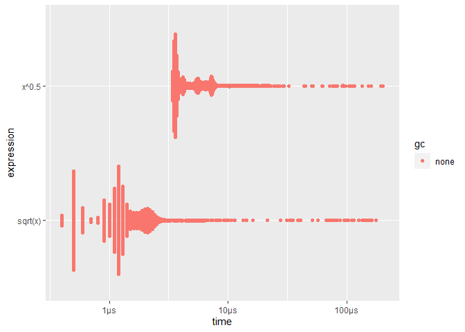

# 23 Measuring performance {#perf-measure}
\index{performance!measuring}


## 23.1 Introduction

> Programmers waste enormous amounts of time thinking about, or worrying 
> about, the speed of noncritical parts of their programs, and these attempts 
> at efficiency actually have a strong negative impact when debugging and 
> maintenance are considered.
>
> --- Donald Knuth.

Before you can make your code faster, you first need to figure out what's making it slow. This sounds easy, but it's not. Even experienced programmers have a hard time identifying bottlenecks in their code. So instead of relying on your intuition, you should __profile__ your code: measure the run-time of each line of code using realistic inputs.

Once you've identified bottlenecks you'll need to carefully experiment with alternatives to find faster code that is still equivalent. In Chapter  \@ref(perf-improve) you'll learn a bunch of ways to speed up code, but first you need to learn how to __microbenchmark__ so that you can precisely measure the difference in performance.

### Outline {-}

* Section \@ref(profiling) shows you how to use profiling tools to dig into
  exactly what is making code slow.
  
* Section \@ref(microbenchmarking) shows how to use microbenchmarking to 
  explore alternative implementations and figure out exactly which one is 
  fastest.

### Prerequisites {-}

We'll use [profvis](https://rstudio.github.io/profvis/) for profiling, and [bench](https://bench.r-lib.org/) for microbenchmarking.


```r
library(profvis)
library(bench)
```

## 23.2 Profiling {#profiling}
\index{profiling}
\indexc{RProf()}

Across programming languages, the primary tool used to understand code performance is the profiler. There are a number of different types of profilers, but R uses a fairly simple type called a sampling or statistical profiler. A sampling profiler stops the execution of code every few milliseconds and records the call stack (i.e. which function is currently executing, and the function that called the function, and so on). For example, consider `f()`, below: 


```r
f <- function() {
  pause(0.1)
  g()
  h()
}
g <- function() {
  pause(0.1)
  h()
}
h <- function() {
  pause(0.1)
}
```

(I use `profvis::pause()` instead of `Sys.sleep()` because `Sys.sleep()` does not appear in profiling outputs because as far as R can tell, it doesn't use up any computing time.) \indexc{pause()}

If we profiled the execution of `f()`, stopping the execution of code every 0.1 s, we'd see a profile like this:


```r
"pause" "f" 
"pause" "g" "f"
"pause" "h" "g" "f"
"pause" "h" "f"
```

Each line represents one "tick" of the profiler (0.1 s in this case), and function calls are recorded from right to left: the first line shows `f()` calling `pause()`. It shows that the code spends 0.1 s running `f()`, then 0.2 s running `g()`, then 0.1 s running `h()`.

If we actually profile `f()`, using `utils::Rprof()` as in the code below, we're unlikely to get such a clear result.


```r
tmp <- tempfile()
Rprof(tmp, interval = 0.1)
f()
Rprof(NULL)
writeLines(readLines(tmp))
#> sample.interval=100000
#> "pause" "g" "f" 
#> "pause" "h" "g" "f" 
#> "pause" "h" "f" 
```

That's because all profilers must make a fundamental trade-off between accuracy and performance. The compromise that makes, using a sampling profiler, only has minimal impact on performance, but is fundamentally stochastic because there's some variability in both the accuracy of the timer and in the time taken by each operation. That means each time that you profile you'll get a slightly different answer. Fortunately, the variability most affects functions that take very little time to run, which are also the functions of least interest.

### 23.2.1 Visualising profiles
\indexc{profvis()}

The default profiling resolution is quite small, so if your function takes even a few seconds it will generate hundreds of samples. That quickly grows beyond our ability to look at directly, so instead of using `utils::Rprof()` we'll use the profvis package to visualise aggregates. profvis also connects profiling data back to the underlying source code, making it easier to build up a mental model of what you need to change. If you find profvis doesn't help for your code, you might try one of the other options like `utils::summaryRprof()` or the proftools package [@proftools].

There are two ways to use profvis:

*   From the Profile menu in RStudio.
  
*   With `profvis::profvis()`. I recommend storing your code in a separate 
    file and `source()`ing it in; this will ensure you get the best connection 
    between profiling data and source code.

    
    ```r
    source("profiling-example.R")
    profvis(f())
    ```

After profiling is complete, profvis will open an interactive HTML document that allows you to explore the results. There are two panes, as shown in Figure \@ref(fig:flamegraph). 

<div class="figure">

<p class="caption">profvis output showing source on top and flame graph below.</p>
</div>

The top pane shows the source code, overlaid with bar graphs for memory and execution time for each line of code. Here I'll focus on time, and we'll come back to memory shortly. This display gives you a good overall feel for the bottlenecks but doesn't always help you precisely identify the cause. Here, for example, you can see that `h()` takes 150 ms, twice as long as `g()`; that's not because the function is slower, but because it's called twice as often.

The bottom pane displays a __flame graph__ showing the full call stack. This allows you to see the full sequence of calls leading to each function, allowing you to see that `h()` is called from two different places. In this display you can mouse over individual calls to get more information, and see the corresponding line of source code, as in Figure \@ref(fig:perf-info).

<div class="figure">

<p class="caption">Hovering over a call in the flamegraph highlights the corresponding line of code, and displays additional information about performance.</p>
</div>

Alternatively, you can use the __data tab__, Figure \@ref(fig:perf-tree) lets you interactively dive into the tree of performance data. This is basically the same display as the flame graph (rotated 90 degrees), but it's more useful when you have very large or deeply nested call stacks because you can choose to interactively zoom into only selected components.

<div class="figure">

<p class="caption">The data gives an interactive tree that allows you to selectively zoom into key components</p>
</div>

### 23.2.2 Memory profiling
\index{profiling!memory}
\index{garbage collector!performance}
\index{memory usage}

There is a special entry in the flame graph that doesn't correspond to your code: `<GC>`, which indicates that the garbage collector is running. If `<GC>` is taking a lot of time, it's usually an indication that you're creating many short-lived objects. For example, take this small snippet of code:


```r
profvis({x <- integer()
for (i in 1:1e4) {
  x <- c(x, i)
}})
```

```{=html}
<div class="profvis html-widget html-fill-item-overflow-hidden html-fill-item" id="htmlwidget-157f2b6a8c5793b3a677" style="width:100%;height:600px;"></div>
<script type="application/json" data-for="htmlwidget-157f2b6a8c5793b3a677">{"x":{"message":{"prof":{"time":[1,2,3,4,5,6,7,8,9,10],"depth":[1,1,1,1,1,1,1,1,1,1],"label":["c","c","c","c","c","c","c","c","c","c"],"filenum":[1,1,1,1,1,1,1,1,1,1],"linenum":[3,3,3,3,3,3,3,3,3,3],"memalloc":[21.88460540771484,42.79207611083984,62.55522918701172,19.62242889404297,43.75038909912109,62.50820159912109,18.931640625,37.04910278320312,59.05307006835938,18.43270111083984],"meminc":[0,20.907470703125,19.76315307617188,-42.93280029296875,24.12796020507812,18.7578125,-43.57656097412109,18.11746215820312,22.00396728515625,-40.62036895751953],"filename":["<expr>","<expr>","<expr>","<expr>","<expr>","<expr>","<expr>","<expr>","<expr>","<expr>"]},"interval":10,"files":[{"filename":"<expr>","content":"profvis({x <- integer()\nfor (i in 1:1e4) {\n  x <- c(x, i)\n}})","normpath":"<expr>"}],"prof_output":"C:\\Users\\myj23\\AppData\\Local\\Temp\\RtmpSWcvhg\\file5d1c342c6dbf.prof","highlight":{"output":["^output\\$"],"gc":["^<GC>$"],"stacktrace":["^\\.\\.stacktraceo(n|ff)\\.\\.$"]},"split":"h"}},"evals":[],"jsHooks":[]}</script>
```

If you profile it, you'll see that most of the time is spent in the garbage collector, Figure \@ref(fig:perf-memory).

<div class="figure">

<p class="caption">Profiling a loop that modifies an existing variable reveals that most time is spent in the garbage collector (<GC>).</p>
</div>

When you see the garbage collector taking up a lot of time in your own code, you can often figure out the source of the problem by looking at the memory column: you'll see a line where large amounts of memory are being allocated (the bar on the right) and freed (the bar on the left). Here the problem arises because of copy-on-modify (Section \@ref(copy-on-modify)): each iteration of the loop creates another copy of `x`. You'll learn strategies to resolve this type of problem in Section \@ref(avoid-copies).

### 23.2.3 Limitations
\index{profiling!limitations}

There are some other limitations to profiling:

*   Profiling does not extend to C code. You can see if your R code calls C/C++
    code but not what functions are called inside of your C/C++ code. 
    Unfortunately, tools for profiling compiled code are beyond the scope of
    this book; start by looking at <https://github.com/r-prof/jointprof>.

*   If you're doing a lot of functional programming with anonymous functions,
    it can be hard to figure out exactly which function is being called.
    The easiest way to work around this is to name your functions.

*   Lazy evaluation means that arguments are often evaluated inside another 
    function, and this complicates the call stack (Section 
    \@ref(lazy-call-stack)). Unfortunately R's profiler doesn't store enough
    information to disentangle lazy evaluation so that in the following code, 
    profiling would  make it seem like `i()` was called by `j()` because the 
    argument isn't evaluated until it's needed by `j()`. 

    
    ```r
    i <- function() {
      pause(0.1)
      10
    }
    j <- function(x) {
      x + 10
    }
    j(i())
    ```
    
    If this is confusing, use `force()` (Section \@ref(forcing-evaluation)) to 
    force computation to happen earlier.
    
    

```r
profvis({
  i <- function() {
    pause(0.1)
    10
  }
  j <- function(x) {
    x + 10
  }
  j(i())
})
```

```{=html}
<div class="profvis html-widget html-fill-item-overflow-hidden html-fill-item" id="htmlwidget-495dd9af29660e6c3a56" style="width:100%;height:600px;"></div>
<script type="application/json" data-for="htmlwidget-495dd9af29660e6c3a56">{"x":{"message":{"prof":{"time":[1,1,2,2,3,3,4,4,5,5,6,6,7,7],"depth":[2,1,2,1,2,1,2,1,2,1,2,1,2,1],"label":["Rprof","profvis","pause","i","pause","i","pause","i","pause","i","pause","i","pause","i"],"filenum":[null,null,1,1,1,1,1,1,1,1,1,1,1,1],"linenum":[null,null,3,7,3,7,3,7,3,7,3,7,3,7],"memalloc":[9.88671875,9.88671875,9.887092590332031,9.887092590332031,9.887092590332031,9.887092590332031,9.887092590332031,9.887092590332031,9.887092590332031,9.887092590332031,9.887092590332031,9.887092590332031,9.887092590332031,9.887092590332031],"meminc":[0,0,0.00037384033203125,0,0,0,0,0,0,0,0,0,0,0],"filename":[null,null,"<expr>","<expr>","<expr>","<expr>","<expr>","<expr>","<expr>","<expr>","<expr>","<expr>","<expr>","<expr>"]},"interval":10,"files":[{"filename":"<expr>","content":"profvis({\n  i <- function() {\n    pause(0.1)\n    10\n  }\n  j <- function(x) {\n    x + 10\n  }\n  j(i())\n})","normpath":"<expr>"}],"prof_output":"C:\\Users\\myj23\\AppData\\Local\\Temp\\RtmpSWcvhg\\file5d1c697e7f67.prof","highlight":{"output":["^output\\$"],"gc":["^<GC>$"],"stacktrace":["^\\.\\.stacktraceo(n|ff)\\.\\.$"]},"split":"h"}},"evals":[],"jsHooks":[]}</script>
```


```r
profvis({
  i <- function() {
    pause(0.1)
    10
  }
  j <- function(x) {
    x + 10
  }
  force(j(i()))
})
```

```{=html}
<div class="profvis html-widget html-fill-item-overflow-hidden html-fill-item" id="htmlwidget-8780986edc8ec4e3d6da" style="width:100%;height:600px;"></div>
<script type="application/json" data-for="htmlwidget-8780986edc8ec4e3d6da">{"x":{"message":{"prof":{"time":[1,1,1,2,2,3,3,4,4,5,5,6,6,7,7],"depth":[3,2,1,2,1,2,1,2,1,2,1,2,1,2,1],"label":["tryCatch","with_profvis_handlers","profvis","pause","i","pause","i","pause","i","pause","i","pause","i","pause","i"],"filenum":[null,null,null,1,1,1,1,1,1,1,1,1,1,1,1],"linenum":[null,null,null,3,7,3,7,3,7,3,7,3,7,3,7],"memalloc":[9.913688659667969,9.913688659667969,9.913688659667969,9.914054870605469,9.914054870605469,9.914054870605469,9.914054870605469,9.914054870605469,9.914054870605469,9.914054870605469,9.914054870605469,9.914054870605469,9.914054870605469,9.914054870605469,9.914054870605469],"meminc":[0,0,0,0.0003662109375,0,0,0,0,0,0,0,0,0,0,0],"filename":[null,null,null,"<expr>","<expr>","<expr>","<expr>","<expr>","<expr>","<expr>","<expr>","<expr>","<expr>","<expr>","<expr>"]},"interval":10,"files":[{"filename":"<expr>","content":"profvis({\n  i <- function() {\n    pause(0.1)\n    10\n  }\n  j <- function(x) {\n    x + 10\n  }\n  force(j(i()))\n})","normpath":"<expr>"}],"prof_output":"C:\\Users\\myj23\\AppData\\Local\\Temp\\RtmpSWcvhg\\file5d1c33cf526c.prof","highlight":{"output":["^output\\$"],"gc":["^<GC>$"],"stacktrace":["^\\.\\.stacktraceo(n|ff)\\.\\.$"]},"split":"h"}},"evals":[],"jsHooks":[]}</script>
```

### 23.2.4 Exercises

<!-- The explanation of `torture = TRUE` was removed in https://github.com/hadley/adv-r/commit/ea63f1e48fb523c013fb3df1860b7e0c227e1512 -->

1.  Profile the following function with `torture = TRUE`. What is 
    surprising? Read the source code of `rm()` to figure out what's going on.

    
    ```r
    f <- function(n = 1e5) {
      x <- rep(1, n)
      rm(x)
    }
    ```
    

```r
profvis::profvis(f())
```

> it executes too fast for meaningful results.

To achieve more precise memory profiling, we can enable the torture = TRUE option, which triggers garbage collection after each memory allocation call.


```r
profvis::profvis(f(), torture = TRUE)
```

Interestingly, profiling f() in this manner takes an unexpectedly long time. What might be causing this delay?

To investigate, examine the source code of the rm() function:


```r
View(rm)
```

function (..., list = character(), pos = -1, envir = as.environment(pos), 
  inherits = FALSE) 
{
  if (...length()) {
    dots <- match.call(expand.dots = FALSE)$...
    if (!all(vapply(dots, function(x) is.symbol(x) || is.character(x), 
      NA, USE.NAMES = FALSE))) 
      stop("... must contain names or character strings")
    list <- .Primitive("c")(list, vapply(dots, as.character, 
      ""))
  }
  .Internal(remove(list, envir, inherits))
}

It turns out that rm() performs a significant amount of work to determine the name of the object to delete due to its reliance on non-standard evaluation.

To simplify the task for rm(), we can utilize the list argument:


```r
f2 <- function(n = 1e5) {
  x <- rep(1, n)
  rm(list = "x")
}
profvis::profvis(f2(), torture = TRUE)
```

However, even with this modification, profiling `f2()` still takes an excessive amount of time, leaving us effectively stuck in the profiling process.

## 23.3 Microbenchmarking {#microbenchmarking}
\index{microbenchmarking|see {benchmarking}}
\index{benchmarking}
 
A __microbenchmark__ is a measurement of the performance of a very small piece of code, something that might take milliseconds (ms), microseconds (µs), or nanoseconds (ns) to run. Microbenchmarks are useful for comparing small snippets of code for specific tasks. Be very wary of generalising the results of microbenchmarks to real code: the observed differences in microbenchmarks will typically be dominated by higher-order effects in real code; a deep understanding of subatomic physics is not very helpful when baking.

A great tool for microbenchmarking in R is the bench package [@bench]. The bench package uses a high precision timer, making it possible to compare operations that only take a tiny amount of time. For example, the following code compares the speed of two approaches to computing a square root.


```r
x <- runif(100)
(lb <- bench::mark(
  sqrt(x),
  x ^ 0.5
))
```

```
## # A tibble: 2 × 6
##   expression      min   median `itr/sec` mem_alloc `gc/sec`
##   <bch:expr> <bch:tm> <bch:tm>     <dbl> <bch:byt>    <dbl>
## 1 sqrt(x)       400ns    1.2µs   620132.      848B        0
## 2 x^0.5         3.4µs    3.7µs   198842.      848B        0
```

By default, `bench::mark()` runs each expression at least once (`min_iterations = 1`), and at most enough times to take 0.5 s (`min_time = 0.5`). It checks that each run returns the same value which is typically what you want microbenchmarking; if you want to compare the speed of expressions that return different values, set `check = FALSE`.

### 23.3.1 `bench::mark()` results
\indexc{mark()}

`bench::mark()` returns the results as a tibble, with one row for each input expression, and the following columns:

*   `min`, `mean`, `median`, `max`, and `itr/sec` summarise the time taken by the 
    expression. Focus on the minimum (the best possible running time) and the
    median (the typical time). In this example, you can see that using the 
    special purpose `sqrt()` function is faster than the general exponentiation 
    operator. 

    You can visualise the distribution of the individual timings with `plot()`:

    
    ```r
    plot(lb)
    ```
    
    ```
    ## Loading required namespace: tidyr
    ```
    
    <!-- -->

    The distribution tends to be heavily right-skewed (note that the x-axis is 
    already on a log scale!), which is why you should avoid comparing means. 
    You'll also often see multimodality because your computer is running
    something else in the background.

*   `mem_alloc` tells you the amount of memory allocated by the first run,
    and `n_gc()` tells you the total number of garbage collections over all
    runs. These are useful for assessing the memory usage of the expression.
  
*   `n_itr` and `total_time` tells you how many times the expression was 
    evaluated and how long that took in total. `n_itr` will always be
    greater than the `min_iteration` parameter, and `total_time` will always
    be greater than the `min_time` parameter.

*   `result`, `memory`, `time`, and `gc` are list-columns that store the 
    raw underlying data.

Because the result is a special type of tibble, you can use `[` to select just the most important columns. I'll do that frequently in the next chapter.


```r
lb[c("expression", "min", "median", "itr/sec", "n_gc")]
```

```
## # A tibble: 2 × 4
##   expression      min   median `itr/sec`
##   <bch:expr> <bch:tm> <bch:tm>     <dbl>
## 1 sqrt(x)       400ns    1.2µs   620132.
## 2 x^0.5         3.4µs    3.7µs   198842.
```

### 23.3.2 Interpreting results


As with all microbenchmarks, pay careful attention to the units: here, each computation takes about 400 ns, 400 billionths of a second. To help calibrate the impact of a microbenchmark on run time, it's useful to think about how many times a function needs to run before it takes a second. If a microbenchmark takes:

* 1 ms, then one thousand calls take a second.
* 1 µs, then one million calls take a second.
* 1 ns, then one billion calls take a second.

The `sqrt()` function takes about 400 ns, or 0.4 µs, to compute the square roots of 100 numbers. That means if you repeated the operation a million times, it would take 0.4 s, and hence changing the way you compute the square root is unlikely to significantly affect real code. This is the reason you need to exercise care when generalising microbenchmarking results.

### 23.3.3 Exercises

1. Instead of using `bench::mark()`, you could use the built-in function
   `system.time()`. But `system.time()` is much less precise, so you'll
   need to repeat each operation many times with a loop, and then divide
   to find the average time of each operation, as in the code below.

    
    ```r
    n <- 1e6
    x <- runif(100)
    
    system.time(for (i in 1:n) sqrt(x)) / n
    system.time(for (i in 1:n) x ^ 0.5) / n
    ```
    
    How do the estimates from `system.time()` compare to those from
    `bench::mark()`? Why are they different?


```r
n <- 1e6
x <- runif(100)

system.time(for (i in 1:n)
  sqrt(x)) / n
```

```
##     user   system  elapsed 
## 3.70e-07 1.40e-07 1.02e-06
```

```r
system.time(for (i in 1:n)
  x ^ 0.5) / n
```

```
##     user   system  elapsed 
## 4.40e-06 0.00e+00 9.26e-06
```
The first two entries are the total user and system CPU times of the current R process and any child processes on which it has waited, and the third entry is the ‘real’ elapsed time since the process was started.

The definition of ‘user’ and ‘system’ times is from your OS. Typically it is something like

The ‘user time’ is the CPU time charged for the execution of user instructions of the calling process. The ‘system time’ is the CPU time charged for execution by the system on behalf of the calling process.


```r
n <- 1e6
x <- runif(100)

bench_df <- bench::mark(
  sqrt(x), 
  x ^ 0.5,
  iterations = n
)

bench_df
```

```
## # A tibble: 2 × 6
##   expression      min   median `itr/sec` mem_alloc `gc/sec`
##   <bch:expr> <bch:tm> <bch:tm>     <dbl> <bch:byt>    <dbl>
## 1 sqrt(x)       400ns      2µs   370136.      848B     7.40
## 2 x^0.5         3.3µs   12.2µs    96766.      848B     3.00
```

To compare the results of both benchmarking approaches, we need access to the raw data.


```r
t1_bench <- mean(unlist(bench_df[1, "time"]))
t2_bench <- mean(unlist(bench_df[2, "time"]))

t1_systime <- system.time(for (i in 1:n) sqrt(x)) / n
t2_systime <- system.time(for (i in 1:n) x ^ 0.5) / n
```


```r
# Compare the results
t1_systime["elapsed"]
```

```
##  elapsed 
## 1.08e-06
```

```r
t1_bench
```

```
## [1] 2.984032e-06
```

```r
t2_systime["elapsed"]
```

```
##  elapsed 
## 5.39e-06
```

```r
t2_bench
```

```
## [1] 1.07256e-05
```


2.  Here are two other ways to compute the square root of a vector. Which
    do you think will be fastest? Which will be slowest? Use microbenchmarking
    to test your answers.

    
    ```r
    x ^ (1 / 2)
    exp(log(x) / 2)
    ```
    
    

```r
x <- runif(100)

benchmark_results <- bench::mark(
  sqrt(x),
  x^0.5,
  x^(1 / 2),
  exp(log(x) / 2)
)

benchmark_results
```

```
## # A tibble: 4 × 6
##   expression         min   median `itr/sec` mem_alloc `gc/sec`
##   <bch:expr>    <bch:tm> <bch:tm>     <dbl> <bch:byt>    <dbl>
## 1 sqrt(x)          400ns    500ns  1397194.      848B        0
## 2 x^0.5            3.4µs    3.7µs   205348.      848B        0
## 3 x^(1/2)          3.6µs    5.8µs   165040.      848B        0
## 4 exp(log(x)/2)    8.5µs   10.8µs    85365.      848B        0
```

fastest: `sqrt(x)`
slowest: `exp(log(x) / 2)`
