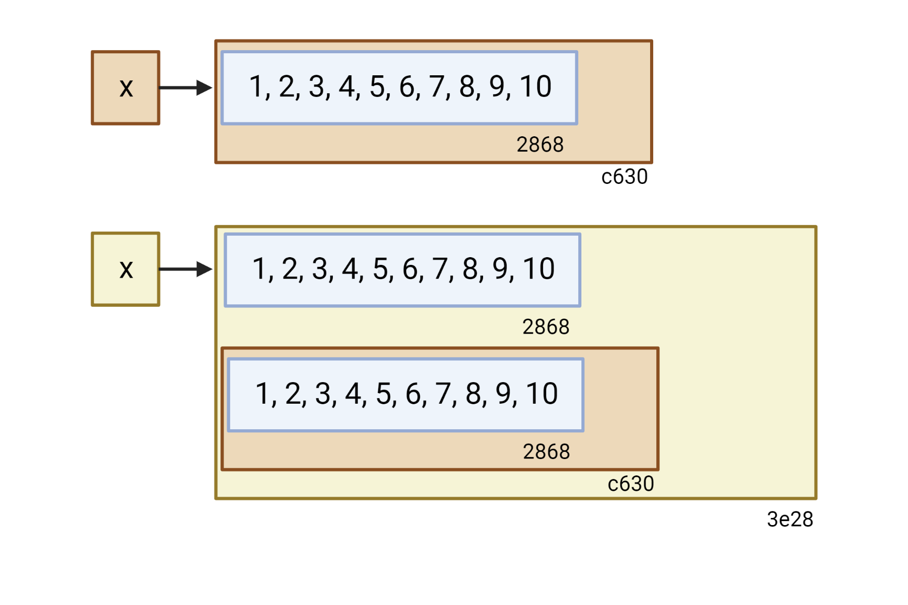

# Names and values {#names-values}

## 2.1 Introduction

In R, it is important to understand the distinction between an object and its name. Doing so will help you:

* More accurately predict the performance and memory usage of your code. 
* Write faster code by avoiding accidental copies, a major source of slow code. 
* Better understand R's functional programming tools.

The goal of this chapter is to help you understand the distinction between names and values, and when R will copy an object.

### Quiz {-}

Answer the following questions to see if you can safely skip this chapter. You can find the answers at the end of the chapter in Section \@ref(names-values-answers).

1.  Given the following data frame, how do I create a new column called "3"
    that contains the sum of `1` and `2`? You may only use `$`, not `[[`.
    What makes `1`, `2`, and `3` challenging as variable names?


```r
df <- data.frame(runif(3), runif(3))
names(df) <- c(1, 2)
```

> Before reading:


```r
df$"3" <- df$"1" + df$"2"
str(df)
```

```
## 'data.frame':	3 obs. of  3 variables:
##  $ 1: num  0.20787 0.93624 0.00989
##  $ 2: num  0.729 0.538 0.267
##  $ 3: num  0.937 1.474 0.277
```

> After reading:


```r
df$`3` <- df$`1` + df$`2`
str(df)
```

```
## 'data.frame':	3 obs. of  3 variables:
##  $ 1: num  0.20787 0.93624 0.00989
##  $ 2: num  0.729 0.538 0.267
##  $ 3: num  0.937 1.474 0.277
```

> Using numbers for column name is confusing.   

2.  In the following code, how much memory does `y` occupy?
   
    
    ```r
    x <- runif(1e6)
    y <- list(x, x, x)
    ```

> Before reading: 24 MB. Based on the number shows in the environment.

> After reading: 8 MB.


```r
lobstr::obj_size(y)
```

```
## 8.00 MB
```
> The number in the environment probably from utils::object.size().

3.  On which line does `a` get copied in the following example?

    
    ```r
    a <- c(1, 5, 3, 2)
    b <- a
    b[[1]] <- 10
    ```

> Before reading: `a` get copied on the line : `b <- a`

> After reading: `a` get copied on the line : `b[[1]] <- 10`

### Outline {-}

* Section \@ref(binding-basics) introduces you to the distinction between
  names and values, and discusses how `<-` creates a binding, or reference,
  between a name and a value. 

* Section \@ref(copy-on-modify) describes when R makes a copy: whenever you
  modify a vector, you're almost certainly creating a new, modified vector. 
  You'll learn how to use `tracemem()` to figure out when a copy actually 
  occurs. Then you'll explore the implications as they apply to function calls, 
  lists, data frames, and character vectors. 

* Section \@ref(object-size) explores the implications of the previous two 
  sections on how much memory an object occupies. Since your intuition may be 
  profoundly wrong and since `utils::object.size()` is unfortunately 
  inaccurate, you'll learn how to use `lobstr::obj_size()`.

* Section \@ref(modify-in-place) describes the two important exceptions to
  copy-on-modify: with environments and values with a single name, objects are 
  actually modified in place.

* Section \@ref(gc) concludes the chapter with a discussion of the garbage 
  collector, which frees up the memory used by objects no longer referenced by 
  a name.

### Prerequisites {-}

We'll use the [lobstr](https://github.com/r-lib/lobstr) package to dig into the internal representation of R objects.


```r
library(lobstr)
```

### Sources {-}

The details of R's memory management are not documented in a single place. Much of the information in this chapter was gleaned from a close reading of the documentation (particularly `?Memory` and `?gc`), the [memory profiling](http://cran.r-project.org/doc/manuals/R-exts.html#Profiling-R-code-for-memory-use) section of _Writing R extensions_ [@r-exts], and the [SEXPs](http://cran.r-project.org/doc/manuals/R-ints.html#SEXPs) section of _R internals_ [@r-ints]. The rest I figured out by reading the C source code, performing small experiments, and asking questions on R-devel. Any mistakes are entirely mine.

## 2.2 Binding basics
\index{bindings|seealso {assignment}}
\index{assignment}
\indexc{obj\_addr()}

Consider this code: 


```r
x <- c(1, 2, 3)
```

It's easy to read it as: "create an object named 'x', containing the values 1, 2, and 3". Unfortunately, that's a simplification that will lead to inaccurate predictions about what R is actually doing behind the scenes. It's more accurate to say that this code is doing two things:

* It's creating an object, a vector of values, `c(1, 2, 3)`.
* And it's binding that object to a name, `x`.

In other words, the object, or value, doesn't have a name; it's actually the name that has a value. 

To further clarify this distinction, I'll draw diagrams like this:  


The name, `x`, is drawn with a rounded rectangle. It has an arrow that points to (or binds or references) the value, the vector `c(1, 2, 3)`. The arrow points in opposite direction to the assignment arrow: `<-` creates a binding from the name on the left-hand side to the object on the right-hand side.

Thus, you can think of a name as a reference to a value. For example, if you run this code, you don't get another copy of the value `c(1, 2, 3)`, you get another binding to the existing object:


```r
y <- x
```


You might have noticed that the value `c(1, 2, 3)` has a label: `0x74b`. While the vector doesn't have a name, I'll occasionally need to refer to an object independent of its bindings. To make that possible, I'll label values with a unique identifier. These identifiers have a special form that looks like the object's memory "address", i.e. the location in memory where the object is stored. But because the actual memory addresses changes every time the code is run, we use these identifiers instead.

You can access an object's identifier with `lobstr::obj_addr()`. Doing so allows you to see that both `x` and `y` point to the same identifier:


```r
obj_addr(x)
```

```
## [1] "0x1592025c498"
```

```r
obj_addr(y)
```

```
## [1] "0x1592025c498"
```

These identifiers are long, and change every time you restart R.

It can take some time to get your head around the distinction between names and values, but understanding this is really helpful in functional programming where functions can have different names in different contexts.

### 2.2.1 Non-syntactic names {#non-syntactic}
\index{reserved names} 
\index{'@\texttt{`}} 
\index{non-syntactic names}

R has strict rules about what constitutes a valid name. A __syntactic__ name must consist of letters[^letters], digits, `.` and `_` but can't begin with `_` or a digit. Additionally, you can't use any of the __reserved words__ like `TRUE`, `NULL`, `if`, and `function` (see the complete list in `?Reserved`). A name that doesn't follow these rules is a __non-syntactic__ name; if you try to use them, you'll get an error:


```r
#_abc <- 1
#> Error: unexpected input in "_"

#if <- 10
#> Error: unexpected assignment in "if <-"
```

[^letters]: Surprisingly, precisely what constitutes a letter is determined by your current locale. That means that the syntax of R code can actually differ from computer to computer, and that it's possible for a file that works on one computer to not even parse on another! Avoid this problem by sticking to ASCII characters (i.e. A-Z) as much as possible.

It's possible to override these rules and use any name, i.e., any sequence of characters, by surrounding it with backticks:


```r
`_abc` <- 1
`_abc`
```

```
## [1] 1
```

```r
`if` <- 10
`if`
```

```
## [1] 10
```

While it's unlikely you'd deliberately create such crazy names, you need to understand how these crazy names work because you'll come across them, most commonly when you load data that has been created outside of R.

::: sidebar
You _can_ also create non-syntactic bindings using single or double quotes (e.g. `"_abc" <- 1`) instead of backticks, but you shouldn't, because you'll have to use a different syntax to retrieve the values. The ability to use strings on the left hand side of the assignment arrow is an historical artefact, used before R supported backticks.
:::

### 2.2.2 Exercises

1.  Explain the relationship between `a`, `b`, `c` and `d` in the following 
    code:

    
    ```r
    a <- 1:10
    b <- a
    c <- b
    d <- 1:10
    ```


```r
obj_addr(a)
```

```
## [1] "0x15920818f78"
```

```r
obj_addr(b)
```

```
## [1] "0x15920818f78"
```

```r
obj_addr(c)
```

```
## [1] "0x15920818f78"
```

```r
obj_addr(d)
```

```
## [1] "0x15920932eb0"
```

> `a`, `b`, and `c` all point to the same object. `d` is another object.

2.  The following code accesses the mean function in multiple ways. Do they all point to the same underlying function object? Verify this with 
    `lobstr::obj_addr()`.
    
    
    ```r
    mean
    base::mean
    get("mean")
    evalq(mean)
    match.fun("mean")
    ```


```r
obj_addr(mean)
```

```
## [1] "0x1591f66d888"
```

```r
obj_addr(base::mean)
```

```
## [1] "0x1591f66d888"
```

```r
obj_addr(get("mean"))
```

```
## [1] "0x1591f66d888"
```

```r
obj_addr(evalq(mean))
```

```
## [1] "0x1591f66d888"
```

```r
obj_addr(match.fun("mean"))
```

```
## [1] "0x1591f66d888"
```

> Yes. They all point to the same underlying function object.
    
3.  By default, base R data import functions, like `read.csv()`, will 
    automatically convert non-syntactic names to syntactic ones. Why might 
    this be problematic? What option allows you to suppress this behaviour?

> It might change original data. We can set `check.names = FALSE`.

4.  What rules does `make.names()` use to convert non-syntactic names into
    syntactic ones?
    
> The character "X" is prepended if necessary. All invalid characters are translated to ".". A missing value is translated to "NA". Names which match R keywords have a dot appended to them. Duplicated values are altered by make.unique.

> 1. Names that do not start with a letter or a dot will be prepended with an "X".


```r
make.names("")
```

```
## [1] "X"
```

The same holds for names that begin with a dot followed by a number.


```r
make.names(".1")
```

```
## [1] "X.1"
```

> 2. Additionally, non-valid characters are replaced by a dot.


```r
make.names("non-valid")
```

```
## [1] "non.valid"
```

```r
make.names("@")
```

```
## [1] "X."
```

```r
make.names("  R")
```

```
## [1] "X..R"
```

> 3. Reserved R keywords (see ?reserved) are suffixed by a dot.


```r
make.names("if")
```

```
## [1] "if."
```


5.  I slightly simplified the rules that govern syntactic names. Why is `.123e1` not a syntactic name? Read `?make.names` for the full details.

> A syntactically valid name consists of letters, numbers and the dot or underline characters and starts with a letter or the dot not followed by a number. 

> This makes it a double, 1.23.

## 2.3 Copy-on-modify
\index{copy-on-modify}

Consider the following code. It binds `x` and `y` to the same underlying value, then modifies `y`[^double-bracket].

[^double-bracket]: You may be surprised to see `[[` used to subset a numeric vector. We'll come back to this in Section \@ref(subset-single), but in brief, I think you should always use `[[` when you are getting or setting a single element.


```r
x <- c(1, 2, 3)
y <- x

y[[3]] <- 4
x
```

```
## [1] 1 2 3
```

```r
str(y)
```

```
##  num [1:3] 1 2 4
```

```r
y
```

```
## [1] 1 2 4
```

```r
y[[2]]
```

```
## [1] 2
```

```r
y[c(1,3)]
```

```
## [1] 1 4
```

> The most important distinction between [, [[ and $ is that the [ can select more than one element whereas the other two select a single element.

Modifying `y` clearly didn't modify `x`. So what happened to the shared binding? While the value associated with `y` changed, the original object did not. Instead, R created a new object, `0xcd2`, a copy of `0x74b` with one value changed, then rebound `y` to that object.


This behaviour is called __copy-on-modify__. Understanding it will radically improve your intuition about the performance of R code. A related way to describe this behaviour is to say that R objects are unchangeable, or __immutable__. However, I'll generally avoid that term because there are a couple of important exceptions to copy-on-modify that you'll learn about in Section \@ref(modify-in-place). 

When exploring copy-on-modify behaviour interactively, be aware that you'll get different results inside of RStudio. That's because the environment pane must make a reference to each object in order to display information about it. This distorts your interactive exploration but doesn't affect code inside of functions, and so doesn't affect performance during data analysis. For experimentation, I recommend either running R directly from the terminal, or using RMarkdown (like this book).

### 2.3.1 `tracemem()`
\indexc{tracemem()}

You can see when an object gets copied with the help of `base::tracemem()`. Once you call that function with an object, you'll get the object's current address:


```r
x <- c(1, 2, 3)
cat(tracemem(x), "\n")
#> <0x7f80c0e0ffc8> 
```

From then on, whenever that object is copied, `tracemem()` will print a message telling you which object was copied, its new address, and the sequence of calls that led to the copy:


```r
y <- x

tracemem(y)
y[[3]] <- 4L
#> tracemem[0x7f80c0e0ffc8 -> 0x7f80c4427f40]: 
```

If you modify `y` again, it won't get copied. That's because the new object now only has a single name bound to it, so R applies modify-in-place optimisation. We'll come back to this in Section \@ref(modify-in-place).


```r
tracemem(y)
```

```
## [1] "<0000015923B49858>"
```

```r
y[[3]] <- 5L
```

```
## tracemem[0x0000015923b49858 -> 0x00000159203a15e8]: eval eval eval_with_user_handlers withVisible withCallingHandlers handle timing_fn evaluate_call <Anonymous> evaluate in_dir in_input_dir eng_r block_exec call_block process_group.block process_group withCallingHandlers process_file <Anonymous> <Anonymous>
```

```r
untracemem(x)
```

`untracemem()` is the opposite of `tracemem()`; it turns tracing off.

### 2.3.2 Function calls

The same rules for copying also apply to function calls. Take this code:


```r
f <- function(a) {
  a
}

x <- c(1, 2, 3)
cat(tracemem(x), "\n")
```

```
## <000001591F38A738>
```

```r
z <- f(x)
# there's no copy here!

untracemem(x)
```


```r
f <- function(a) {
  a+1
}

x <- c(1, 2, 3)
cat(tracemem(x), "\n")
```

```
## <000001592083A098>
```

```r
z <- f(x)
# there's no copy here!

untracemem(x)
```


While `f()` is running, the `a` inside the function points to the same value as the `x` does outside the function:


You'll learn more about the conventions used in this diagram in Section \@ref(execution-environments). In brief: the function `f()` is depicted by the yellow object on the right. It has a formal argument, `a`, which becomes a binding (indicated by dotted black line) in the execution environment (the gray box) when the function is run.

Once `f()` completes, `x` and `z` will point to the same object. `0x74b` never gets copied because it never gets modified. If `f()` did modify `x`, R would create a new copy, and then `z` would bind that object.


### 2.3.3 Lists {#list-references}
\indexc{ref()}
\index{lists}

It's not just names (i.e. variables) that point to values; elements of lists do too. Consider this list, which is superficially very similar to the numeric vector above:


```r
l1 <- list(1, 2, 3)
```

This list is more complex because instead of storing the values itself, it stores references to them:


This is particularly important when we modify a list:


```r
l2 <- l1
```


```r
l2[[3]] <- 4
```


Like vectors, lists use copy-on-modify behaviour; the original list is left unchanged, and R creates a modified copy. This, however, is a __shallow__ copy: the list object and its bindings are copied, but the values pointed to by the bindings are not. The opposite of a shallow copy is a deep copy where the contents of every reference are copied. Prior to R 3.1.0, copies were always deep copies.

To see values that are shared across lists, use `lobstr::ref()`. `ref()` prints the memory address of each object, along with a local ID so that you can easily cross-reference shared components.


```r
ref(l1, l2)
```

```
## █ [1:0x15922bb23c8] <list> 
## ├─[2:0x1592293b1c8] <dbl> 
## ├─[3:0x1592293b190] <dbl> 
## └─[4:0x1592293b158] <dbl> 
##  
## █ [5:0x159232ac298] <list> 
## ├─[2:0x1592293b1c8] 
## ├─[3:0x1592293b190] 
## └─[6:0x159230b9918] <dbl>
```

### 2.3.4 Data frames {#df-modify}

Data frames are lists of vectors, so copy-on-modify has important consequences when you modify a data frame. Take this data frame as an example:


```r
d1 <- data.frame(x = c(1, 5, 6), y = c(2, 4, 3))
```


If you modify a column, only _that_ column needs to be modified; the others will still point to their original references:


```r
d2 <- d1
d2[, 2] <- d2[, 2] * 2
```


However, if you modify a row, every column is modified, which means every column must be copied:


```r
d3 <- d1
d3[1, ] <- d3[1, ] * 3
```


### 2.3.5 Character vectors
\index{string pool}

The final place that R uses references is with character vectors[^character-vector]. I usually draw character vectors like this:

[^character-vector]: Confusingly, a character vector is a vector of strings, not individual characters. 


```r
x <- c("a", "a", "abc", "d")
```


But this is a polite fiction. R actually uses a __global string pool__ where each element of a character vector is a pointer to a unique string in the pool:


You can request that `ref()` show these references by setting the `character` argument to `TRUE`:


```r
ref(x, character = TRUE)
```

```
## █ [1:0x15924096cd8] <chr> 
## ├─[2:0x1591cdf4f28] <string: "a"> 
## ├─[2:0x1591cdf4f28] 
## ├─[3:0x15923210f58] <string: "abc"> 
## └─[4:0x1591d009140] <string: "d">
```

This has a profound impact on the amount of memory a character vector uses but is otherwise generally unimportant, so elsewhere in the book I'll draw character vectors as if the strings lived inside a vector.

### 2.3.6 Exercises

1.  Why is `tracemem(1:10)` not useful?


```r
tracemem(1:10)
```

```
## [1] "<0000015923CE0FC0>"
```

```r
tracemem(1:10)
```

```
## [1] "<0000015923D3B190>"
```

> This `tracemem()` function marks an object so that a message is printed whenever the internal code copies the object. When we enter `1:10`, it creates a new object. Therefore, the address is different every time, but it's not a copy of the original one so that no new message, like tracemem [0x7f80c0e0ffc8 -> 0x7f80c4427f40], will show up. 

2.  Explain why `tracemem()` shows two copies when you run this code.
    Hint: carefully look at the difference between this code and the code 
    shown earlier in the section.
     
    
    ```r
    x <- c(1L, 2L, 3L)
    tracemem(x)
    str(x)
    x[[3]] <- 4
    str(x)
    ```


```r
    x <- c(1L, 2L, 3L)
    tracemem(x)
```

```
## [1] "<00000159201BB818>"
```

```r
    str(x)
```

```
##  int [1:3] 1 2 3
```

```r
    x[[3]] <- 4L
```

```
## tracemem[0x00000159201bb818 -> 0x00000159200ac878]: eval eval eval_with_user_handlers withVisible withCallingHandlers handle timing_fn evaluate_call <Anonymous> evaluate in_dir in_input_dir eng_r block_exec call_block process_group.block process_group withCallingHandlers process_file <Anonymous> <Anonymous>
```

```r
    str(x)
```

```
##  int [1:3] 1 2 4
```

```r
    x <- c(1, 2, 3)
    tracemem(x)
```

```
## [1] "<00000159230EA8F8>"
```

```r
    str(x)
```

```
##  num [1:3] 1 2 3
```

```r
    x[[3]] <- 4
```

```
## tracemem[0x00000159230ea8f8 -> 0x0000015923258a28]: eval eval eval_with_user_handlers withVisible withCallingHandlers handle timing_fn evaluate_call <Anonymous> evaluate in_dir in_input_dir eng_r block_exec call_block process_group.block process_group withCallingHandlers process_file <Anonymous> <Anonymous>
```

```r
    str(x)
```

```
##  num [1:3] 1 2 4
```


```r
    x <- c(1, 2, 3)
    tracemem(x)
```

```
## [1] "<0000015924491798>"
```

```r
    str(x)
```

```
##  num [1:3] 1 2 3
```

```r
    x[[3]] <- 4L
```

```
## tracemem[0x0000015924491798 -> 0x00000159244a8f98]: eval eval eval_with_user_handlers withVisible withCallingHandlers handle timing_fn evaluate_call <Anonymous> evaluate in_dir in_input_dir eng_r block_exec call_block process_group.block process_group withCallingHandlers process_file <Anonymous> <Anonymous>
```

```r
    str(x)
```

```
##  num [1:3] 1 2 4
```

> It seems like `x <- c(1L, 2L, 3L)` creates a vector with integers. Therefore, to add a `4` number, R will need to make a copy of x as a numeric vector and then make another copy to make changes on `x[[3]]`.

3.  Sketch out the relationship between the following objects:

    
    ```r
    a <- 1:10
    b <- list(a, a)
    c <- list(b, a, 1:10)
    ```


```r
ref(a, b, c)
```

```
## [1:0x15922a2da18] <int> 
##  
## █ [2:0x159236cbac8] <list> 
## ├─[1:0x15922a2da18] 
## └─[1:0x15922a2da18] 
##  
## █ [3:0x159244cff08] <list> 
## ├─[2:0x159236cbac8] 
## ├─[1:0x15922a2da18] 
## └─[4:0x15922af7018] <int>
```


```r
ref(c)
```

```
## █ [1:0x159244cff08] <list> 
## ├─█ [2:0x159236cbac8] <list> 
## │ ├─[3:0x15922a2da18] <int> 
## │ └─[3:0x15922a2da18] 
## ├─[3:0x15922a2da18] 
## └─[4:0x15922af7018] <int>
```


4.  What happens when you run this code?


```r
    x <- list(1:10)

    tracemem(x)
```

```
## [1] "<00000159241B9D30>"
```

```r
    obj_addr(x)
```

```
## [1] "0x159241b9d30"
```

```r
    obj_addrs(x)
```

```
## [1] "0x15923b9c4e8"
```

```r
    ref(x)
```

```
## tracemem[0x00000159241b9d30 -> 0x00000159243a8438]: FUN lapply ref eval eval eval_with_user_handlers withVisible withCallingHandlers handle timing_fn evaluate_call <Anonymous> evaluate in_dir in_input_dir eng_r block_exec call_block process_group.block process_group withCallingHandlers process_file <Anonymous> <Anonymous>
```

```
## █ [1:0x159241b9d30] <list> 
## └─[2:0x15923b9c4e8] <int>
```


    
    ```r
    x[[2]] <- x
    ```
    
    ```
    ## tracemem[0x00000159241b9d30 -> 0x0000015920472448]: eval eval eval_with_user_handlers withVisible withCallingHandlers handle timing_fn evaluate_call <Anonymous> evaluate in_dir in_input_dir eng_r block_exec call_block process_group.block process_group withCallingHandlers process_file <Anonymous> <Anonymous>
    ```
    
    ```r
    x
    ```
    
    ```
    ## [[1]]
    ##  [1]  1  2  3  4  5  6  7  8  9 10
    ## 
    ## [[2]]
    ## [[2]][[1]]
    ##  [1]  1  2  3  4  5  6  7  8  9 10
    ```
    
    ```r
    str(x)
    ```
    
    ```
    ## List of 2
    ##  $ : int [1:10] 1 2 3 4 5 6 7 8 9 10
    ##  $ :List of 1
    ##   ..$ : int [1:10] 1 2 3 4 5 6 7 8 9 10
    ```
    
    ```r
    obj_addr(x)
    ```
    
    ```
    ## [1] "0x15920482728"
    ```
    
    ```r
    obj_addrs(x)
    ```
    
    ```
    ## [1] "0x15923b9c4e8" "0x159241b9d30"
    ```
    
    ```r
    untracemem(x)
    ```


```r
ref(x)
```

```
## tracemem[0x00000159241b9d30 -> 0x000001591dd8a960]: FUN lapply FUN lapply ref eval eval eval_with_user_handlers withVisible withCallingHandlers handle timing_fn evaluate_call <Anonymous> evaluate in_dir in_input_dir eng_r block_exec call_block process_group.block process_group withCallingHandlers process_file <Anonymous> <Anonymous>
```

```
## █ [1:0x15920482728] <list> 
## ├─[2:0x15923b9c4e8] <int> 
## └─█ [3:0x159241b9d30] <list> 
##   └─[2:0x15923b9c4e8]
```
    
    Draw a picture.



## 2.4 Object size
\indexc{object.size} 
\indexc{obj\_size()}
\indexc{ALTREP}
\index{memory usage}

You can find out how much memory an object takes with `lobstr::obj_size()`[^object.size]:

[^object.size]: Beware of the `utils::object.size()` function. It does not correctly account for shared references and will return sizes that are too large.


```r
obj_size(letters)
```

```
## 1.71 kB
```

```r
obj_size(ggplot2::diamonds)
```

```
## 3.46 MB
```

Since the elements of lists are references to values, the size of a list might be much smaller than you expect:


```r
x <- runif(1e6)
obj_size(x)
```

```
## 8.00 MB
```

```r
y <- list(x, x, x)
obj_size(y)
```

```
## 8.00 MB
```

`y` is only 80 bytes[^32bit] bigger than `x`. That's the size of an empty list with three elements:


```r
obj_size(list(NULL, NULL, NULL))
```

```
## 80 B
```

[^32bit]: If you're running 32-bit R, you'll see slightly different sizes.

Similarly, because R uses a global string pool character vectors take up less memory than you might expect: repeating a string 100 times does not make it take up 100 times as much memory.


```r
banana <- "bananas bananas bananas"
obj_size(banana)
```

```
## 136 B
```

```r
obj_size(rep(banana, 100))
```

```
## 928 B
```

References also make it challenging to think about the size of individual objects. `obj_size(x) + obj_size(y)` will only equal `obj_size(x, y)` if there are no shared values. Here, the combined size of `x` and `y` is the same as the size of `y`:


```r
obj_size(x, y)
```

```
## 8.00 MB
```

Finally, R 3.5.0 and later versions have a feature that might lead to surprises: ALTREP, short for __alternative representation__. This allows R to represent certain types of vectors very compactly. The place you are most likely to see this is with `:` because instead of storing every single number in the sequence, R just stores the first and last number. This means that every sequence, no matter how large, is the same size:


```r
obj_size(1:3)
```

```
## 680 B
```

```r
obj_size(1:1e3)
```

```
## 680 B
```

```r
obj_size(1:1e6)
```

```
## 680 B
```

```r
obj_size(1:1e9)
```

```
## 680 B
```

### 2.4.1 Exercises

1.  In the following example, why are `object.size(y)` and `obj_size(y)`
    so radically different? Consult the documentation of `object.size()`.

    
    ```r
    y <- rep(list(runif(1e4)), 100)
    
    object.size(y)
    ```
    
    ```
    ## 8005648 bytes
    ```
    
    ```r
    obj_size(y)
    ```
    
    ```
    ## 80.90 kB
    ```

> It's because the `utils::object.size()` function is different from `lobstr::obj_size()`. The `utils::object.size()` function does not correctly account for shared references and will return too large sizes.

2.  Take the following list. Why is its size somewhat misleading?

    
    ```r
    funs <- list(mean, sd, var)
    obj_size(funs)
    ```
    
    ```
    ## 17.55 kB
    ```


```r
    obj_size(list(mean, sd, var))
```

```
## 17.55 kB
```

```r
    obj_size(mean)
```

```
## 1.13 kB
```

```r
    obj_size(sd)
```

```
## 4.48 kB
```

```r
    obj_size(var)
```

```
## 12.47 kB
```

```r
    obj_size(mean)+obj_size(sd)+obj_size(var)
```

```
## 18.08 kB
```

> The size of `obj_size(list(mean, sd, var))` is smaller than `obj_size(mean)+obj_size(sd)+obj_size(var)`. The definition of these functions might share the same reference points in base R. Therefore, the list size is smaller than adding them up individually. For example, sd(x) is equivalent to sqrt(var(x)).

> Because the mean function is recycled.


```r
    obj_size(mean)+obj_size(sqrt)+obj_size(var)
```

```
## 13.60 kB
```

3.  Predict the output of the following code:

    
    ```r
    a <- runif(1e6)
    obj_size(a)
    ```


```r
    b <- list(a, a)
    obj_size(b)
```

```
## 8.00 MB
```

> 8.00 MB. Because `b` is composed of `a`, the size of `b` is the same as `a`.


```r
    obj_size(a, b)
```

```
## 8.00 MB
```

> 8.00 MB. Because there are shared values, the combined size of `a` and `b` is the same as the size of `a`.


```r
str(b)    
```

```
## List of 2
##  $ : num [1:1000000] 0.6167 0.0867 0.9201 0.8751 0.5918 ...
##  $ : num [1:1000000] 0.6167 0.0867 0.9201 0.8751 0.5918 ...
```

```r
b[[1]][[1]] <- 10
str(b)
```

```
## List of 2
##  $ : num [1:1000000] 10 0.0867 0.9201 0.8751 0.5918 ...
##  $ : num [1:1000000] 0.6167 0.0867 0.9201 0.8751 0.5918 ...
```

```r
obj_size(b)
```

```
## 16.00 MB
```

> 16.00 MB. Because one of the vectors in `b` has been changed, and it's different from `a`.


```r
    obj_size(a, b)
```

```
## 16.00 MB
```

> 16.00 MB. Because there are shared values, the combined size of `a` and `b` is the same as the size of `b`.


```r
str(b) 
```

```
## List of 2
##  $ : num [1:1000000] 10 0.0867 0.9201 0.8751 0.5918 ...
##  $ : num [1:1000000] 0.6167 0.0867 0.9201 0.8751 0.5918 ...
```

```r
b[[2]][[1]] <- 10
str(b) 
```

```
## List of 2
##  $ : num [1:1000000] 10 0.0867 0.9201 0.8751 0.5918 ...
##  $ : num [1:1000000] 10 0.0867 0.9201 0.8751 0.5918 ...
```

```r
obj_size(b)
```

```
## 16.00 MB
```

> 16.00 MB. Since we modified the vectors in `b` separately, there are two separate 8 MB vectors in `b`. 


```r
obj_size(a)
```

```
## 8.00 MB
```

```r
obj_size(b)
```

```
## 16.00 MB
```

```r
obj_size(a, b)
```

```
## 24.00 MB
```

> 24.00 MB. Since `a` and `b` don't have shared reference points now, `obj_size(a, b)` is the same as `obj_size(a)+obj_size(b)`.

## 2.5 Modify-in-place
\index{modify-in-place}

As we've seen above, modifying an R object usually creates a copy. There are two exceptions:

* Objects with a single binding get a special performance optimisation.

* Environments, a special type of object, are always modified in place.

### 2.5.1 Objects with a single binding {#single-binding}
\index{loops!avoiding copies in}

If an object has a single name bound to it, R will modify it in place:


```r
v <- c(1, 2, 3)
tracemem(v)
```

```
## [1] "<0000015923B491C8>"
```


```r
v[[3]] <- 4
```

```
## tracemem[0x0000015923b491c8 -> 0x0000015920762ad8]: eval eval eval_with_user_handlers withVisible withCallingHandlers handle timing_fn evaluate_call <Anonymous> evaluate in_dir in_input_dir eng_r block_exec call_block process_group.block process_group withCallingHandlers process_file <Anonymous> <Anonymous>
```


(Note the object IDs here: `v` continues to bind to the same object, `0x207`.)

Two complications make predicting exactly when R applies this optimisation challenging:

* When it comes to bindings, R can currently[^refcnt] only count 0, 1, 
  or many. That means that if an object has two bindings, and one goes away,
  the reference count does not go back to 1: one less than many is 
  still many. In turn, this means that R will make copies when it sometimes
  doesn't need to.
  
* Whenever you call the vast majority of functions, it makes a reference to the 
  object. The only exception are specially written "primitive" C functions. 
  These can only be written by R-core and occur mostly in the base package.

[^refcnt]: By the time you read this, this may have changed, as plans are afoot to improve reference counting: https://developer.r-project.org/Refcnt.html

Together, these two complications make it hard to predict whether or not a copy will occur. Instead, it's better to determine it empirically with `tracemem()`.

\index{loops!performance}
\index{for loops|see {loops}}
Let's explore the subtleties with a case study using for loops. For loops have a reputation for being slow in R, but often that slowness is caused by every iteration of the loop creating a copy. Consider the following code. It subtracts the median from each column of a large data frame: 


```r
x <- data.frame(matrix(runif(5 * 1e4), ncol = 5))
str(x)
```

```
## 'data.frame':	10000 obs. of  5 variables:
##  $ X1: num  0.2085 0.0576 0.1649 0.99 0.9182 ...
##  $ X2: num  0.924 0.373 0.651 0.98 0.325 ...
##  $ X3: num  0.0645 0.5625 0.3241 0.6691 0.1455 ...
##  $ X4: num  0.13 0.585 0.955 0.675 0.244 ...
##  $ X5: num  0.0932 0.6782 0.4965 0.7919 0.1354 ...
```


```r
medians <- vapply(x, median, numeric(1))
str(medians)
```

```
##  Named num [1:5] 0.494 0.502 0.496 0.503 0.494
##  - attr(*, "names")= chr [1:5] "X1" "X2" "X3" "X4" ...
```


```r
x <- data.frame(matrix(runif(5 * 1e4), ncol = 5))
medians <- vapply(x, median, numeric(1))

for (i in seq_along(medians)) {
  x[[i]] <- x[[i]] - medians[[i]]
}
```


This loop is surprisingly slow because each iteration of the loop copies the data frame. You can see this by using `tracemem()`:


```r
cat(tracemem(x), "\n")
#> <0x7f80c429e020> 

for (i in 1:5) {
  x[[i]] <- x[[i]] - medians[[i]]
}
#> tracemem[0x7f80c429e020 -> 0x7f80c0c144d8]: 
#> tracemem[0x7f80c0c144d8 -> 0x7f80c0c14540]: [[<-.data.frame [[<- 
#> tracemem[0x7f80c0c14540 -> 0x7f80c0c145a8]: [[<-.data.frame [[<- 
#> tracemem[0x7f80c0c145a8 -> 0x7f80c0c14610]: 
#> tracemem[0x7f80c0c14610 -> 0x7f80c0c14678]: [[<-.data.frame [[<- 
#> tracemem[0x7f80c0c14678 -> 0x7f80c0c146e0]: [[<-.data.frame [[<- 
#> tracemem[0x7f80c0c146e0 -> 0x7f80c0c14748]: 
#> tracemem[0x7f80c0c14748 -> 0x7f80c0c147b0]: [[<-.data.frame [[<- 
#> tracemem[0x7f80c0c147b0 -> 0x7f80c0c14818]: [[<-.data.frame [[<- 
#> tracemem[0x7f80c0c14818 -> 0x7f80c0c14880]: 
#> tracemem[0x7f80c0c14880 -> 0x7f80c0c148e8]: [[<-.data.frame [[<- 
#> tracemem[0x7f80c0c148e8 -> 0x7f80c0c14950]: [[<-.data.frame [[<- 
#> tracemem[0x7f80c0c14950 -> 0x7f80c0c149b8]: 
#> tracemem[0x7f80c0c149b8 -> 0x7f80c0c14a20]: [[<-.data.frame [[<- 
#> tracemem[0x7f80c0c14a20 -> 0x7f80c0c14a88]: [[<-.data.frame [[<- 

untracemem(x)
```

In fact, each iteration copies the data frame not once, not twice, but three times! Two copies are made by `[[.data.frame`, and a further copy[^shallow-copy] is made because `[[.data.frame` is a regular function that increments the reference count of `x`. 

[^shallow-copy]: These copies are shallow: they only copy the reference to each individual column, not the contents of the columns. This means the performance isn't terrible, but it's obviously not as good as it could be.

We can reduce the number of copies by using a list instead of a data frame. Modifying a list uses internal C code, so the references are not incremented and only a single copy is made:


```r
y <- as.list(x)
cat(tracemem(y), "\n")
#> <0x7f80c5c3de20>
```


```r
for (i in 1:5) {
  y[[i]] <- y[[i]] - medians[[i]]
}
#> tracemem[0x7f80c5c3de20 -> 0x7f80c48de210]: 
```


While it's not hard to determine when a copy is made, it is hard to prevent it. If you find yourself resorting to exotic tricks to avoid copies, it may be time to rewrite your function in C++, as described in Chapter \@ref(rcpp).

### 2.5.2 Environments {#env-modify}
\index{reference semantics}
\index{environments}

You'll learn more about environments in Chapter \@ref(environments), but it's important to mention them here because their behaviour is different from that of other objects: environments are always modified in place. This property is sometimes described as __reference semantics__ because when you modify an environment all existing bindings to that environment continue to have the same reference.

Take this environment, which we bind to `e1` and `e2`:


```r
e1 <- rlang::env(a = 1, b = 2, c = 3)
e2 <- e1
```


If we change a binding, the environment is modified in place:


```r
e1$c <- 4
e2$c
```

```
## [1] 4
```


This basic idea can be used to create functions that "remember" their previous state. See Section \@ref(stateful-funs) for more details. This property is also used to implement the R6 object-oriented programming system, the topic of Chapter \@ref(r6).

One consequence of this is that environments can contain themselves:


```r
e <- rlang::env()
e$self <- e

ref(e)
```

```
## █ [1:0x15922b24830] <env> 
## └─self = [1:0x15922b24830]
```


This is a unique property of environments!

### 2.5.3 Exercises

1.  Explain why the following code doesn't create a circular list.

    
    ```r
    x <- list()
    tracemem(x)
    ```
    
    ```
    ## [1] "<0000015923264980>"
    ```
    
    ```r
    x[[1]] <- x
    ```
    
    ```
    ## tracemem[0x0000015923264980 -> 0x00000159233892a0]: eval eval eval_with_user_handlers withVisible withCallingHandlers handle timing_fn evaluate_call <Anonymous> evaluate in_dir in_input_dir eng_r block_exec call_block process_group.block process_group withCallingHandlers process_file <Anonymous> <Anonymous>
    ```
    
    ```r
    untracemem(x)
    ```


```r
    ref(x)
```

```
## tracemem[0x0000015923264980 -> 0x0000015923cbec10]: FUN lapply FUN lapply ref eval eval eval_with_user_handlers withVisible withCallingHandlers handle timing_fn evaluate_call <Anonymous> evaluate in_dir in_input_dir eng_r block_exec call_block process_group.block process_group withCallingHandlers process_file <Anonymous> <Anonymous>
```

```
## █ [1:0x15924be4d10] <list> 
## └─█ [2:0x15923264980] <list>
```


> Because R uses copy-on-modify on `x[[1]] <- x`, the new `x` is a new list with one object, which is an empty list.

2.  Wrap the two methods for subtracting medians into two functions, then use the 'bench' package [@bench] to carefully compare their speeds. How does performance change as the number of columns increase?


```r
nc = 100
x <- data.frame(matrix(runif(nc * 1e4), ncol = nc))
medians <- vapply(x, median, numeric(1))
```


```r
normalization_slow <- function(x, medians) {
  for (i in seq_along(medians)) {
    x[[i]] <- x[[i]] - medians[[i]]
  }
  x
}
```


```r
normalization_fast <- function(x, medians) {
  y <- as.list(x)
  for (i in seq_along(medians)) {
    y[[i]] <- y[[i]] - medians[[i]]
  }
  list2DF(y)
}
```


```r
library(bench)

bench::mark(normalization_slow(x, medians))
```

```
## # A tibble: 1 × 6
##   expression                          min   median `itr/sec` mem_alloc `gc/sec`
##   <bch:expr>                     <bch:tm> <bch:tm>     <dbl> <bch:byt>    <dbl>
## 1 normalization_slow(x, medians)   2.22ms      3ms      327.    7.82MB     106.
```


```r
bench::mark(normalization_fast(x, medians))
```

```
## # A tibble: 1 × 6
##   expression                          min   median `itr/sec` mem_alloc `gc/sec`
##   <bch:expr>                     <bch:tm> <bch:tm>     <dbl> <bch:byt>    <dbl>
## 1 normalization_fast(x, medians)    1.1ms   2.23ms      447.    7.68MB     125.
```

> With 1000 columns, it's much faster using a list! It improves from 54.1 ms to 25 ms.


```r
create_random_df <- function(nrow, ncol) {
  random_matrix <- matrix(runif(nrow * ncol), nrow = nrow)
  as.data.frame(random_matrix)
}

create_random_df(2, 2)
```

```
##          V1        V2
## 1 0.7379214 0.6790287
## 2 0.7108728 0.4206241
```


```r
benchmark_medians <- function(ncol) {
  df <- create_random_df(nrow = 1e4, ncol = ncol)
  medians <- vapply(df, median, numeric(1), USE.NAMES = FALSE)

  bench::mark(
    "data frame" = normalization_slow(df, medians),
    "list" = normalization_fast(df, medians),
    time_unit = "ms"
  )
}

benchmark_medians(1000)
```

```
## Warning: Some expressions had a GC in every iteration; so filtering is disabled.
```

```
## # A tibble: 2 × 6
##   expression   min median `itr/sec` mem_alloc `gc/sec`
##   <bch:expr> <dbl>  <dbl>     <dbl> <bch:byt>    <dbl>
## 1 data frame  45.1   50.0      18.3    91.7MB     18.3
## 2 list        18.0   31.7      28.6    76.4MB     19.0
```

> press: Run setup code and benchmarks across a grid of parameters

> The bench::press() function allows us to run our helper across a grid of parameters. We will use it to slowly increase the number of data frame columns in our benchmark.


```r
results <- bench::press(
  ncol = c(1, 10, 50, 100, 250, 300, 400, 500, 750, 1000),
  benchmark_medians(ncol)
)
```

```
## Running with:
##     ncol
```

```
##  1     1
```

```
##  2    10
```

```
##  3    50
```

```
##  4   100
```

```
##  5   250
```

```
##  6   300
```

```
##  7   400
```

```
##  8   500
```

```
##  9   750
```

```
## 10  1000
```


```r
library(ggplot2)

ggplot(
  results,
  aes(ncol, median, col = attr(expression, "description"))
) +
  geom_point(size = 2) +
  geom_smooth() +
  labs(
    x = "Number of Columns",
    y = "Execution Time (ms)",
    colour = "Data Structure"
  ) +
  theme(legend.position = "top")
```

```
## `geom_smooth()` using method = 'loess' and formula 'y ~ x'
```

<!-- -->


3.  What happens if you attempt to use `tracemem()` on an environment?


```r
# tracemem(e1)
# Error in tracemem(e1) : 
#  'tracemem' is not useful for promise and environment objects
```

> It shows an error message: 'tracemem' is not useful for promise and environment objects.

## 2.6 Unbinding and the garbage collector {#gc}
\index{garbage collector} 
\index{unbinding}
\indexc{rm()}

Consider this code:


```r
x <- 1:3
```


```r
x <- 2:4
```


```r
rm(x)
```


We created two objects, but by the time the code finishes, neither object is bound to a name. How do these objects get deleted? That's the job of the __garbage collector__, or GC for short. The GC frees up memory by deleting R objects that are no longer used, and by requesting more memory from the operating system if needed. 

R uses a __tracing__ GC. This means it traces every object that's reachable from the global[^callstack] environment, and all objects that are, in turn, reachable from those objects (i.e. the references in lists and environments are searched recursively). The garbage collector does not use the modify-in-place reference count described above. While these two ideas are closely related, the internal data structures are optimised for different use cases.

[^callstack]: And every environment in the current call stack.

The garbage collector (GC) runs automatically whenever R needs more memory to create a new object. Looking from the outside, it's basically impossible to predict when the GC will run. In fact, you shouldn't even try. If you want to find out when the GC runs, call `gcinfo(TRUE)` and GC will print a message to the console every time it runs.

\index{garbage collector!gc@\texttt{gc()}}
You can force garbage collection by calling `gc()`. But despite what you might have read elsewhere, there's never any _need_ to call `gc()` yourself. The only reasons you might _want_ to call `gc()` is to ask R to return memory to your operating system so other programs can use it, or for the side-effect that tells you how much memory is currently being used:   


```r
gc() 
```

```
##            used  (Mb) gc trigger   (Mb)  max used   (Mb)
## Ncells  2205127 117.8    3626698  193.7   3626698  193.7
## Vcells 75068552 572.8  139530574 1064.6 139528242 1064.6
```

`lobstr::mem_used()` is a wrapper around `gc()` that prints the total number of bytes used:


```r
mem_used()
```

```
## 724.04 MB
```

This number won't agree with the amount of memory reported by your operating system. There are three reasons:

1. It includes objects created by R but not by the R interpreter.

2. Both R and the operating system are lazy: they won't reclaim memory 
   until it's actually needed. R might be holding on to memory because 
   the OS hasn't yet asked for it back.

3. R counts the memory occupied by objects but there may be empty gaps due to 
   deleted objects. This problem is known as memory fragmentation.

## Quiz answers {#names-values-answers}

1.  You must quote non-syntactic names with backticks: `` ` ``: for example,
    the variables `1`, `2`, and `3`.

    
    ```r
    df <- data.frame(runif(3), runif(3))
    names(df) <- c(1, 2)
    
    df$`3` <- df$`1` + df$`2`
    ```

2.  It occupies about 8 MB.
   
    
    ```r
    x <- runif(1e6)
    y <- list(x, x, x)
    obj_size(y)
    ```
    
    ```
    ## 8.00 MB
    ```

3.  `a` is copied when `b` is modified, `b[[1]] <- 10`.


