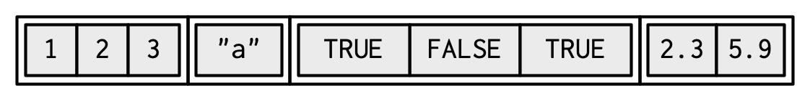
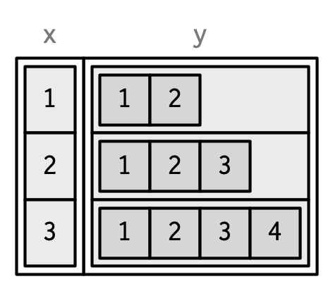

```r
library(tidyverse)
```

```
## ── Attaching packages ─────────────────────────────────────── tidyverse 1.3.2 ──
## ✔ ggplot2 3.3.6      ✔ purrr   0.3.4 
## ✔ tibble  3.1.8      ✔ dplyr   1.0.10
## ✔ tidyr   1.2.1      ✔ stringr 1.4.1 
## ✔ readr   2.1.2      ✔ forcats 0.5.2 
## ── Conflicts ────────────────────────────────────────── tidyverse_conflicts() ──
## ✖ dplyr::filter() masks stats::filter()
## ✖ dplyr::lag()    masks stats::lag()
```


# 3 Vectors {#vectors-chap}

## 3.1 Introduction
\index{vectors}
\index{nodes}

This chapter discusses the most important family of data types in base R: vectors[^node]. While you've probably already used many (if not all) of the different types of vectors, you may not have thought deeply about how they're interrelated. In this chapter, I won't cover individual vectors types in too much detail, but I will show you how all the types fit together as a whole. If you need more details, you can find them in R's documentation.

[^node]: Collectively, all the other data types are known as "node" types, which include things like functions and environments. You're most likely to come across this highly technical term when using `gc()`: the "N" in `Ncells` stands for nodes and the "V" in `Vcells` stands for vectors.

Vectors come in two flavours: atomic vectors and lists[^generic-vectors]. They differ in terms of their elements' types: for atomic vectors, all elements must have the same type; for lists, elements can have different types. While not a vector, `NULL` is closely related to vectors and often serves the role of a generic zero length vector. This diagram, which we'll be expanding on throughout this chapter, illustrates the basic relationships:


[^generic-vectors]: A few places in R's documentation call lists generic vectors to emphasise their difference from atomic vectors.

Every vector can also have __attributes__, which you can think of as a named list of arbitrary metadata. Two attributes are particularly important. The __dimension__ attribute turns vectors into matrices and arrays and the __class__ attribute powers the S3 object system. While you'll learn how to use S3 in Chapter \@ref(s3), here you'll learn about some of the most important S3 vectors: factors, date and times, data frames, and tibbles. And while 2D structures like matrices and data frames are not necessarily what come to mind when you think of vectors, you'll also learn why R considers them to be vectors.

### Quiz {-}

Take this short quiz to determine if you need to read this chapter. If the answers quickly come to mind, you can comfortably skip this chapter. You can check your answers in Section \@ref(data-structure-answers).

1. What are the four common types of atomic vectors? What are the two 
   rare types?

> Before reading: The four common types of atomic vectors: double, integer, character, and  logical. I am not sure about the the two rare types: complex?

> After reading: The four common types of atomic vectors: logical, integer, double, and character (which contains strings). There are two rare types: complex and raw.

> note: Complex Vector
The complex data type is to store numbers with an imaginary component. Examples of complex values are 1+2i, 3i, 4-5i, -12+6i, etc.


```r
# R program to create complex Vectors 
  
# create complex vector
v1 <- c(1+2i, 3i, 4-5i, -12+6i)  
  
# print vector
print(v1)
```

```
## [1]   1+2i   0+3i   4-5i -12+6i
```

```r
# display type of vector 
print(typeof(v1))
```

```
## [1] "complex"
```

> notes: Raw Vector
Raw vectors store raw bytes of data. Making raw vectors gets complicated, but raw vectors can be created using the raw() function.


```r
# R program to illustrate raw vector
  
# Creating raw vector using raw()
print(raw(3))
```

```
## [1] 00 00 00
```

```r
# Print the type of vector
print(typeof(raw(3)))
```

```
## [1] "raw"
```

2. What are attributes? How do you get them and set them?

> Before reading: Attributes are a named list of arbitrary metadata. I can get them use str() or attr().

> After reading: Attributes allow you to associate arbitrary additional metadata to
    any object. You can get and set individual attributes with `attr(x, "y")`
    and `attr(x, "y") <- value`; or you can get and set all attributes at once 
    with `attributes()`.

3. How is a list different from an atomic vector? How is a matrix different
   from a data frame?
   
> Before reading: They differ in elements' types: for atomic vectors, all elements must have the same type; for lists, elements can have different types. For a matrix, all elements must have the same type. For a data frame, elements can have different types in different columns.

> After reading: The elements of a list can be any type (even a list); the elements of 
    an atomic vector are all of the same type. Similarly, every element of 
    a matrix must be the same type; in a data frame, different columns can have 
    different types.

4. Can you have a list that is a matrix? Can a data frame have a column 
   that is a matrix?
   
> Before reading: Yes. No.

> After reading: You can make a list-array by assigning dimensions to a list. You can
    make a matrix a column of a data frame with `df$x <- matrix()`, or by
    using `I()` when creating a new data frame `data.frame(x = I(matrix()))`.
   
5. How do tibbles behave differently from data frames?

> Before reading: print differently?

> After reading: Tibbles have an enhanced print method, never coerce strings to 
    factors, and provide stricter subsetting methods.

### Outline {-}

* Section \@ref(atomic-vectors) introduces you to the atomic vectors:
  logical, integer, double, and character. These are R's simplest data 
  structures.
  
* Section \@ref(attributes) takes a small detour to discuss attributes,
  R's flexible metadata specification. The most important attributes are
  names, dimensions, and class.
  
* Section \@ref(s3-atomic-vectors) discusses the important vector types that
  are built by combining atomic vectors with special attributes. These include
  factors, dates, date-times, and durations.
  
* Section \@ref(lists) dives into lists. Lists are very similar to atomic 
  vectors, but have one key difference: an element of a list can be any 
  data type, including another list. This makes them suitable for representing
  hierarchical data.

* Section \@ref(tibble) teaches you about data frames and tibbles, which
  are used to represent rectangular data. They combine the behaviour 
  of lists and matrices to make a structure ideally suited for the needs 
  of statistical data.

## 3.2 Atomic vectors
\index{atomic vectors} 
\index{vectors!atomic|see {atomic vectors}}
\index{logical vectors} 
\index{integer vectors} 
\index{double vectors} 
\index{numeric vectors} 
\index{character vectors} 

There are four primary types of atomic vectors: logical, integer, double, and character (which contains strings). Collectively integer and double vectors are known as numeric vectors[^numeric]. There are two rare types: complex and raw. I won't discuss them further because complex numbers are rarely needed in statistics, and raw vectors are a special type that's only needed when handling binary data. 


[^numeric]: This is a slight simplification as R does not use "numeric" consistently, which we'll come back to in Section \@ref(numeric-type).

### 3.2.1 Scalars
\index{scalars}
\indexc{NaN}
\indexc{Inf} 
\indexc{L}
\indexc{""}
\indexc{'}

Each of the four primary types has a special syntax to create an individual value, AKA a __scalar__[^scalar]:

* Logicals can be written in full (`TRUE` or `FALSE`), or abbreviated 
  (`T` or `F`).

* Doubles can be specified in decimal (`0.1234`), scientific (`1.23e4`), or 
  hexadecimal (`0xcafe`) form. There are three special values unique to
  doubles: `Inf`, `-Inf`, and `NaN` (not a number). These are special values
  defined by the floating point standard. 

* Integers are written similarly to doubles but must be followed by 
  `L`[^L-suffix] (`1234L`, `1e4L`, or `0xcafeL`), and can not contain
  fractional values. 

* Strings are surrounded by `"` (`"hi"`) or `'` (`'bye'`). Special characters
  are escaped with `\`; see `?Quotes` for full details.

[^L-suffix]: `L` is not intuitive, and you might wonder where it comes from. At the time `L` was added to R, R's integer type was equivalent to a long integer in C, and C code could use a suffix of `l` or `L` to force a number to be a long integer. It was decided that `l` was too visually similar to `i` (used for complex numbers in R), leaving `L`.

[^scalar]: Technically, the R language does not possess scalars. Everything that looks like a scalar is actually a vector of length one. This is mostly a theoretical distinction, but it does mean that expressions like `1[1]` work.

### 3.2.2 Making longer vectors with `c()` {#atomic-constructing}
\indexc{typeof()}
\indexc{length()}
\indexc{c()} 

To create longer vectors from shorter ones, use `c()`, short for combine:


```r
lgl_var <- c(TRUE, FALSE)
int_var <- c(1L, 6L, 10L)
dbl_var <- c(1, 2.5, 4.5)
chr_var <- c("these are", "some strings")
```

When the inputs are atomic vectors, `c()` always creates another atomic vector; i.e. it flattens:


```r
c(c(1, 2), c(3, 4))
```

```
## [1] 1 2 3 4
```

In diagrams, I'll depict vectors as connected rectangles, so the above code could be drawn as follows:


You can determine the type of a vector with `typeof()`[^mode] and its length with `length()`.


```r
typeof(lgl_var)
```

```
## [1] "logical"
```

```r
typeof(int_var)
```

```
## [1] "integer"
```

```r
typeof(dbl_var)
```

```
## [1] "double"
```

```r
typeof(chr_var)
```

```
## [1] "character"
```

```r
length(lgl_var)
```

```
## [1] 2
```

```r
length(int_var)
```

```
## [1] 3
```

```r
length(dbl_var)
```

```
## [1] 3
```

```r
length(chr_var)
```

```
## [1] 2
```

[^mode]: You may have heard of the related `mode()` and `storage.mode()` functions. Do not use them: they exist only for compatibility with S.

### 3.2.3 Missing values
\indexc{NA}
\indexc{is.na}
\index{missing values|see {\texttt{NA}}}

R represents missing, or unknown values, with special sentinel value: `NA` (short for not applicable). Missing values tend to be infectious: most computations involving a missing value will return another missing value.


```r
NA > 5
```

```
## [1] NA
```

```r
10 * NA
```

```
## [1] NA
```

```r
!NA
```

```
## [1] NA
```

There are only a few exceptions to this rule. These occur when some identity holds for all possible inputs:


```r
NA ^ 0
```

```
## [1] 1
```

```r
NA | TRUE
```

```
## [1] TRUE
```

```r
NA & FALSE
```

```
## [1] FALSE
```

Propagation of missingness leads to a common mistake when determining which values in a vector are missing:


```r
x <- c(NA, 5, NA, 10)
x == NA
```

```
## [1] NA NA NA NA
```

This result is correct (if a little surprising) because there's no reason to believe that one missing value has the same value as another. Instead, use `is.na()` to test for the presence of missingness:


```r
is.na(x)
```

```
## [1]  TRUE FALSE  TRUE FALSE
```

NB: Technically there are four missing values, one for each of the atomic types: `NA` (logical), `NA_integer_` (integer), `NA_real_` (double), and `NA_character_` (character). This distinction is usually unimportant because `NA` will be automatically coerced to the correct type when needed.

### 3.2.4 Testing and coercion
\index{coercion}
\indexc{is.vector()}
\indexc{is.atomic()}
\indexc{is.numeric()}

Generally, you can __test__ if a vector is of a given type with an `is.*()` function, but these functions need to be used with care. `is.logical()`, `is.integer()`, `is.double()`, and `is.character()` do what you might expect: they test if a vector is a character, double, integer, or logical. Avoid `is.vector()`, `is.atomic()`, and `is.numeric()`: they don't test if you have a vector, atomic vector, or numeric vector; you'll need to carefully read the documentation to figure out what they actually do.

For atomic vectors, type is a property of the entire vector: all elements must be the same type. When you attempt to combine different types they will be __coerced__ in a fixed order: character → double → integer → logical. For example, combining a character and an integer yields a character:


```r
str(c("a", 1))
```

```
##  chr [1:2] "a" "1"
```

Coercion often happens automatically. Most mathematical functions (`+`, `log`, `abs`, etc.) will coerce to numeric. This coercion is particularly useful for logical vectors because `TRUE` becomes 1 and `FALSE` becomes 0.


```r
x <- c(FALSE, FALSE, TRUE)
as.numeric(x)
```

```
## [1] 0 0 1
```

```r
# Total number of TRUEs
sum(x)
```

```
## [1] 1
```

```r
# Proportion that are TRUE
mean(x)
```

```
## [1] 0.3333333
```

Generally, you can deliberately coerce by using an `as.*()` function, like `as.logical()`, `as.integer()`, `as.double()`, or `as.character()`. Failed coercion of strings generates a warning and a missing value:


```r
as.integer(c("1", "1.5", "a"))
```

```
## Warning: NAs introduced by coercion
```

```
## [1]  1  1 NA
```

### 3.2.5 Exercises

1. How do you create raw and complex scalars? (See `?raw` and 
   `?complex`.)


```r
#?raw
```


```r
xx <- raw(2)
xx[1] <- as.raw(40)     # NB, not just 40.
xx[2] <- charToRaw("A")
xx       ## 28 41   -- raw prints hexadecimals
```

```
## [1] 28 41
```

```r
dput(xx) ## as.raw(c(0x28, 0x41))
```

```
## as.raw(c(0x28, 0x41))
```

```r
as.integer(xx) ## 40 65
```

```
## [1] 40 65
```


```r
#?complex
z <- complex(length.out = 1, real = 2, imaginary = 3, modulus = 4, argument = 5)
z
```

```
## [1] 1.134649-3.835697i
```

```r
str(z)
```

```
##  cplx 1.13-3.84i
```


```r
## create a complex normal vector
z <- complex(real = stats::rnorm(10), imaginary = stats::rnorm(10))
z
```

```
##  [1] -0.6193672-0.6805076i -0.1493491+1.0329827i  0.0816943+1.6331857i
##  [4] -0.2743462+0.2111099i -0.6284611-0.3253443i -0.7619288-0.2161379i
##  [7]  1.8218442+3.0940406i  1.9976523+0.3128574i -0.9472021+0.5648832i
## [10] -0.0412568+0.5345046i
```

```r
## or also (less efficiently):
z2 <- 1:2 + 1i*(8:9)
z2
```

```
## [1] 1+8i 2+9i
```


2. Test your knowledge of the vector coercion rules by predicting the output of the following uses of `c()`:

    
    ```r
    c(1, FALSE)
    c("a", 1)
    c(TRUE, 1L)
    ```

> When you attempt to combine different types they will be coerced in a fixed order: character → double → integer → logical.

> `c(1, FALSE)` -> 1 0

> `c("a", 1)` -> "a" "1"

> `c(TRUE, 1L)` -> 1 1

3. Why is `1 == "1"` true? Why is `-1 < FALSE` true? Why is `"one" < 2` false?

> These comparisons are carried out by operator-functions (==, <), which coerce their arguments to a common type.


```r
1 == "1"
```

```
## [1] TRUE
```

> 1 is coerced to "1". Therefore, `"1" == "1"` is TRUE.


```r
-1 < FALSE
```

```
## [1] TRUE
```

> FALSE is coerced to 0. Therefore, `-1 < 0` is TRUE.


```r
"one" < 2
```

```
## [1] FALSE
```

> 2 is coerced to "2". Therefore, `"one" < "2"` is FALSE.

> numbers precede letters in lexicographic order (may depend on locale)

4. Why is the default missing value, `NA`, a logical vector? What's special
   about logical vectors? (Hint: think about `c(FALSE, NA_character_)`.)

> Since the fixed order for coercing is character → double → integer → logical, having the default missing value, NA, a logical vector will not change the types of other values in the same vector.

> The presence of missing values shouldn’t affect the type of an object. When combining NAs with other atomic types, the NAs will be coerced to integer (NA_integer_), double (NA_real_) or character (NA_character_) and not the other way round. If NA were a character and added to a set of other values all of these would be coerced to character as well.

5. Precisely what do `is.atomic()`, `is.numeric()`, and `is.vector()` test for?


```r
#?is.atomic()
```

> is.atomic returns TRUE if x is of an atomic type (or NULL) and FALSE otherwise. is.atomic() tests if an object is an atomic vector (as defined in Advanced R) or is NULL (!).

> The is.atomic() function in R is used to check if an R object is atomic or not. When an R object is atomic it can be used to create atomic vectors. 
Note: R has six basic atomic vector types: logical, integer, real, complex, string (or character), and raw.


```r
# creating R objects
myname <- "Theophilus"
addition <- 5 + 3
numbers <- c(0:10)
a <- (quote(exp)) 
b <- expression(x+1)


# implementing the is.atomic() function 

is.atomic(myname)
```

```
## [1] TRUE
```

```r
is.atomic(addition)
```

```
## [1] TRUE
```

```r
is.atomic(numbers)
```

```
## [1] TRUE
```

```r
is.atomic(a)
```

```
## [1] FALSE
```

```r
is.atomic(b)
```

```
## [1] FALSE
```

```r
is.vector(myname)
```

```
## [1] TRUE
```

```r
is.vector(addition)
```

```
## [1] TRUE
```

```r
is.vector(numbers)
```

```
## [1] TRUE
```

```r
is.vector(a)
```

```
## [1] FALSE
```

```r
is.vector(b)
```

```
## [1] TRUE
```


```r
#?is.numeric()
```

> is.numeric only return true if the base type of the class is double or integer and values can reasonably be regarded as numeric (e.g., arithmetic on them makes sense, and comparison should be done via the base type).

> is.numeric() tests if an object has type integer or double and is not of class factor, Date, POSIXt or difftime.


```r
#?is.vector()
```

> is.vector(x) returns TRUE if x is a vector of the specified mode having no attributes other than names.

> is.vector() tests if an object is a vector (as defined in Advanced R) or an expression and has no attributes, apart from names.

## 3.3 Attributes {#attributes}
\index{attributes}

You might have noticed that the set of atomic vectors does not include a number of important data structures like matrices, arrays, factors, or date-times. These types are built on top of atomic vectors by adding attributes. In this section, you'll learn the basics of attributes, and how the dim attribute makes matrices and arrays. In the next section you'll learn how the class attribute is used to create S3 vectors, including factors, dates, and date-times.

### 3.3.1 Getting and setting
\indexc{attr()}
\index{attributes!attributes@\texttt{attributes()}}
\indexc{structure()}

You can think of attributes as name-value pairs[^pairlist] that attach metadata to an object. Individual attributes can be retrieved and modified with `attr()`, or retrieved en masse with `attributes()`, and set en masse with `structure()`.

[^pairlist]: Attributes behave like named lists, but are actually pairlists.  Pairlists are functionally indistinguishable from lists, but are profoundly different under the hood. You'll learn more about them in Section \@ref(pairlists). 


```r
a <- 1:3
attr(a, "x") <- "abcdef"
attr(a, "x")
```

```
## [1] "abcdef"
```

```r
attr(a, "y") <- 4:6
str(attributes(a))
```

```
## List of 2
##  $ x: chr "abcdef"
##  $ y: int [1:3] 4 5 6
```

```r
# Or equivalently
a <- structure(
  1:3, 
  x = "abcdef",
  y = 4:6
)
str(attributes(a))
```

```
## List of 2
##  $ x: chr "abcdef"
##  $ y: int [1:3] 4 5 6
```


Attributes should generally be thought of as ephemeral. For example, most attributes are lost by most operations:


```r
attributes(a[1])
```

```
## NULL
```

```r
attributes(sum(a))
```

```
## NULL
```

There are only two attributes that are routinely preserved: 

* __names__, a character vector giving each element a name.
* __dim__, short for dimensions, an integer vector, used to turn vectors 
  into matrices or arrays.

To preserve other attributes, you'll need to create your own S3 class, the topic of Chapter \@ref(s3).

### 3.3.2 Names {#attr-names}
\index{attributes!names}
\indexc{names()}
\indexc{setNames()}
 
You can name a vector in three ways:


```r
# When creating it: 
x <- c(a = 1, b = 2, c = 3)

# By assigning a character vector to names()
x <- 1:3
names(x) <- c("a", "b", "c")

# Inline, with setNames():
x <- setNames(1:3, c("a", "b", "c"))
```

Avoid using `attr(x, "names")` as it requires more typing and is less readable than `names(x)`. You can remove names from a vector by using `x <- unname(x)` or `names(x) <- NULL`. 

To be technically correct, when drawing the named vector `x`, I should draw it like so:


However, names are so special and so important, that unless I'm trying specifically to draw attention to the attributes data structure, I'll use them to label the vector directly:


To be useful with character subsetting (e.g. Section \@ref(lookup-tables)) names should be unique, and non-missing, but this is not enforced by R. Depending on how the names are set, missing names may be either `""` or `NA_character_`. If all names are missing, `names()` will return `NULL`.

### 3.3.3 Dimensions {#attr-dims}
\index{arrays} 
\index{matrices|see {arrays}}
\index{attributes!dimensions}

Adding a `dim` attribute to a vector allows it to behave like a 2-dimensional __matrix__ or a multi-dimensional __array__. Matrices and arrays are primarily mathematical and statistical tools, not programming tools, so they'll be used infrequently and only covered briefly in this book. Their most important feature is multidimensional subsetting, which is covered in Section \@ref(matrix-subsetting).

You can create matrices and arrays with `matrix()` and `array()`, or by using the assignment form of `dim()`:


```r
# Two scalar arguments specify row and column sizes
x <- matrix(1:6, nrow = 2, ncol = 3)
x
```

```
##      [,1] [,2] [,3]
## [1,]    1    3    5
## [2,]    2    4    6
```

```r
# One vector argument to describe all dimensions
y <- array(1:12, c(2, 3, 2))
y
```

```
## , , 1
## 
##      [,1] [,2] [,3]
## [1,]    1    3    5
## [2,]    2    4    6
## 
## , , 2
## 
##      [,1] [,2] [,3]
## [1,]    7    9   11
## [2,]    8   10   12
```

```r
# You can also modify an object in place by setting dim()
z <- 1:6
dim(z) <- c(3, 2)
z
```

```
##      [,1] [,2]
## [1,]    1    4
## [2,]    2    5
## [3,]    3    6
```

Many of the functions for working with vectors have generalisations for matrices and arrays:

| Vector            | Matrix                     | Array            |
|-------------------|----------------------------|------------------|
| `names()`         | `rownames()`, `colnames()` | `dimnames()`     |
| `length()`        | `nrow()`, `ncol()`         | `dim()`          |
| `c()`             | `rbind()`, `cbind()`       | `abind::abind()` |
| ---               | `t()`                      | `aperm()`        |
| `is.null(dim(x))` | `is.matrix()`              | `is.array()`     |

A vector without a `dim` attribute set is often thought of as 1-dimensional, but actually has `NULL` dimensions. You also can have matrices with a single row or single column, or arrays with a single dimension. They may print similarly, but will behave differently. The differences aren't too important, but it's useful to know they exist in case you get strange output from a function (`tapply()` is a frequent offender). As always, use `str()` to reveal the differences.


```r
str(1:3)                   # 1d vector
```

```
##  int [1:3] 1 2 3
```

```r
str(matrix(1:3, ncol = 1)) # column vector
```

```
##  int [1:3, 1] 1 2 3
```

```r
str(matrix(1:3, nrow = 1)) # row vector
```

```
##  int [1, 1:3] 1 2 3
```

```r
str(array(1:3, 3))         # "array" vector
```

```
##  int [1:3(1d)] 1 2 3
```

### 3.3.4 Exercises

1.  How is `setNames()` implemented? How is `unname()` implemented?
    Read the source code.


```r
#?setNames()
#?unname()
```

> here is how is setNames() implemented:


```r
setNames
```

```
## function (object = nm, nm) 
## {
##     names(object) <- nm
##     object
## }
## <bytecode: 0x000002692b911ef0>
## <environment: namespace:stats>
```


```r
getAnywhere(setNames)
```

```
## A single object matching 'setNames' was found
## It was found in the following places
##   package:stats
##   namespace:methods
##   namespace:stats
## with value
## 
## function (object = nm, nm) 
## {
##     names(object) <- nm
##     object
## }
## <bytecode: 0x000002692b911ef0>
## <environment: namespace:stats>
```


```r
x <- setNames(1:3, c("a", "b", "c"))
str(x)
```

```
##  Named int [1:3] 1 2 3
##  - attr(*, "names")= chr [1:3] "a" "b" "c"
```

> data is the first argument, name vector is the second argument.

> here is how is unname() implemented:


```r
getAnywhere(unname)
```

```
## A single object matching 'unname' was found
## It was found in the following places
##   package:base
##   namespace:base
## with value
## 
## function (obj, force = FALSE) 
## {
##     if (!is.null(names(obj))) 
##         names(obj) <- NULL
##     if (!is.null(dimnames(obj)) && (force || !is.data.frame(obj))) 
##         dimnames(obj) <- NULL
##     obj
## }
## <bytecode: 0x000002692b633dc0>
## <environment: namespace:base>
```

```r
unname(x) %>% str()
```

```
##  int [1:3] 1 2 3
```

> remove their name by setting them to NULL

2.  What does `dim()` return when applied to a 1-dimensional vector?
    When might you use `NROW()` or `NCOL()`?
    

```r
vector <- c(1:10)
vector
```

```
##  [1]  1  2  3  4  5  6  7  8  9 10
```

```r
dim(vector)
```

```
## NULL
```

> dim() returns NULL when applied to a 1-dimensional vector.


```r
NROW(vector)
```

```
## [1] 10
```

```r
NCOL(vector)
```

```
## [1] 1
```

```r
nrow(vector)
```

```
## NULL
```

```r
ncol(vector)
```

```
## NULL
```

```r
#?NROW()
```

> nrow and ncol return the number of rows or columns present in x. NCOL and NROW do the same treating a vector as 1-column matrix, even a 0-length vector.

> use NROW() or NCOL() to handle atomic vectors, lists and NULL values in the same way as one column matrices or data frames.

3.  How would you describe the following three objects? What makes them
    different from `1:5`?

    
    ```r
    x1 <- array(1:5, c(1, 1, 5))
    x2 <- array(1:5, c(1, 5, 1))
    x3 <- array(1:5, c(5, 1, 1))
    
    str(x1)
    ```
    
    ```
    ##  int [1, 1, 1:5] 1 2 3 4 5
    ```
    
    ```r
    str(x2)
    ```
    
    ```
    ##  int [1, 1:5, 1] 1 2 3 4 5
    ```
    
    ```r
    str(x3)
    ```
    
    ```
    ##  int [1:5, 1, 1] 1 2 3 4 5
    ```
    
    ```r
    str(1:5)
    ```
    
    ```
    ##  int [1:5] 1 2 3 4 5
    ```


```r
attributes(x1)
```

```
## $dim
## [1] 1 1 5
```

```r
attributes(x2)
```

```
## $dim
## [1] 1 5 1
```

```r
attributes(x3)
```

```
## $dim
## [1] 5 1 1
```

```r
attributes(1:5)
```

```
## NULL
```

> All of them are 3d array. x1 has five elements in the x-dimension, x2 has five elements in the y-dimension, and x3 has five elements in the z-dimension.

> `1:5` doen't have dim attributes.

4.  An early draft used this code to illustrate `structure()`:

    
    ```r
    structure(1:5, comment = "my attribute")
    ```
    
    ```
    ## [1] 1 2 3 4 5
    ```

    But when you print that object you don't see the comment attribute.
    Why? Is the attribute missing, or is there something else special about
    it? (Hint: try using help.)
    

```r
#?comment
?attributes() # These functions access an object's attributes. 
```

```
## starting httpd help server ... done
```

```r
#?attr() # Get or set specific attributes of an object.
#?structure() # structure returns the given object with further attributes set.
```

> from `?comment` Contrary to other attributes, the comment is not printed (by print or print.default).

> Note that some attributes (namely class, comment, dim, dimnames, names, row.names and tsp) are treated specially and have restrictions on the values which can be set. (Note that this is not true of levels which should be set for factors via the levels replacement function.)


```r
attributes(structure(1:5, comment = "my attribute"))
```

```
## $comment
## [1] "my attribute"
```


```r
test <- structure(1:5, comment = "my attribute")

attributes(test)
```

```
## $comment
## [1] "my attribute"
```

```r
attr(test, which = "comment")
```

```
## [1] "my attribute"
```


## 3.4 S3 atomic vectors
\index{attributes!S3}
\index{S3!vectors}

One of the most important vector attributes is `class`, which underlies the S3 object system. Having a class attribute turns an object into an __S3 object__, which means it will behave differently from a regular vector when passed to a __generic__ function. Every S3 object is built on top of a base type, and often stores additional information in other attributes. You'll learn the details of the S3 object system, and how to create your own S3 classes, in Chapter \@ref(s3). 

In this section, we'll discuss four important S3 vectors used in base R:

* Categorical data, where values come from a fixed set of levels recorded in 
  __factor__ vectors.

* Dates (with day resolution), which are recorded in __Date__ vectors.

* Date-times (with second or sub-second resolution), which are stored in
  __POSIXct__ vectors.
  
* Durations, which are stored in __difftime__ vectors.


### 3.4.1 Factors
\indexc{factor}
\indexc{stringsAsFactors}
 
A factor is a vector that can contain only predefined values. It is used to store categorical data. Factors are built on top of an integer vector with two attributes: a `class`, "factor", which makes it behave differently from regular integer vectors, and `levels`, which defines the set of allowed values.


```r
x <- factor(c("a", "b", "b", "a"))
x
```

```
## [1] a b b a
## Levels: a b
```

```r
typeof(x)
```

```
## [1] "integer"
```

```r
attributes(x)
```

```
## $levels
## [1] "a" "b"
## 
## $class
## [1] "factor"
```


Factors are useful when you know the set of possible values but they're not all present in a given dataset. In contrast to a character vector, when you tabulate a factor you'll get counts of all categories, even unobserved ones:


```r
sex_char <- c("m", "m", "m")
sex_factor <- factor(sex_char, levels = c("m", "f"))

table(sex_char)
```

```
## sex_char
## m 
## 3
```

```r
table(sex_factor)
```

```
## sex_factor
## m f 
## 3 0
```

__Ordered__ factors are a minor variation of factors. In general, they behave like regular factors, but the order of the levels is meaningful (low, medium, high) (a property that is automatically leveraged by some modelling and visualisation functions).


```r
grade <- ordered(c("b", "b", "a", "c"), levels = c("c", "b", "a"))
grade
```

```
## [1] b b a c
## Levels: c < b < a
```

In base R[^tidyverse-factors] you tend to encounter factors very frequently because many base R functions (like `read.csv()` and `data.frame()`) automatically convert character vectors to factors. This is suboptimal because there's no way for those functions to know the set of all possible levels or their correct order: the levels are a property of theory or experimental design, not of the data. Instead, use the argument `stringsAsFactors = FALSE` to suppress this behaviour, and then manually convert character vectors to factors using your knowledge of the "theoretical" data. To learn about the historical context of this behaviour, I recommend [_stringsAsFactors: An unauthorized
biography_](http://simplystatistics.org/2015/07/24/stringsasfactors-an-unauthorized-biography/) by Roger Peng, and [_stringsAsFactors = 
\<sigh\>_](http://notstatschat.tumblr.com/post/124987394001/stringsasfactors-sigh) by Thomas Lumley.

[^tidyverse-factors]: The tidyverse never automatically coerces characters to factors, and provides the forcats [@forcats] package specifically for working with factors.

While factors look like (and often behave like) character vectors, they are built on top of integers. So be careful when treating them like strings. Some string methods (like `gsub()` and `grepl()`) will automatically coerce factors to strings,  others (like `nchar()`) will throw an error, and still others will (like `c()`) use the underlying integer values. For this reason, it's usually best to explicitly convert factors to character vectors if you need string-like behaviour.

### 3.4.2 Dates
\indexc{Date}

Date vectors are built on top of double vectors. They have class "Date" and no other attributes:


```r
today <- Sys.Date()

typeof(today)
```

```
## [1] "double"
```

```r
attributes(today)
```

```
## $class
## [1] "Date"
```

The value of the double (which can be seen by stripping the class), represents the number of days since 1970-01-01[^epoch]:


```r
date <- as.Date("1970-02-01")
unclass(date)
```

```
## [1] 31
```

[^epoch]: This special date is known as the Unix Epoch.

### 3.4.3 Date-times
\index{date-times|see {\texttt{POSIXct}}}
\indexc{POSIXct}

Base R[^tidyverse-datetimes] provides two ways of storing date-time information, POSIXct, and POSIXlt. These are admittedly odd names: "POSIX" is short for Portable Operating System Interface, which is a family of cross-platform standards. "ct" stands for calendar time (the `time_t` type in C), and "lt" for local time (the `struct tm` type in C). Here we'll focus on `POSIXct`, because it's the simplest, is built on top of an atomic vector, and is most appropriate for use in data frames. POSIXct vectors are built on top of double vectors, where the value represents the number of seconds since 1970-01-01.


```r
now_ct <- as.POSIXct("2018-08-01 22:00", tz = "UTC")
now_ct
```

```
## [1] "2018-08-01 22:00:00 UTC"
```

```r
typeof(now_ct)
```

```
## [1] "double"
```

```r
attributes(now_ct)
```

```
## $class
## [1] "POSIXct" "POSIXt" 
## 
## $tzone
## [1] "UTC"
```

The `tzone` attribute controls only how the date-time is formatted; it does not control the instant of time represented by the vector. Note that the time is not printed if it is midnight.


```r
structure(now_ct, tzone = "Asia/Tokyo")
```

```
## [1] "2018-08-02 07:00:00 JST"
```

```r
structure(now_ct, tzone = "America/New_York")
```

```
## [1] "2018-08-01 18:00:00 EDT"
```

```r
structure(now_ct, tzone = "Australia/Lord_Howe")
```

```
## [1] "2018-08-02 08:30:00 +1030"
```

```r
structure(now_ct, tzone = "Europe/Paris")
```

```
## [1] "2018-08-02 CEST"
```

[^tidyverse-datetimes]: The tidyverse provides the lubridate [@lubridate] package for working with date-times. It provides a number of convenient helpers that work with the base POSIXct type.

### 3.4.4 Durations
\index{durations|see {difftime}}
\indexc{difftime}

Durations, which represent the amount of time between pairs of dates or date-times, are stored in difftimes. Difftimes are built on top of doubles, and have a `units` attribute that determines how the integer should be interpreted:


```r
one_week_1 <- as.difftime(1, units = "weeks")
one_week_1
```

```
## Time difference of 1 weeks
```

```r
typeof(one_week_1)
```

```
## [1] "double"
```

```r
attributes(one_week_1)
```

```
## $class
## [1] "difftime"
## 
## $units
## [1] "weeks"
```

```r
one_week_2 <- as.difftime(7, units = "days")
one_week_2
```

```
## Time difference of 7 days
```

```r
typeof(one_week_2)
```

```
## [1] "double"
```

```r
attributes(one_week_2)
```

```
## $class
## [1] "difftime"
## 
## $units
## [1] "days"
```

### 3.4.5 Exercises

1.  What sort of object does `table()` return? What is its type? What 
    attributes does it have? How does the dimensionality change as you
    tabulate more variables?
    

```r
#?table()
```

> table uses cross-classifying factors to build a contingency table of the counts at each combination of factor levels.


```r
## Check the design:
# warpbreaks {datasets} The Number of Breaks in Yarn during Weaving
with(warpbreaks, table(wool, tension))
```

```
##     tension
## wool L M H
##    A 9 9 9
##    B 9 9 9
```
> This data set gives the number of warp breaks per loom, where a loom corresponds to a fixed length of yarn.


```r
## US State Facts and Figures
# Data sets related to the 50 states of the United States of America.
table(state.division, state.region)
```

```
##                     state.region
## state.division       Northeast South North Central West
##   New England                6     0             0    0
##   Middle Atlantic            3     0             0    0
##   South Atlantic             0     8             0    0
##   East South Central         0     4             0    0
##   West South Central         0     4             0    0
##   East North Central         0     0             5    0
##   West North Central         0     0             7    0
##   Mountain                   0     0             0    8
##   Pacific                    0     0             0    5
```

```r
t <- table(state.division, state.region)

typeof(t)
```

```
## [1] "integer"
```

```r
attributes(t)
```

```
## $dim
## [1] 9 4
## 
## $dimnames
## $dimnames$state.division
## [1] "New England"        "Middle Atlantic"    "South Atlantic"    
## [4] "East South Central" "West South Central" "East North Central"
## [7] "West North Central" "Mountain"           "Pacific"           
## 
## $dimnames$state.region
## [1] "Northeast"     "South"         "North Central" "West"         
## 
## 
## $class
## [1] "table"
```

> state.division:
factor giving state divisions (New England, Middle Atlantic, South Atlantic, East South Central, West South Central, East North Central, West North Central, Mountain, and Pacific).

> state.region:
factor giving the region (Northeast, South, North Central, West) that each state belongs to.

2.  What happens to a factor when you modify its levels? 
    
    
    ```r
    f1 <- factor(letters)
    f1
    levels(f1)
    ```
    

```r
levels(f1) <- rev(levels(f1))
f1
```

```
##  [1] z y x w v u t s r q p o n m l k j i h g f e d c b a
## Levels: z y x w v u t s r q p o n m l k j i h g f e d c b a
```

```r
levels(f1)
```

```
##  [1] "z" "y" "x" "w" "v" "u" "t" "s" "r" "q" "p" "o" "n" "m" "l" "k" "j" "i" "h"
## [20] "g" "f" "e" "d" "c" "b" "a"
```
> The same number of level, but the order changed.

3.  What does this code do? How do `f2` and `f3` differ from `f1`?

    
    ```r
    f2 <- rev(factor(letters))
    f2
    levels(f2)
    ```
> The order of the factor elements is reversed.


```r
f3 <- factor(letters, levels = rev(letters))
f3
```

```
##  [1] a b c d e f g h i j k l m n o p q r s t u v w x y z
## Levels: z y x w v u t s r q p o n m l k j i h g f e d c b a
```

```r
levels(f3)
```

```
##  [1] "z" "y" "x" "w" "v" "u" "t" "s" "r" "q" "p" "o" "n" "m" "l" "k" "j" "i" "h"
## [20] "g" "f" "e" "d" "c" "b" "a"
```
> The order of the factor levels is reversed.

## 3.5 Lists
\index{lists} 
\index{vectors!recursive|see {lists}}
\index{vectors!generic|see {lists}}

Lists are a step up in complexity from atomic vectors: each element can be any type, not just vectors. Technically speaking, each element of a list is actually the same type because, as you saw in Section \@ref(list-references), each element is really a _reference_ to another object, which can be any type.

### 3.5.1 Creating {#list-creating}
\indexc{list()}

You construct lists with `list()`: 


```r
l1 <- list(
  1:3, 
  "a", 
  c(TRUE, FALSE, TRUE), 
  c(2.3, 5.9)
)

typeof(l1)
```

```
## [1] "list"
```

```r
str(l1)
```

```
## List of 4
##  $ : int [1:3] 1 2 3
##  $ : chr "a"
##  $ : logi [1:3] TRUE FALSE TRUE
##  $ : num [1:2] 2.3 5.9
```

Because the elements of a list are references, creating a list does not involve copying the components into the list. For this reason, the total size of a list might be smaller than you might expect.


```r
lobstr::obj_size(mtcars)
```

```
## 7.21 kB
```

```r
l2 <- list(mtcars, mtcars, mtcars, mtcars)
lobstr::obj_size(l2)
```

```
## 7.29 kB
```

Lists can contain complex objects so it's not possible to pick a single visual style that works for every list. Generally I'll draw lists like vectors, using colour to remind you of the hierarchy.



Lists are sometimes called __recursive__ vectors because a list can contain other lists. This makes them fundamentally different from atomic vectors.


```r
l3 <- list(list(list(1)))
str(l3)
```

```
## List of 1
##  $ :List of 1
##   ..$ :List of 1
##   .. ..$ : num 1
```


`c()` will combine several lists into one. If given a combination of atomic vectors and lists, `c()` will coerce the vectors to lists before combining them. Compare the results of `list()` and `c()`:


```r
l4 <- list(list(1, 2), c(3, 4))
l5 <- c(list(1, 2), c(3, 4))
str(l4)
```

```
## List of 2
##  $ :List of 2
##   ..$ : num 1
##   ..$ : num 2
##  $ : num [1:2] 3 4
```

```r
str(l5)
```

```
## List of 4
##  $ : num 1
##  $ : num 2
##  $ : num 3
##  $ : num 4
```


### 3.5.2 Testing and coercion {#list-types}

The `typeof()` a list is `list`. You can test for a list with `is.list()`, and coerce to a list with `as.list()`. 


```r
list(1:3)
```

```
## [[1]]
## [1] 1 2 3
```

```r
as.list(1:3)
```

```
## [[1]]
## [1] 1
## 
## [[2]]
## [1] 2
## 
## [[3]]
## [1] 3
```


```r
is.list(list(1:3))
```

```
## [1] TRUE
```

```r
is.list(as.list(1:3))
```

```
## [1] TRUE
```


You can turn a list into an atomic vector with `unlist()`. The rules for the resulting type are complex, not well documented, and not always equivalent to what you'd get with `c()`. 

### 3.5.3 Matrices and arrays {#list-array}
\index{lists!list-arrays}
\index{arrays!list-arrays} 

With atomic vectors, the dimension attribute is commonly used to create matrices. With lists, the dimension attribute can be used to create list-matrices or list-arrays:  


```r
l <- list(1:3, "a", TRUE, 1.0)
dim(l) <- c(2, 2)
l
```

```
##      [,1]      [,2]
## [1,] integer,3 TRUE
## [2,] "a"       1
```

```r
l[[1, 1]]
```

```
## [1] 1 2 3
```

These data structures are relatively esoteric but they can be useful if you want to arrange objects in a grid-like structure. For example, if you're running models on a spatio-temporal grid, it might be more intuitive to store the models in a 3D array that matches the grid structure. 

### 3.5.4 Exercises

1.  List all the ways that a list differs from an atomic vector.

> In an atomic vector, all elements must be of the same type. In a list, the elements can be of different types.

> Atomic vectors point to one address in memory, while lists contain a separate reference for each element. (This was described in the list sections of the vectors and the names and values chapters.)


```r
lobstr::ref(1:2)
```

```
## [1:0x26930457a90] <int>
```

```r
1:2
```

```
## [1] 1 2
```

```r
lobstr::ref(list(1:2, 2))
```

```
## █ [1:0x26931732668] <list> 
## ├─[2:0x2692fdcaef0] <int> 
## └─[3:0x26931217560] <dbl>
```

```r
list(1:2, 2)
```

```
## [[1]]
## [1] 1 2
## 
## [[2]]
## [1] 2
```


> Because the elements of a list are references, creating a list does not involve copying the components into the list.

2.  Why do you need to use `unlist()` to convert a list to an 
    atomic vector? Why doesn't `as.vector()` work?
    

```r
#?unlist()
#?as.vector()
```


```r
L<-list(1:3)
is.list(L)
```

```
## [1] TRUE
```

```r
is.vector(L)
```

```
## [1] TRUE
```

```r
L2<-as.vector(L)
is.list(L2)
```

```
## [1] TRUE
```

```r
is.vector(L2)
```

```
## [1] TRUE
```

> L2 is still a list and a vector.


```r
L<-list(1:3)
is.list(L)
```

```
## [1] TRUE
```

```r
is.vector(L)
```

```
## [1] TRUE
```

```r
L2<-unlist(L)
is.list(L2)
```

```
## [1] FALSE
```

```r
is.vector(L2)
```

```
## [1] TRUE
```
> L2 is a vector, but not a list.

> `as.vector`, a generic, attempts to coerce its argument into a vector of mode mode (the default is to coerce to whichever vector mode is most convenient): if the result is atomic (is.atomic), all attributes are removed.

> `is.vector` returns TRUE if x is a vector of the specified mode having no attributes other than names. It returns FALSE otherwise.

3.  Compare and contrast `c()` and `unlist()` when combining a 
    date and date-time into a single vector.


```r
today <- Sys.Date()
today
```

```
## [1] "2022-10-31"
```

```r
typeof(today)
```

```
## [1] "double"
```

```r
attributes(today)
```

```
## $class
## [1] "Date"
```


```r
now_ct <- Sys.time()
now_ct
```

```
## [1] "2022-10-31 17:55:34 GMT"
```

```r
typeof(now_ct)
```

```
## [1] "double"
```

```r
attributes(now_ct)
```

```
## $class
## [1] "POSIXct" "POSIXt"
```


```r
c(today,now_ct)
```

```
## [1] "2022-10-31" "2022-10-31"
```

```r
c(now_ct,today)
```

```
## [1] "2022-10-31 17:55:34 GMT" "2022-10-31 00:00:00 GMT"
```

> c() coerces all element types to the type of first element in the vector.


```r
list(today,now_ct)
```

```
## [[1]]
## [1] "2022-10-31"
## 
## [[2]]
## [1] "2022-10-31 17:55:34 GMT"
```

```r
list(now_ct,today)
```

```
## [[1]]
## [1] "2022-10-31 17:55:34 GMT"
## 
## [[2]]
## [1] "2022-10-31"
```


```r
unlist(list(today,now_ct))
```

```
## [1]      19296 1667238934
```

```r
unlist(list(now_ct,today))
```

```
## [1] 1667238934      19296
```

> unlist removes the attributes of the list.

> *notes: if you ever need to work with dates and times in R, use the lubridate package.

> To summarise: c() coerces types and strips time zones. Errors may have occurred in older R versions because of inappropriate method dispatch/immature methods. unlist() strips attributes.

## 3.6 Data frames and tibbles {#tibble}
\index{data frames}
\index{tibbles|see {data frames}}
\indexc{row.names}

The two most important S3 vectors built on top of lists are data frames and tibbles. 


If you do data analysis in R, you're going to be using data frames. A data frame is a named list of vectors with attributes for (column) `names`, `row.names`[^rownames], and its class, "data.frame":


```r
df1 <- data.frame(x = 1:3, y = letters[1:3])
typeof(df1)
```

```
## [1] "list"
```

```r
attributes(df1)
```

```
## $names
## [1] "x" "y"
## 
## $class
## [1] "data.frame"
## 
## $row.names
## [1] 1 2 3
```

[^rownames]: Row names are one of the most surprisingly complex data structures in R. They've also been a persistent source of performance issues over the years. The most straightforward implementation is a character or integer vector, with one element for each row. But there's also a compact representation for "automatic" row names (consecutive integers), created by `.set_row_names()`. R 3.5 has a special way of deferring integer to character conversion that is specifically designed to speed up `lm()`; see <https://svn.r-project.org/R/branches/ALTREP/ALTREP.html#deferred_string_conversions> for details.

In contrast to a regular list, a data frame has an additional constraint: the length of each of its vectors must be the same. This gives data frames their rectangular structure and explains why they share the properties of both matrices and lists:

* A data frame has `rownames()`[^row.names] and `colnames()`. The `names()`
  of a data frame are the column names.
  
* A data frame has `nrow()` rows and `ncol()` columns. The `length()` of a 
  data frame gives the number of columns.

[^row.names]: Technically, you are encouraged to use `row.names()`, not `rownames()` with data frames, but this distinction is rarely important.

Data frames are one of the biggest and most important ideas in R, and one of the things that make R different from other programming languages. However, in the over 20 years since their creation, the ways that people use R have changed, and some of the design decisions that made sense at the time data frames were created now cause frustration.

This frustration lead to the creation of the tibble [@tibble], a modern reimagining of the data frame. Tibbles are designed to be (as much as possible) drop-in replacements for data frames that fix those frustrations. A concise, and fun, way to summarise the main differences is that tibbles are lazy and surly: they do less and complain more. You'll see what that means as you work through this section.

Tibbles are provided by the tibble package and share the same structure as data frames. The only difference is that the class vector is longer, and includes `tbl_df`. This allows tibbles to behave differently in the key ways which we'll discuss below.


```r
library(tibble)

df2 <- tibble(x = 1:3, y = letters[1:3])
typeof(df2)
```

```
## [1] "list"
```

```r
attributes(df2)
```

```
## $class
## [1] "tbl_df"     "tbl"        "data.frame"
## 
## $row.names
## [1] 1 2 3
## 
## $names
## [1] "x" "y"
```

### 3.6.1 Creating {#df-create}
\indexc{stringsAsFactors}
\index{data frames!data.frame@\texttt{data.frame()}}

You create a data frame by supplying name-vector pairs to `data.frame()`:


```r
df <- data.frame(
  x = 1:3, 
  y = c("a", "b", "c")
)
str(df)
```

```
## 'data.frame':	3 obs. of  2 variables:
##  $ x: int  1 2 3
##  $ y: chr  "a" "b" "c"
```

Beware of the default conversion of strings to factors. Use `stringsAsFactors = FALSE` to suppress this and keep character vectors as character vectors:


```r
df1 <- data.frame(
  x = 1:3,
  y = c("a", "b", "c"),
  stringsAsFactors = FALSE
)
str(df1)
```

```
## 'data.frame':	3 obs. of  2 variables:
##  $ x: int  1 2 3
##  $ y: chr  "a" "b" "c"
```

Creating a tibble is similar to creating a data frame. The difference between the two is that tibbles never coerce their input (this is one feature that makes them lazy):


```r
df2 <- tibble(
  x = 1:3, 
  y = c("a", "b", "c")
)
str(df2)
```

```
## tibble [3 × 2] (S3: tbl_df/tbl/data.frame)
##  $ x: int [1:3] 1 2 3
##  $ y: chr [1:3] "a" "b" "c"
```

Additionally, while data frames automatically transform non-syntactic names (unless `check.names = FALSE`), tibbles do not (although they do print non-syntactic names surrounded by `` ` ``).


```r
names(data.frame(`1` = 1))
```

```
## [1] "X1"
```

```r
names(tibble(`1` = 1))
```

```
## [1] "1"
```

While every element of a data frame (or tibble) must have the same length, both `data.frame()` and `tibble()` will recycle shorter inputs. However, while data frames automatically recycle columns that are an integer multiple of the longest column, tibbles will only recycle vectors of length one.


```r
data.frame(x = 1:4, y = 1:2)
```

```
##   x y
## 1 1 1
## 2 2 2
## 3 3 1
## 4 4 2
```

```r
data.frame(x = 1:4, y = 1:3)
```

```
## Error in data.frame(x = 1:4, y = 1:3): arguments imply differing number of rows: 4, 3
```

```r
tibble(x = 1:4, y = 1)
```

```
## # A tibble: 4 × 2
##       x     y
##   <int> <dbl>
## 1     1     1
## 2     2     1
## 3     3     1
## 4     4     1
```

```r
tibble(x = 1:4, y = 1:2)
```

```
## Error:
## ! Tibble columns must have compatible sizes.
## • Size 4: Existing data.
## • Size 2: Column `y`.
## ℹ Only values of size one are recycled.
```

There is one final difference: `tibble()` allows you to refer to variables created during construction:


```r
tibble(
  x = 1:3,
  y = x * 2
)
```

```
## # A tibble: 3 × 2
##       x     y
##   <int> <dbl>
## 1     1     2
## 2     2     4
## 3     3     6
```

(Inputs are evaluated left-to-right.)

When drawing data frames and tibbles, rather than focussing on the implementation details, i.e. the attributes:


I'll draw them the same way as a named list, but arrange them to emphasise their columnar structure.


### 3.6.2 Row names {#rownames}
\indexc{row.names}

Data frames allow you to label each row with a name, a character vector containing only unique values:


```r
df3 <- data.frame(
  age = c(35, 27, 18),
  hair = c("blond", "brown", "black"),
  row.names = c("Bob", "Susan", "Sam")
)
df3
```

```
##       age  hair
## Bob    35 blond
## Susan  27 brown
## Sam    18 black
```

You can get and set row names with `rownames()`, and you can use them to subset rows:


```r
rownames(df3)
```

```
## [1] "Bob"   "Susan" "Sam"
```

```r
df3["Bob", ]
```

```
##     age  hair
## Bob  35 blond
```

Row names arise naturally if you think of data frames as 2D structures like matrices: columns (variables) have names so rows (observations) should too. Most matrices are numeric, so having a place to store character labels is important. But this analogy to matrices is misleading because matrices possess an important property that data frames do not: they are transposable. In matrices the rows and columns are interchangeable, and transposing a matrix gives you another matrix (transposing again gives you the original matrix). With data frames, however, the rows and columns are not interchangeable: the transpose of a data frame is not a data frame.

There are three reasons why row names are undesirable:

*   Metadata is data, so storing it in a different way to the rest of the 
    data is fundamentally a bad idea. It also means that you need to learn
    a new set of tools to work with row names; you can't use what you already 
    know about manipulating columns.
 
*   Row names are a poor abstraction for labelling rows because they only work 
    when a row can be identified by a single string. This fails in many cases,
    for example when you want to identify a row by a non-character vector 
    (e.g. a time point), or with multiple vectors (e.g. position, encoded by
    latitude and longitude).
    
*   Row names must be unique, so any duplication of rows (e.g. from 
    bootstrapping) will create new row names. If you want to match rows from 
    before and after the transformation, you'll need to perform complicated 
    string surgery.

    
    ```r
    df3[c(1, 1, 1), ]
    ```
    
    ```
    ##       age  hair
    ## Bob    35 blond
    ## Bob.1  35 blond
    ## Bob.2  35 blond
    ```

For these reasons, tibbles do not support row names. Instead the tibble package provides tools to easily convert row names into a regular column with either `rownames_to_column()`, or the `rownames` argument in `as_tibble()`:


```r
as_tibble(df3, rownames = "name")
```

```
## # A tibble: 3 × 3
##   name    age hair 
##   <chr> <dbl> <chr>
## 1 Bob      35 blond
## 2 Susan    27 brown
## 3 Sam      18 black
```

### 3.6.3 Printing 

One of the most obvious differences between tibbles and data frames is how they print. I assume that you're already familiar with how data frames are printed, so here I'll highlight some of the biggest differences using an example dataset included in the dplyr package:


```r
dplyr::starwars
```

```
## # A tibble: 87 × 14
##    name        height  mass hair_…¹ skin_…² eye_c…³ birth…⁴ sex   gender homew…⁵
##    <chr>        <int> <dbl> <chr>   <chr>   <chr>     <dbl> <chr> <chr>  <chr>  
##  1 Luke Skywa…    172    77 blond   fair    blue       19   male  mascu… Tatooi…
##  2 C-3PO          167    75 <NA>    gold    yellow    112   none  mascu… Tatooi…
##  3 R2-D2           96    32 <NA>    white,… red        33   none  mascu… Naboo  
##  4 Darth Vader    202   136 none    white   yellow     41.9 male  mascu… Tatooi…
##  5 Leia Organa    150    49 brown   light   brown      19   fema… femin… Aldera…
##  6 Owen Lars      178   120 brown,… light   blue       52   male  mascu… Tatooi…
##  7 Beru White…    165    75 brown   light   blue       47   fema… femin… Tatooi…
##  8 R5-D4           97    32 <NA>    white,… red        NA   none  mascu… Tatooi…
##  9 Biggs Dark…    183    84 black   light   brown      24   male  mascu… Tatooi…
## 10 Obi-Wan Ke…    182    77 auburn… fair    blue-g…    57   male  mascu… Stewjon
## # … with 77 more rows, 4 more variables: species <chr>, films <list>,
## #   vehicles <list>, starships <list>, and abbreviated variable names
## #   ¹​hair_color, ²​skin_color, ³​eye_color, ⁴​birth_year, ⁵​homeworld
```

* Tibbles only show the first 10 rows and all the columns that will fit on 
  screen. Additional columns are shown at the bottom.

* Each column is labelled with its type, abbreviated to three or four letters.

* Wide columns are truncated to avoid having a single long string occupy an 
  entire row. (This is still a work in progress: it's a tricky tradeoff between
  showing as many columns as possible and showing columns in their entirety.)

* When used in console environments that support it, colour is used judiciously 
  to highlight important information, and de-emphasise supplemental details.

### 3.6.4 Subsetting {#safe-subsetting}
As you will learn in Chapter \@ref(subsetting), you can subset a data frame or a tibble like a 1D structure (where it behaves like a list), or a 2D structure (where it behaves like a matrix). 

In my opinion, data frames have two undesirable subsetting behaviours:

* When you subset columns with `df[, vars]`, you will get a vector if `vars`
  selects one variable, otherwise you'll get a data frame. This is a frequent 
  source of bugs when using `[` in a function, unless you always remember to 
  use `df[, vars, drop = FALSE]`.
  
* When you attempt to extract a single column with `df$x` and there is no 
  column `x`, a data frame will instead select any variable that starts with
  `x`. If no variable starts with `x`, `df$x` will return `NULL`. This makes
  it easy to select the wrong variable or to select a variable that doesn't
  exist.

Tibbles tweak these behaviours so that a `[` always returns a tibble, and a `$` doesn't do partial matching and warns if it can't find a variable (this is what makes tibbles surly).


```r
df1 <- data.frame(xyz = "a")
df2 <- tibble(xyz = "a")

str(df1$x)
```

```
##  chr "a"
```

```r
str(df2$x)
```

```
## Warning: Unknown or uninitialised column: `x`.
```

```
##  NULL
```


A tibble's insistence on returning a data frame from `[` can cause problems with legacy code, which often uses `df[, "col"]` to extract a single column. If you want a single column, I recommend using `df[["col"]]`. This clearly communicates your intent, and works with both data frames and tibbles.

### 3.6.5 Testing and coercing {#df-test-coerce}

To check if an object is a data frame or tibble, use `is.data.frame()`:


```r
is.data.frame(df1)
```

```
## [1] TRUE
```

```r
is.data.frame(df2)
```

```
## [1] TRUE
```

Typically, it should not matter if you have a tibble or data frame, but if you need to be certain, use `is_tibble()`:


```r
is_tibble(df1)
```

```
## [1] FALSE
```

```r
is_tibble(df2)
```

```
## [1] TRUE
```

You can coerce an object to a data frame with `as.data.frame()` or to a tibble with `as_tibble()`.

### 3.6.6 List columns
\index{data frames!list-columns}
\indexc{I()}

Since a data frame is a list of vectors, it is possible for a data frame to have a column that is a list. This is very useful because a list can contain any other object: this means you can put any object in a data frame. This allows you to keep related objects together in a row, no matter how complex the individual objects are. You can see an application of this in the "Many Models" chapter of _R for Data Science_, <http://r4ds.had.co.nz/many-models.html>.

List-columns are allowed in data frames but you have to do a little extra work by either adding the list-column after creation or wrapping the list in `I()`[^identity].

[^identity]: `I()` is short for identity and is often used to indicate that an input should be left as is, and not automatically transformed.


```r
df <- data.frame(x = 1:3)
df$y <- list(1:2, 1:3, 1:4)

data.frame(
  x = 1:3, 
  y = I(list(1:2, 1:3, 1:4))
)
```

```
##   x          y
## 1 1       1, 2
## 2 2    1, 2, 3
## 3 3 1, 2, 3, 4
```



List columns are easier to use with tibbles because they can be directly included inside `tibble()` and they will be printed tidily:


```r
tibble(
  x = 1:3, 
  y = list(1:2, 1:3, 1:4)
)
```

```
## # A tibble: 3 × 2
##       x y        
##   <int> <list>   
## 1     1 <int [2]>
## 2     2 <int [3]>
## 3     3 <int [4]>
```

### 3.6.7 Matrix and data frame columns
\index{data frames!matrix-columns}

As long as the number of rows matches the data frame, it's also possible to have a matrix or array as a column of a data frame. (This requires a slight extension to our definition of a data frame: it's not the `length()` of each column that must be equal, but the `NROW()`.) As for list-columns, you must either add it after creation, or wrap it in `I()`.


```r
dfm <- data.frame(
  x = 1:3 * 10
)
dfm$y <- matrix(1:9, nrow = 3)
dfm$z <- data.frame(a = 3:1, b = letters[1:3], stringsAsFactors = FALSE)

str(dfm)
```

```
## 'data.frame':	3 obs. of  3 variables:
##  $ x: num  10 20 30
##  $ y: int [1:3, 1:3] 1 2 3 4 5 6 7 8 9
##  $ z:'data.frame':	3 obs. of  2 variables:
##   ..$ a: int  3 2 1
##   ..$ b: chr  "a" "b" "c"
```


Matrix and data frame columns require a little caution. Many functions that work with data frames assume that all columns are vectors. Also, the printed display can be confusing.


```r
dfm[1, ]
```

```
##    x y.1 y.2 y.3 z.a z.b
## 1 10   1   4   7   3   a
```


### 3.6.8 Exercises

1.  Can you have a data frame with zero rows? What about zero columns?

> Yes!


```r
df0 <- data.frame()
str(df0)
```

```
## 'data.frame':	0 obs. of  0 variables
```

```r
nrow(df0)
```

```
## [1] 0
```

```r
ncol(df0)
```

```
## [1] 0
```


2.  What happens if you attempt to set rownames that are not unique?


```r
#data.frame(row.names = c("a", "b", "b", "c"))
```

> it will give me an error: Error in data.frame(row.names = c("a", "b", "b", "c")) : duplicate row.names: b

3.  If `df` is a data frame, what can you say about `t(df)`, and `t(t(df))`? 
    Perform some experiments, making sure to try different column types.
    

```r
df <- data.frame(
  age = c(35, 27, 18),
  hair = c("blond", "brown", "black"))
df
```

```
##   age  hair
## 1  35 blond
## 2  27 brown
## 3  18 black
```

```r
str(df)
```

```
## 'data.frame':	3 obs. of  2 variables:
##  $ age : num  35 27 18
##  $ hair: chr  "blond" "brown" "black"
```

```r
is.matrix(df)
```

```
## [1] FALSE
```


```r
t(df)
```

```
##      [,1]    [,2]    [,3]   
## age  "35"    "27"    "18"   
## hair "blond" "brown" "black"
```

```r
str(t(df))
```

```
##  chr [1:2, 1:3] "35" "blond" "27" "brown" "18" "black"
##  - attr(*, "dimnames")=List of 2
##   ..$ : chr [1:2] "age" "hair"
##   ..$ : NULL
```

```r
is.matrix(t(df))
```

```
## [1] TRUE
```

```r
is.list(t(df))
```

```
## [1] FALSE
```


```r
t(t(df))
```

```
##      age  hair   
## [1,] "35" "blond"
## [2,] "27" "brown"
## [3,] "18" "black"
```

```r
str(t(t(df)))
```

```
##  chr [1:3, 1:2] "35" "27" "18" "blond" "brown" "black"
##  - attr(*, "dimnames")=List of 2
##   ..$ : NULL
##   ..$ : chr [1:2] "age" "hair"
```

```r
is.matrix(t(t(df)))
```

```
## [1] TRUE
```

```r
is.list(t(t(df)))
```

```
## [1] FALSE
```

> the output of t(df) and t(t(df)) are matrices.

4.  What does `as.matrix()` do when applied to a data frame with 
    columns of different types? How does it differ from `data.matrix()`?


```r
#?as.matrix
#?data.matrix()
```

> `as.matrix` attempts to turn its argument into a matrix. The method for data frames will return a character matrix if there is only atomic columns and any non-(numeric/logical/complex) column.

> `data.matrix()` Return the matrix obtained by converting all the variables in a data frame to numeric mode and then binding them together as the columns of a matrix. Factors and ordered factors are replaced by their internal codes. Character columns are first converted to factors and then to integers.


```r
df
```

```
##   age  hair
## 1  35 blond
## 2  27 brown
## 3  18 black
```

```r
as.matrix(df)
```

```
##      age  hair   
## [1,] "35" "blond"
## [2,] "27" "brown"
## [3,] "18" "black"
```

```r
data.matrix(df)
```

```
##      age hair
## [1,]  35    2
## [2,]  27    3
## [3,]  18    1
```


## 3.7  `NULL`
\indexc{NULL}

To finish up this chapter, I want to talk about one final important data structure that's closely related to vectors: `NULL`. `NULL` is special because it has a unique type, is always length zero, and can't have any attributes:


```r
typeof(NULL)
```

```
## [1] "NULL"
```

```r
length(NULL)
```

```
## [1] 0
```

```r
x <- NULL
attr(x, "y") <- 1
```

```
## Error in attr(x, "y") <- 1: attempt to set an attribute on NULL
```

You can test for `NULL`s with `is.null()`:


```r
is.null(NULL)
```

```
## [1] TRUE
```

There are two common uses of `NULL`:

*   To represent an empty vector (a vector of length zero) of arbitrary type.
    For example, if you use `c()` but don't include any arguments, you get 
    `NULL`, and concatenating `NULL` to a vector will leave it unchanged:
    
    
    ```r
    c()
    ```
    
    ```
    ## NULL
    ```

*   To represent an absent vector. For example, `NULL` is often used as a 
    default function argument, when the argument is optional but the default 
    value requires some computation (see Section \@ref(missing-arguments) for
    more on this). Contrast this with `NA` which is used to indicate that 
    an _element_ of a vector is absent. 

If you're familiar with SQL, you'll know about relational `NULL` and might expect it to be the same as R's. However, the database `NULL` is actually equivalent to R's `NA`.


