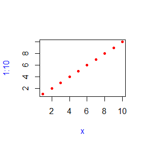
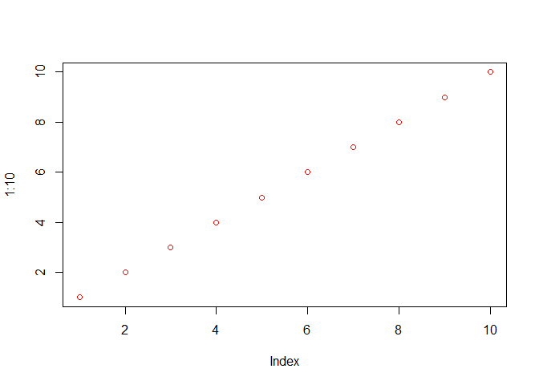
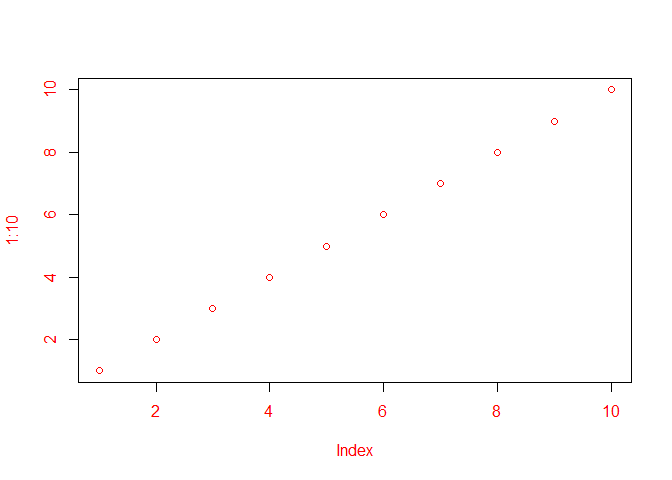
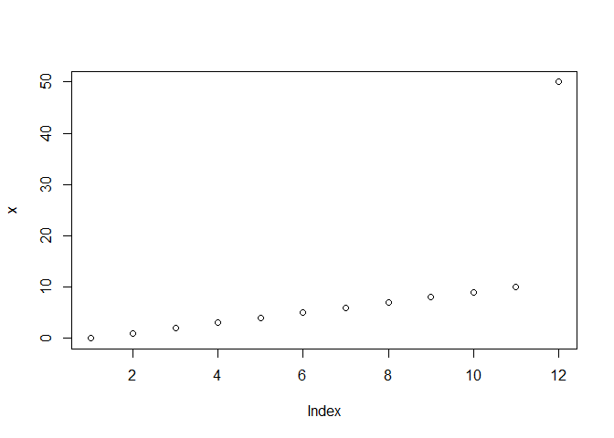

## 6.6 `...`  (dot-dot-dot) {#fun-dot-dot-dot}
\indexc{...}
\index{functions!variadic|see {...}}
\index{ellipsis|see {...}}
\index{dot-dot-dot|see {...}}

Functions can have a special argument `...` (pronounced dot-dot-dot). With it, a function can take any number of additional arguments. In other programming languages, this type of argument is often called _varargs_ (short for variable arguments), and a function that uses it is said to be variadic. 

You can also use `...` to pass those additional arguments on to another function.


```r
i01 <- function(y, z) {
  list(y = y, z = z)
}

i02 <- function(x, ...) {
  i01(...)
}

str(i02(x = 1, y = 2, z = 3))
```

```
## List of 2
##  $ y: num 2
##  $ z: num 3
```

Using a special form, `..N`, it's possible (but rarely useful) to refer to elements of `...` by position:


```r
i03 <- function(...) {
  list(first = ..1, third = ..3)
}
str(i03(1, 2, 3))
```

```
## List of 2
##  $ first: num 1
##  $ third: num 3
```

More useful is `list(...)`, which evaluates the arguments and stores them in a list:


```r
i04 <- function(...) {
  list(...)
}
str(i04(a = 1, b = 2))
```

```
## List of 2
##  $ a: num 1
##  $ b: num 2
```

(See also `rlang::list2()` to support splicing and to silently ignore trailing commas, and `rlang::enquos()` to capture unevaluated arguments, the topic of [quasiquotation].)

There are two primary uses of `...`, both of which we'll come back to later in the book:

*   If your function takes a function as an argument, you want some way to 
    pass additional arguments to that function. In this example, `lapply()`
    uses `...` to pass `na.rm` on to `mean()`:
    
    
    ```r
    x <- list(c(1, 3, NA), c(4, NA, 6))
    str(lapply(x, mean, na.rm = TRUE))
    ```
    
    ```
    ## List of 2
    ##  $ : num 2
    ##  $ : num 5
    ```
    
    We'll come back to this technique in Section \@ref(passing-arguments).
    
*   If your function is an S3 generic, you need some way to allow methods to 
    take arbitrary extra arguments. For example, take the `print()` function. 
    Because there are different options for printing depending on the type of 
    object, there's no way to pre-specify every possible argument and `...` 
    allows individual methods to have different arguments:

    
    ```r
    print(factor(letters), max.levels = 4)
    
    print(y ~ x, showEnv = TRUE)
    ```
    
    We'll come back to this use of `...` in Section \@ref(s3-arguments).

Using `...` comes with two downsides:

*   When you use it to pass arguments to another function, you have to 
    carefully explain to the user where those arguments go. This makes it
    hard to understand what you can do with functions like `lapply()` and 
    `plot()`.
    
*   A misspelled argument will not raise an error. This makes it easy for 
    typos to go unnoticed:

    
    ```r
    sum(1, 2, NA, na_rm = TRUE)
    ```
    
    ```
    ## [1] NA
    ```


```r
sum(1, 2, NA, na.rm = TRUE)
```

```
## [1] 3
```


### 6.6.1 Exercises

1.  Explain the following results:
    
    
    ```r
    sum(1, 2, 3)
    ```
    
    ```
    ## [1] 6
    ```
    
    ```r
    mean(1, 2, 3)
    ```
    
    ```
    ## [1] 1
    ```
    
    ```r
    sum(1, 2, 3, na.omit = TRUE)
    ```
    
    ```
    ## [1] 7
    ```
    
    ```r
    mean(1, 2, 3, na.omit = TRUE)
    ```
    
    ```
    ## [1] 1
    ```


```r
str(sum)
```

```
## function (..., na.rm = FALSE)
```

For the ... argument sum() expects numeric, complex, or logical vector input (see ?sum). Unfortunately, when ... is used, misspelled arguments (!) like na.omit won’t raise an error (in case of no further input checks). So instead, na.omit is treated as a logical and becomes part of the ... argument. It will be coerced to 1 and be part of the sum. All other arguments are left unchanged. Therefore sum(1, 2, 3) returns 6 and sum(1, 2, 3, na.omit = TRUE) returns 7.


```r
sum(1, 2, 3)
```

```
## [1] 6
```

```r
sum(1, 2, 3, na.omit = TRUE)
```

```
## [1] 7
```

```r
sum(1, 2, 3, na.rm = TRUE)
```

```
## [1] 6
```


In contrast, the generic function mean() expects x, trim, na.rm and ... for its default method.


```r
str(mean.default)
```

```
## function (x, trim = 0, na.rm = FALSE, ...)
```

As na.omit is not one of mean()’s named arguments (x; and no candidate for partial matching), na.omit again becomes part of the ... argument. However, in contrast to sum() the elements of ... are not “part” of the mean. The other supplied arguments are matched by their order, i.e. x = 1, trim = 2 and na.rm = 3. As x is of length 1 and not NA, the settings of trim and na.rm do not affect the calculation of the mean. Both calls (mean(1, 2, 3) and mean(1, 2, 3, na.omit = TRUE)) return 1.


```r
mean(1, 2, 3)
```

```
## [1] 1
```

```r
mean(1, 2, 3, na.omit = TRUE)
```

```
## [1] 1
```

```r
mean(c(1, 2, 3))
```

```
## [1] 2
```

```r
mean(c(1, 2, 3), na.rm = TRUE)
```

```
## [1] 2
```


```r
x <- c(0:10, 50)
xm <- mean(x)
c(xm, mean(x, trim = 0.10))
```

```
## [1] 8.75 5.50
```

```r
mean(1:10)
```

```
## [1] 5.5
```
Arguments
x	
An R object. Currently there are methods for numeric/logical vectors and date, date-time and time interval objects. Complex vectors are allowed for trim = 0, only.

trim	
the fraction (0 to 0.5) of observations to be trimmed from each end of x before the mean is computed. Values of trim outside that range are taken as the nearest endpoint.

na.rm	
a logical value indicating whether NA values should be stripped before the computation proceeds.

...	
further arguments passed to or from other methods.

Value
If trim is zero (the default), the arithmetic mean of the values in x is computed, as a numeric or complex vector of length one. If x is not logical (coerced to numeric), numeric (including integer) or complex, NA_real_ is returned, with a warning.

If trim is non-zero, a symmetrically trimmed mean is computed with a fraction of trim observations deleted from each end before the mean is computed.


2.  Explain how to find the documentation for the named arguments in the 
    following function call:
    
    
    ```r
    plot(1:10, col = "red", pch = 20, xlab = "x", col.lab = "blue")
    ```
    
    <!-- -->


```r
# ?plot
str(plot)
```

```
## function (x, y, ...)
```

```r
# ?par
```

The arguments we want to learn more about (col, pch, xlab, col.lab) are part of the ... argument. There we can find information for the xlab argument and a recommendation to visit ?par for the other arguments. Under ?par we type “col” into the search bar, which leads us to the section “Color Specification.” We also search for the pch argument, which leads to the recommendation to check ?points. Finally, col.lab is also directly documented within ?par.

3.  Why does `plot(1:10, col = "red")` only colour the points, not the axes 
    or labels? Read the source code of `plot.default()` to find out.


```r
plot(1:10, col = "red")
```

<!-- -->


```r
# ?plot.default()
plot.default
```

```
## function (x, y = NULL, type = "p", xlim = NULL, ylim = NULL, 
##     log = "", main = NULL, sub = NULL, xlab = NULL, ylab = NULL, 
##     ann = par("ann"), axes = TRUE, frame.plot = axes, panel.first = NULL, 
##     panel.last = NULL, asp = NA, xgap.axis = NA, ygap.axis = NA, 
##     ...) 
## {
##     localAxis <- function(..., col, bg, pch, cex, lty, lwd) Axis(...)
##     localBox <- function(..., col, bg, pch, cex, lty, lwd) box(...)
##     localWindow <- function(..., col, bg, pch, cex, lty, lwd) plot.window(...)
##     localTitle <- function(..., col, bg, pch, cex, lty, lwd) title(...)
##     xlabel <- if (!missing(x)) 
##         deparse1(substitute(x))
##     ylabel <- if (!missing(y)) 
##         deparse1(substitute(y))
##     xy <- xy.coords(x, y, xlabel, ylabel, log)
##     xlab <- if (is.null(xlab)) 
##         xy$xlab
##     else xlab
##     ylab <- if (is.null(ylab)) 
##         xy$ylab
##     else ylab
##     xlim <- if (is.null(xlim)) 
##         range(xy$x[is.finite(xy$x)])
##     else xlim
##     ylim <- if (is.null(ylim)) 
##         range(xy$y[is.finite(xy$y)])
##     else ylim
##     dev.hold()
##     on.exit(dev.flush())
##     plot.new()
##     localWindow(xlim, ylim, log, asp, ...)
##     panel.first
##     plot.xy(xy, type, ...)
##     panel.last
##     if (axes) {
##         localAxis(if (is.null(y)) 
##             xy$x
##         else x, side = 1, gap.axis = xgap.axis, ...)
##         localAxis(if (is.null(y)) 
##             x
##         else y, side = 2, gap.axis = ygap.axis, ...)
##     }
##     if (frame.plot) 
##         localBox(...)
##     if (ann) 
##         localTitle(main = main, sub = sub, xlab = xlab, ylab = ylab, 
##             ...)
##     invisible()
## }
## <bytecode: 0x000001f0786db0a0>
## <environment: namespace:graphics>
```

#### Default S3 method:
plot(x, y = NULL, type = "p",  xlim = NULL, ylim = NULL,
     log = "", main = NULL, sub = NULL, xlab = NULL, ylab = NULL,
     ann = par("ann"), axes = TRUE, frame.plot = axes,
     panel.first = NULL, panel.last = NULL, asp = NA,
     xgap.axis = NA, ygap.axis = NA,
     ...)
     
localTitle(main = main, sub = sub, xlab = xlab, ylab = ylab, ...)
The localTitle() function was defined in the first lines of plot.default() as:

localTitle <- function(..., col, bg, pch, cex, lty, lwd) title(...)
The call to localTitle() passes the col parameter as part of the ... argument to title(). ?title tells us that the title() function specifies four parts of the plot: Main (title of the plot), sub (sub-title of the plot) and both axis labels. Therefore, it would introduce ambiguity inside title() to use col directly. Instead, one has the option to supply col via the ... argument, via col.lab or as part of xlab in the form xlab = list(c("index"), col = "red") (similar for ylab).


```r
plot(1:10, col = "red", col.lab = "red", col.axis = "red")
```

<!-- -->

     
## 6.7 Exiting a function

Most functions exit in one of two ways[^esoterica]: they either return a value, indicating success, or they throw an error, indicating failure. This section describes return values (implicit versus explicit; visible versus invisible), briefly discusses errors, and introduces exit handlers, which allow you to run code when a function exits.

[^esoterica]: Functions can exit in other more esoteric ways like signalling a condition that is caught by an exit handler, invoking a restart, or pressing "Q" in an interactive browser.

### 6.7.1 Implicit versus explicit returns
\index{functions!return value}
\indexc{return()}

There are two ways that a function can return a value:

*   Implicitly, where the last evaluated expression is the return value:

    
    ```r
    j01 <- function(x) {
      if (x < 10) {
        0
      } else {
        10
      }
    }
    j01(5)
    ```
    
    ```
    ## [1] 0
    ```
    
    ```r
    j01(15)
    ```
    
    ```
    ## [1] 10
    ```

*   Explicitly, by calling `return()`:

    
    ```r
    j02 <- function(x) {
      if (x < 10) {
        return(0)
      } else {
        return(10)
      }
    }
    ```
    
### 6.7.2 Invisible values {#invisible}
\indexc{invisible()} 
\index{functions!invisible results}
\index{assignment}

Most functions return visibly: calling the function in an interactive context prints the result.


```r
j03 <- function() 1
j03()
```

```
## [1] 1
```

However, you can prevent automatic printing by applying `invisible()` to the last value:


```r
j04 <- function() invisible(1)
j04()
```

To verify that this value does indeed exist, you can explicitly print it or wrap it in parentheses:


```r
print(j04())
```

```
## [1] 1
```

```r
(j04())
```

```
## [1] 1
```

Alternatively, you can use `withVisible()` to return the value and a visibility flag:


```r
str(withVisible(j04()))
```

```
## List of 2
##  $ value  : num 1
##  $ visible: logi FALSE
```

The most common function that returns invisibly is `<-`: 


```r
a <- 2
(a <- 2)
```

```
## [1] 2
```

This is what makes it possible to chain assignments:


```r
a <- b <- c <- d <- 2
```

In general, any function called primarily for a side effect (like `<-`, `print()`, or `plot()`) should return an invisible value (typically the value of the first argument).

### 6.7.3 Errors
\indexc{stop()}
\index{errors}

If a function cannot complete its assigned task, it should throw an error with `stop()`, which immediately terminates the execution of the function.


```r
j05 <- function() {
  stop("I'm an error")
  return(10)
}
j05()
```

```
## Error in j05(): I'm an error
```

An error indicates that something has gone wrong, and forces the user to deal with the problem. Some languages (like C, Go, and Rust) rely on special return values to indicate problems, but in R you should always throw an error. You'll learn more about errors, and how to handle them, in Chapter \@ref(conditions).

### 6.7.4 Exit handlers {#on-exit}
\indexc{on.exit()}
\index{handlers!exit}

Sometimes a function needs to make temporary changes to the global state. But having to cleanup those changes can be painful (what happens if there's an error?). To ensure that these changes are undone and that the global state is restored no matter how a function exits, use `on.exit()` to set up an __exit handler__. The following simple example shows that the exit handler is run regardless of whether the function exits normally or with an error.


```r
j06 <- function(x) {
  cat("Hello\n")
  on.exit(cat("Goodbye!\n"), add = TRUE)
  
  if (x) {
    return(10)
  } else {
    stop("Error")
  }
}

j06(TRUE)
```

```
## Hello
## Goodbye!
```

```
## [1] 10
```

```r
j06(FALSE)
```

```
## Hello
```

```
## Error in j06(FALSE): Error
```

```
## Goodbye!
```

::: sidebar
Always set `add = TRUE` when using `on.exit()`. If you don't, each call to `on.exit()` will overwrite the previous exit handler. Even when only registering a single handler, it's good practice to set `add = TRUE` so that you won't get any unpleasant surprises if you later add more exit handlers.
:::

`on.exit()` is useful because it allows you to place clean-up code directly next to the code that requires clean-up:


```r
cleanup <- function(dir, code) {
  old_dir <- setwd(dir)
  on.exit(setwd(old_dir), add = TRUE)
  
  old_opt <- options(stringsAsFactors = FALSE)
  on.exit(options(old_opt), add = TRUE)
}
```

Coupled with lazy evaluation, this creates a very useful pattern for running a block of code in an altered environment:


```r
with_dir <- function(dir, code) {
  old <- setwd(dir)
  on.exit(setwd(old), add = TRUE)

  force(code)
}

getwd()
```

```
## [1] "D:/Oldroyd_lab/GitHub/Advanced_R"
```

```r
with_dir("~", getwd())
```

```
## [1] "C:/Users/myj23/Documents"
```

The use of `force()` isn't strictly necessary here as simply referring to `code` will force its evaluation. However, using `force()` makes it very clear that we are deliberately forcing the execution. You'll learn other uses of `force()` in Chapter \@ref(function-factories).

The withr package [@withr] provides a collection of other functions for setting up a temporary state.

In R 3.4 and earlier, `on.exit()` expressions are always run in order of creation:


```r
j08 <- function() {
  on.exit(message("a"), add = TRUE)
  on.exit(message("b"), add = TRUE)
}
j08()
```

```
## a
```

```
## b
```

This can make cleanup a little tricky if some actions need to happen in a specific order; typically you want the most recent added expression to be run first. In R 3.5 and later, you can control this by setting `after = FALSE`:


```r
j09 <- function() {
  on.exit(message("a"), add = TRUE, after = FALSE)
  on.exit(message("b"), add = TRUE, after = FALSE)
}
j09()
```

```
## b
```

```
## a
```

### 6.7.5 Exercises

1.  What does `load()` return? Why don't you normally see these values?


```r
?load()
```

```
## starting httpd help server ... done
```

Reload Saved Datasets
Description
Reload datasets written with the function save.

Usage
load(file, envir = parent.frame(), verbose = FALSE)

Arguments
file	
a (readable binary-mode) connection or a character string giving the name of the file to load (when tilde expansion is done).

envir	
the environment where the data should be loaded.

verbose	
should item names be printed during loading?

> load() loads objects saved to disk in .Rdata files by save(). When run successfully, load() invisibly returns a character vector containing the names of the newly loaded objects. To print these names to the console, one can set the argument verbose to TRUE or surround the call in parentheses to trigger R’s auto-printing mechanism.


```r
## save all data
xx <- pi # to ensure there is some data
save(list = ls(all.names = TRUE), file= "all.rda")
rm(xx)

## restore the saved values to the current environment
local({
   load("all.rda")
   ls()
})
```

```
##  [1] "a"        "b"        "c"        "cleanup"  "d"        "i01"     
##  [7] "i02"      "i03"      "i04"      "j01"      "j02"      "j03"     
## [13] "j04"      "j05"      "j06"      "j08"      "j09"      "with_dir"
## [19] "x"        "xm"       "xx"
```


```r
xx <- exp(1:3)
## restore the saved values to the user's workspace
load("all.rda") ## which is here *equivalent* to
## load("all.rda", .GlobalEnv)
## This however annihilates all objects in .GlobalEnv with the same names !
xx # no longer exp(1:3)
```

```
## [1] 3.141593
```


```r
rm(xx)
attach("all.rda") # safer and will warn about masked objects w/ same name in .GlobalEnv
```

```
## The following objects are masked _by_ .GlobalEnv:
## 
##     a, b, c, cleanup, d, i01, i02, i03, i04, j01, j02, j03, j04, j05,
##     j06, j08, j09, with_dir, x, xm
```

```r
ls(pos = 2)
```

```
##  [1] "a"        "b"        "c"        "cleanup"  "d"        "i01"     
##  [7] "i02"      "i03"      "i04"      "j01"      "j02"      "j03"     
## [13] "j04"      "j05"      "j06"      "j08"      "j09"      "with_dir"
## [19] "x"        "xm"       "xx"
```

```r
##  also typically need to cleanup the search path:
detach("file:all.rda")

## clean up (the example):
unlink("all.rda")
```

2.  What does `write.table()` return? What would be more useful?


```r
# ?write.table()
```

write.table {utils}

Description
write.table prints its required argument x (after converting it to a data frame if it is not one nor a matrix) to a file or connection.

Usage
write.table(x, file = "", append = FALSE, quote = TRUE, sep = " ",
            eol = "\n", na = "NA", dec = ".", row.names = TRUE,
            col.names = TRUE, qmethod = c("escape", "double"),
            fileEncoding = "")

write.csv(...)
write.csv2(...)


```r
write.csv(mtcars, "mtcars.csv")
```


> write.table() writes an object, usually a data frame or a matrix, to disk. The function invisibly returns NULL. It would be more useful if write.table() would (invisibly) return the input data, x. This would allow to save intermediate results and directly take on further processing steps without breaking the flow of the code (i.e. breaking it into different lines). One package which uses this pattern is the {readr} package,12 which is part of the tidyverse-ecosystem.


```r
# If only a file name is specified, write_()* will write
# the file to the current working directory.
library(tidyverse)
```

```
## ── Attaching packages ─────────────────────────────────────── tidyverse 1.3.2 ──
## ✔ ggplot2 3.4.0      ✔ purrr   1.0.1 
## ✔ tibble  3.1.8      ✔ dplyr   1.0.10
## ✔ tidyr   1.2.1      ✔ stringr 1.5.0 
## ✔ readr   2.1.3      ✔ forcats 0.5.2 
## ── Conflicts ────────────────────────────────────────── tidyverse_conflicts() ──
## ✖ dplyr::filter() masks stats::filter()
## ✖ dplyr::lag()    masks stats::lag()
```

```r
write_csv(mtcars, "mtcars.csv")
write_tsv(mtcars, "mtcars.tsv")
```


```r
write.csv(mtcars, "mtcars.csv") %>% print()
```

```
## NULL
```


```r
write_csv(mtcars, "mtcars.csv") %>% print()
```

```
##                      mpg cyl  disp  hp drat    wt  qsec vs am gear carb
## Mazda RX4           21.0   6 160.0 110 3.90 2.620 16.46  0  1    4    4
## Mazda RX4 Wag       21.0   6 160.0 110 3.90 2.875 17.02  0  1    4    4
## Datsun 710          22.8   4 108.0  93 3.85 2.320 18.61  1  1    4    1
## Hornet 4 Drive      21.4   6 258.0 110 3.08 3.215 19.44  1  0    3    1
## Hornet Sportabout   18.7   8 360.0 175 3.15 3.440 17.02  0  0    3    2
## Valiant             18.1   6 225.0 105 2.76 3.460 20.22  1  0    3    1
## Duster 360          14.3   8 360.0 245 3.21 3.570 15.84  0  0    3    4
## Merc 240D           24.4   4 146.7  62 3.69 3.190 20.00  1  0    4    2
## Merc 230            22.8   4 140.8  95 3.92 3.150 22.90  1  0    4    2
## Merc 280            19.2   6 167.6 123 3.92 3.440 18.30  1  0    4    4
## Merc 280C           17.8   6 167.6 123 3.92 3.440 18.90  1  0    4    4
## Merc 450SE          16.4   8 275.8 180 3.07 4.070 17.40  0  0    3    3
## Merc 450SL          17.3   8 275.8 180 3.07 3.730 17.60  0  0    3    3
## Merc 450SLC         15.2   8 275.8 180 3.07 3.780 18.00  0  0    3    3
## Cadillac Fleetwood  10.4   8 472.0 205 2.93 5.250 17.98  0  0    3    4
## Lincoln Continental 10.4   8 460.0 215 3.00 5.424 17.82  0  0    3    4
## Chrysler Imperial   14.7   8 440.0 230 3.23 5.345 17.42  0  0    3    4
## Fiat 128            32.4   4  78.7  66 4.08 2.200 19.47  1  1    4    1
## Honda Civic         30.4   4  75.7  52 4.93 1.615 18.52  1  1    4    2
## Toyota Corolla      33.9   4  71.1  65 4.22 1.835 19.90  1  1    4    1
## Toyota Corona       21.5   4 120.1  97 3.70 2.465 20.01  1  0    3    1
## Dodge Challenger    15.5   8 318.0 150 2.76 3.520 16.87  0  0    3    2
## AMC Javelin         15.2   8 304.0 150 3.15 3.435 17.30  0  0    3    2
## Camaro Z28          13.3   8 350.0 245 3.73 3.840 15.41  0  0    3    4
## Pontiac Firebird    19.2   8 400.0 175 3.08 3.845 17.05  0  0    3    2
## Fiat X1-9           27.3   4  79.0  66 4.08 1.935 18.90  1  1    4    1
## Porsche 914-2       26.0   4 120.3  91 4.43 2.140 16.70  0  1    5    2
## Lotus Europa        30.4   4  95.1 113 3.77 1.513 16.90  1  1    5    2
## Ford Pantera L      15.8   8 351.0 264 4.22 3.170 14.50  0  1    5    4
## Ferrari Dino        19.7   6 145.0 175 3.62 2.770 15.50  0  1    5    6
## Maserati Bora       15.0   8 301.0 335 3.54 3.570 14.60  0  1    5    8
## Volvo 142E          21.4   4 121.0 109 4.11 2.780 18.60  1  1    4    2
```


3.  How does the `chdir` parameter of `source()` compare to `with_dir()`? Why 
    might you prefer one to the other?
    

```r
# ?source()
with_dir
```

```
## function(dir, code) {
##   old <- setwd(dir)
##   on.exit(setwd(old), add = TRUE)
## 
##   force(code)
## }
```

> with_dir() takes a path for a working directory (dir) as its first argument. This is the directory where the provided code (code) should be executed. Therefore, the current working directory is changed in with_dir() via setwd(). Then, on.exit() ensures that the modification of the working directory is reset to the initial value when the function exits. By passing the path explicitly, the user has full control over the directory to execute the code in.

> In source() the code is passed via the file argument (a path to a file). The chdir argument specifies if the working directory should be changed to the directory containing the file. The default for chdir is FALSE, so you don’t have to provide a value. However, as you can only provide TRUE or FALSE, you are also less flexible in choosing the working directory for the code execution.

source {base}
Description
source causes R to accept its input from the named file or URL or connection or expressions directly. Input is read and parsed from that file until the end of the file is reached, then the parsed expressions are evaluated sequentially in the chosen environment.

Usage
source(file, local = FALSE, echo = verbose, print.eval = echo,
       exprs, spaced = use_file,
       verbose = getOption("verbose"),
       prompt.echo = getOption("prompt"),
       max.deparse.length = 150, width.cutoff = 60L,
       deparseCtrl = "showAttributes",
       chdir = FALSE,
       encoding = getOption("encoding"),
       continue.echo = getOption("continue"),
       skip.echo = 0, keep.source = getOption("keep.source"))

withAutoprint(exprs, evaluated = FALSE, local = parent.frame(),
              print. = TRUE, echo = TRUE, max.deparse.length = Inf,
              width.cutoff = max(20, getOption("width")),
              deparseCtrl = c("keepInteger", "showAttributes", "keepNA"),
              ...)

chdir	
logical; if TRUE and file is a pathname, the R working directory is temporarily changed to the directory containing file for evaluating.

4.  Write a function that opens a graphics device, runs the supplied code, and 
    closes the graphics device (always, regardless of whether or not the 
    plotting code works).
    
To control the graphics device we use pdf() and dev.off(). To ensure a clean termination on.exit() is used.


```r
plot_pdf <- function(code) {
  pdf("test.pdf")
  on.exit(dev.off(), add = TRUE)
  code
}
```


```r
plot(x)
```

<!-- -->

```r
plot_pdf(plot(x))
```


5.  We can use `on.exit()` to implement a simple version of `capture.output()`.

    
    ```r
    capture.output2 <- function(code) {
      temp <- tempfile()
      on.exit(unlink(temp), add = TRUE, after = TRUE)
    
      sink(temp)
      on.exit(sink(), add = TRUE, after = TRUE)
    
      force(code)
      readLines(temp)
    }
    capture.output2(cat("a", "b", "c", sep = "\n"))
    ```
    
    ```
    ## [1] "a" "b" "c"
    ```

Compare `capture.output()` to `capture.output2()`. How do the functions differ? What features have I removed to make the key ideas easier to see? How have I rewritten the key ideas so they're easier to understand?


```r
# ?capture.output
capture.output
```

```
## function (..., file = NULL, append = FALSE, type = c("output", 
##     "message"), split = FALSE) 
## {
##     type <- match.arg(type)
##     rval <- NULL
##     closeit <- TRUE
##     if (is.null(file)) 
##         file <- textConnection("rval", "w", local = TRUE)
##     else if (is.character(file)) 
##         file <- file(file, if (append) 
##             "a"
##         else "w")
##     else if (inherits(file, "connection")) {
##         if (!isOpen(file)) 
##             open(file, if (append) 
##                 "a"
##             else "w")
##         else closeit <- FALSE
##     }
##     else stop("'file' must be NULL, a character string or a connection")
##     sink(file, type = type, split = split)
##     on.exit({
##         sink(type = type, split = split)
##         if (closeit) close(file)
##     })
##     for (i in seq_len(...length())) {
##         out <- withVisible(...elt(i))
##         if (out$visible) 
##             print(out$value)
##     }
##     on.exit()
##     sink(type = type, split = split)
##     if (closeit) 
##         close(file)
##     if (is.null(rval)) 
##         invisible(NULL)
##     else rval
## }
## <bytecode: 0x000001f078eeab90>
## <environment: namespace:utils>
```

Send Output to a Character String or File
Description
Evaluates its arguments with the output being returned as a character string or sent to a file. Related to sink similarly to how with is related to attach.

Usage
capture.output(..., file = NULL, append = FALSE,
               type = c("output", "message"), split = FALSE)
Arguments


...	
Expressions to be evaluated.

file	
A file name or a connection, or NULL to return the output as a character vector. If the connection is not open, it will be opened initially and closed on exit.

append	
logical. If file a file name or unopened connection, append or overwrite?

type, split

> In capture_output2() the code is simply forced, and the output is caught via sink() in a temporary file. An additional feature of capture_output() is that one can also capture messages by setting type = "message". As this is internally forwarded to sink(), this behaviour (and also sink()’s split argument) could be easily introduced within capture_output2() as well.

The main difference is that capture.output() calls print, i.e. compare the output of these two calls:


```r
capture.output({1})
```

```
## [1] "[1] 1"
```

```r
capture.output2({1})
```

```
## character(0)
```


```r
capture.output(1+1)
```

```
## [1] "[1] 2"
```

```r
capture.output2(1+1)
```

```
## character(0)
```

    
## 6.8 Function forms

> To understand computations in R, two slogans are helpful:
>
> * Everything that exists is an object.
> * Everything that happens is a function call.
>
> --- John Chambers

While everything that happens in R is a result of a function call, not all calls look the same. Function calls come in four varieties:

* __prefix__: the function name comes before its arguments, like
  `foofy(a, b, c)`. These constitute of the majority of function calls in R.

* __infix__: the function name comes in between its arguments, like
  `x + y`. Infix forms are used for many mathematical operators, and for
  user-defined functions that begin and end with `%`.

* __replacement__: functions that replace values by assignment, like
  `names(df) <- c("a", "b", "c")`. They actually look like prefix functions.

* __special__: functions like `[[`, `if`, and `for`. While they don't have a
  consistent structure, they play important roles in R's syntax.

While there are four forms, you actually only need one because any call can be written in prefix form. I'll demonstrate this property, and then you'll learn about each of the forms in turn.

### 6.8.1 Rewriting to prefix form {#prefix-transform}
\index{'@\texttt{`}}
\index{backticks|see {\texttt{`}}}
\indexc{sapply()}

An interesting property of R is that every infix, replacement, or special form can be rewritten in prefix form. Doing so is useful because it helps you better understand the structure of the language, it gives you the real name of every function, and it allows you to modify those functions for fun and profit.

The following example shows three pairs of equivalent calls, rewriting an infix form, replacement form, and a special form into prefix form. 


```r
x + y
`+`(x, y)

names(df) <- c("x", "y", "z")
`names<-`(df, c("x", "y", "z"))

for(i in 1:10) print(i)
`for`(i, 1:10, print(i))
```

Suprisingly, in R, `for` can be called like a regular function! The same is true for basically every operation in R, which means that knowing the function name of a non-prefix function allows you to override its behaviour. For example, if you're ever feeling particularly evil, run the following code while a friend is away from their computer. It will introduce a fun bug: 10% of the time, it will add 1 to any numeric calculation inside the parentheses.


```r
`(` <- function(e1) {
  if (is.numeric(e1) && runif(1) < 0.1) {
    e1 + 1
  } else {
    e1
  }
}
replicate(50, (1 + 2))
```

```
##  [1] 3 3 3 3 3 3 3 3 3 3 3 3 3 3 3 3 3 3 3 3 3 3 4 3 3 3 3 3 3 3 3 3 3 3 3 3 3 3
## [39] 3 3 3 3 3 3 3 3 3 3 3 4
```

```r
rm("(")
```

Of course, overriding built-in functions like this is a bad idea, but, as you'll learn in Section \@ref(html-env), it's possible to apply it only to selected code blocks. This provides a clean and elegant approach to writing domain specific languages and translators to other languages.

A more useful application comes up when using functional programming tools. For example, you could use `lapply()` to add 3 to every element of a list by first defining a function `add()`:


```r
add <- function(x, y) x + y
lapply(list(1:3, 4:5), add, 3)
```

```
## [[1]]
## [1] 4 5 6
## 
## [[2]]
## [1] 7 8
```

But we can also get the same result simply by relying on the existing `+` function:


```r
lapply(list(1:3, 4:5), `+`, 3)
```

```
## [[1]]
## [1] 4 5 6
## 
## [[2]]
## [1] 7 8
```

We'll explore this idea in detail in Section \@ref(functionals).

### 6.8.2 Prefix form {#prefix-form}
\index{functions!arguments}
\index{arguments!matching}

The prefix form is the most common form in R code, and indeed in the majority of programming languages. Prefix calls in R are a little special because you can specify arguments in three ways:

* By position, like `help(mean)`.
* Using partial matching, like `help(top = mean)`.
* By name, like `help(topic = mean)`.

As illustrated by the following chunk, arguments are matched by exact name, then with unique prefixes, and finally by position.


```r
k01 <- function(abcdef, bcde1, bcde2) {
  list(a = abcdef, b1 = bcde1, b2 = bcde2)
}
str(k01(1, 2, 3))
```

```
## List of 3
##  $ a : num 1
##  $ b1: num 2
##  $ b2: num 3
```

```r
str(k01(2, 3, abcdef = 1))
```

```
## List of 3
##  $ a : num 1
##  $ b1: num 2
##  $ b2: num 3
```

```r
# Can abbreviate long argument names:
str(k01(2, 3, a = 1))
```

```
## List of 3
##  $ a : num 1
##  $ b1: num 2
##  $ b2: num 3
```

```r
# But this doesn't work because abbreviation is ambiguous
str(k01(1, 3, b = 1))
```

```
## Error in k01(1, 3, b = 1): argument 3 matches multiple formal arguments
```

In general, use positional matching only for the first one or two arguments; they will be the most commonly used, and most readers will know what they are. Avoid using positional matching for less commonly used arguments, and never use partial matching. Unfortunately you can't disable partial matching, but you can turn it into a warning with the `warnPartialMatchArgs` option:
\index{options!warnPartialMatchArgs@\texttt{warnPartialMatchArgs}}


```r
options(warnPartialMatchArgs = TRUE)
x <- k01(a = 1, 2, 3)
```

```
## Warning in k01(a = 1, 2, 3): partial argument match of 'a' to 'abcdef'
```

### 6.8.3 Infix functions
\index{functions!infix} 
\index{infix functions} 
\indexc{\%\%}

Infix functions get their name from the fact the function name comes inbetween its arguments, and hence have two arguments. R comes with a number of built-in infix operators: `:`, `::`, `:::`, `$`, `@`, `^`, `*`, `/`, `+`, `-`, `>`, `>=`, `<`, `<=`, `==`, `!=`, `!`, `&`, `&&`, `|`, `||`, `~`, `<-`, and `<<-`. You can also create your own infix functions that start and end with `%`. Base R uses this pattern to define `%%`, `%*%`, `%/%`, `%in%`, `%o%`, and `%x%`.

Defining your own infix function is simple. You create a two argument function and bind it to a name that starts and ends with `%`:


```r
`%+%` <- function(a, b) paste0(a, b)
"new " %+% "string"
```

```
## [1] "new string"
```

The names of infix functions are more flexible than regular R functions: they can contain any sequence of characters except for `%`. You will need to escape any special characters in the string used to define the function, but not when you call it:


```r
`% %` <- function(a, b) paste(a, b)
`%/\\%` <- function(a, b) paste(a, b)

"a" % % "b"
```

```
## [1] "a b"
```

```r
"a" %/\% "b"
```

```
## [1] "a b"
```

R's default precedence rules mean that infix operators are composed left to right:


```r
`%-%` <- function(a, b) paste0("(", a, " %-% ", b, ")")
"a" %-% "b" %-% "c"
```

```
## [1] "((a %-% b) %-% c)"
```

There are two special infix functions that can be called with a single argument: `+` and `-`.  

```r
-1
```

```
## [1] -1
```

```r
+10
```

```
## [1] 10
```

### 6.8.4 Replacement functions {#replacement-functions}
\index{replacement functions} 
\index{functions!replacement}
\index{assignment!in replacement functions}

Replacement functions act like they modify their arguments in place, and have the special name `xxx<-`. They must have arguments named `x` and `value`, and must return the modified object. For example, the following function modifies the second element of a vector: 


```r
`second<-` <- function(x, value) {
  x[2] <- value
  x
}
```

Replacement functions are used by placing the function call on the left side of `<-`: 


```r
x <- 1:10
second(x) <- 5L
x
```

```
##  [1]  1  5  3  4  5  6  7  8  9 10
```

I say they act like they modify their arguments in place, because, as explained in Section \@ref(modify-in-place), they actually create a modified copy. We can see that by using `tracemem()`:


```r
x <- 1:10
tracemem(x)
#> <0x7ffae71bd880>

second(x) <- 6L
#> tracemem[0x7ffae71bd880 -> 0x7ffae61b5480]: 
#> tracemem[0x7ffae61b5480 -> 0x7ffae73f0408]: second<- 
```

If your replacement function needs additional arguments, place them between `x` and `value`, and call the replacement function with additional arguments on the left:


```r
`modify<-` <- function(x, position, value) {
  x[position] <- value
  x
}
modify(x, 1) <- 10
x
```

```
##  [1] 10  5  3  4  5  6  7  8  9 10
```

When you write `modify(x, 1) <- 10`, behind the scenes R turns it into:


```r
x <- `modify<-`(x, 1, 10)
```

Combining replacement with other functions requires more complex translation. For example:


```r
x <- c(a = 1, b = 2, c = 3)
names(x)
```

```
## [1] "a" "b" "c"
```

```r
names(x)[2] <- "two"
names(x)
```

```
## [1] "a"   "two" "c"
```

is translated into:


```r
`*tmp*` <- x
x <- `names<-`(`*tmp*`, `[<-`(names(`*tmp*`), 2, "two"))
rm(`*tmp*`)
```

(Yes, it really does create a local variable named `*tmp*`, which is removed afterwards.)

### 6.8.5 Special forms
\index{special forms}
\index{functions!special}

Finally, there are a bunch of language features that are usually written in special ways, but also have prefix forms. These include parentheses:

* `(x)` (`` `(`(x) ``)
* `{x}` (`` `{`(x) ``).

The subsetting operators:

* `x[i]` (`` `[`(x, i) ``) 
* `x[[i]]` (`` `[[`(x, i) ``)

And the tools of control flow:

* `if (cond) true` (`` `if`(cond, true) ``)
* `if (cond) true else false` (`` `if`(cond, true, false) ``)
* `for(var in seq) action` (`` `for`(var, seq, action) ``)
* `while(cond) action` (`` `while`(cond, action)  ``)
* `repeat expr` (`` `repeat`(expr) ``)
* `next` (`` `next`() ``)
* `break` (`` `break`() ``)

Finally, the most complex is the `function` function:

* `function(arg1, arg2) {body}` (`` `function`(alist(arg1, arg2), body, env)``)

Knowing the name of the function that underlies a special form is useful for getting documentation: `?(` is a syntax error; `` ?`(` `` will give you the documentation for parentheses.

All special forms are implemented as primitive functions (i.e. in C); this means printing these functions is not informative:


```r
`for`
```

```
## .Primitive("for")
```

### 6.8.6 Exercises

1. Rewrite the following code snippets into prefix form:


```r
1 + 2 + 3

1 + (2 + 3)

if (length(x) <= 5)
  x[[5]] 
else
  x[[n]]
```
    

```r
`+`(`+`(1, 2), 3)

`+`(1, `(`(`+`(2, 3)))
`+`(1, `+`(2, 3))

`if`(`<=`(length(x), 5), `[[`(x, 5), `[[`(x, n))
```


2.  Clarify the following list of odd function calls:

    
    ```r
    x <- sample(replace = TRUE, 20, x = c(1:10, NA))
    y <- runif(min = 0, max = 1, 20)
    cor(m = "k", y = y, u = "p", x = x)
    ```


```r
x <- sample(c(1:10, NA), size = 20, replace = TRUE)
y <- runif(20, min = 0, max = 1)
cor(x, y, use = "pairwise.complete.obs", method = "kendall")
```

```
## [1] -0.1013401
```

cor(x, y = NULL, use = "everything",
    method = c("pearson", "kendall", "spearman"))
    
Arguments
x	
a numeric vector, matrix or data frame.

y	
NULL (default) or a vector, matrix or data frame with compatible dimensions to x. The default is equivalent to y = x (but more efficient).

na.rm	
logical. Should missing values be removed?

use	
an optional character string giving a method for computing covariances in the presence of missing values. This must be (an abbreviation of) one of the strings "everything", "all.obs", "complete.obs", "na.or.complete", or "pairwise.complete.obs".

method	
a character string indicating which correlation coefficient (or covariance) is to be computed. One of "pearson" (default), "kendall", or "spearman": can be abbreviated.

V	
symmetric numeric matrix, usually positive definite such as a covariance matrix.

3. Explain why the following code fails:

    
    ```r
    modify(get("x"), 1) <- 10
    #> Error: target of assignment expands to non-language object
    ```

First, let’s define x and recall the definition of modify() from Advanced R:


```r
x <- 1:3

`modify<-` <- function(x, position, value) {
  x[position] <- value
  x
}
```

R internally transforms the code, and the transformed code reproduces the error above:


```r
get("x") <- `modify<-`(get("x"), 1, 10)
```

The error occurs during the assignment because no corresponding replacement function, i.e. get<-, exists for get(). To confirm this, we reproduce the error via the following simplified example.


```r
get("x") <- 2
```


4. Create a replacement function that modifies a random location in a vector.


5. Write your own version of `+` that pastes its inputs together if they are 
   character vectors but behaves as usual otherwise. In other words, make this 
   code work:
   
    
    ```r
    1 + 2
    #> [1] 3
    
    "a" + "b"
    #> [1] "ab"
    ```


6. Create a list of all the replacement functions found in the base package. 
   Which ones are primitive functions? (Hint: use `apropos()`.)


7. What are valid names for user-created infix functions?


8. Create an infix `xor()` operator.


9. Create infix versions of the set functions `intersect()`, `union()`, and
   `setdiff()`. You might call them `%n%`, `%u%`, and `%/%` to match 
   conventions from mathematics.


