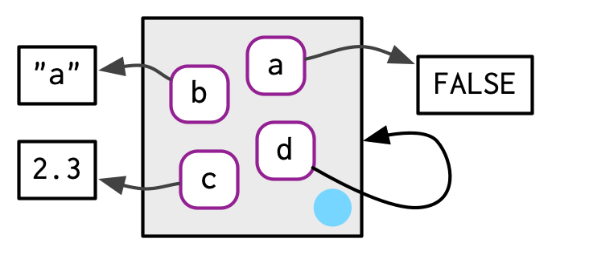

# 7 Environments {#environments}
\index{environments}

## 7.1 Introduction

The environment is the data structure that powers scoping. This chapter dives deep into environments, describing their structure in depth, and using them to improve your understanding of the four scoping rules described in Section \@ref(lexical-scoping). 
Understanding environments is not necessary for day-to-day use of R. But they are important to understand because they power many important R features like lexical scoping, namespaces, and R6 classes, and interact with evaluation to give you powerful tools for making domain specific languages, like dplyr and ggplot2.

### Quiz {-}

If you can answer the following questions correctly, you already know the most important topics in this chapter. You can find the answers at the end of the chapter in Section \@ref(env-answers).

1.  List at least three ways that an environment differs from a list.

> The environment is a virtual space that is triggered when an interpreter of a programming language is launched. Simply, the environment is a collection of all the objects, variables, and functions. Or, Environment can be assumed as a top-level object that contains the set of names/variables associated with some values. 

> Why the Environment Differ from the List?
* Every object in an environment has a name.
* The environment has a parent environment.
* Environments follow reference semantics.

> after reading: There are four ways: every object in an environment must have a name;
    order doesn't matter; environments have parents; environments have
    reference semantics.

2.  What is the parent of the global environment? What is the only 
    environment that doesn't have a parent?
    
> before reading: I don't know. :)

> after reading: The parent of the global environment is the last package that you
    loaded. The only environment that doesn't have a parent is the empty
    environment.
    
3.  What is the enclosing environment of a function? Why is it 
    important?
    
> before reading: I don't know. :)

> after reading: The enclosing environment of a function is the environment where it
    was created. It determines where a function looks for variables.

4.  How do you determine the environment from which a function was called?

> before reading: use caller_env()

> after reading: Use `caller_env()` or `parent.frame()`.

5.  How are `<-` and `<<-` different?

> before reading: `<-` creates a binding. I don't know `<<-`.

> after reading: `<-` always creates a binding in the current environment; `<<-`
    rebinds an existing name in a parent of the current environment.


### Outline {-}

* Section \@ref(env-basics) introduces you to the basic properties
  of an environment and shows you how to create your own.
  
* Section \@ref(env-recursion) provides a function template
  for computing with environments, illustrating the idea with a useful
  function.
  
* Section \@ref(special-environments) describes environments used for special 
  purposes: for packages, within functions, for namespaces, and for
  function execution.
  
* Section \@ref(call-stack) explains the last important environment: the 
  caller environment. This requires you to learn about the call stack,
  that describes how a function was called. You'll have seen the call stack 
  if you've ever called `traceback()` to aid debugging.
  
* Section \@ref(explicit-envs) briefly discusses three places where
  environments are useful data structures for solving other problems.

### Prerequisites {-}

This chapter will use [rlang](https://rlang.r-lib.org) functions for working with environments, because it allows us to focus on the essence of environments, rather than the incidental details. 


```r
library(rlang)
```

The `env_` functions in rlang are designed to work with the pipe: all take an environment as the first argument, and many also return an environment. I won't use the pipe in this chapter in the interest of keeping the code as simple as possible, but you should consider it for your own code.

## 7.2 Environment basics {#env-basics}

Generally, an environment is similar to a named list, with four important exceptions:

*   Every name must be unique.

*   The names in an environment are not ordered.

*   An environment has a parent. 

*   Environments are not copied when modified.

Let's explore these ideas with code and pictures. 

### Basics
\index{environments!creating}
\indexc{env()}
\indexc{new.env()}
\index{assignment}

To create an environment, use `rlang::env()`. It works like `list()`, taking a set of name-value pairs:


```r
e1 <- env(
  a = FALSE,
  b = "a",
  c = 2.3,
  d = 1:3,
)
```

::: base
Use `new.env()` to create a new environment. Ignore the `hash` and `size` parameters; they are not needed. You cannot simultaneously create and define values; use `$<-`, as shown below.
:::

The job of an environment is to associate, or __bind__, a set of names to a set of values. You can think of an environment as a bag of names, with no implied order (i.e. it doesn't make sense to ask which is the first element in an environment). For that reason, we'll draw the environment as so:


As discussed in Section \@ref(env-modify), environments have reference semantics: unlike most R objects, when you modify them, you modify them in place, and don't create a copy. One important implication is that environments can contain themselves. 


```r
e1$d <- e1
```



Printing an environment just displays its memory address, which is not terribly useful:


```r
e1
```

```
## <environment: 0x000002708742fcc0>
```

Instead, we'll use `env_print()` which gives us a little more information:


```r
env_print(e1)
```

```
## <environment: 0x000002708742fcc0>
## Parent: <environment: global>
## Bindings:
## • a: <lgl>
## • b: <chr>
## • c: <dbl>
## • d: <env>
```

You can use `env_names()` to get a character vector giving the current bindings


```r
env_names(e1)
```

```
## [1] "a" "b" "c" "d"
```

::: base
In R 3.2.0 and greater, use `names()` to list the bindings in an environment. If your code needs to work with R 3.1.0 or earlier, use `ls()`, but note that you'll need to set `all.names = TRUE` to show all bindings.
:::


```r
names(e1)
```

```
## [1] "a" "b" "c" "d"
```


### 7.2.2 Important environments
\index{environments!current}
\index{environments!global}

We'll talk in detail about special environments in \@ref(special-environments), but for now we need to mention two. The current environment, or `current_env()` is the environment in which code is currently executing. When you're experimenting interactively, that's usually the global environment, or `global_env()`. The global environment is sometimes called your "workspace", as it's where all interactive (i.e. outside of a function) computation takes place.

To compare environments, you need to use `identical()` and not `==`. This is because `==` is a vectorised operator, and environments are not vectors.


```r
identical(global_env(), current_env())
```

```
## [1] TRUE
```

```r
#global_env() == current_env()
```


```r
global_env()
```

```
## <environment: R_GlobalEnv>
```


```r
current_env()
```

```
## <environment: R_GlobalEnv>
```


:::base
Access the global environment with `globalenv()` and the current environment with `environment()`. The global environment is printed as `R_GlobalEnv` and `.GlobalEnv`.
:::


```r
globalenv()
```

```
## <environment: R_GlobalEnv>
```


```r
environment()
```

```
## <environment: R_GlobalEnv>
```


### 7.2.3 Parents
\index{environments!parent}
\indexc{env\_parent()}

Every environment has a __parent__, another environment. In diagrams, the parent is shown as a small pale blue circle and arrow that points to another environment. The parent is what's used to implement lexical scoping: if a name is not found in an environment, then R will look in its parent (and so on).  You can set the parent environment by supplying an unnamed argument to `env()`. If you don't supply it, it defaults to the current environment. In the code below, `e2a` is the parent of `e2b`.


```r
e2a <- env(d = 4, e = 5)
e2b <- env(e2a, a = 1, b = 2, c = 3)
```


To save space, I typically won't draw all the ancestors; just remember whenever you see a pale blue circle, there's a parent environment somewhere. 

You can find the parent of an environment with `env_parent()`:


```r
env_parent(e2b)
```

```
## <environment: 0x000002708bd5be00>
```

```r
env_parent(e2a)
```

```
## <environment: R_GlobalEnv>
```

```r
env_print(e2b)
```

```
## <environment: 0x000002708bda8720>
## Parent: <environment: 0x000002708bd5be00>
## Bindings:
## • a: <dbl>
## • b: <dbl>
## • c: <dbl>
```

```r
env_print(e2a)
```

```
## <environment: 0x000002708bd5be00>
## Parent: <environment: global>
## Bindings:
## • d: <dbl>
## • e: <dbl>
```

Only one environment doesn't have a parent: the __empty__ environment.  I draw the empty environment with a hollow parent environment, and where space allows I'll label it with `R_EmptyEnv`, the name R uses.


```r
e2c <- env(empty_env(), d = 4, e = 5)
e2d <- env(e2c, a = 1, b = 2, c = 3)
```


The ancestors of every environment eventually terminate with the empty environment. You can see all ancestors with `env_parents()`:


```r
env_parents(e2b)
```

```
## [[1]]   <env: 0x000002708bd5be00>
## [[2]] $ <env: global>
```

```r
env_parents(e2d)
```

```
## [[1]]   <env: 0x0000027088bbd150>
## [[2]] $ <env: empty>
```

By default, `env_parents()` stops when it gets to the global environment. This is useful because the ancestors of the global environment include every attached package, which you can see if you override the default behaviour as below. We'll come back to these environments in Section \@ref(search-path). 


```r
env_parents(e2b, last = empty_env())
```

```
##  [[1]]   <env: 0x000002708bd5be00>
##  [[2]] $ <env: global>
##  [[3]] $ <env: package:rlang>
##  [[4]] $ <env: package:stats>
##  [[5]] $ <env: package:graphics>
##  [[6]] $ <env: package:grDevices>
##  [[7]] $ <env: package:utils>
##  [[8]] $ <env: package:datasets>
##  [[9]] $ <env: package:methods>
## [[10]] $ <env: Autoloads>
## [[11]] $ <env: package:base>
## [[12]] $ <env: empty>
```

::: base 
Use `parent.env()` to find the parent of an environment. No base function returns all ancestors.
:::


```r
parent.env(e2b)
```

```
## <environment: 0x000002708bd5be00>
```

```r
parent.env(e2d)
```

```
## <environment: 0x0000027088bbd150>
```


### 7.2.4 Super assignment, `<<-`
\indexc{<<-}
\index{assignment}
\index{super assignment}

The ancestors of an environment have an important relationship to `<<-`. Regular assignment, `<-`, always creates a variable in the current environment. Super assignment, `<<-`, never creates a variable in the current environment, but instead modifies an existing variable found in a parent environment. 


```r
x <- 0
f <- function() {
  x <<- 1
}
f()
x
```

```
## [1] 1
```

If `<<-` doesn't find an existing variable, it will create one in the global environment. This is usually undesirable, because global variables introduce non-obvious dependencies between functions. `<<-` is most often used in conjunction with a function factory, as described in Section \@ref(stateful-funs).

### 7.2.5 Getting and setting
\index{environments!bindings}
\indexc{env\_bind\_*}

You can get and set elements of an environment with `$` and `[[` in the same way as a list:


```r
e3 <- env(x = 1, y = 2)
e3$x
```

```
## [1] 1
```

```r
e3$z <- 3
e3[["z"]]
```

```
## [1] 3
```

```r
e3
```

```
## <environment: 0x000002708bb167a0>
```

```r
env_print(e3)
```

```
## <environment: 0x000002708bb167a0>
## Parent: <environment: global>
## Bindings:
## • x: <dbl>
## • y: <dbl>
## • z: <dbl>
```

But you can't use `[[` with numeric indices, and you can't use `[`:


```r
#e3[[1]]
#Error in e3[[1]] : wrong arguments for subsetting an environment

#e3[c("x", "y")]
#Error in e3[c("x", "y")] : 
#  object of type 'environment' is not subsettable
```

`$` and `[[` will return `NULL` if the binding doesn't exist. Use `env_get()` if you want an error:


```r
e3$xyz
```

```
## NULL
```

```r
#NULL

env_get(e3, "xyz")
```

```
## Error in `env_get()`:
## ! Can't find `xyz` in environment.
```

```r
#Error in `env_get()`:
#! Can't find `xyz` in environment.
#Backtrace:
# 1. rlang::env_get(e3, "xyz")
# Error in base::try(where, silent = TRUE) : object 'where' not found
```

If you want to use a default value if the binding doesn't exist, you can use the `default` argument.


```r
env_get(e3, "xyz", default = NA)
```

```
## [1] NA
```

There are two other ways to add bindings to an environment: 

*   `env_poke()`[^poke] takes a name (as string) and a value:

    
    ```r
    env_poke(e3, "a", 100)
    e3$a
    ```
    
    ```
    ## [1] 100
    ```

    [^poke]: You might wonder why rlang has `env_poke()` instead of `env_set()`. 
    This is for consistency: `_set()` functions return a modified copy; 
    `_poke()` functions modify in place.

*   `env_bind()` allows you to bind multiple values: 

    
    ```r
    env_bind(e3, a = 10, b = 20)
    env_names(e3)
    ```
    
    ```
    ## [1] "x" "y" "z" "a" "b"
    ```

You can determine if an environment has a binding with `env_has()`:


```r
env_has(e3, "a")
```

```
##    a 
## TRUE
```

Unlike lists, setting an element to `NULL` does not remove it, because sometimes you want a name that refers to `NULL`. Instead, use `env_unbind()`:


```r
e3$a <- NULL
env_has(e3, "a")
```

```
##    a 
## TRUE
```

```r
env_unbind(e3, "a")
env_has(e3, "a")
```

```
##     a 
## FALSE
```

Unbinding a name doesn't delete the object. That's the job of the garbage collector, which automatically removes objects with no names binding to them. This process is described in more detail in Section \@ref(gc).

::: base
\indexc{rm()}\index{assignment!assign()@\texttt{assign()}}\indexc{get()}\indexc{exists()}
See `get()`, `assign()`, `exists()`, and `rm()`. These are designed interactively for use with the current environment, so working with other environments is a little clunky. Also beware the `inherits` argument: it defaults to `TRUE` meaning that the base equivalents will inspect the supplied environment and all its ancestors.
:::

### 7.2.6 Advanced bindings
\index{bindings!delayed} 
\index{promises} 
\index{bindings!active}
\index{active bindings}
\indexc{env\_bind\_*}

There are two more exotic variants of `env_bind()`:

*   `env_bind_lazy()` creates __delayed bindings__, which are evaluated the
    first time they are accessed. Behind the scenes, delayed bindings create 
    promises, so behave in the same way as function arguments.

    
    ```r
    env_bind_lazy(current_env(), b = {Sys.sleep(1); 1})
    
    system.time(print(b))
    ```
    
    ```
    ## [1] 1
    ```
    
    ```
    ##    user  system elapsed 
    ##    0.00    0.00    1.02
    ```
    
    ```r
    system.time(print(b))
    ```
    
    ```
    ## [1] 1
    ```
    
    ```
    ##    user  system elapsed 
    ##       0       0       0
    ```

    The primary use of delayed bindings is in `autoload()`, which 
    allows R packages to provide datasets that behave like they are loaded in
    memory, even though they're only loaded from disk when needed.

*   `env_bind_active()` creates __active bindings__ which are re-computed every 
    time they're accessed:

    
    ```r
    env_bind_active(current_env(), z1 = function(val) runif(1))
    
    z1
    ```
    
    ```
    ## [1] 0.08357573
    ```
    
    ```r
    z1
    ```
    
    ```
    ## [1] 0.9709415
    ```

```r
env_bind(current_env(), b1 = {print('hi'); 1})
```

```
## [1] "hi"
```

```r
print('first')
```

```
## [1] "first"
```

```r
print(b1)
```

```
## [1] 1
```

```r
print(b1)
```

```
## [1] 1
```


```r
env_bind_lazy(current_env(), b2 = {print('yo'); 2})
print('second')
```

```
## [1] "second"
```

```r
print(b2)
```

```
## [1] "yo"
## [1] 2
```

```r
print(b2)
```

```
## [1] 2
```


```r
env_bind_active(current_env(), b3 = function(){print('foo'); 3})
print('third')
```

```
## [1] "third"
```

```r
print(b3)
```

```
## [1] "foo"
## [1] 3
```

```r
print(b3)
```

```
## [1] "foo"
## [1] 3
```

    Active bindings are used to implement R6's active fields, which you'll learn
    about in Section \@ref(active-fields).

::: base
See  `?delayedAssign()` and `?makeActiveBinding()`.
:::


```r
#?delayedAssign()
```


```r
#?makeActiveBinding()
```

### 7.2.7 Exercises

1.  List three ways in which an environment differs from a list.

> Every name must be unique.

> The names in an environment are not ordered.

> An environment has a parent.

> Environments are not copied when modified.

> environments can only be compared via identical(); not with ==

> environments can contain themselves

2.  Create an environment as illustrated by this picture.

    


```r
e7_2 <- env()
e7_2$loop <- e7_2

env_print(e7_2)
```

```
## <environment: 0x000002708b2ff140>
## Parent: <environment: global>
## Bindings:
## • loop: <env>
```

```r
# Verify that it contains itself
lobstr::ref(e7_2)
```

```
## █ [1:0x2708b2ff140] <env> 
## └─loop = [1:0x2708b2ff140]
```


3.  Create a pair of environments as illustrated by this picture.

    


```r
e7_2 <- env()
e7_3 <- env()

e7_3$dedoop <- e7_2
e7_2$loop <- e7_3

lobstr::ref(e7_2)
```

```
## █ [1:0x2708c1d52f8] <env> 
## └─loop = █ [2:0x2708c22c740] <env> 
##          └─dedoop = [1:0x2708c1d52f8]
```

```r
lobstr::ref(e7_3)
```

```
## █ [1:0x2708c22c740] <env> 
## └─dedoop = █ [2:0x2708c1d52f8] <env> 
##            └─loop = [1:0x2708c22c740]
```


4.  Explain why `e[[1]]` and `e[c("a", "b")]` don't make sense when `e` is
    an environment.

> elements of an environment are not ordered.

> object of type 'environment' is not subsettable

5.  Create a version of `env_poke()` that will only bind new names, never 
    re-bind old names. Some programming languages only do this, and are known 
    as [single assignment languages][single assignment].


```r
#?env_poke()
getAnywhere(env_poke)
```

```
## A single object matching 'env_poke' was found
## It was found in the following places
##   package:rlang
##   namespace:rlang
## with value
## 
## function (env = caller_env(), nm, value, inherit = FALSE, create = !inherit) 
## {
##     check_environment(env)
##     invisible(.Call(ffi_env_poke, env = env, nm = nm, values = value, 
##         inherit = inherit, create = create))
## }
## <bytecode: 0x0000027087f812b8>
## <environment: namespace:rlang>
```


```r
new_env_poke <- function (env = caller_env(), nm, value, inherit = FALSE, create = !inherit) 
{
  if (env_has(env, nm)) {
    abort(paste(nm, "is already assigned to a value."))
  }
    check_environment(env)
    invisible(.Call(ffi_env_poke, env = env, nm = nm, values = value, 
        inherit = inherit, create = create))
}

# Test
#e3$b
#new_env_poke(e3, "b", 100)
```

6.  What does this function do? How does it differ from `<<-` and why
    might you prefer it?
    
    
    ```r
    rebind <- function(name, value, env = caller_env()) {
      if (identical(env, empty_env())) {
        stop("Can't find `", name, "`", call. = FALSE)
      } else if (env_has(env, name)) {
        env_poke(env, name, value)
      } else {
        rebind(name, value, env_parent(env))
      }
    }
    
    rebind("a", 10)
    ```
    
    ```
    ## Error: Can't find `a`
    ```
    
    ```r
    a <- 5
    rebind("a", 10)
    a
    ```
    
    ```
    ## [1] 10
    ```

> rebind() will carry out an assignment when it finds an existing binding in the current environment or parent environment. If rebind() doesn’t find an existing variable, rebind() will NOT create a new one in the global environment.

> Super assignment, <<-, never creates a variable in the current environment, but instead modifies an existing variable found in a parent environment. If <<- doesn’t find an existing variable, it will create one in the global environment. This is usually undesirable, because global variables introduce non-obvious dependencies between functions. 
> The operators <<- and ->> are normally only used in functions, and cause a search to be made through parent environments for an existing definition of the variable being assigned. If such a variable is found (and its binding is not locked) then its value is redefined, otherwise assignment takes place in the global environment.


## 7.3 Recursing over environments {#env-recursion}
\index{recursion!over environments}

If you want to operate on every ancestor of an environment, it's often convenient to write a recursive function. This section shows you how, applying your new knowledge of environments to write a function that given a name, finds the environment `where()` that name is defined, using R's regular scoping rules. 

The definition of `where()` is straightforward. It has two arguments: the name to look for (as a string), and the environment in which to start the search. (We'll learn why `caller_env()` is a good default in Section \@ref(call-stack).)


```r
where <- function(name, env = caller_env()) {
  if (identical(env, empty_env())) {
    # Base case
    stop("Can't find ", name, call. = FALSE)
  } else if (env_has(env, name)) {
    # Success case
    env
  } else {
    # Recursive case
    where(name, env_parent(env))
  }
}
```

There are three cases:

* The base case: we've reached the empty environment and haven't found the
  binding. We can't go any further, so we throw an error. 

* The successful case: the name exists in this environment, so we return the
  environment.

* The recursive case: the name was not found in this environment, so try the 
  parent.

These three cases are illustrated with these three examples:


```r
where("yyy")
```

```
## Error: Can't find yyy
```

```r
x <- 5
where("x")
```

```
## <environment: R_GlobalEnv>
```

```r
where("mean")
```

```
## <environment: base>
```

It might help to see a picture. Imagine you have two environments, as in the following code and diagram:


```r
e4a <- env(empty_env(), a = 1, b = 2)
e4b <- env(e4a, x = 10, a = 11)
```


* `where("a", e4b)` will find `a` in `e4b`.

* `where("b", e4b)` doesn't find `b` in `e4b`, so it looks in its parent, `e4a`,
  and finds it there.

* `where("c", e4b)` looks in `e4b`, then `e4a`, then hits the empty environment
  and throws an error.

It's natural to work with environments recursively, so `where()` provides a useful template. Removing the specifics of `where()` shows the structure more clearly:


```r
f <- function(..., env = caller_env()) {
  if (identical(env, empty_env())) {
    # base case
  } else if (success) {
    # success case
  } else {
    # recursive case
    f(..., env = env_parent(env))
  }
}
```

::: sidebar
### Iteration versus recursion {-}

It's possible to use a loop instead of recursion. I think it's harder to understand than the recursive version, but I include it because you might find it easier to see what's happening if you haven't written many recursive functions.


```r
f2 <- function(..., env = caller_env()) {
  while (!identical(env, empty_env())) {
    if (success) {
      # success case
      return()
    }
    # inspect parent
    env <- env_parent(env)
  }

  # base case
}
```
:::

### 7.3.1 Exercises

1.  Modify `where()` to return _all_ environments that contain a binding for
    `name`. Carefully think through what type of object the function will
    need to return.
    

```r
where <- function(name, env = caller_env()) {
  if (identical(env, empty_env())) {
    # Base case
    stop("Can't find ", name, call. = FALSE)
  } else if (env_has(env, name)) {
    # Success case
    env
  } else {
    # Recursive case
    where(name, env_parent(env))
  }
}
```


```r
new_where <- function(name, env = caller_env(), results = list()) {
  if (identical(env, empty_env())) {
    # Base case
    results
  } else {
    if (env_has(env, name)) {
    # Success case
    results <- c(results, env)
    } 
    # Recursive anyway
    new_where(name, env_parent(env), results)
  }
}
```


```r
# Test
e1a <- env(empty_env(), a = 1, b = 2)
e1b <- env(e1a, b = 10, c = 11)
e1c <- env(e1b, a = 12, d = 13)

lobstr::ref(e1a)
```

```
## █ [1:0x2708c4c1bf0] <env> 
## ├─a = [2:0x2708cdc7df8] <dbl> 
## └─b = [3:0x2708cdc7dc0] <dbl>
```

```r
lobstr::ref(e1b)
```

```
## █ [1:0x2708c555580] <env> 
## ├─b = [2:0x2708cdc0740] <dbl> 
## └─c = [3:0x2708cdc0708] <dbl>
```

```r
lobstr::ref(e1c)
```

```
## █ [1:0x2708c601920] <env> 
## ├─a = [2:0x2708ce5e4a8] <dbl> 
## └─d = [3:0x2708ce5e470] <dbl>
```

```r
where("a", e1c)
```

```
## <environment: 0x000002708c601920>
```

```r
new_where("a", e1c)
```

```
## [[1]]
## <environment: 0x000002708c601920>
## 
## [[2]]
## <environment: 0x000002708c4c1bf0>
```


2.  Write a function called `fget()` that finds only function objects. It 
    should have two arguments, `name` and `env`, and should obey the regular 
    scoping rules for functions: if there's an object with a matching name 
    that's not a function, look in the parent. For an added challenge, also 
    add an `inherits` argument which controls whether the function recurses up 
    the parents or only looks in one environment.


```r
fget <- function(name, env = caller_env()) {

  # Base case  
  if (identical(env, emptyenv())) {
    stop("Could not find a function called ", name, ".", call. = FALSE)
    }
  
  # Success case
  else{
    if (env_has(env, name)) {
      obj <- env_get(env, name)
      if (is.function(obj)) {
        return(obj)
      }
    }
  }

  # Recursive anyway
  fget(name, env_parent(env))
}

# Test
mean <- 10
fget("mean")
```

```
## function (x, ...) 
## UseMethod("mean")
## <bytecode: 0x0000027087d07890>
## <environment: namespace:base>
```

```r
#fget("meanx")
#Error: Could not find a function called meanx.
```


```r
new_fget <- function(name, env = caller_env(),inherits = TRUE) {

  # Base case  
  if (identical(env, emptyenv())) {
    stop("Could not find a function called ", name, ".", call. = FALSE)
    }
  
  # Success case
  else{
    if (env_has(env, name)) {
      obj <- env_get(env, name)
      if (is.function(obj)) {
        return(obj)
      }
    }
    if (inherits == FALSE) {
      stop("inherits = FALSE.")
      }
  }
  
  # Recursive anyway
  fget(name, env_parent(env))
}

# Test
mean <- 10
#new_fget("mean", inherits = FALSE)
#Error in new_fget("mean", inherits = FALSE) : inherits = FALSE.

new_fget("mean")
```

```
## function (x, ...) 
## UseMethod("mean")
## <bytecode: 0x0000027087d07890>
## <environment: namespace:base>
```

```r
#new_fget("meanx")
#Error: Could not find a function called meanx.
```

