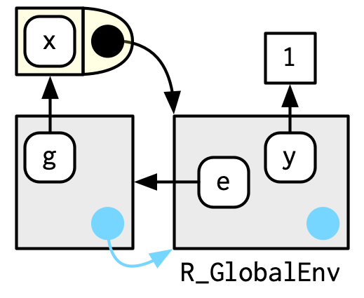

```r
library(rlang)
```

## 7.4 Special environments {#special-environments}
 
Most environments are not created by you (e.g. with `env()`) but are instead created by R. In this section, you'll learn about the most important environments, starting with the package environments. You'll then learn about the function environment bound to the function when it is created, and the (usually) ephemeral execution environment created every time the function is called. Finally, you'll see how the package and function environments interact to support namespaces, which ensure that a package always behaves the same way, regardless of what other packages the user has loaded.

### 7.4.1 Package environments and the search path {#search-path}
\indexc{search()} 
\index{search path}
\indexc{Autoloads}
\index{environments!base}

Each package attached by `library()` or `require()` becomes one of the parents of the global environment. The immediate parent of the global environment is the last package you attached[^attach], the parent of that package is the second to last package you attached, ...

[^attach]: Note the difference between attached and loaded. A package is loaded automatically if you access one of its functions using `::`; it is only __attached__ to the search path by `library()` or `require()`.


If you follow all the parents back, you see the order in which every package has been attached. This is known as the __search path__ because all objects in these environments can be found from the top-level interactive workspace. You can see the names of these environments with `base::search()`, or the environments themselves with `rlang::search_envs()`:


```r
library(rlang)
```


```r
search()
```

```
##  [1] ".GlobalEnv"        "package:rlang"     "package:stats"    
##  [4] "package:graphics"  "package:grDevices" "package:utils"    
##  [7] "package:datasets"  "package:methods"   "Autoloads"        
## [10] "package:base"
```

```r
search_envs()
```

```
##  [[1]] $ <env: global>
##  [[2]] $ <env: package:rlang>
##  [[3]] $ <env: package:stats>
##  [[4]] $ <env: package:graphics>
##  [[5]] $ <env: package:grDevices>
##  [[6]] $ <env: package:utils>
##  [[7]] $ <env: package:datasets>
##  [[8]] $ <env: package:methods>
##  [[9]] $ <env: Autoloads>
## [[10]] $ <env: package:base>
```

The last two environments on the search path are always the same:

* The `Autoloads` environment uses delayed bindings to save memory by only 
  loading package objects (like big datasets) when needed. 
  
* The base environment, `package:base` or sometimes just `base`, is the
  environment of the base package. It is special because it has to be able 
  to bootstrap the loading of all other packages. You can access it directly 
  with `base_env()`.

Note that when you attach another package with `library()`, the parent environment of the global environment changes:


### 7.4.2 The function environment {#function-environments}
\index{environments!function}
\indexc{fn\_env()}

A function binds the current environment when it is created. This is called the __function environment__, and is used for lexical scoping. Across computer languages, functions that capture (or enclose) their environments are called __closures__, which is why this term is often used interchangeably with _function_ in R's documentation.

You can get the function environment with `fn_env()`: 


```r
y <- 1
f <- function(x) x + y
fn_env(f)
```

```
## <environment: R_GlobalEnv>
```

::: base 
Use `environment(f)` to access the environment of function `f`.
:::

In diagrams, I'll draw a function as a rectangle with a rounded end that binds an environment. 


In this case, `f()` binds the environment that binds the name `f` to the function. But that's not always the case: in the following example `g` is bound in a new environment `e`, but `g()` binds the global environment. The distinction between binding and being bound by is subtle but important; the difference is how we find `g` versus how `g` finds its variables.


```r
e <- env()
e$g <- function() 1
```




### 7.4.3 Namespaces
\index{namespaces}

In the diagram above, you saw that the parent environment of a package varies based on what other packages have been loaded. This seems worrying: doesn't that mean that the package will find different functions if packages are loaded in a different order? The goal of __namespaces__ is to make sure that this does not happen, and that every package works the same way regardless of what packages are attached by the user. 

For example, take `sd()`:


```r
sd
```

```
## function (x, na.rm = FALSE) 
## sqrt(var(if (is.vector(x) || is.factor(x)) x else as.double(x), 
##     na.rm = na.rm))
## <bytecode: 0x00000157b96a5ad0>
## <environment: namespace:stats>
```

`sd()` is defined in terms of `var()`, so you might worry that the result of `sd()` would be affected by any function called `var()` either in the global environment, or in one of the other attached packages. R avoids this problem by taking advantage of the function versus binding environment described above. Every function in a package is associated with a pair of environments: the package environment, which you learned about earlier, and the __namespace__ environment. 

*   The package environment is the external interface to the package. It's how 
    you, the R user, find a function in an attached package or with `::`. Its 
    parent is determined by search path, i.e. the order in which packages have 
    been attached. 

*   The namespace environment is the internal interface to the package. The 
    package environment controls how we find the function; the namespace 
    controls how the function finds its variables. 

Every binding in the package environment is also found in the namespace environment; this ensures every function can use every other function in the package. But some bindings only occur in the namespace environment. These are known as internal or non-exported objects, which make it possible to hide internal implementation details from the user.


Every namespace environment has the same set of ancestors:

* Each namespace has an __imports__ environment that contains bindings to all 
  the functions used by the package. The imports environment is controlled by 
  the package developer with the `NAMESPACE` file.

* Explicitly importing every base function would be tiresome, so the parent
  of the imports environment is the base __namespace__. The base namespace 
  contains the same bindings as the base environment, but it has a different
  parent.
  
* The parent of the base namespace is the global environment. This means that 
  if a binding isn't defined in the imports environment the package will look
  for it in the usual way. This is usually a bad idea (because it makes code
  depend on other loaded packages), so `R CMD check` automatically warns about
  such code. It is needed primarily for historical reasons, particularly due 
  to how S3 method dispatch works.


Putting all these diagrams together we get:


So when `sd()` looks for the value of `var` it always finds it in a sequence of environments determined by the package developer, but not by the package user. This ensures that package code always works the same way regardless of what packages have been attached by the user.

There's no direct link between the package and namespace environments; the link is defined by the function environments.

### 7.4.4 Execution environments
\index{environments!execution}
\index{functions!environment}

The last important topic we need to cover is the __execution__ environment. What will the following function return the first time it's run? What about the second?


```r
g <- function(x) {
  if (!env_has(current_env(), "a")) {
    message("Defining a")
    a <- 1
  } else {
    a <- a + 1
  }
  a
}
```

Think about it for a moment before you read on.


```r
g(10)
```

```
## Defining a
```

```
## [1] 1
```

```r
g(10)
```

```
## Defining a
```

```
## [1] 1
```

This function returns the same value every time because of the fresh start principle, described in Section \@ref(fresh-start). Each time a function is called, a new environment is created to host execution. This is called the execution environment, and its parent is the function environment. Let's illustrate that process with a simpler function. Figure \@ref(fig:execution-env) illustrates the graphical conventions: I draw execution environments with an indirect parent; the parent environment is found via the function environment.


```r
h <- function(x) {
  # 1.
  a <- 2 # 2.
  x + a
}
y <- h(1) # 3.
```

<div class="figure">

<p class="caption">The execution environment of a simple function call. Note that the parent of the execution environment is the function environment.</p>
</div>

An execution environment is usually ephemeral; once the function has completed, the environment will be garbage collected. There are several ways to make it stay around for longer. The first is to explicitly return it:


```r
h2 <- function(x) {
  a <- x * 2
  current_env()
}

e <- h2(x = 10)
env_print(e)
```

```
## <environment: 0x00000157bd6f1ad8>
## Parent: <environment: global>
## Bindings:
## • a: <dbl>
## • x: <dbl>
```

```r
fn_env(h2)
```

```
## <environment: R_GlobalEnv>
```

Another way to capture it is to return an object with a binding to that environment, like a function. The following example illustrates that idea with a function factory, `plus()`. We use that factory to create a function called `plus_one()`. 

There's a lot going on in the diagram because the enclosing environment of `plus_one()` is the execution environment of `plus()`. 


```r
plus <- function(x) {
  function(y) x + y
}

plus_one <- plus(1)
plus_one
```

```
## function(y) x + y
## <environment: 0x00000157bae9afc0>
```


What happens when we call `plus_one()`? Its execution environment will have the captured execution environment of `plus()` as its parent:


```r
plus_one(2)
```

```
## [1] 3
```


You'll learn more about function factories in Section \@ref(factory-fundamentals).

### 7.4.5 Exercises

1.  How is `search_envs()` different from `env_parents(global_env())`?


```r
search_envs()
```

```
##  [[1]] $ <env: global>
##  [[2]] $ <env: package:rlang>
##  [[3]] $ <env: package:stats>
##  [[4]] $ <env: package:graphics>
##  [[5]] $ <env: package:grDevices>
##  [[6]] $ <env: package:utils>
##  [[7]] $ <env: package:datasets>
##  [[8]] $ <env: package:methods>
##  [[9]] $ <env: Autoloads>
## [[10]] $ <env: package:base>
```

> search_envs() returns the environments on the search path as a list.


```r
env_parents(global_env())
```

```
##  [[1]] $ <env: package:rlang>
##  [[2]] $ <env: package:stats>
##  [[3]] $ <env: package:graphics>
##  [[4]] $ <env: package:grDevices>
##  [[5]] $ <env: package:utils>
##  [[6]] $ <env: package:datasets>
##  [[7]] $ <env: package:methods>
##  [[8]] $ <env: Autoloads>
##  [[9]] $ <env: package:base>
## [[10]] $ <env: empty>
```

> env_parents() returns the list of all parents, including the empty environment.

2.  Draw a diagram that shows the enclosing environments of this function:
    
    
    ```r
    f1 <- function(x1) {
      f2 <- function(x2) {
        f3 <- function(x3) {
          x1 + x2 + x3
        }
        f3(3)
      }
      f2(2)
    }
    f1(1)
    ```


```r
    f1 <- function(x1) {
      f2 <- function(x2) {
        f3 <- function(x3) {
          x1 + x2 + x3
        }
        f3(3)
        env_print()
      }
      f2(2)
      env_print()
    }
    f1(1)
```

```
## <environment: 0x00000157be0faea0>
## Parent: <environment: 0x00000157be0fb060>
## Bindings:
## • f3: <fn>
## • x2: <dbl>
## <environment: 0x00000157be0fb060>
## Parent: <environment: global>
## Bindings:
## • f2: <fn>
## • x1: <dbl>
```

```r
    env_print()
```

```
## <environment: global>
## Parent: <environment: package:rlang>
## Bindings:
## • plus_one: <fn>
## • h2: <fn>
## • y: <dbl>
## • e: <env>
## • f: <fn>
## • g: <fn>
## • h: <fn>
## • plus: <fn>
## • f1: <fn>
```


3.  Write an enhanced version of `str()` that provides more information 
    about functions. Show where the function was found and what environment 
    it was defined in.
    

```r
#?str
```


```r
fget <- function(name, env = caller_env()) {

  # Base case  
  if (identical(env, emptyenv())) {
    stop("Could not find a function called ", name, ".", call. = FALSE)
    }
  
  # Success case
  else{
    if (env_has(env, name)) {
      obj <- env_get(env, name)
      if (is.function(obj)) {
        return(list(fun = obj, env = env))
      }
    }
  }

  # Recursive anyway
  fget(name, env_parent(env))
}
```


```r
fstr <- function(fun_name, env = caller_env()) {
  if (!is.character(fun_name)) {
    stop("`fun_name` should be a string.", call. = FALSE)
  }
  fun_env <- fget(fun_name, env)

  list(
    environment = fun_env$env,
    namespace = fn_env(fun_env$fun)
  )
}
```


```r
# Test
fstr("mean")
```

```
## $environment
## <environment: base>
## 
## $namespace
## <environment: namespace:base>
```


## 7.5 Call stacks {#call-stack}
\index{environments!calling}
\indexc{parent.frame()}
\index{call stacks}

There is one last environment we need to explain, the __caller__ environment, accessed with `rlang::caller_env()`. This provides the environment from which the function was called, and hence varies based on how the function is called, not how the function was created. As we saw above this is a useful default whenever you write a function that takes an environment as an argument. 

::: base
`parent.frame()` is equivalent to `caller_env()`; just note that it returns an environment, not a frame.
::: 

To fully understand the caller environment we need to discuss two related concepts: the __call stack__, which is made up of __frames__. Executing a function creates two types of context. You've learned about one already: the execution environment is a child of the function environment, which is determined by where the function was created. There's another type of context created by where the function was called: this is called the call stack.

<!-- HW: mention that this is actually a tree! -->

### 7.5.1 Simple call stacks {#simple-stack}
\indexc{cst()}
\indexc{traceback()}

Let's illustrate this with a simple sequence of calls: `f()` calls `g()` calls `h()`.


```r
f <- function(x) {
  g(x = 2)
}
g <- function(x) {
  h(x = 3)
}
h <- function(x) {
  stop()
}
```

The way you most commonly see a call stack in R is by looking at the `traceback()` after an error has occurred:


```r
f(x = 1)
#> Error:
traceback()
#> 4: stop()
#> 3: h(x = 3) 
#> 2: g(x = 2)
#> 1: f(x = 1)
```

Instead of `stop()` + `traceback()` to understand the call stack, we're going to use `lobstr::cst()` to print out the **c**all **s**tack **t**ree:


```r
h <- function(x) {
  lobstr::cst()
}
f(x = 1)
#> █
#> └─f(x = 1)
#>   └─g(x = 2)
#>     └─h(x = 3)
#>       └─lobstr::cst()
```

This shows us that `cst()` was called from `h()`, which was called from `g()`, which was called from `f()`. Note that the order is the opposite from `traceback()`. As the call stacks get more complicated, I think it's easier to understand the sequence of calls if you start from the beginning, rather than the end (i.e. `f()` calls `g()`; rather than `g()` was called by `f()`).

### 7.5.2 Lazy evaluation {#lazy-call-stack}
\index{lazy evaluation}

The call stack above is simple: while you get a hint that there's some tree-like structure involved, everything happens on a single branch. This is typical of a call stack when all arguments are eagerly evaluated. 

Let's create a more complicated example that involves some lazy evaluation. We'll create a sequence of functions, `a()`, `b()`, `c()`, that pass along an argument `x`.


```r
a <- function(x) b(x)
b <- function(x) c(x)
c <- function(x) x

a(f())
#> █
#> ├─a(f())
#> │ └─b(x)
#> │   └─c(x)
#> └─f()
#>   └─g(x = 2)
#>     └─h(x = 3)
#>       └─lobstr::cst()
```

`x` is lazily evaluated so this tree gets two branches. In the first branch `a()` calls `b()`, then `b()` calls `c()`. The second branch starts when `c()` evaluates its argument `x`. This argument is evaluated in a new branch because the environment in which it is evaluated is the global environment, not the environment of `c()`.

### 7.5.3 Frames
\index{frame}
\indexc{parent.frame()}

Each element of the call stack is a __frame__[^frame], also known as an evaluation context. The frame is an extremely important internal data structure, and R code can only access a small part of the data structure because tampering with it will break R. A frame has three key components:

* An expression (labelled with `expr`) giving the function call. This is
  what `traceback()` prints out.

* An environment (labelled with `env`), which is typically the execution 
  environment of a function. There are two main exceptions: the environment of 
  the global frame is the global environment, and calling `eval()` also 
  generates frames, where the environment can be anything.

* A parent, the previous call in the call stack (shown by a grey arrow). 

Figure \@ref(fig:calling) illustrates the stack for the call to `f(x = 1)` shown in Section \@ref(simple-stack).

[^frame]: NB: `?environment` uses frame in a different sense: "Environments consist of a _frame_, or collection of named objects, and a pointer to an enclosing environment." We avoid this sense of frame, which comes from S, because it's very specific and not widely used in base R. For example, the frame in `parent.frame()` is an execution context, not a collection of named objects.

<div class="figure">

<p class="caption">The graphical depiction of a simple call stack</p>
</div>

(To focus on the calling environments, I have omitted the bindings in the global environment from `f`, `g`, and `h` to the respective function objects.)

The frame also holds exit handlers created with `on.exit()`, restarts and handlers for the condition system, and which context to `return()` to when a function completes. These are important internal details that are not accessible with R code.

### 7.5.4 Dynamic scope
\index{scoping!dynamic} 

Looking up variables in the calling stack rather than in the enclosing environment is called __dynamic scoping__. Few languages implement dynamic scoping (Emacs Lisp is a [notable exception](http://www.gnu.org/software/emacs/emacs-paper.html#SEC15).) This is because dynamic scoping makes it much harder to reason about how a function operates: not only do you need to know how it was defined, you also need to know the context in which it was called. Dynamic scoping is primarily useful for developing functions that aid interactive data analysis, and one of the topics discussed in Chapter \@ref(evaluation).

### 7.5.5 Exercises

1.  Write a function that lists all the variables defined in the environment
    in which it was called. It should return the same results as `ls()`.


```r
ls
```

```
## function (name, pos = -1L, envir = as.environment(pos), all.names = FALSE, 
##     pattern, sorted = TRUE) 
## {
##     if (!missing(name)) {
##         pos <- tryCatch(name, error = function(e) e)
##         if (inherits(pos, "error")) {
##             name <- substitute(name)
##             if (!is.character(name)) 
##                 name <- deparse(name)
##             warning(gettextf("%s converted to character string", 
##                 sQuote(name)), domain = NA)
##             pos <- name
##         }
##     }
##     all.names <- .Internal(ls(envir, all.names, sorted))
##     if (!missing(pattern)) {
##         if ((ll <- length(grep("[", pattern, fixed = TRUE))) && 
##             ll != length(grep("]", pattern, fixed = TRUE))) {
##             if (pattern == "[") {
##                 pattern <- "\\["
##                 warning("replaced regular expression pattern '[' by  '\\\\['")
##             }
##             else if (length(grep("[^\\\\]\\[<-", pattern))) {
##                 pattern <- sub("\\[<-", "\\\\\\[<-", pattern)
##                 warning("replaced '[<-' by '\\\\[<-' in regular expression pattern")
##             }
##         }
##         grep(pattern, all.names, value = TRUE)
##     }
##     else all.names
## }
## <bytecode: 0x00000157b7f7f9d0>
## <environment: namespace:base>
```


```r
ls()
```

```
##  [1] "e"        "f"        "f1"       "fget"     "fstr"     "g"       
##  [7] "h"        "h2"       "plus"     "plus_one" "y"
```


```r
env_names(current_env())
```

```
##  [1] "plus_one" "h2"       "y"        "e"        "f"        "g"       
##  [7] "fget"     "h"        "fstr"     "plus"     "f1"
```


```r
new_ls <- function(env = caller_env()) {
  sort(env_names(env))
}
```


```r
ls(all.names = TRUE)
```

```
##  [1] "e"        "f"        "f1"       "fget"     "fstr"     "g"       
##  [7] "h"        "h2"       "new_ls"   "plus"     "plus_one" "y"
```


```r
new_ls()
```

```
##  [1] "e"        "f"        "f1"       "fget"     "fstr"     "g"       
##  [7] "h"        "h2"       "new_ls"   "plus"     "plus_one" "y"
```


```r
#test
ls(e)
```

```
## [1] "a" "x"
```

```r
new_ls(e)
```

```
## [1] "a" "x"
```


## 7.6 As data structures {#explicit-envs}
\index{hashmaps} 
\index{dictionaries|see {hashmaps}}

As well as powering scoping, environments are also useful data structures in their own right because they have reference semantics.  There are three common problems that they can help solve:

*   __Avoiding copies of large data__. Since environments have reference 
    semantics, you'll never accidentally create a copy. But bare environments 
    are painful to work with, so instead I recommend using R6 objects, which 
    are built on top of environments. Learn more in Chapter \@ref(r6).

*   __Managing state within a package__. Explicit environments are useful in 
    packages because they allow you to maintain state across function calls. 
    Normally, objects in a package are locked, so you can't modify them 
    directly. Instead, you can do something like this:

    
    ```r
    my_env <- new.env(parent = emptyenv())
    my_env$a <- 1
    
    get_a <- function() {
      my_env$a
    }
    set_a <- function(value) {
      old <- my_env$a
      my_env$a <- value
      invisible(old)
    }
    ```

    Returning the old value from setter functions is a good pattern because 
    it makes it easier to reset the previous value in conjunction with 
    `on.exit()` (Section \@ref(on-exit)).

*   __As a hashmap__. A hashmap is a data structure that takes constant, O(1), 
    time to find an object based on its name. Environments provide this 
    behaviour by default, so can be used to simulate a hashmap. See the 
    hash package [@hash] for a complete development of this idea. 
