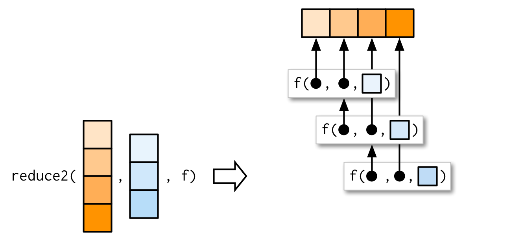

```r
library(purrr)
```

## 9.5 Reduce family {#reduce}

After the map family, the next most important family of functions is the reduce family. This family is much smaller, with only two main variants, and is used less commonly, but it's a powerful idea, gives us the opportunity to discuss some useful algebra, and powers the map-reduce framework frequently used for processing very large datasets.

### 9.5.1 Basics
\indexc{reduce()} 
\index{fold|see {reduce}}

`reduce()` takes a vector of length _n_ and produces a vector of length 1 by calling a function with a pair of values at a time: `reduce(1:4, f)` is equivalent to `f(f(f(1, 2), 3), 4)`. 


`reduce()` is a useful way to generalise a function that works with two inputs (a __binary__ function) to work with any number of inputs. Imagine you have a list of numeric vectors, and you want to find the values that occur in every element. First we generate some sample data:


```r
l <- map(1:4, ~ sample(1:10, 15, replace = T))
str(l)
```

```
## List of 4
##  $ : int [1:15] 8 5 4 5 10 1 10 4 2 9 ...
##  $ : int [1:15] 2 9 9 9 8 4 3 2 7 5 ...
##  $ : int [1:15] 5 3 8 2 1 8 8 3 5 3 ...
##  $ : int [1:15] 7 9 9 10 1 7 5 4 8 2 ...
```

To solve this challenge we need to use `intersect()` repeatedly:


```r
out <- l[[1]]
out <- intersect(out, l[[2]])
out <- intersect(out, l[[3]])
out <- intersect(out, l[[4]])
out
```

```
## [1] 8 5 1 2 9
```

`reduce()` automates this solution for us, so we can write:


```r
reduce(l, intersect)
```

```
## [1] 8 5 1 2 9
```

We could apply the same idea if we wanted to list all the elements that appear in at least one entry. All we have to do is switch from `intersect()` to `union()`:


```r
reduce(l, union)
```

```
##  [1]  8  5  4 10  1  2  9  3  7  6
```

Like the map family, you can also pass additional arguments. `intersect()` and `union()` don't take extra arguments so I can't demonstrate them here, but the principle is straightforward and I drew you a picture.


As usual, the essence of `reduce()` can be reduced to a simple wrapper around a for loop:


```r
simple_reduce <- function(x, f) {
  out <- x[[1]]
  for (i in seq(2, length(x))) {
    out <- f(out, x[[i]])
  }
  out
}
```

::: base 
The base equivalent is `Reduce()`. Note that the argument order is different: the function comes first, followed by the vector, and there is no way to supply additional arguments.
:::

### 9.5.2 Accumulate
\indexc{accumulate()}

The first `reduce()` variant, `accumulate()`, is useful for understanding how reduce works, because instead of returning just the final result, it returns all the intermediate results as well:


```r
accumulate(l, intersect)
```

```
## [[1]]
##  [1]  8  5  4  5 10  1 10  4  2  9  2  3  7  5  5
## 
## [[2]]
## [1] 8 5 4 1 2 9 3 7
## 
## [[3]]
## [1] 8 5 1 2 9 3
## 
## [[4]]
## [1] 8 5 1 2 9
```

Another useful way to understand reduce is to think about `sum()`: `sum(x)` is equivalent to `x[[1]] + x[[2]] + x[[3]] + ...`, i.e. ``reduce(x, `+`)``. Then ``accumulate(x, `+`)`` is the cumulative sum:


```r
x <- c(4, 3, 10)
reduce(x, `+`)
```

```
## [1] 17
```

```r
accumulate(x, `+`)
```

```
## [1]  4  7 17
```

### 9.5.3 Output types

In the above example using `+`, what should `reduce()` return when `x` is short, i.e. length 1 or 0? Without additional arguments, `reduce()` just returns the input when `x` is length 1:


```r
reduce(1, `+`)
```

```
## [1] 1
```

This means that `reduce()` has no way to check that the input is valid:


```r
reduce("a", `+`)
```

```
## [1] "a"
```

What if it's length 0? We get an error that suggests we need to use the `.init` argument:


```r
reduce(integer(), `+`)
```

```
## Error in `reduce()`:
## ! Must supply `.init` when `.x` is empty.
```

What should `.init` be here? To figure that out, we need to see what happens when `.init` is supplied:


So if we call ``reduce(1, `+`, init)`` the result will be `1 + init`. Now we know that the result should be just `1`, so that suggests that `.init` should be 0:


```r
reduce(integer(), `+`, .init = 0)
```

```
## [1] 0
```

This also ensures that `reduce()` checks that length 1 inputs are valid for the function that you're calling:


```r
reduce("a", `+`, .init = 0)
```

```
## Error in .x + .y: non-numeric argument to binary operator
```

If you want to get algebraic about it, 0 is called the __identity__ of the real numbers under the operation of addition: if you add a 0 to any number, you get the same number back. R applies the same principle to determine what a summary function with a zero length input should return:


```r
sum(integer())  # x + 0 = x
```

```
## [1] 0
```

```r
prod(integer()) # x * 1 = x
```

```
## [1] 1
```

```r
min(integer())  # min(x, Inf) = x
```

```
## [1] Inf
```

```r
max(integer())  # max(x, -Inf) = x
```

```
## [1] -Inf
```

```r
reduce(integer(), sum, .init = "x")
```

```
## [1] "x"
```

```r
reduce(integer(), prod, .init = "x")
```

```
## [1] "x"
```

```r
reduce(integer(), min, .init = "x")
```

```
## [1] "x"
```

```r
reduce(integer(), max, .init = "x")
```

```
## [1] "x"
```

If you're using `reduce()` in a function, you should always supply `.init`. Think carefully about what your function should return when you pass a vector of length 0 or 1, and make sure to test your implementation.

### 9.5.4 Multiple inputs
\indexc{reduce2()}

Very occasionally you need to pass two arguments to the function that you're reducing. For example, you might have a list of data frames that you want to join together, and the variables you use to join will vary from element to element. This is a very specialised scenario, so I don't want to spend much time on it, but I do want you to know that `reduce2()` exists.

The length of the second argument varies based on whether or not `.init` is supplied: if you have four elements of `x`, `f` will only be called three times. If you supply init, `f` will be called four times.




### 9.5.5 Map-reduce
\index{map-reduce}

You might have heard of map-reduce, the idea that powers technology like Hadoop. Now you can see how simple and powerful the underlying idea is: map-reduce is a map combined with a reduce. The difference for large data is that the data is spread over multiple computers. Each computer performs the map on the data that it has, then it sends the result to back to a coordinator which _reduces_ the individual results back to a single result.

As a simple example, imagine computing the mean of a very large vector, so large that it has to be split over multiple computers. You could ask each computer to calculate the sum and the length, and then return those to the coordinator which computes the overall mean by dividing the total sum by the total length.

## 9.6 Predicate functionals
\index{predicates} 
\index{functions!predicate|see {predicates}}

A __predicate__ is a function that returns a single `TRUE` or `FALSE`, like `is.character()`, `is.null()`, or `all()`, and we say a predicate __matches__ a vector if it returns `TRUE`. 

### 9.6.1 Basics

A __predicate functional__ applies a predicate to each element of a vector. purrr provides seven useful functions which come in three groups:

*   `some(.x, .p)` returns `TRUE` if _any_ element matches;  
    `every(.x, .p)` returns `TRUE` if _all_ elements match;  
    `none(.x, .p)` returns `TRUE` if _no_ element matches.
    
    These are similar to `any(map_lgl(.x, .p))`, `all(map_lgl(.x, .p))` and
    `all(map_lgl(.x, negate(.p)))` but they terminate early: `some()` returns
    `TRUE` when it sees the first `TRUE`, and `every()` and `none()` return
    `FALSE` when they see the first `FALSE` or `TRUE` respectively.

* `detect(.x, .p)` returns the _value_ of the first match;
  `detect_index(.x, .p)` returns the _location_ of the first match.

* `keep(.x, .p)` _keeps_ all matching elements;
  `discard(.x, .p)` _drops_ all matching elements.

The following example shows how you might use these functionals with a data frame:


```r
df <- data.frame(x = 1:3, y = c("a", "b", "c"))
detect(df, is.factor)
```

```
## NULL
```

```r
detect_index(df, is.factor)
```

```
## [1] 0
```

```r
str(keep(df, is.factor))
```

```
## 'data.frame':	3 obs. of  0 variables
```

```r
str(discard(df, is.factor))
```

```
## 'data.frame':	3 obs. of  2 variables:
##  $ x: int  1 2 3
##  $ y: chr  "a" "b" "c"
```

### 9.6.2 Map variants {#predicate-map}

`map()` and `modify()` come in variants that also take predicate functions, transforming only the elements of `.x` where `.p` is `TRUE`.


```r
df <- data.frame(
  num1 = c(0, 10, 20),
  num2 = c(5, 6, 7),
  chr1 = c("a", "b", "c"),
  stringsAsFactors = FALSE
)

str(map_if(df, is.numeric, mean))
```

```
## List of 3
##  $ num1: num 10
##  $ num2: num 6
##  $ chr1: chr [1:3] "a" "b" "c"
```

```r
str(modify_if(df, is.numeric, mean))
```

```
## 'data.frame':	3 obs. of  3 variables:
##  $ num1: num  10 10 10
##  $ num2: num  6 6 6
##  $ chr1: chr  "a" "b" "c"
```

```r
str(map(keep(df, is.numeric), mean))
```

```
## List of 2
##  $ num1: num 10
##  $ num2: num 6
```

### 9.6.3 Exercises

1.  Why isn't `is.na()` a predicate function? What base R function is closest
    to being a predicate version of `is.na()`?
    

```r
df <- data.frame(x = 1:3, y = c("a", "b", "c"))
str(df)
```

```
## 'data.frame':	3 obs. of  2 variables:
##  $ x: int  1 2 3
##  $ y: chr  "a" "b" "c"
```

```r
is.na(df)
```

```
##          x     y
## [1,] FALSE FALSE
## [2,] FALSE FALSE
## [3,] FALSE FALSE
```

```r
str(is.na(df))
```

```
##  logi [1:3, 1:2] FALSE FALSE FALSE FALSE FALSE FALSE
##  - attr(*, "dimnames")=List of 2
##   ..$ : NULL
##   ..$ : chr [1:2] "x" "y"
```

> `is.na()` is not a predicate function because it returns a logical vector.


```r
anyNA(df)
```

```
## [1] FALSE
```

> `anyNA()` is closest to being a predicate version of `is.na()` because it returns a single TRUE or FALSE.

2.  `simple_reduce()` has a problem when `x` is length 0 or length 1. Describe
    the source of the problem and how you might go about fixing it.
    
    
    ```r
    simple_reduce <- function(x, f) {
      out <- x[[1]]
      for (i in seq(2, length(x))) {
        out <- f(out, x[[i]])
      }
      out
    }
    ```


```r
simple_reduce(c(1:5), sum)
```

```
## [1] 15
```


```r
simple_reduce(1, sum)
```


```r
integer()
simple_reduce(integer(), sum)
```


```r
simple_reduce <- function(x, f, default = NULL) {
  if (length(x) == 0L & is.null(default) == TRUE)
    stop("x is length 0")
  
  if (length(x) == 0L & is.null(default) == FALSE)
    return(default)
  
  if (length(x) == 1L & is.null(default) == TRUE)
    return(x)
  
  if (length(x) == 1L & is.null(default) == FALSE)
    out <- f(default, x) 
  return(out)
  
  
  out <- x[[1]]
  for (i in seq(2, length(x))) {
    out <- f(out, x[[i]])
  }
  out
}
```


```r
simple_reduce(c(1:5), sum)
```

```
## [1] 8 5 1 2 9
```


```r
simple_reduce(c(1:5), sum, 1)
```

```
## [1] 8 5 1 2 9
```


```r
simple_reduce(1, sum)
```

```
## [1] 1
```


```r
simple_reduce(1, sum, 1)
```

```
## [1] 2
```


```r
simple_reduce(integer(), sum, 1)
```


```r
simple_reduce(integer(), sum)
```


3.  Implement the `span()` function from Haskell: given a list `x` and a 
    predicate function `f`, `span(x, f)` returns the location of the longest 
    sequential run of elements where the predicate is true. (Hint: you 
    might find `rle()` helpful.)
    

```r
# ?rle()
```

> Run Length Encoding: Compute the lengths and values of runs of equal values in a vector – or the reverse operation.


```r
x <- rev(rep(6:10, 1:5))
str(x)
```

```
##  int [1:15] 10 10 10 10 10 9 9 9 9 8 ...
```

```r
x
```

```
##  [1] 10 10 10 10 10  9  9  9  9  8  8  8  7  7  6
```

```r
rle(x)
```

```
## Run Length Encoding
##   lengths: int [1:5] 5 4 3 2 1
##   values : int [1:5] 10 9 8 7 6
```


```r
z <- c(TRUE, TRUE, FALSE, FALSE, TRUE, FALSE, TRUE, TRUE, TRUE)
rle(z)
```

```
## Run Length Encoding
##   lengths: int [1:5] 2 2 1 1 3
##   values : logi [1:5] TRUE FALSE TRUE FALSE TRUE
```


```r
library(rlang)
```

```
## 
## Attaching package: 'rlang'
```

```
## The following objects are masked from 'package:purrr':
## 
##     %@%, flatten, flatten_chr, flatten_dbl, flatten_int, flatten_lgl,
##     flatten_raw, invoke, splice
```


```r
x <- c(11, 1:4, 0:5)
x
```

```
##  [1] 11  1  2  3  4  0  1  2  3  4  5
```

```r
which.max(x)
```

```
## [1] 1
```


```r
span1 <- function(x, f) {
  idx <- unname(map_lgl(x, ~ f(.x)))
  rle <- rle(idx) 

  # Find the length of the longest sequence of values
  longest <- which.max(rle$lengths)
  
  # Add up all lengths in rle before the longest run
  ind_before_longest <- sum(rle$lengths[seq_len(longest - 1)])

  longest_start <- ind_before_longest + 1L
  longest_start
}
```


```r
span2 <- function(x, f) {
  idx <- unname(map_lgl(x, ~ f(.x)))
  rle <- rle(idx) 

  # Check if the predicate is never true
  if (none(rle$values,is_true)) {
    stop("never true")
  }

  # Find the length of the longest sequence of true values
  longest <- max(rle$lengths[rle$values])

  # Find the position of the (first) longest run in rle
  longest_idx <- which(rle$values & rle$lengths == longest)[1]

  # Add up all lengths in rle before the longest run
  ind_before_longest <- sum(rle$lengths[seq_len(longest_idx - 1)])

  longest_start <- ind_before_longest + 1L
  longest_start
}
```


```r
span1(c(0,  0,  0,  0,  0), is.na)
span2(c(0,  0,  0,  0,  0), is.na)
```


```r
span1(c(NA, 0,  0,  0,  0), is.na)
```

```
## [1] 2
```

```r
span2(c(NA, 0,  0,  0,  0), is.na)
```

```
## [1] 1
```

```r
span1(c(NA, 0,  0, 0, NA, NA, NA, NA, NA), is.na)
```

```
## [1] 5
```

```r
span2(c(NA, 0,  0, 0, NA, NA, NA, NA, NA), is.na)
```

```
## [1] 5
```


4.  Implement `arg_max()`. It should take a function and a vector of inputs, and return the elements of the input where the function returns the highest value. For example, `arg_max(-10:5, function(x) x ^ 2)` should return -10. `arg_max(-5:5, function(x) x ^ 2)` should return `c(-5, 5)`. Also implement the matching `arg_min()` function.
    

```r
arg_max <- function(x, f) {
  y <- map_dbl(x, f)
  x[y == max(y)]
}

arg_min <- function(x, f) {
  y <- map_dbl(x, f)
  x[y == min(y)]
}

arg_max(-10:5, function(x) x ^ 2)
```

```
## [1] -10
```

```r
arg_max(-5:5, function(x) x ^ 2)
```

```
## [1] -5  5
```

```r
arg_min(-10:5, function(x) x ^ 2)
```

```
## [1] 0
```

```r
arg_min(-5:5, function(x) x ^ 2)
```

```
## [1] 0
```


5.  The function below scales a vector so it falls in the range [0, 1]. How would you apply it to every column of a data frame? How would you apply it to every numeric column in a data frame?

    
    ```r
    scale01 <- function(x) {
      rng <- range(x, na.rm = TRUE)
      (x - rng[1]) / (rng[2] - rng[1])
    }
    ```

> apply it to every column of a data frame


```r
df <- data.frame(
  x = 1:3,
  y = 6:4
)
df
```

```
##   x y
## 1 1 6
## 2 2 5
## 3 3 4
```


```r
modify(df, scale01)
```

```
##     x   y
## 1 0.0 1.0
## 2 0.5 0.5
## 3 1.0 0.0
```


> apply it to every numeric column in a data frame


```r
str(mtcars)
```

```
## 'data.frame':	32 obs. of  11 variables:
##  $ mpg : num  21 21 22.8 21.4 18.7 18.1 14.3 24.4 22.8 19.2 ...
##  $ cyl : num  6 6 4 6 8 6 8 4 4 6 ...
##  $ disp: num  160 160 108 258 360 ...
##  $ hp  : num  110 110 93 110 175 105 245 62 95 123 ...
##  $ drat: num  3.9 3.9 3.85 3.08 3.15 2.76 3.21 3.69 3.92 3.92 ...
##  $ wt  : num  2.62 2.88 2.32 3.21 3.44 ...
##  $ qsec: num  16.5 17 18.6 19.4 17 ...
##  $ vs  : num  0 0 1 1 0 1 0 1 1 1 ...
##  $ am  : num  1 1 1 0 0 0 0 0 0 0 ...
##  $ gear: num  4 4 4 3 3 3 3 4 4 4 ...
##  $ carb: num  4 4 1 1 2 1 4 2 2 4 ...
```


```r
modify_if(mtcars, is.numeric, scale01)
```

```
##          mpg cyl       disp         hp       drat         wt       qsec vs am
## 1  0.4510638 0.5 0.22175106 0.20494700 0.52534562 0.28304781 0.23333333  0  1
## 2  0.4510638 0.5 0.22175106 0.20494700 0.52534562 0.34824853 0.30000000  0  1
## 3  0.5276596 0.0 0.09204290 0.14487633 0.50230415 0.20634109 0.48928571  1  1
## 4  0.4680851 0.5 0.46620105 0.20494700 0.14746544 0.43518282 0.58809524  1  0
## 5  0.3531915 1.0 0.72062859 0.43462898 0.17972350 0.49271286 0.30000000  0  0
## 6  0.3276596 0.5 0.38388626 0.18727915 0.00000000 0.49782664 0.68095238  1  0
## 7  0.1659574 1.0 0.72062859 0.68197880 0.20737327 0.52595244 0.15952381  0  0
## 8  0.5957447 0.0 0.18857570 0.03533569 0.42857143 0.42879059 0.65476190  1  0
## 9  0.5276596 0.0 0.17385882 0.15194346 0.53456221 0.41856303 1.00000000  1  0
## 10 0.3744681 0.5 0.24070841 0.25088339 0.53456221 0.49271286 0.45238095  1  0
## 11 0.3148936 0.5 0.24070841 0.25088339 0.53456221 0.49271286 0.52380952  1  0
## 12 0.2553191 1.0 0.51060115 0.45229682 0.14285714 0.65379698 0.34523810  0  0
## 13 0.2936170 1.0 0.51060115 0.45229682 0.14285714 0.56686269 0.36904762  0  0
## 14 0.2042553 1.0 0.51060115 0.45229682 0.14285714 0.57964715 0.41666667  0  0
## 15 0.0000000 1.0 1.00000000 0.54063604 0.07834101 0.95551010 0.41428571  0  0
## 16 0.0000000 1.0 0.97006735 0.57597173 0.11059908 1.00000000 0.39523810  0  0
## 17 0.1829787 1.0 0.92017960 0.62897527 0.21658986 0.97980056 0.34761905  0  0
## 18 0.9361702 0.0 0.01895735 0.04946996 0.60829493 0.17565840 0.59166667  1  1
## 19 0.8510638 0.0 0.01147418 0.00000000 1.00000000 0.02608029 0.47857143  1  1
## 20 1.0000000 0.0 0.00000000 0.04593640 0.67281106 0.08233188 0.64285714  1  1
## 21 0.4723404 0.0 0.12222499 0.15901060 0.43317972 0.24341601 0.65595238  1  0
## 22 0.2170213 1.0 0.61586431 0.34628975 0.00000000 0.51316799 0.28214286  0  0
## 23 0.2042553 1.0 0.58094288 0.34628975 0.17972350 0.49143442 0.33333333  0  0
## 24 0.1234043 1.0 0.69568471 0.68197880 0.44700461 0.59498849 0.10833333  0  0
## 25 0.3744681 1.0 0.82040409 0.43462898 0.14746544 0.59626694 0.30357143  0  0
## 26 0.7191489 0.0 0.01970566 0.04946996 0.60829493 0.10790079 0.52380952  1  1
## 27 0.6638298 0.0 0.12272387 0.13780919 0.76958525 0.16031705 0.26190476  0  1
## 28 0.8510638 0.0 0.05986530 0.21554770 0.46543779 0.00000000 0.28571429  1  1
## 29 0.2297872 1.0 0.69817910 0.74911661 0.67281106 0.42367681 0.00000000  0  1
## 30 0.3957447 0.5 0.18433525 0.43462898 0.39631336 0.32140118 0.11904762  0  1
## 31 0.1957447 1.0 0.57345972 1.00000000 0.35944700 0.52595244 0.01190476  0  1
## 32 0.4680851 0.0 0.12446994 0.20141343 0.62211982 0.32395807 0.48809524  1  1
##    gear      carb
## 1   0.5 0.4285714
## 2   0.5 0.4285714
## 3   0.5 0.0000000
## 4   0.0 0.0000000
## 5   0.0 0.1428571
## 6   0.0 0.0000000
## 7   0.0 0.4285714
## 8   0.5 0.1428571
## 9   0.5 0.1428571
## 10  0.5 0.4285714
## 11  0.5 0.4285714
## 12  0.0 0.2857143
## 13  0.0 0.2857143
## 14  0.0 0.2857143
## 15  0.0 0.4285714
## 16  0.0 0.4285714
## 17  0.0 0.4285714
## 18  0.5 0.0000000
## 19  0.5 0.1428571
## 20  0.5 0.0000000
## 21  0.0 0.0000000
## 22  0.0 0.1428571
## 23  0.0 0.1428571
## 24  0.0 0.4285714
## 25  0.0 0.1428571
## 26  0.5 0.0000000
## 27  1.0 0.1428571
## 28  1.0 0.1428571
## 29  1.0 0.4285714
## 30  1.0 0.7142857
## 31  1.0 1.0000000
## 32  0.5 0.1428571
```


## 9.7 Base functionals {#base-functionals}

To finish up the chapter, here I provide a survey of important base functionals that are not members of the map, reduce, or predicate families, and hence have no equivalent in purrr. This is not to say that they're not important, but they have more of a mathematical or statistical flavour, and they are generally less useful in data analysis.

### 9.7.1 Matrices and arrays
\indexc{apply()}

`map()` and friends are specialised to work with one-dimensional vectors. `base::apply()` is specialised to work with two-dimensional and higher vectors, i.e. matrices and arrays. You can think of `apply()` as an operation that summarises a matrix or array by collapsing each row or column to a single value. It has four arguments: 

* `X`, the matrix or array to summarise.

* `MARGIN`, an integer vector giving the dimensions to summarise over, 
  1 = rows, 2 = columns, etc. (The argument name comes from thinking about
  the margins of a joint distribution.)

* `FUN`, a summary function.

* `...` other arguments passed on to `FUN`.

A typical example of `apply()` looks like this


```r
a2d <- matrix(1:20, nrow = 5)
a2d
```

```
##      [,1] [,2] [,3] [,4]
## [1,]    1    6   11   16
## [2,]    2    7   12   17
## [3,]    3    8   13   18
## [4,]    4    9   14   19
## [5,]    5   10   15   20
```

```r
apply(a2d, 1, mean)
```

```
## [1]  8.5  9.5 10.5 11.5 12.5
```

```r
apply(a2d, 2, mean)
```

```
## [1]  3  8 13 18
```

<!-- HW: recreate diagrams from plyr paper -->

You can specify multiple dimensions to `MARGIN`, which is useful for high-dimensional arrays:


```r
a3d <- array(1:24, c(2, 3, 4))
a3d
```

```
## , , 1
## 
##      [,1] [,2] [,3]
## [1,]    1    3    5
## [2,]    2    4    6
## 
## , , 2
## 
##      [,1] [,2] [,3]
## [1,]    7    9   11
## [2,]    8   10   12
## 
## , , 3
## 
##      [,1] [,2] [,3]
## [1,]   13   15   17
## [2,]   14   16   18
## 
## , , 4
## 
##      [,1] [,2] [,3]
## [1,]   19   21   23
## [2,]   20   22   24
```

```r
apply(a3d, 1, mean)
```

```
## [1] 12 13
```

```r
apply(a3d, c(1, 2), mean)
```

```
##      [,1] [,2] [,3]
## [1,]   10   12   14
## [2,]   11   13   15
```

There are two caveats to using `apply()`: 

*    Like `base::sapply()`, you have no control over the output type; it 
     will automatically be simplified to a list, matrix, or vector. However, 
     you usually use `apply()` with numeric arrays and a numeric summary
     function so you are less likely to encounter a problem than with 
     `sapply()`.

*   `apply()` is also not idempotent in the sense that if the summary 
    function is the identity operator, the output is not always the same as 
    the input. 

    
    ```r
    a1 <- apply(a2d, 1, identity)
    a1
    ```
    
    ```
    ##      [,1] [,2] [,3] [,4] [,5]
    ## [1,]    1    2    3    4    5
    ## [2,]    6    7    8    9   10
    ## [3,]   11   12   13   14   15
    ## [4,]   16   17   18   19   20
    ```
    
    ```r
    identical(a2d, a1)
    ```
    
    ```
    ## [1] FALSE
    ```
    
    ```r
    a2 <- apply(a2d, 2, identity)
    a2
    ```
    
    ```
    ##      [,1] [,2] [,3] [,4]
    ## [1,]    1    6   11   16
    ## [2,]    2    7   12   17
    ## [3,]    3    8   13   18
    ## [4,]    4    9   14   19
    ## [5,]    5   10   15   20
    ```
    
    ```r
    identical(a2d, a2)
    ```
    
    ```
    ## [1] TRUE
    ```

*   Never use `apply()` with a data frame. It always coerces it to a matrix,
    which will lead to undesirable results if your data frame contains anything
    other than numbers.
    
    
    ```r
    df <- data.frame(x = 1:3, y = c("a", "b", "c"))
    apply(df, 2, mean)
    ```
    
    ```
    ## Warning in mean.default(newX[, i], ...): argument is not numeric or logical:
    ## returning NA
    
    ## Warning in mean.default(newX[, i], ...): argument is not numeric or logical:
    ## returning NA
    ```
    
    ```
    ##  x  y 
    ## NA NA
    ```

### 9.7.2 Mathematical concerns

Functionals are very common in mathematics. The limit, the maximum, the roots (the set of points where `f(x) = 0`), and the definite integral are all functionals: given a function, they return a single number (or vector of numbers). At first glance, these functions don't seem to fit in with the theme of eliminating loops, but if you dig deeper you'll find out that they are all implemented using an algorithm that involves iteration.

Base R provides a useful set:

* `integrate()` finds the area under the curve defined by `f()`
* `uniroot()` finds where `f()` hits zero
* `optimise()` finds the location of the lowest (or highest) value of `f()`

The following example shows how functionals might be used with a simple function, `sin()`:


```r
integrate(sin, 0, pi)
```

```
## 2 with absolute error < 2.2e-14
```

```r
str(uniroot(sin, pi * c(1 / 2, 3 / 2)))
```

```
## List of 5
##  $ root      : num 3.14
##  $ f.root    : num 1.22e-16
##  $ iter      : int 2
##  $ init.it   : int NA
##  $ estim.prec: num 6.1e-05
```

```r
str(optimise(sin, c(0, 2 * pi)))
```

```
## List of 2
##  $ minimum  : num 4.71
##  $ objective: num -1
```

```r
str(optimise(sin, c(0, pi), maximum = TRUE))
```

```
## List of 2
##  $ maximum  : num 1.57
##  $ objective: num 1
```

### 9.7.3 Exercises

1.  How does `apply()` arrange the output? Read the documentation and perform     some experiments.


```r
?apply()
```

```
## starting httpd help server ... done
```

Apply Functions Over Array Margins

Description
Returns a vector or array or list of values obtained by applying a function to margins of an array or matrix.

Arguments
X	
an array, including a matrix.

MARGIN	
a vector giving the subscripts which the function will be applied over. E.g., for a matrix 1 indicates rows, 2 indicates columns, c(1, 2) indicates rows and columns. Where X has named dimnames, it can be a character vector selecting dimension names.

FUN	
the function to be applied: see ‘Details’. In the case of functions like +, %*%, etc., the function name must be backquoted or quoted.

...	
optional arguments to FUN.

simplify	
a logical indicating whether results should be simplified if possible.


```r
## Compute row and column sums for a matrix:
x <- cbind(x1 = 3, x2 = c(4:1, 2:5))
dimnames(x)[[1]] <- letters[1:8]
x
```

```
##   x1 x2
## a  3  4
## b  3  3
## c  3  2
## d  3  1
## e  3  2
## f  3  3
## g  3  4
## h  3  5
```


```r
apply(x, 2, mean, trim = .2)
```

```
## x1 x2 
##  3  3
```


```r
col.sums <- apply(x, 2, sum)
row.sums <- apply(x, 1, sum)
rbind(cbind(x, Rtot = row.sums), Ctot = c(col.sums, sum(col.sums)))
```

```
##      x1 x2 Rtot
## a     3  4    7
## b     3  3    6
## c     3  2    5
## d     3  1    4
## e     3  2    5
## f     3  3    6
## g     3  4    7
## h     3  5    8
## Ctot 24 24   48
```

```r
stopifnot( apply(x, 2, is.vector))
```


```r
## Sort the columns of a matrix
apply(x, 2, sort)
```

```
##      x1 x2
## [1,]  3  1
## [2,]  3  2
## [3,]  3  2
## [4,]  3  3
## [5,]  3  3
## [6,]  3  4
## [7,]  3  4
## [8,]  3  5
```


```r
## keeping named dimnames
names(dimnames(x)) <- c("row", "col")
x3 <- array(x, dim = c(dim(x),3),
	    dimnames = c(dimnames(x), list(C = paste0("cop.",1:3))))
x3
```

```
## , , C = cop.1
## 
##    col
## row x1 x2
##   a  3  4
##   b  3  3
##   c  3  2
##   d  3  1
##   e  3  2
##   f  3  3
##   g  3  4
##   h  3  5
## 
## , , C = cop.2
## 
##    col
## row x1 x2
##   a  3  4
##   b  3  3
##   c  3  2
##   d  3  1
##   e  3  2
##   f  3  3
##   g  3  4
##   h  3  5
## 
## , , C = cop.3
## 
##    col
## row x1 x2
##   a  3  4
##   b  3  3
##   c  3  2
##   d  3  1
##   e  3  2
##   f  3  3
##   g  3  4
##   h  3  5
```


```r
identical(x,  apply( x,  2,  identity))
```

```
## [1] TRUE
```

```r
identical(x3, apply(x3, 2:3, identity))
```

```
## [1] TRUE
```


```r
##- function with extra args:
cave <- function(x, c1, c2) c(mean(x[c1]), mean(x[c2]))
apply(x, 1, cave,  c1 = "x1", c2 = c("x1","x2"))
```

```
##       row
##          a b   c d   e f   g h
##   [1,] 3.0 3 3.0 3 3.0 3 3.0 3
##   [2,] 3.5 3 2.5 2 2.5 3 3.5 4
```


```r
ma <- matrix(c(1:4, 1, 6:8), nrow = 2)
ma
```

```
##      [,1] [,2] [,3] [,4]
## [1,]    1    3    1    7
## [2,]    2    4    6    8
```


```r
apply(ma, 1, stats::quantile) # 5 x n matrix with rownames
```

```
##      [,1] [,2]
## 0%      1  2.0
## 25%     1  3.5
## 50%     2  5.0
## 75%     4  6.5
## 100%    7  8.0
```


2.  What do `eapply()` and `rapply()` do? Does purrr have equivalents?


```r
?eapply()
```

Apply a Function Over Values in an Environment
Description
eapply applies FUN to the named values from an environment and returns the results as a list. The user can request that all named objects are used (normally names that begin with a dot are not). The output is not sorted and no enclosing environments are searched.

Usage
eapply(env, FUN, ..., all.names = FALSE, USE.NAMES = TRUE)


```r
?rapply()
```

Recursively Apply a Function to a List
Description
rapply is a recursive version of lapply with flexibility in how the result is structured (how = "..").

Usage
rapply(object, f, classes = "ANY", deflt = NULL,
       how = c("unlist", "replace", "list"), ...)
Arguments

3.  Challenge: read about the [fixed point algorithm](https://mitpress.mit.edu/sites/default/files/sicp/full-text/book/book-Z-H-12.html#%25_idx_1096).
    Complete the exercises using R.
