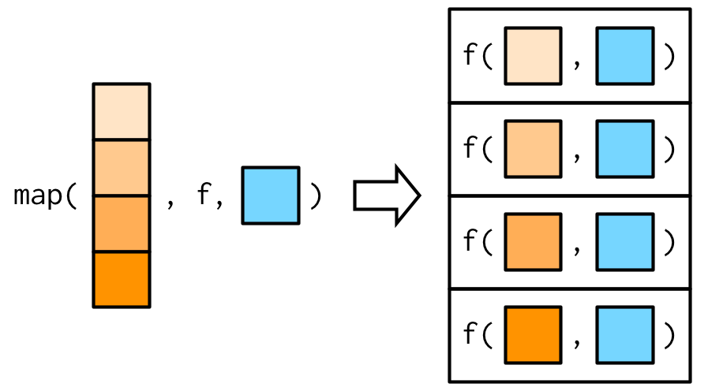
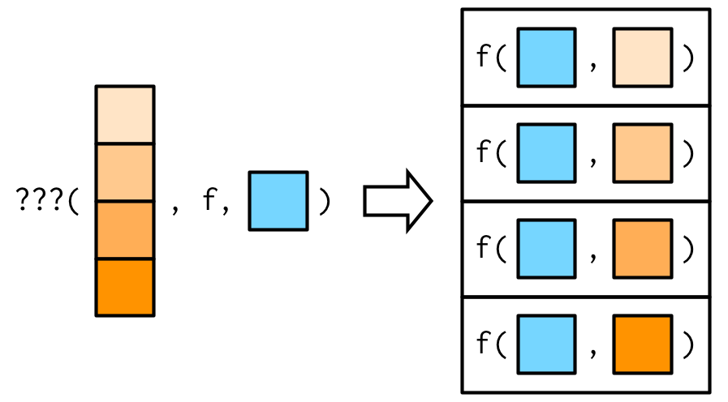
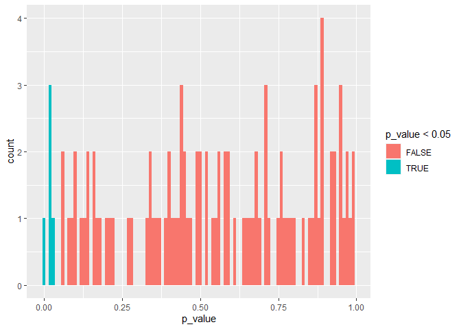
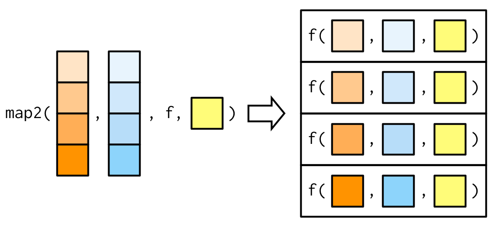
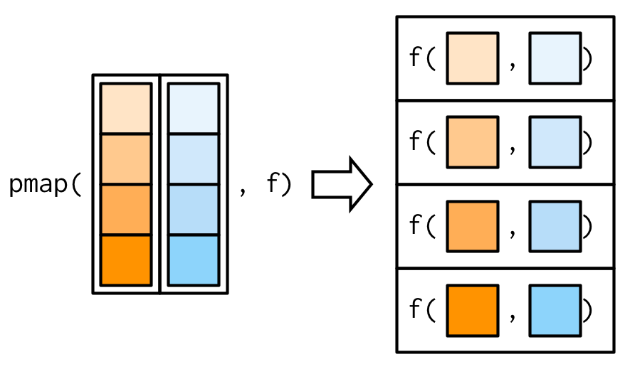

# 9 Functionals {#functionals}

## 9.1 Introduction
\index{functionals}

> To become significantly more reliable, code must become more transparent.
> In particular, nested conditions and loops must be viewed with great
> suspicion. Complicated control flows confuse programmers. Messy code often
> hides bugs.
>
> --- Bjarne Stroustrup

A __functional__ is a function that takes a function as an input and returns a vector as output. Here's a simple functional: it calls the function provided as input with 1000 random uniform numbers. 


```r
randomise <- function(f) f(runif(1e3))
randomise(mean)
```

```
## [1] 0.5044587
```

```r
randomise(mean)
```

```
## [1] 0.4953686
```

```r
randomise(sum)
```

```
## [1] 491.0261
```

The chances are that you've already used a functional. You might have used for-loop replacements like base R's `lapply()`, `apply()`, and `tapply()`; or purrr's `map()`; or maybe you've used a mathematical functional like `integrate()` or `optim()`. 

\index{loops!replacing}
A common use of functionals is as an alternative to for loops. For loops have a bad rap in R because many people believe they are slow[^not-slow], but the real downside of for loops is that they're very flexible: a loop conveys that you're iterating, but not what should be done with the results. Just as it's better to use `while` than `repeat`, and it's better to use `for` than `while` (Section \@ref(for-family)), it's better to use a functional than `for`. Each functional is tailored for a specific task, so when you recognise the functional you immediately know why it's being used.

[^not-slow]: Typically it's not the for loop itself that's slow, but what you're doing inside of it. A common culprit of slow loops is modifying a data structure, where each modification generates a copy. See Sections \@ref(single-binding) and \@ref(avoid-copies) for more details.

If you're an experienced for loop user, switching to functionals is typically a pattern matching exercise. You look at the for loop and find a functional that matches the basic form. If one doesn't exist, don't try and torture an existing functional to fit the form you need. Instead, just leave it as a for loop! (Or once you've repeated the same loop two or more times, maybe think about writing your own functional).

### Outline {-}

* Section \@ref(map) introduces your first functional: `purrr::map()`.

* Section \@ref(purrr-style) demonstrates how you can combine multiple simple
  functionals to solve a more complex problem and discusses how purrr style
  differs from other approaches.

* Section \@ref(map-variants) teaches you about 18 (!!) important variants of 
  `purrr::map()`. Fortunately, their orthogonal design makes them easy to 
  learn, remember, and master.

* Section \@ref(reduce) introduces a new style of functional: `purrr::reduce()`.
  `reduce()` systematically reduces a vector to a single result by applying
  a function that takes two inputs.

* Section \@ref(predicate-functionals) teaches you about predicates: functions
  that return a single `TRUE` or `FALSE`, and the family of functionals
  that use them to solve common problems.
  
* Section \@ref(base-functionals) reviews some functionals in base R that
  are not members of the map, reduce, or predicate families.

### Prerequisites {-}

This chapter will focus on functionals provided by the [purrr package](https://purrr.tidyverse.org) [@purrr]. These functions have a consistent interface that makes it easier to understand the key ideas than their base equivalents, which have grown organically over many years. I'll compare and contrast base R functions as we go, and then wrap up the chapter with a discussion of base functionals that don't have purrr equivalents.


```r
library(purrr)
```

## 9.2 My first functional: `map()` {#map}
\indexc{map()}

The most fundamental functional is `purrr::map()`[^Map]. It takes a vector and a function, calls the function once for each element of the vector, and returns the results in a list. In other words, `map(1:3, f)` is equivalent to `list(f(1), f(2), f(3))`. 


```r
triple <- function(x) x * 3
map(1:3, triple)
```

```
## [[1]]
## [1] 3
## 
## [[2]]
## [1] 6
## 
## [[3]]
## [1] 9
```

Or, graphically:


::: sidebar
You might wonder why this function is called `map()`. What does it have to do with depicting physical features of land or sea `emoji("world_map")`? In fact, the meaning comes from mathematics where _map_ refers to "an operation that associates each element of a given set with one or more elements of a second set". This makes sense here because `map()` defines a mapping from one vector to another. (_"Map"_ also has the nice property of being short, which is useful for such a fundamental building block.)
:::

[^Map]: Not to be confused with `base::Map()`, which is considerably more complex. I'll discuss `Map()` in Section \@ref(pmap).

The implementation of `map()` is quite simple. We allocate a list the same length as the input, and then fill in the list with a for loop. The heart of the implementation is only a handful of lines of code:


```r
simple_map <- function(x, f, ...) {
  out <- vector("list", length(x))
  for (i in seq_along(x)) {
    out[[i]] <- f(x[[i]], ...)
  }
  out
}
```

The real `purrr::map()` function has a few differences: it is written in C to eke out every last iota of performance, preserves names, and supports a few shortcuts that you'll learn about in Section \@ref(purrr-shortcuts).

::: base
\indexc{lapply()}
The base equivalent to `map()` is `lapply()`. The only difference is that `lapply()` does not support the helpers that you'll learn about below, so if you're only using `map()` from purrr, you can skip the additional dependency and use `lapply()` directly.
:::

### 9.2.1 Producing atomic vectors {#map-atomic}

`map()` returns a list, which makes it the most general of the map family because you can put anything in a list. But it is inconvenient to return a list when a simpler data structure would do, so there are four more specific variants: `map_lgl()`, `map_int()`, `map_dbl()`, and `map_chr()`. Each returns an atomic vector of the specified type:


```r
# map_chr() always returns a character vector
map_chr(mtcars, typeof)
```

```
##      mpg      cyl     disp       hp     drat       wt     qsec       vs 
## "double" "double" "double" "double" "double" "double" "double" "double" 
##       am     gear     carb 
## "double" "double" "double"
```

```r
# map_lgl() always returns a logical vector
map_lgl(mtcars, is.double)
```

```
##  mpg  cyl disp   hp drat   wt qsec   vs   am gear carb 
## TRUE TRUE TRUE TRUE TRUE TRUE TRUE TRUE TRUE TRUE TRUE
```

```r
# map_int() always returns a integer vector
n_unique <- function(x) length(unique(x))
map_int(mtcars, n_unique)
```

```
##  mpg  cyl disp   hp drat   wt qsec   vs   am gear carb 
##   25    3   27   22   22   29   30    2    2    3    6
```

```r
# map_dbl() always returns a double vector
map_dbl(mtcars, mean)
```

```
##        mpg        cyl       disp         hp       drat         wt       qsec 
##  20.090625   6.187500 230.721875 146.687500   3.596563   3.217250  17.848750 
##         vs         am       gear       carb 
##   0.437500   0.406250   3.687500   2.812500
```

purrr uses the convention that suffixes, like `_dbl()`, refer to the output. All `map_*()` functions can take any type of vector as input. These examples rely on two facts: `mtcars` is a data frame, and data frames are lists containing vectors of the same length. This is more obvious if we draw a data frame with the same orientation as vector:


All map functions always return an output vector the same length as the input, which implies that each call to `.f` must return a single value. If it does not, you'll get an error:


```r
pair <- function(x) c(x, x)
map_dbl(1:2, pair)
```

```
## Error in `map_dbl()`:
## ℹ In index: 1.
## Caused by error:
## ! Result must be length 1, not 2.
```

This is similar to the error you'll get if `.f` returns the wrong type of result:


```r
map_dbl(1:2, as.character)
```

```
## Error in `map_dbl()`:
## ℹ In index: 1.
## Caused by error:
## ! Can't coerce from a character vector to a double vector.
```

In either case, it's often useful to switch back to `map()`, because `map()` can accept any type of output. That allows you to see the problematic output, and figure out what to do with it.


```r
map(1:2, pair)
```

```
## [[1]]
## [1] 1 1
## 
## [[2]]
## [1] 2 2
```

```r
map(1:2, as.character)
```

```
## [[1]]
## [1] "1"
## 
## [[2]]
## [1] "2"
```

::: base
\indexc{sapply()}
\indexc{vapply()}

Base R has two apply functions that can return atomic vectors: `sapply()` and `vapply()`. I recommend that you avoid `sapply()` because it tries to simplify the result, so it can return a list, a vector, or a matrix. This makes it difficult to program with, and it should be avoided in non-interactive settings. `vapply()` is safer because it allows you to provide a template, `FUN.VALUE`, that describes the output shape. If you don't want to use purrr, I recommend you always use `vapply()` in your functions, not `sapply()`. The primary downside of `vapply()` is its verbosity: for example, the equivalent to `map_dbl(x, mean, na.rm = TRUE)` is `vapply(x, mean, na.rm = TRUE, FUN.VALUE = double(1))`.
:::

### 9.2.2 Anonymous functions and shortcuts {#purrr-shortcuts}
\index{functions!anonymous}
\indexc{\textasciitilde}

Instead of using `map()` with an existing function, you can create an inline anonymous function (as mentioned in Section \@ref(first-class-functions)):


```r
map_dbl(mtcars, function(x) length(unique(x)))
```

```
##  mpg  cyl disp   hp drat   wt qsec   vs   am gear carb 
##   25    3   27   22   22   29   30    2    2    3    6
```

Anonymous functions are very useful, but the syntax is verbose. So purrr supports a special shortcut:


```r
map_dbl(mtcars, ~ length(unique(.x)))
```

```
##  mpg  cyl disp   hp drat   wt qsec   vs   am gear carb 
##   25    3   27   22   22   29   30    2    2    3    6
```

This works because all purrr functions translate formulas, created by `~` (pronounced "twiddle"), into functions. You can see what's happening behind the scenes by calling `as_mapper()`:


```r
as_mapper(~ length(unique(.x)))
```

```
## <lambda>
## function (..., .x = ..1, .y = ..2, . = ..1) 
## length(unique(.x))
## attr(,"class")
## [1] "rlang_lambda_function" "function"
```

The function arguments look a little quirky but allow you to refer to `.` for one argument functions, `.x` and `.y` for two argument functions, and `..1`, `..2`, `..3`, etc, for functions with an arbitrary number of arguments. `.` remains for backward compatibility but I don't recommend using it because it's easily confused with the `.` used by magrittr's pipe.

This shortcut is particularly useful for generating random data:


```r
x <- map(1:3, ~ runif(2))
str(x)
```

```
## List of 3
##  $ : num [1:2] 0.863 0.431
##  $ : num [1:2] 0.451 0.349
##  $ : num [1:2] 0.349 0.254
```

Reserve this syntax for short and simple functions. A good rule of thumb is that if your function spans lines or uses `{}`, it's time to give it a name.

\indexc{pluck()}

The map functions also have shortcuts for extracting elements from a vector, powered by  `purrr::pluck()`. You can use a character vector to select elements by name, an integer vector to select by position, or a list to select by both name and position. These are very useful for working with deeply nested lists, which often arise when working with JSON. 


```r
x <- list(
  list(-1, x = 1, y = c(2), z = "a"),
  list(-2, x = 4, y = c(5, 6), z = "b"),
  list(-3, x = 8, y = c(9, 10, 11))
)

# Select by name
map_dbl(x, "x")
```

```
## [1] 1 4 8
```

```r
# Or by position
map_dbl(x, 1)
```

```
## [1] -1 -2 -3
```

```r
# Or by both
map_dbl(x, list("y", 1))
```

```
## [1] 2 5 9
```

```r
# You'll get an error if a component doesn't exist:
map_chr(x, "z")
```

```
## Error in `map_chr()`:
## ℹ In index: 3.
## Caused by error:
## ! Result must be length 1, not 0.
```

```r
# Unless you supply a .default value
map_chr(x, "z", .default = NA)
```

```
## [1] "a" "b" NA
```

::: base
In base R functions, like `lapply()`, you can provide the name of the function as a string. This isn't tremendously useful as `lapply(x, "f")` is almost always equivalent to `lapply(x, f)` and is more typing.
:::

### 9.2.3 Passing arguments with `...` {#passing-arguments}
\indexc{...}
\index{vectorisation}

It's often convenient to pass along additional arguments to the function that you're calling. For example, you might want to pass `na.rm = TRUE` along to `mean()`. One way to do that is with an anonymous function:


```r
x <- list(1:5, c(1:10, NA))
map_dbl(x, ~ mean(.x, na.rm = TRUE))
```

```
## [1] 3.0 5.5
```

But because the map functions pass `...` along, there's a simpler form available:


```r
map_dbl(x, mean, na.rm = TRUE)
```

```
## [1] 3.0 5.5
```

This is easiest to understand with a picture: any arguments that come after `f` in the call to `map()` are inserted _after_ the data in individual calls to `f()`:



It's important to note that these arguments are not decomposed; or said another way, `map()` is only vectorised over its first argument. If an argument after `f` is a vector, it will be passed along as is:


(You'll learn about map variants that _are_ vectorised over multiple arguments in Sections \@ref(map2) and \@ref(pmap).)

Note there's a subtle difference between placing extra arguments inside an anonymous function compared with passing them to `map()`. Putting them in an anonymous function means that they will be evaluated every time `f()` is executed, not just once when you call `map()`. This is easiest to see if we make the additional argument random:


```r
plus <- function(x, y) x + y

x <- c(0, 0, 0, 0)
map_dbl(x, plus, runif(1))
```

```
## [1] 0.9951101 0.9951101 0.9951101 0.9951101
```

```r
map_dbl(x, ~ plus(.x, runif(1)))
```

```
## [1] 0.6644926 0.4995296 0.3980880 0.3352313
```

### 9.2.4 Argument names

In the diagrams, I've omitted argument names to focus on the overall structure. But I recommend writing out the full names in your code, as it makes it easier to read. `map(x, mean, 0.1)` is perfectly valid code, but will call `mean(x[[1]], 0.1)` so it relies on the reader remembering that the second argument to `mean()` is `trim`.  To avoid unnecessary burden on the brain of the reader[^future-you], be kind and write `map(x, mean, trim = 0.1)`.

[^future-you]: Who is highly likely to be future you!

This is the reason why the arguments to `map()` are a little odd: instead of being `x` and `f`, they are `.x` and `.f`. It's easiest to see the problem that leads to these names using `simple_map()` defined above. `simple_map()` has arguments `x` and `f` so you'll have problems whenever the function you are calling has arguments `x` or `f`:


```r
boostrap_summary <- function(x, f) {
  f(sample(x, replace = TRUE))
}

simple_map(mtcars, boostrap_summary, f = mean)
```

```
## Error in mean.default(x[[i]], ...): 'trim' must be numeric of length one
```

<!-- GVW: a diagram here showing how the various f's and x's are matched to one another in the example above would be very helpful -->

The error is a little bewildering until you remember that the call to `simple_map()` is equivalent to `simple_map(x = mtcars, f = mean, bootstrap_summary)` because named matching beats positional matching. 

purrr functions reduce the likelihood of such a clash by using `.f` and `.x` instead of the more common `f` and `x`. Of course this technique isn't perfect (because the function you are calling might still use `.f` and `.x`), but it avoids 99% of issues. The remaining 1% of the time, use an anonymous function.

::: base
Base functions that pass along `...` use a variety of naming conventions to prevent undesired argument matching:

* The apply family mostly uses capital letters (e.g. `X` and `FUN`). 

* `transform()` uses the more exotic prefix `_`: this makes the name non-syntactic 
  so it must always be surrounded in `` ` ``, as described in 
  Section \@ref(non-syntactic). This makes undesired matches extremely 
  unlikely.
  
* Other functionals like `uniroot()` and `optim()` make no effort to avoid 
  clashes but they tend to be used with specially created functions so
  clashes are less likely.
:::

### 9.2.5 Varying another argument {#change-argument}

So far the first argument to `map()` has always become the first argument to the function. But what happens if the first argument should be constant, and you want to vary a different argument? How do you get the result in this picture?



It turns out that there's no way to do it directly, but there are two tricks you can use instead. To illustrate them, imagine I have a vector that contains a few unusual values, and I want to explore the effect of different amounts of trimming when computing the mean. In this case, the first argument to `mean()` will be constant, and I want to vary the second argument, `trim`.


```r
trims <- c(0, 0.1, 0.2, 0.5)
x <- rcauchy(1000)
```

*   The simplest technique is to use an anonymous function to rearrange the 
    argument order:

    
    ```r
    map_dbl(trims, ~ mean(x, trim = .x))
    ```
    
    ```
    ## [1] -4.39534825 -0.10476367 -0.10313699 -0.08889105
    ```
    
    This is still a little confusing because I'm using both `x` and `.x`.
    You can make it a little clearer by abandoning the `~` helper:
    
    
    ```r
    map_dbl(trims, function(trim) mean(x, trim = trim))
    ```
    
    ```
    ## [1] -4.39534825 -0.10476367 -0.10313699 -0.08889105
    ```

*   Sometimes, if you want to be (too) clever, you can take advantage of R's 
    flexible argument matching rules (as described in Section 
    \@ref(prefix-form)). For example, in this example you can rewrite 
    `mean(x, trim = 0.1)` as `mean(0.1, x = x)`, so you could write the 
    call to `map_dbl()` as:

    
    ```r
    map_dbl(trims, mean, x = x)
    ```
    
    ```
    ## [1] -4.39534825 -0.10476367 -0.10313699 -0.08889105
    ```
    
    I don't recommend this technique as it relies on the reader's familiarity with both the argument order to `.f`, and R's 
    argument matching rules.

You'll see one more alternative in Section \@ref(pmap).

### 9.2.6 Exercises

1.  Use `as_mapper()` to explore how purrr generates anonymous functions for
    the integer, character, and list helpers. What helper allows you to 
    extract attributes? Read the documentation to find out.

> as_mapper is the powerhouse behind the varied function specifications that most purrr functions allow. It is an S3 generic. The default method forwards its arguments to rlang::as_function().

> Usage
    

```r
as_mapper(.f, ...)

# S3 method for character
as_mapper(.f, ..., .null, .default = NULL)

# S3 method for numeric
as_mapper(.f, ..., .null, .default = NULL)

# S3 method for list
as_mapper(.f, ..., .null, .default = NULL)
```
.f
A function, formula, or vector (not necessarily atomic).

If a function, it is used as is.

If a formula, e.g. ~ .x + 2, it is converted to a function. There are three ways to refer to the arguments:

For a single argument function, use .

For a two argument function, use .x and .y

For more arguments, use ..1, ..2, ..3 etc

This syntax allows you to create very compact anonymous functions. Note that formula functions conceptually take dots (that's why you can use ..1 etc). They silently ignore additional arguments that are not used in the formula expression.

If character vector, numeric vector, or list, it is converted to an extractor function. Character vectors index by name and numeric vectors index by position; use a list to index by position and name at different levels. If a component is not present, the value of .default will be returned.


```r
as_mapper(1)
```

```
## function (x, ...) 
## pluck_raw(x, list(1), .default = NULL)
## <environment: 0x000001aa927a9f18>
```

> equivalent to function(x) x[[1]]


```r
as_mapper(c("a", "b", "c"))
```

```
## function (x, ...) 
## pluck_raw(x, list("a", "b", "c"), .default = NULL)
## <environment: 0x000001aa8d7691a8>
```

> equivalent to function(x) x[["a"]][["b"]][["c"]]


```r
as_mapper(list(1, "a", 2))
```

```
## function (x, ...) 
## pluck_raw(x, list(1, "a", 2), .default = NULL)
## <environment: 0x000001aa8cd1da08>
```

> equivalent to function(x) x[[1]][["a"]][[2]]


```r
as_mapper(list(1, attr_getter("a")))
```

```
## function (x, ...) 
## pluck_raw(x, list(1, function (x) 
## attr(x, attr, exact = TRUE)), .default = NULL)
## <environment: 0x000001aa8c72cb80>
```

> equivalent to function(x) attr(x[[1]], "a")

> attr_getter() generates an attribute accessor function; i.e., it generates a function for extracting an attribute with a given name. Unlike the base R attr() function with default options, it doesn't use partial matching.

2.  `map(1:3, ~ runif(2))` is a useful pattern for generating random
    numbers, but `map(1:3, runif(2))` is not. Why not? Can you explain why 
    it returns the result that it does?
    

```r
map(1:3, ~ runif(2))
```

```
## [[1]]
## [1] 0.4253421 0.4325306
## 
## [[2]]
## [1] 0.4560090 0.5127342
## 
## [[3]]
## [1] 0.1470554 0.3439617
```

> This creates three different pairs of random numbers because `~ runif(2)` is converted into an anonymous function. 


```r
as_mapper(~ runif(2))
```

```
## <lambda>
## function (..., .x = ..1, .y = ..2, . = ..1) 
## runif(2)
## attr(,"class")
## [1] "rlang_lambda_function" "function"
```


```r
as_mapper(1:3, runif(2))
```

```
## function (x, ...) 
## pluck_raw(x, list(1L, 2L, 3L), .default = NULL)
## <environment: 0x000001aa8e6b2910>
```


```r
?purrr::pluck()
```

```
## starting httpd help server ... done
```


```r
map(1:3, 0.22)
```

```
## [[1]]
## [1] 1
## 
## [[2]]
## [1] 2
## 
## [[3]]
## [1] 3
```


```r
map(1:3, runif(2))
```

```
## [[1]]
## [1] 1
## 
## [[2]]
## [1] 2
## 
## [[3]]
## [1] 3
```

> This doesn't work because `runif(2)` is only evaluated once.


```r
as_mapper(runif(2))
```

```
## function (x, ...) 
## pluck_raw(x, list(0.665345342829823, 0.847153527662158), .default = NULL)
## <environment: 0x000001aa911afaf8>
```

> This leads to three `NULL`s because these indexes cannot be found.

3.  Use the appropriate `map()` function to:

    a) Compute the standard deviation of every column in a numeric data frame.

> I will use the example in the book. mtcars


```r
mtcars
```

```
##                      mpg cyl  disp  hp drat    wt  qsec vs am gear carb
## Mazda RX4           21.0   6 160.0 110 3.90 2.620 16.46  0  1    4    4
## Mazda RX4 Wag       21.0   6 160.0 110 3.90 2.875 17.02  0  1    4    4
## Datsun 710          22.8   4 108.0  93 3.85 2.320 18.61  1  1    4    1
## Hornet 4 Drive      21.4   6 258.0 110 3.08 3.215 19.44  1  0    3    1
## Hornet Sportabout   18.7   8 360.0 175 3.15 3.440 17.02  0  0    3    2
## Valiant             18.1   6 225.0 105 2.76 3.460 20.22  1  0    3    1
## Duster 360          14.3   8 360.0 245 3.21 3.570 15.84  0  0    3    4
## Merc 240D           24.4   4 146.7  62 3.69 3.190 20.00  1  0    4    2
## Merc 230            22.8   4 140.8  95 3.92 3.150 22.90  1  0    4    2
## Merc 280            19.2   6 167.6 123 3.92 3.440 18.30  1  0    4    4
## Merc 280C           17.8   6 167.6 123 3.92 3.440 18.90  1  0    4    4
## Merc 450SE          16.4   8 275.8 180 3.07 4.070 17.40  0  0    3    3
## Merc 450SL          17.3   8 275.8 180 3.07 3.730 17.60  0  0    3    3
## Merc 450SLC         15.2   8 275.8 180 3.07 3.780 18.00  0  0    3    3
## Cadillac Fleetwood  10.4   8 472.0 205 2.93 5.250 17.98  0  0    3    4
## Lincoln Continental 10.4   8 460.0 215 3.00 5.424 17.82  0  0    3    4
## Chrysler Imperial   14.7   8 440.0 230 3.23 5.345 17.42  0  0    3    4
## Fiat 128            32.4   4  78.7  66 4.08 2.200 19.47  1  1    4    1
## Honda Civic         30.4   4  75.7  52 4.93 1.615 18.52  1  1    4    2
## Toyota Corolla      33.9   4  71.1  65 4.22 1.835 19.90  1  1    4    1
## Toyota Corona       21.5   4 120.1  97 3.70 2.465 20.01  1  0    3    1
## Dodge Challenger    15.5   8 318.0 150 2.76 3.520 16.87  0  0    3    2
## AMC Javelin         15.2   8 304.0 150 3.15 3.435 17.30  0  0    3    2
## Camaro Z28          13.3   8 350.0 245 3.73 3.840 15.41  0  0    3    4
## Pontiac Firebird    19.2   8 400.0 175 3.08 3.845 17.05  0  0    3    2
## Fiat X1-9           27.3   4  79.0  66 4.08 1.935 18.90  1  1    4    1
## Porsche 914-2       26.0   4 120.3  91 4.43 2.140 16.70  0  1    5    2
## Lotus Europa        30.4   4  95.1 113 3.77 1.513 16.90  1  1    5    2
## Ford Pantera L      15.8   8 351.0 264 4.22 3.170 14.50  0  1    5    4
## Ferrari Dino        19.7   6 145.0 175 3.62 2.770 15.50  0  1    5    6
## Maserati Bora       15.0   8 301.0 335 3.54 3.570 14.60  0  1    5    8
## Volvo 142E          21.4   4 121.0 109 4.11 2.780 18.60  1  1    4    2
```

```r
str(mtcars)
```

```
## 'data.frame':	32 obs. of  11 variables:
##  $ mpg : num  21 21 22.8 21.4 18.7 18.1 14.3 24.4 22.8 19.2 ...
##  $ cyl : num  6 6 4 6 8 6 8 4 4 6 ...
##  $ disp: num  160 160 108 258 360 ...
##  $ hp  : num  110 110 93 110 175 105 245 62 95 123 ...
##  $ drat: num  3.9 3.9 3.85 3.08 3.15 2.76 3.21 3.69 3.92 3.92 ...
##  $ wt  : num  2.62 2.88 2.32 3.21 3.44 ...
##  $ qsec: num  16.5 17 18.6 19.4 17 ...
##  $ vs  : num  0 0 1 1 0 1 0 1 1 1 ...
##  $ am  : num  1 1 1 0 0 0 0 0 0 0 ...
##  $ gear: num  4 4 4 3 3 3 3 4 4 4 ...
##  $ carb: num  4 4 1 1 2 1 4 2 2 4 ...
```


```r
map_dbl(mtcars, sd, na.rm = TRUE)
```

```
##         mpg         cyl        disp          hp        drat          wt 
##   6.0269481   1.7859216 123.9386938  68.5628685   0.5346787   0.9784574 
##        qsec          vs          am        gear        carb 
##   1.7869432   0.5040161   0.4989909   0.7378041   1.6152000
```

    b) Compute the standard deviation of every numeric column in a mixed data frame. (Hint: you'll need to do it in two steps.)
    
> Carbon Dioxide Uptake in Grass Plants

Description
The CO2 data frame has 84 rows and 5 columns of data from an experiment on the cold tolerance of the grass species Echinochloa crus-galli.


```r
# library(help = "datasets")
CO2
```

```
##    Plant        Type  Treatment conc uptake
## 1    Qn1      Quebec nonchilled   95   16.0
## 2    Qn1      Quebec nonchilled  175   30.4
## 3    Qn1      Quebec nonchilled  250   34.8
## 4    Qn1      Quebec nonchilled  350   37.2
## 5    Qn1      Quebec nonchilled  500   35.3
## 6    Qn1      Quebec nonchilled  675   39.2
## 7    Qn1      Quebec nonchilled 1000   39.7
## 8    Qn2      Quebec nonchilled   95   13.6
## 9    Qn2      Quebec nonchilled  175   27.3
## 10   Qn2      Quebec nonchilled  250   37.1
## 11   Qn2      Quebec nonchilled  350   41.8
## 12   Qn2      Quebec nonchilled  500   40.6
## 13   Qn2      Quebec nonchilled  675   41.4
## 14   Qn2      Quebec nonchilled 1000   44.3
## 15   Qn3      Quebec nonchilled   95   16.2
## 16   Qn3      Quebec nonchilled  175   32.4
## 17   Qn3      Quebec nonchilled  250   40.3
## 18   Qn3      Quebec nonchilled  350   42.1
## 19   Qn3      Quebec nonchilled  500   42.9
## 20   Qn3      Quebec nonchilled  675   43.9
## 21   Qn3      Quebec nonchilled 1000   45.5
## 22   Qc1      Quebec    chilled   95   14.2
## 23   Qc1      Quebec    chilled  175   24.1
## 24   Qc1      Quebec    chilled  250   30.3
## 25   Qc1      Quebec    chilled  350   34.6
## 26   Qc1      Quebec    chilled  500   32.5
## 27   Qc1      Quebec    chilled  675   35.4
## 28   Qc1      Quebec    chilled 1000   38.7
## 29   Qc2      Quebec    chilled   95    9.3
## 30   Qc2      Quebec    chilled  175   27.3
## 31   Qc2      Quebec    chilled  250   35.0
## 32   Qc2      Quebec    chilled  350   38.8
## 33   Qc2      Quebec    chilled  500   38.6
## 34   Qc2      Quebec    chilled  675   37.5
## 35   Qc2      Quebec    chilled 1000   42.4
## 36   Qc3      Quebec    chilled   95   15.1
## 37   Qc3      Quebec    chilled  175   21.0
## 38   Qc3      Quebec    chilled  250   38.1
## 39   Qc3      Quebec    chilled  350   34.0
## 40   Qc3      Quebec    chilled  500   38.9
## 41   Qc3      Quebec    chilled  675   39.6
## 42   Qc3      Quebec    chilled 1000   41.4
## 43   Mn1 Mississippi nonchilled   95   10.6
## 44   Mn1 Mississippi nonchilled  175   19.2
## 45   Mn1 Mississippi nonchilled  250   26.2
## 46   Mn1 Mississippi nonchilled  350   30.0
## 47   Mn1 Mississippi nonchilled  500   30.9
## 48   Mn1 Mississippi nonchilled  675   32.4
## 49   Mn1 Mississippi nonchilled 1000   35.5
## 50   Mn2 Mississippi nonchilled   95   12.0
## 51   Mn2 Mississippi nonchilled  175   22.0
## 52   Mn2 Mississippi nonchilled  250   30.6
## 53   Mn2 Mississippi nonchilled  350   31.8
## 54   Mn2 Mississippi nonchilled  500   32.4
## 55   Mn2 Mississippi nonchilled  675   31.1
## 56   Mn2 Mississippi nonchilled 1000   31.5
## 57   Mn3 Mississippi nonchilled   95   11.3
## 58   Mn3 Mississippi nonchilled  175   19.4
## 59   Mn3 Mississippi nonchilled  250   25.8
## 60   Mn3 Mississippi nonchilled  350   27.9
## 61   Mn3 Mississippi nonchilled  500   28.5
## 62   Mn3 Mississippi nonchilled  675   28.1
## 63   Mn3 Mississippi nonchilled 1000   27.8
## 64   Mc1 Mississippi    chilled   95   10.5
## 65   Mc1 Mississippi    chilled  175   14.9
## 66   Mc1 Mississippi    chilled  250   18.1
## 67   Mc1 Mississippi    chilled  350   18.9
## 68   Mc1 Mississippi    chilled  500   19.5
## 69   Mc1 Mississippi    chilled  675   22.2
## 70   Mc1 Mississippi    chilled 1000   21.9
## 71   Mc2 Mississippi    chilled   95    7.7
## 72   Mc2 Mississippi    chilled  175   11.4
## 73   Mc2 Mississippi    chilled  250   12.3
## 74   Mc2 Mississippi    chilled  350   13.0
## 75   Mc2 Mississippi    chilled  500   12.5
## 76   Mc2 Mississippi    chilled  675   13.7
## 77   Mc2 Mississippi    chilled 1000   14.4
## 78   Mc3 Mississippi    chilled   95   10.6
## 79   Mc3 Mississippi    chilled  175   18.0
## 80   Mc3 Mississippi    chilled  250   17.9
## 81   Mc3 Mississippi    chilled  350   17.9
## 82   Mc3 Mississippi    chilled  500   17.9
## 83   Mc3 Mississippi    chilled  675   18.9
## 84   Mc3 Mississippi    chilled 1000   19.9
```

```r
str(CO2)
```

```
## Classes 'nfnGroupedData', 'nfGroupedData', 'groupedData' and 'data.frame':	84 obs. of  5 variables:
##  $ Plant    : Ord.factor w/ 12 levels "Qn1"<"Qn2"<"Qn3"<..: 1 1 1 1 1 1 1 2 2 2 ...
##  $ Type     : Factor w/ 2 levels "Quebec","Mississippi": 1 1 1 1 1 1 1 1 1 1 ...
##  $ Treatment: Factor w/ 2 levels "nonchilled","chilled": 1 1 1 1 1 1 1 1 1 1 ...
##  $ conc     : num  95 175 250 350 500 675 1000 95 175 250 ...
##  $ uptake   : num  16 30.4 34.8 37.2 35.3 39.2 39.7 13.6 27.3 37.1 ...
##  - attr(*, "formula")=Class 'formula'  language uptake ~ conc | Plant
##   .. ..- attr(*, ".Environment")=<environment: R_EmptyEnv> 
##  - attr(*, "outer")=Class 'formula'  language ~Treatment * Type
##   .. ..- attr(*, ".Environment")=<environment: R_EmptyEnv> 
##  - attr(*, "labels")=List of 2
##   ..$ x: chr "Ambient carbon dioxide concentration"
##   ..$ y: chr "CO2 uptake rate"
##  - attr(*, "units")=List of 2
##   ..$ x: chr "(uL/L)"
##   ..$ y: chr "(umol/m^2 s)"
```


```r
CO2_numeric <- map_lgl(CO2, is.numeric)
CO2_numeric
```

```
##     Plant      Type Treatment      conc    uptake 
##     FALSE     FALSE     FALSE      TRUE      TRUE
```


```r
map_dbl(CO2[CO2_numeric], sd, na.rm = TRUE)
```

```
##      conc    uptake 
## 295.92412  10.81441
```

    c) Compute the number of levels for every factor in a data frame.


```r
CO2_factor <- map_lgl(CO2, is.factor)
CO2_factor
```

```
##     Plant      Type Treatment      conc    uptake 
##      TRUE      TRUE      TRUE     FALSE     FALSE
```


```r
map_int(CO2[CO2_factor], ~ length(unique(.x)))
```

```
##     Plant      Type Treatment 
##        12         2         2
```

4.  The following code simulates the performance of a t-test for non-normal 
    data. Extract the p-value from each test, then visualise.

> The Poisson Distribution

Description
Density, distribution function, quantile function and random generation for the Poisson distribution with parameter lambda.


```r
trials <- map(1:100, ~ t.test(rpois(10, 10), rpois(7, 10)))
```


```r
library(ggplot2)
```


```r
trials_p_value <- data.frame(p_value = map_dbl(trials, "p.value"))
trials_p_value
```

```
##         p_value
## 1   0.582301434
## 2   0.457757452
## 3   0.436629751
## 4   0.391341537
## 5   0.578017479
## 6   0.865918546
## 7   0.453636271
## 8   0.119170474
## 9   0.760498323
## 10  0.846683185
## 11  0.655777330
## 12  0.402480879
## 13  0.710011188
## 14  0.590937114
## 15  0.668531558
## 16  0.078900008
## 17  0.328027409
## 18  0.404951817
## 19  0.606744776
## 20  0.487325460
## 21  0.771691295
## 22  0.977674752
## 23  0.777835580
## 24  0.637908361
## 25  0.722607652
## 26  0.546755561
## 27  0.057399219
## 28  0.501182760
## 29  0.445461660
## 30  0.223358650
## 31  0.992570455
## 32  0.802258183
## 33  0.544135939
## 34  0.140847668
## 35  0.156769677
## 36  0.350905723
## 37  0.691275411
## 38  0.966795768
## 39  0.336960147
## 40  0.439215884
## 41  0.865059490
## 42  0.144904784
## 43  0.166131844
## 44  0.680984077
## 45  0.427068815
## 46  0.789796736
## 47  0.021321142
## 48  0.956635419
## 49  0.929147608
## 50  0.893540991
## 51  0.886493912
## 52  0.160924455
## 53  0.517587820
## 54  0.747150006
## 55  0.339364709
## 56  0.025295285
## 57  0.134721981
## 58  0.994508630
## 59  0.966108433
## 60  0.486708744
## 61  0.677978099
## 62  0.023326834
## 63  0.424070008
## 64  0.521813137
## 65  0.208702239
## 66  0.562011326
## 67  0.470297915
## 68  0.830377103
## 69  0.362712253
## 70  0.861842366
## 71  0.177311870
## 72  0.269698920
## 73  0.653421400
## 74  0.952355047
## 75  0.020117555
## 76  0.891795700
## 77  0.916753878
## 78  0.501675977
## 79  0.924099898
## 80  0.585385379
## 81  0.374632675
## 82  0.952716251
## 83  0.093300589
## 84  0.894411195
## 85  0.954869723
## 86  0.934968616
## 87  0.275160853
## 88  0.197429987
## 89  0.874627459
## 90  0.097438721
## 91  0.877047439
## 92  0.100755750
## 93  0.059103335
## 94  0.443307342
## 95  0.411438627
## 96  0.003382853
## 97  0.707253324
## 98  0.560864552
## 99  0.712707861
## 100 0.760378492
```

```r
str(trials_p_value)
```

```
## 'data.frame':	100 obs. of  1 variable:
##  $ p_value: num  0.582 0.458 0.437 0.391 0.578 ...
```


```r
trials_p_value %>% 
  ggplot(aes(x = p_value, fill = p_value < 0.05))+
  geom_histogram(binwidth = 0.01)
```

<!-- -->


5.  The following code uses a map nested inside another map to apply a
    function to every element of a nested list. Why does it fail, and 
    what do you need to do to make it work?

    
    ```r
    x <- list(
      list(1, c(3, 9)),
      list(c(3, 6), 7, c(4, 7, 6))
    )
    
    triple <- function(x) x * 3
    map(x, map, .f = triple)
    ```
    
    ```
    ## Error in `map()`:
    ## ℹ In index: 1.
    ## Caused by error in `.f()`:
    ## ! unused argument (function (.x, .f, ..., .progress = FALSE) 
    ## {
    ##     map_("list", .x, .f, ..., .progress = .progress)
    ## })
    ```

> This call fails because `.f = triple`is used as the .f argument for the outer `map()`. Therefore, the inner `map()` is used as an argument of `triple()`.


```r
map(x, map, triple)
```

```
## [[1]]
## [[1]][[1]]
## [1] 3
## 
## [[1]][[2]]
## [1]  9 27
## 
## 
## [[2]]
## [[2]][[1]]
## [1]  9 18
## 
## [[2]][[2]]
## [1] 21
## 
## [[2]][[3]]
## [1] 12 21 18
```


```r
map(x, ~ map(.x, triple))
```

```
## [[1]]
## [[1]][[1]]
## [1] 3
## 
## [[1]][[2]]
## [1]  9 27
## 
## 
## [[2]]
## [[2]][[1]]
## [1]  9 18
## 
## [[2]][[2]]
## [1] 21
## 
## [[2]][[3]]
## [1] 12 21 18
```

6.  Use `map()` to fit linear models to the `mtcars` dataset using the formulas stored in this list:


```r
    formulas <- list(
      mpg ~ disp,
      mpg ~ I(1 / disp),
      mpg ~ disp + wt,
      mpg ~ I(1 / disp) + wt
    )
```


```r
str(mtcars)
```

```
## 'data.frame':	32 obs. of  11 variables:
##  $ mpg : num  21 21 22.8 21.4 18.7 18.1 14.3 24.4 22.8 19.2 ...
##  $ cyl : num  6 6 4 6 8 6 8 4 4 6 ...
##  $ disp: num  160 160 108 258 360 ...
##  $ hp  : num  110 110 93 110 175 105 245 62 95 123 ...
##  $ drat: num  3.9 3.9 3.85 3.08 3.15 2.76 3.21 3.69 3.92 3.92 ...
##  $ wt  : num  2.62 2.88 2.32 3.21 3.44 ...
##  $ qsec: num  16.5 17 18.6 19.4 17 ...
##  $ vs  : num  0 0 1 1 0 1 0 1 1 1 ...
##  $ am  : num  1 1 1 0 0 0 0 0 0 0 ...
##  $ gear: num  4 4 4 3 3 3 3 4 4 4 ...
##  $ carb: num  4 4 1 1 2 1 4 2 2 4 ...
```


```r
models <- map(formulas, lm, data = mtcars)
models
```

```
## [[1]]
## 
## Call:
## .f(formula = .x[[i]], data = ..1)
## 
## Coefficients:
## (Intercept)         disp  
##    29.59985     -0.04122  
## 
## 
## [[2]]
## 
## Call:
## .f(formula = .x[[i]], data = ..1)
## 
## Coefficients:
## (Intercept)    I(1/disp)  
##       10.75      1557.67  
## 
## 
## [[3]]
## 
## Call:
## .f(formula = .x[[i]], data = ..1)
## 
## Coefficients:
## (Intercept)         disp           wt  
##    34.96055     -0.01772     -3.35083  
## 
## 
## [[4]]
## 
## Call:
## .f(formula = .x[[i]], data = ..1)
## 
## Coefficients:
## (Intercept)    I(1/disp)           wt  
##      19.024     1142.560       -1.798
```


7.  Fit the model `mpg ~ disp` to each of the bootstrap replicates of `mtcars` in the list below, then extract the $R^2$ of the model fit (Hint: you can compute the $R^2$ with `summary()`.)


```r
bootstrap <- function(df) {
  df[sample(nrow(df), replace = TRUE), , drop = FALSE]
}

bootstraps <- map(1:10, ~ bootstrap(mtcars))
summary(bootstraps)
```

```
##       Length Class      Mode
##  [1,] 11     data.frame list
##  [2,] 11     data.frame list
##  [3,] 11     data.frame list
##  [4,] 11     data.frame list
##  [5,] 11     data.frame list
##  [6,] 11     data.frame list
##  [7,] 11     data.frame list
##  [8,] 11     data.frame list
##  [9,] 11     data.frame list
## [10,] 11     data.frame list
```


```r
bootstraps_models <- map(bootstraps, ~ lm(mpg ~ disp, data = .x)) 
summary(bootstraps_models)
```

```
##       Length Class Mode
##  [1,] 12     lm    list
##  [2,] 12     lm    list
##  [3,] 12     lm    list
##  [4,] 12     lm    list
##  [5,] 12     lm    list
##  [6,] 12     lm    list
##  [7,] 12     lm    list
##  [8,] 12     lm    list
##  [9,] 12     lm    list
## [10,] 12     lm    list
```


```r
map(bootstraps_models, summary) %>% str()
```

```
## List of 10
##  $ :List of 11
##   ..$ call         : language lm(formula = mpg ~ disp, data = .x)
##   ..$ terms        :Classes 'terms', 'formula'  language mpg ~ disp
##   .. .. ..- attr(*, "variables")= language list(mpg, disp)
##   .. .. ..- attr(*, "factors")= int [1:2, 1] 0 1
##   .. .. .. ..- attr(*, "dimnames")=List of 2
##   .. .. .. .. ..$ : chr [1:2] "mpg" "disp"
##   .. .. .. .. ..$ : chr "disp"
##   .. .. ..- attr(*, "term.labels")= chr "disp"
##   .. .. ..- attr(*, "order")= int 1
##   .. .. ..- attr(*, "intercept")= int 1
##   .. .. ..- attr(*, "response")= int 1
##   .. .. ..- attr(*, ".Environment")=<environment: 0x000001aa95ce8af8> 
##   .. .. ..- attr(*, "predvars")= language list(mpg, disp)
##   .. .. ..- attr(*, "dataClasses")= Named chr [1:2] "numeric" "numeric"
##   .. .. .. ..- attr(*, "names")= chr [1:2] "mpg" "disp"
##   ..$ residuals    : Named num [1:32] -1.46 4.63 -2.43 -2.93 -4.49 ...
##   .. ..- attr(*, "names")= chr [1:32] "Datsun 710" "Pontiac Firebird" "Volvo 142E" "Camaro Z28" ...
##   ..$ coefficients : num [1:2, 1:4] 27.84881 -0.0332 1.33951 0.00485 20.79033 ...
##   .. ..- attr(*, "dimnames")=List of 2
##   .. .. ..$ : chr [1:2] "(Intercept)" "disp"
##   .. .. ..$ : chr [1:4] "Estimate" "Std. Error" "t value" "Pr(>|t|)"
##   ..$ aliased      : Named logi [1:2] FALSE FALSE
##   .. ..- attr(*, "names")= chr [1:2] "(Intercept)" "disp"
##   ..$ sigma        : num 3.44
##   ..$ df           : int [1:3] 2 30 2
##   ..$ r.squared    : num 0.61
##   ..$ adj.r.squared: num 0.597
##   ..$ fstatistic   : Named num [1:3] 46.8 1 30
##   .. ..- attr(*, "names")= chr [1:3] "value" "numdf" "dendf"
##   ..$ cov.unscaled : num [1:2, 1:2] 1.52e-01 -4.90e-04 -4.90e-04 1.99e-06
##   .. ..- attr(*, "dimnames")=List of 2
##   .. .. ..$ : chr [1:2] "(Intercept)" "disp"
##   .. .. ..$ : chr [1:2] "(Intercept)" "disp"
##   ..- attr(*, "class")= chr "summary.lm"
##  $ :List of 11
##   ..$ call         : language lm(formula = mpg ~ disp, data = .x)
##   ..$ terms        :Classes 'terms', 'formula'  language mpg ~ disp
##   .. .. ..- attr(*, "variables")= language list(mpg, disp)
##   .. .. ..- attr(*, "factors")= int [1:2, 1] 0 1
##   .. .. .. ..- attr(*, "dimnames")=List of 2
##   .. .. .. .. ..$ : chr [1:2] "mpg" "disp"
##   .. .. .. .. ..$ : chr "disp"
##   .. .. ..- attr(*, "term.labels")= chr "disp"
##   .. .. ..- attr(*, "order")= int 1
##   .. .. ..- attr(*, "intercept")= int 1
##   .. .. ..- attr(*, "response")= int 1
##   .. .. ..- attr(*, ".Environment")=<environment: 0x000001aa95d0ebc8> 
##   .. .. ..- attr(*, "predvars")= language list(mpg, disp)
##   .. .. ..- attr(*, "dataClasses")= Named chr [1:2] "numeric" "numeric"
##   .. .. .. ..- attr(*, "names")= chr [1:2] "mpg" "disp"
##   ..$ residuals    : Named num [1:32] -1.59 0.77 -3.8 -2.51 6.66 ...
##   .. ..- attr(*, "names")= chr [1:32] "Merc 230" "Porsche 914-2" "Volvo 142E" "AMC Javelin" ...
##   ..$ coefficients : num [1:2, 1:4] 30.15341 -0.04093 1.16062 0.00481 25.98038 ...
##   .. ..- attr(*, "dimnames")=List of 2
##   .. .. ..$ : chr [1:2] "(Intercept)" "disp"
##   .. .. ..$ : chr [1:4] "Estimate" "Std. Error" "t value" "Pr(>|t|)"
##   ..$ aliased      : Named logi [1:2] FALSE FALSE
##   .. ..- attr(*, "names")= chr [1:2] "(Intercept)" "disp"
##   ..$ sigma        : num 3.37
##   ..$ df           : int [1:3] 2 30 2
##   ..$ r.squared    : num 0.707
##   ..$ adj.r.squared: num 0.697
##   ..$ fstatistic   : Named num [1:3] 72.3 1 30
##   .. ..- attr(*, "names")= chr [1:3] "value" "numdf" "dendf"
##   ..$ cov.unscaled : num [1:2, 1:2] 1.19e-01 -4.22e-04 -4.22e-04 2.04e-06
##   .. ..- attr(*, "dimnames")=List of 2
##   .. .. ..$ : chr [1:2] "(Intercept)" "disp"
##   .. .. ..$ : chr [1:2] "(Intercept)" "disp"
##   ..- attr(*, "class")= chr "summary.lm"
##  $ :List of 11
##   ..$ call         : language lm(formula = mpg ~ disp, data = .x)
##   ..$ terms        :Classes 'terms', 'formula'  language mpg ~ disp
##   .. .. ..- attr(*, "variables")= language list(mpg, disp)
##   .. .. ..- attr(*, "factors")= int [1:2, 1] 0 1
##   .. .. .. ..- attr(*, "dimnames")=List of 2
##   .. .. .. .. ..$ : chr [1:2] "mpg" "disp"
##   .. .. .. .. ..$ : chr "disp"
##   .. .. ..- attr(*, "term.labels")= chr "disp"
##   .. .. ..- attr(*, "order")= int 1
##   .. .. ..- attr(*, "intercept")= int 1
##   .. .. ..- attr(*, "response")= int 1
##   .. .. ..- attr(*, ".Environment")=<environment: 0x000001aa95de8690> 
##   .. .. ..- attr(*, "predvars")= language list(mpg, disp)
##   .. .. ..- attr(*, "dataClasses")= Named chr [1:2] "numeric" "numeric"
##   .. .. .. ..- attr(*, "names")= chr [1:2] "mpg" "disp"
##   ..$ residuals    : Named num [1:32] -1.253 -2.412 0.737 -1.613 -4.411 ...
##   .. ..- attr(*, "names")= chr [1:32] "Camaro Z28" "Mazda RX4" "Porsche 914-2" "Merc 450SE" ...
##   ..$ coefficients : num [1:2, 1:4] 30.87202 -0.04663 1.20063 0.00565 25.71308 ...
##   .. ..- attr(*, "dimnames")=List of 2
##   .. .. ..$ : chr [1:2] "(Intercept)" "disp"
##   .. .. ..$ : chr [1:4] "Estimate" "Std. Error" "t value" "Pr(>|t|)"
##   ..$ aliased      : Named logi [1:2] FALSE FALSE
##   .. ..- attr(*, "names")= chr [1:2] "(Intercept)" "disp"
##   ..$ sigma        : num 3.45
##   ..$ df           : int [1:3] 2 30 2
##   ..$ r.squared    : num 0.694
##   ..$ adj.r.squared: num 0.684
##   ..$ fstatistic   : Named num [1:3] 68.1 1 30
##   .. ..- attr(*, "names")= chr [1:3] "value" "numdf" "dendf"
##   ..$ cov.unscaled : num [1:2, 1:2] 1.21e-01 -4.92e-04 -4.92e-04 2.69e-06
##   .. ..- attr(*, "dimnames")=List of 2
##   .. .. ..$ : chr [1:2] "(Intercept)" "disp"
##   .. .. ..$ : chr [1:2] "(Intercept)" "disp"
##   ..- attr(*, "class")= chr "summary.lm"
##  $ :List of 11
##   ..$ call         : language lm(formula = mpg ~ disp, data = .x)
##   ..$ terms        :Classes 'terms', 'formula'  language mpg ~ disp
##   .. .. ..- attr(*, "variables")= language list(mpg, disp)
##   .. .. ..- attr(*, "factors")= int [1:2, 1] 0 1
##   .. .. .. ..- attr(*, "dimnames")=List of 2
##   .. .. .. .. ..$ : chr [1:2] "mpg" "disp"
##   .. .. .. .. ..$ : chr "disp"
##   .. .. ..- attr(*, "term.labels")= chr "disp"
##   .. .. ..- attr(*, "order")= int 1
##   .. .. ..- attr(*, "intercept")= int 1
##   .. .. ..- attr(*, "response")= int 1
##   .. .. ..- attr(*, ".Environment")=<environment: 0x000001aa95e2a878> 
##   .. .. ..- attr(*, "predvars")= language list(mpg, disp)
##   .. .. ..- attr(*, "dataClasses")= Named chr [1:2] "numeric" "numeric"
##   .. .. .. ..- attr(*, "names")= chr [1:2] "mpg" "disp"
##   ..$ residuals    : Named num [1:32] 6.2 -2.91 6.17 2.55 1.09 ...
##   .. ..- attr(*, "names")= chr [1:32] "Pontiac Firebird" "Merc 450SLC" "Fiat 128" "Hornet 4 Drive" ...
##   ..$ coefficients : num [1:2, 1:4] 29.46368 -0.04115 1.11982 0.00417 26.31108 ...
##   .. ..- attr(*, "dimnames")=List of 2
##   .. .. ..$ : chr [1:2] "(Intercept)" "disp"
##   .. .. ..$ : chr [1:4] "Estimate" "Std. Error" "t value" "Pr(>|t|)"
##   ..$ aliased      : Named logi [1:2] FALSE FALSE
##   .. ..- attr(*, "names")= chr [1:2] "(Intercept)" "disp"
##   ..$ sigma        : num 2.91
##   ..$ df           : int [1:3] 2 30 2
##   ..$ r.squared    : num 0.764
##   ..$ adj.r.squared: num 0.757
##   ..$ fstatistic   : Named num [1:3] 97.3 1 30
##   .. ..- attr(*, "names")= chr [1:3] "value" "numdf" "dendf"
##   ..$ cov.unscaled : num [1:2, 1:2] 1.48e-01 -4.91e-04 -4.91e-04 2.06e-06
##   .. ..- attr(*, "dimnames")=List of 2
##   .. .. ..$ : chr [1:2] "(Intercept)" "disp"
##   .. .. ..$ : chr [1:2] "(Intercept)" "disp"
##   ..- attr(*, "class")= chr "summary.lm"
##  $ :List of 11
##   ..$ call         : language lm(formula = mpg ~ disp, data = .x)
##   ..$ terms        :Classes 'terms', 'formula'  language mpg ~ disp
##   .. .. ..- attr(*, "variables")= language list(mpg, disp)
##   .. .. ..- attr(*, "factors")= int [1:2, 1] 0 1
##   .. .. .. ..- attr(*, "dimnames")=List of 2
##   .. .. .. .. ..$ : chr [1:2] "mpg" "disp"
##   .. .. .. .. ..$ : chr "disp"
##   .. .. ..- attr(*, "term.labels")= chr "disp"
##   .. .. ..- attr(*, "order")= int 1
##   .. .. ..- attr(*, "intercept")= int 1
##   .. .. ..- attr(*, "response")= int 1
##   .. .. ..- attr(*, ".Environment")=<environment: 0x000001aa95eb8658> 
##   .. .. ..- attr(*, "predvars")= language list(mpg, disp)
##   .. .. ..- attr(*, "dataClasses")= Named chr [1:2] "numeric" "numeric"
##   .. .. .. ..- attr(*, "names")= chr [1:2] "mpg" "disp"
##   ..$ residuals    : Named num [1:32] -1.39 7.96 -1.39 4.64 1.05 ...
##   .. ..- attr(*, "names")= chr [1:32] "Mazda RX4 Wag" "Toyota Corolla" "Mazda RX4 Wag.1" "Honda Civic" ...
##   ..$ coefficients : num [1:2, 1:4] 28.78507 -0.03997 1.1498 0.00493 25.03482 ...
##   .. ..- attr(*, "dimnames")=List of 2
##   .. .. ..$ : chr [1:2] "(Intercept)" "disp"
##   .. .. ..$ : chr [1:4] "Estimate" "Std. Error" "t value" "Pr(>|t|)"
##   ..$ aliased      : Named logi [1:2] FALSE FALSE
##   .. ..- attr(*, "names")= chr [1:2] "(Intercept)" "disp"
##   ..$ sigma        : num 2.87
##   ..$ df           : int [1:3] 2 30 2
##   ..$ r.squared    : num 0.687
##   ..$ adj.r.squared: num 0.676
##   ..$ fstatistic   : Named num [1:3] 65.8 1 30
##   .. ..- attr(*, "names")= chr [1:3] "value" "numdf" "dendf"
##   ..$ cov.unscaled : num [1:2, 1:2] 1.60e-01 -6.15e-04 -6.15e-04 2.94e-06
##   .. ..- attr(*, "dimnames")=List of 2
##   .. .. ..$ : chr [1:2] "(Intercept)" "disp"
##   .. .. ..$ : chr [1:2] "(Intercept)" "disp"
##   ..- attr(*, "class")= chr "summary.lm"
##  $ :List of 11
##   ..$ call         : language lm(formula = mpg ~ disp, data = .x)
##   ..$ terms        :Classes 'terms', 'formula'  language mpg ~ disp
##   .. .. ..- attr(*, "variables")= language list(mpg, disp)
##   .. .. ..- attr(*, "factors")= int [1:2, 1] 0 1
##   .. .. .. ..- attr(*, "dimnames")=List of 2
##   .. .. .. .. ..$ : chr [1:2] "mpg" "disp"
##   .. .. .. .. ..$ : chr "disp"
##   .. .. ..- attr(*, "term.labels")= chr "disp"
##   .. .. ..- attr(*, "order")= int 1
##   .. .. ..- attr(*, "intercept")= int 1
##   .. .. ..- attr(*, "response")= int 1
##   .. .. ..- attr(*, ".Environment")=<environment: 0x000001aa95efa3b8> 
##   .. .. ..- attr(*, "predvars")= language list(mpg, disp)
##   .. .. ..- attr(*, "dataClasses")= Named chr [1:2] "numeric" "numeric"
##   .. .. .. ..- attr(*, "names")= chr [1:2] "mpg" "disp"
##   ..$ residuals    : Named num [1:32] -2.61 -2.06 -2.36 -1.8 -1.07 ...
##   .. ..- attr(*, "names")= chr [1:32] "Merc 280" "AMC Javelin" "Maserati Bora" "Merc 450SE" ...
##   ..$ coefficients : num [1:2, 1:4] 27.40627 -0.03338 1.09328 0.00438 25.06787 ...
##   .. ..- attr(*, "dimnames")=List of 2
##   .. .. ..$ : chr [1:2] "(Intercept)" "disp"
##   .. .. ..$ : chr [1:4] "Estimate" "Std. Error" "t value" "Pr(>|t|)"
##   ..$ aliased      : Named logi [1:2] FALSE FALSE
##   .. ..- attr(*, "names")= chr [1:2] "(Intercept)" "disp"
##   ..$ sigma        : num 2.99
##   ..$ df           : int [1:3] 2 30 2
##   ..$ r.squared    : num 0.659
##   ..$ adj.r.squared: num 0.648
##   ..$ fstatistic   : Named num [1:3] 58 1 30
##   .. ..- attr(*, "names")= chr [1:3] "value" "numdf" "dendf"
##   ..$ cov.unscaled : num [1:2, 1:2] 1.34e-01 -4.70e-04 -4.70e-04 2.15e-06
##   .. ..- attr(*, "dimnames")=List of 2
##   .. .. ..$ : chr [1:2] "(Intercept)" "disp"
##   .. .. ..$ : chr [1:2] "(Intercept)" "disp"
##   ..- attr(*, "class")= chr "summary.lm"
##  $ :List of 11
##   ..$ call         : language lm(formula = mpg ~ disp, data = .x)
##   ..$ terms        :Classes 'terms', 'formula'  language mpg ~ disp
##   .. .. ..- attr(*, "variables")= language list(mpg, disp)
##   .. .. ..- attr(*, "factors")= int [1:2, 1] 0 1
##   .. .. .. ..- attr(*, "dimnames")=List of 2
##   .. .. .. .. ..$ : chr [1:2] "mpg" "disp"
##   .. .. .. .. ..$ : chr "disp"
##   .. .. ..- attr(*, "term.labels")= chr "disp"
##   .. .. ..- attr(*, "order")= int 1
##   .. .. ..- attr(*, "intercept")= int 1
##   .. .. ..- attr(*, "response")= int 1
##   .. .. ..- attr(*, ".Environment")=<environment: 0x000001aa95f3c5c0> 
##   .. .. ..- attr(*, "predvars")= language list(mpg, disp)
##   .. .. ..- attr(*, "dataClasses")= Named chr [1:2] "numeric" "numeric"
##   .. .. .. ..- attr(*, "names")= chr [1:2] "mpg" "disp"
##   ..$ residuals    : Named num [1:32] -1.2733 -0.5438 0.0096 -3.3733 -2.4571 ...
##   .. ..- attr(*, "names")= chr [1:32] "Merc 450SL" "Duster 360" "Fiat X1-9" "Merc 450SLC" ...
##   ..$ coefficients : num [1:2, 1:4] 30.78963 -0.04429 1.09299 0.00376 28.17015 ...
##   .. ..- attr(*, "dimnames")=List of 2
##   .. .. ..$ : chr [1:2] "(Intercept)" "disp"
##   .. .. ..$ : chr [1:4] "Estimate" "Std. Error" "t value" "Pr(>|t|)"
##   ..$ aliased      : Named logi [1:2] FALSE FALSE
##   .. ..- attr(*, "names")= chr [1:2] "(Intercept)" "disp"
##   ..$ sigma        : num 2.91
##   ..$ df           : int [1:3] 2 30 2
##   ..$ r.squared    : num 0.823
##   ..$ adj.r.squared: num 0.817
##   ..$ fstatistic   : Named num [1:3] 139 1 30
##   .. ..- attr(*, "names")= chr [1:3] "value" "numdf" "dendf"
##   ..$ cov.unscaled : num [1:2, 1:2] 1.41e-01 -4.28e-04 -4.28e-04 1.67e-06
##   .. ..- attr(*, "dimnames")=List of 2
##   .. .. ..$ : chr [1:2] "(Intercept)" "disp"
##   .. .. ..$ : chr [1:2] "(Intercept)" "disp"
##   ..- attr(*, "class")= chr "summary.lm"
##  $ :List of 11
##   ..$ call         : language lm(formula = mpg ~ disp, data = .x)
##   ..$ terms        :Classes 'terms', 'formula'  language mpg ~ disp
##   .. .. ..- attr(*, "variables")= language list(mpg, disp)
##   .. .. ..- attr(*, "factors")= int [1:2, 1] 0 1
##   .. .. .. ..- attr(*, "dimnames")=List of 2
##   .. .. .. .. ..$ : chr [1:2] "mpg" "disp"
##   .. .. .. .. ..$ : chr "disp"
##   .. .. ..- attr(*, "term.labels")= chr "disp"
##   .. .. ..- attr(*, "order")= int 1
##   .. .. ..- attr(*, "intercept")= int 1
##   .. .. ..- attr(*, "response")= int 1
##   .. .. ..- attr(*, ".Environment")=<environment: 0x000001aa95f7e7a8> 
##   .. .. ..- attr(*, "predvars")= language list(mpg, disp)
##   .. .. ..- attr(*, "dataClasses")= Named chr [1:2] "numeric" "numeric"
##   .. .. .. ..- attr(*, "names")= chr [1:2] "mpg" "disp"
##   ..$ residuals    : Named num [1:32] -0.0763 1.5763 -1.7681 1.5763 6.1435 ...
##   .. ..- attr(*, "names")= chr [1:32] "Ford Pantera L" "Hornet 4 Drive" "Merc 450SL" "Hornet 4 Drive.1" ...
##   ..$ coefficients : num [1:2, 1:4] 30.77424 -0.04244 1.20423 0.00435 25.55505 ...
##   .. ..- attr(*, "dimnames")=List of 2
##   .. .. ..$ : chr [1:2] "(Intercept)" "disp"
##   .. .. ..$ : chr [1:4] "Estimate" "Std. Error" "t value" "Pr(>|t|)"
##   ..$ aliased      : Named logi [1:2] FALSE FALSE
##   .. ..- attr(*, "names")= chr [1:2] "(Intercept)" "disp"
##   ..$ sigma        : num 3.16
##   ..$ df           : int [1:3] 2 30 2
##   ..$ r.squared    : num 0.761
##   ..$ adj.r.squared: num 0.753
##   ..$ fstatistic   : Named num [1:3] 95.4 1 30
##   .. ..- attr(*, "names")= chr [1:3] "value" "numdf" "dendf"
##   ..$ cov.unscaled : num [1:2, 1:2] 1.45e-01 -4.63e-04 -4.63e-04 1.89e-06
##   .. ..- attr(*, "dimnames")=List of 2
##   .. .. ..$ : chr [1:2] "(Intercept)" "disp"
##   .. .. ..$ : chr [1:2] "(Intercept)" "disp"
##   ..- attr(*, "class")= chr "summary.lm"
##  $ :List of 11
##   ..$ call         : language lm(formula = mpg ~ disp, data = .x)
##   ..$ terms        :Classes 'terms', 'formula'  language mpg ~ disp
##   .. .. ..- attr(*, "variables")= language list(mpg, disp)
##   .. .. ..- attr(*, "factors")= int [1:2, 1] 0 1
##   .. .. .. ..- attr(*, "dimnames")=List of 2
##   .. .. .. .. ..$ : chr [1:2] "mpg" "disp"
##   .. .. .. .. ..$ : chr "disp"
##   .. .. ..- attr(*, "term.labels")= chr "disp"
##   .. .. ..- attr(*, "order")= int 1
##   .. .. ..- attr(*, "intercept")= int 1
##   .. .. ..- attr(*, "response")= int 1
##   .. .. ..- attr(*, ".Environment")=<environment: 0x000001aa95fb4728> 
##   .. .. ..- attr(*, "predvars")= language list(mpg, disp)
##   .. .. ..- attr(*, "dataClasses")= Named chr [1:2] "numeric" "numeric"
##   .. .. .. ..- attr(*, "names")= chr [1:2] "mpg" "disp"
##   ..$ residuals    : Named num [1:32] -2.26 -2.62 -3.31 3.25 -1.15 ...
##   .. ..- attr(*, "names")= chr [1:32] "Mazda RX4 Wag" "Valiant" "Toyota Corona" "Hornet Sportabout" ...
##   ..$ coefficients : num [1:2, 1:4] 29.49905 -0.03902 1.28088 0.00474 23.03032 ...
##   .. ..- attr(*, "dimnames")=List of 2
##   .. .. ..$ : chr [1:2] "(Intercept)" "disp"
##   .. .. ..$ : chr [1:4] "Estimate" "Std. Error" "t value" "Pr(>|t|)"
##   ..$ aliased      : Named logi [1:2] FALSE FALSE
##   .. ..- attr(*, "names")= chr [1:2] "(Intercept)" "disp"
##   ..$ sigma        : num 3.35
##   ..$ df           : int [1:3] 2 30 2
##   ..$ r.squared    : num 0.693
##   ..$ adj.r.squared: num 0.683
##   ..$ fstatistic   : Named num [1:3] 67.7 1 30
##   .. ..- attr(*, "names")= chr [1:3] "value" "numdf" "dendf"
##   ..$ cov.unscaled : num [1:2, 1:2] 0.145882 -0.000479 -0.000479 0.000002
##   .. ..- attr(*, "dimnames")=List of 2
##   .. .. ..$ : chr [1:2] "(Intercept)" "disp"
##   .. .. ..$ : chr [1:2] "(Intercept)" "disp"
##   ..- attr(*, "class")= chr "summary.lm"
##  $ :List of 11
##   ..$ call         : language lm(formula = mpg ~ disp, data = .x)
##   ..$ terms        :Classes 'terms', 'formula'  language mpg ~ disp
##   .. .. ..- attr(*, "variables")= language list(mpg, disp)
##   .. .. ..- attr(*, "factors")= int [1:2, 1] 0 1
##   .. .. .. ..- attr(*, "dimnames")=List of 2
##   .. .. .. .. ..$ : chr [1:2] "mpg" "disp"
##   .. .. .. .. ..$ : chr "disp"
##   .. .. ..- attr(*, "term.labels")= chr "disp"
##   .. .. ..- attr(*, "order")= int 1
##   .. .. ..- attr(*, "intercept")= int 1
##   .. .. ..- attr(*, "response")= int 1
##   .. .. ..- attr(*, ".Environment")=<environment: 0x000001aa95fe7f70> 
##   .. .. ..- attr(*, "predvars")= language list(mpg, disp)
##   .. .. ..- attr(*, "dataClasses")= Named chr [1:2] "numeric" "numeric"
##   .. .. .. ..- attr(*, "names")= chr [1:2] "mpg" "disp"
##   ..$ residuals    : Named num [1:32] -1.6577 -2.1516 -2.5072 -0.0516 -2.7337 ...
##   .. ..- attr(*, "names")= chr [1:32] "Datsun 710" "Merc 450SLC" "Volvo 142E" "Merc 450SL" ...
##   ..$ coefficients : num [1:2, 1:4] 29.03143 -0.04235 1.06378 0.00423 27.29091 ...
##   .. ..- attr(*, "dimnames")=List of 2
##   .. .. ..$ : chr [1:2] "(Intercept)" "disp"
##   .. .. ..$ : chr [1:4] "Estimate" "Std. Error" "t value" "Pr(>|t|)"
##   ..$ aliased      : Named logi [1:2] FALSE FALSE
##   .. ..- attr(*, "names")= chr [1:2] "(Intercept)" "disp"
##   ..$ sigma        : num 2.9
##   ..$ df           : int [1:3] 2 30 2
##   ..$ r.squared    : num 0.77
##   ..$ adj.r.squared: num 0.762
##   ..$ fstatistic   : Named num [1:3] 100 1 30
##   .. ..- attr(*, "names")= chr [1:3] "value" "numdf" "dendf"
##   ..$ cov.unscaled : num [1:2, 1:2] 1.34e-01 -4.67e-04 -4.67e-04 2.12e-06
##   .. ..- attr(*, "dimnames")=List of 2
##   .. .. ..$ : chr [1:2] "(Intercept)" "disp"
##   .. .. ..$ : chr [1:2] "(Intercept)" "disp"
##   ..- attr(*, "class")= chr "summary.lm"
```


```r
model_summarys <- map(bootstraps_models, summary)

data.frame(R_squared = map_dbl(model_summarys, "r.squared"), row.names = c(1:10))
```

```
##    R_squared
## 1  0.6096112
## 2  0.7067848
## 3  0.6941614
## 4  0.7644033
## 5  0.6868359
## 6  0.6590983
## 7  0.8225449
## 8  0.7607009
## 9  0.6929600
## 10 0.7696813
```


## 9.3 Purrr style
\indexc{\%>\%}

Before we go on to explore more map variants, let's take a quick look at how you tend to use multiple purrr functions to solve a moderately realistic problem: fitting a model to each subgroup and extracting a coefficient of the model. For this toy example, I'm going to break the `mtcars` data set down into groups defined by the number of cylinders, using the base `split` function:


```r
by_cyl <- split(mtcars, mtcars$cyl)
summary(by_cyl)
```

```
##   Length Class      Mode
## 4 11     data.frame list
## 6 11     data.frame list
## 8 11     data.frame list
```

This creates a list of three data frames: the cars with 4, 6, and 8 cylinders respectively.

Now imagine we want to fit a linear model, then extract the second coefficient (i.e. the slope). The following code shows how you might do that with purrr:


```r
by_cyl %>% 
  map(~ lm(mpg ~ wt, data = .x)) %>% 
  map(coef) %>% 
  map_dbl(2)
```

```
##         4         6         8 
## -5.647025 -2.780106 -2.192438
```

(If you haven't seen `%>%`, the pipe, before, it's described in Section \@ref(function-composition).)

I think this code is easy to read because each line encapsulates a single step, you can easily distinguish the functional from what it does, and the purrr helpers allow us to very concisely describe what to do in each step.

How would you attack this problem with base R? You certainly _could_ replace each purrr function with the equivalent base function:


```r
by_cyl %>% 
  lapply(function(data) lm(mpg ~ wt, data = data)) %>% 
  lapply(coef) %>% 
  vapply(function(x) x[[2]], double(1))
```

```
##         4         6         8 
## -5.647025 -2.780106 -2.192438
```

But this isn't really base R since we're using the pipe. To tackle purely in base I think you'd use an intermediate variable, and do more in each step:


```r
models <- lapply(by_cyl, function(data) lm(mpg ~ wt, data = data))
vapply(models, function(x) coef(x)[[2]], double(1))
```

```
##         4         6         8 
## -5.647025 -2.780106 -2.192438
```

Or, of course, you could use a for loop:


```r
slopes <- double(length(by_cyl))
for (i in seq_along(by_cyl)) {
  model <- lm(mpg ~ wt, data = by_cyl[[i]])
  slopes[[i]] <- coef(model)[[2]]
}
slopes
```

```
## [1] -5.647025 -2.780106 -2.192438
```

It's interesting to note that as you move from purrr to base apply functions to for loops you tend to do more and more in each iteration. In purrr we iterate 3 times (`map()`, `map()`, `map_dbl()`), with apply functions we iterate twice (`lapply()`, `vapply()`), and with a for loop we iterate once. I prefer more, but simpler, steps because I think it makes the code easier to understand and later modify.

## 9.4 Map variants

There are 23 primary variants of `map()`. So far, you've learned about five (`map()`, `map_lgl()`, `map_int()`, `map_dbl()` and `map_chr()`). That means that you've got 18 (!!) more to learn. That sounds like a lot, but fortunately the design of purrr means that you only need to learn five new ideas:

* Output same type as input with `modify()`
* Iterate over two inputs with `map2()`.
* Iterate with an index using `imap()`
* Return nothing with `walk()`.
* Iterate over any number of inputs with `pmap()`.

The map family of functions has orthogonal input and outputs, meaning that we can organise all the family into a matrix, with inputs in the rows and outputs in the columns. Once you've mastered the idea in a row, you can combine it with any column; once you've mastered the idea in a column, you can combine it with any row. That relationship is summarised in the following table:

|                       | List     | Atomic            | Same type   | Nothing   |
|-----------------------|----------|-------------------|-------------|-----------|
| One argument          | `map()`  | `map_lgl()`, ...  | `modify()`  | `walk()`  |
| Two arguments         | `map2()` | `map2_lgl()`, ... | `modify2()` | `walk2()` |
| One argument + index  | `imap()` | `imap_lgl()`, ... | `imodify()` | `iwalk()` |
| N arguments           | `pmap()` | `pmap_lgl()`, ... | ---         | `pwalk()` |

### 9.4.1 Same type of output as input: `modify()` {#modify}
\indexc{modify()}

Imagine you wanted to double every column in a data frame. You might first try using `map()`, but `map()` always returns a list:


```r
df <- data.frame(
  x = 1:3,
  y = 6:4
)

map(df, ~ .x * 2)
```

```
## $x
## [1] 2 4 6
## 
## $y
## [1] 12 10  8
```

If you want to keep the output as a data frame, you can use `modify()`, which always returns the same type of output as the input:


```r
modify(df, ~ .x * 2)
```

```
##   x  y
## 1 2 12
## 2 4 10
## 3 6  8
```

Despite the name, `modify()` doesn't modify in place, it returns a modified copy, so if you wanted to permanently modify `df`, you'd need to assign it: 


```r
df <- modify(df, ~ .x * 2)
```

As usual, the basic implementation of `modify()` is simple, and in fact it's even simpler than `map()` because we don't need to create a new output vector; we can just progressively replace the input. (The real code is a little complex to handle edge cases more gracefully.)


```r
simple_modify <- function(x, f, ...) {
  for (i in seq_along(x)) {
    x[[i]] <- f(x[[i]], ...)
  }
  x
}
```

In Section \@ref(predicate-map) you'll learn about a very useful variant of `modify()`, called `modify_if()`. This allows you to (e.g.) only double _numeric_ columns of a data frame with `modify_if(df, is.numeric, ~ .x * 2)`.

### 9.4.2 Two inputs: `map2()` and friends {#map2}
\indexc{map2()}

`map()` is vectorised over a single argument, `.x`. This means it only varies `.x` when calling `.f`, and all other arguments are passed along unchanged, thus making it poorly suited for some problems. For example, how would you find a weighted mean when you have a list of observations and a list of weights? Imagine we have the following data:


```r
xs <- map(1:8, ~ runif(10))
xs[[1]][[1]] <- NA
ws <- map(1:8, ~ rpois(10, 5) + 1)
```

You can use `map_dbl()` to compute the unweighted means:


```r
map_dbl(xs, mean)
```

```
## [1]        NA 0.6471605 0.5924293 0.4393753 0.3808531 0.4462200 0.5171233
## [8] 0.6731285
```

But passing `ws` as an additional argument doesn't work because arguments after `.f` are not transformed:


```r
map_dbl(xs, weighted.mean, w = ws)
```

```
## Error in `map_dbl()`:
## ℹ In index: 1.
## Caused by error in `weighted.mean.default()`:
## ! 'x' and 'w' must have the same length
```


We need a new tool: a `map2()`, which is vectorised over two arguments. This means both `.x` and `.y` are varied in each call to `.f`:


```r
map2_dbl(xs, ws, weighted.mean)
```

```
## [1]        NA 0.6346095 0.5608061 0.4374747 0.3497780 0.4451572 0.5250463
## [8] 0.6573144
```


The arguments to `map2()` are slightly different to the arguments to `map()` as two vectors come before the function, rather than one. Additional arguments still go afterwards:


```r
map2_dbl(xs, ws, weighted.mean, na.rm = TRUE)
```

```
## [1] 0.4381414 0.6346095 0.5608061 0.4374747 0.3497780 0.4451572 0.5250463
## [8] 0.6573144
```


The basic implementation of `map2()` is simple, and quite similar to that of `map()`. Instead of iterating over one vector, we iterate over two in parallel:


```r
simple_map2 <- function(x, y, f, ...) {
  out <- vector("list", length(x))
  for (i in seq_along(x)) {
    out[[i]] <- f(x[[i]], y[[i]], ...)
  }
  out
}
```

One of the big differences between `map2()` and the simple function above is that `map2()` recycles its inputs to make sure that they're the same length:


In other words, `map2(x, y, f)` will automatically behave like `map(x, f, y)` when needed. This is helpful when writing functions; in scripts you'd generally just use the simpler form directly.

::: base 
The closest base equivalent to `map2()` is `Map()`, which is discussed in Section \@ref(pmap).
:::

### 9.4.3 No outputs: `walk()` and friends
\indexc{walk()}
\indexc{walk2()}
\indexc{invisible()}

Most functions are called for the value that they return, so it makes sense to capture and store the value with a `map()` function. But some functions are called primarily for their side-effects (e.g. `cat()`, `write.csv()`, or `ggsave()`) and it doesn't make sense to capture their results. Take this simple example that displays a welcome message using `cat()`. `cat()` returns `NULL`, so while `map()` works (in the sense that it generates the desired welcomes), it also returns `list(NULL, NULL)`. 


```r
welcome <- function(x) {
  cat("Welcome ", x, "!\n", sep = "")
}
names <- c("Hadley", "Jenny")

# As well as generate the welcomes, it also shows 
# the return value of cat()
map(names, welcome)
```

```
## Welcome Hadley!
## Welcome Jenny!
```

```
## [[1]]
## NULL
## 
## [[2]]
## NULL
```

You could avoid this problem by assigning the results of `map()` to a variable that you never use, but that would muddy the intent of the code. Instead, purrr provides the walk family of functions that ignore the return values of the `.f` and instead return `.x` invisibly[^invisible].


```r
walk(names, welcome)
```

```
## Welcome Hadley!
## Welcome Jenny!
```

My visual depiction of walk attempts to capture the important difference from `map()`: the outputs are ephemeral, and the input is returned invisibly.


[^invisible]: In brief, invisible values are only printed if you explicitly request it. This makes them well suited for functions called primarily for their side-effects, as it allows their output to be ignored by default, while still giving an option to capture it. See Section \@ref(invisible) for more details.

One of the most useful `walk()` variants is `walk2()` because a very common side-effect is saving something to disk, and when saving something to disk you always have a pair of values: the object and the path that you want to save it to.


For example, imagine you have a list of data frames (which I've created here using `split()`), and you'd like to save each one to a separate CSV file. That's easy with `walk2()`:


```r
temp <- tempfile()
dir.create(temp)

cyls <- split(mtcars, mtcars$cyl)
paths <- file.path(temp, paste0("cyl-", names(cyls), ".csv"))
walk2(cyls, paths, write.csv)

dir(temp)
```

```
## [1] "cyl-4.csv" "cyl-6.csv" "cyl-8.csv"
```

Here the `walk2()` is equivalent to `write.csv(cyls[[1]], paths[[1]])`, `write.csv(cyls[[2]], paths[[2]])`, `write.csv(cyls[[3]], paths[[3]])`.

::: base 
There is no base equivalent to `walk()`; either wrap the result of `lapply()` in `invisible()` or save it to a variable that is never used.
:::

### 9.4.4 Iterating over values and indices
\indexc{imap()}
\index{loops!common patterns}

There are three basic ways to loop over a vector with a for loop: 

* Loop over the elements: `for (x in xs)`
* Loop over the numeric indices: `for (i in seq_along(xs))`
* Loop over the names: `for (nm in names(xs))`

The first form is analogous to the `map()` family. The second and third forms are equivalent to the `imap()` family which allows you to iterate over the values and the indices of a vector in parallel.

`imap()` is like `map2()` in the sense that your `.f` gets called with two arguments, but here both are derived from the vector. `imap(x, f)` is equivalent to `map2(x, names(x), f)` if x has names, and `map2(x, seq_along(x), f)` if it does not.

`imap()` is often useful for constructing labels:


```r
imap_chr(iris, ~ paste0("The first value of ", .y, " is ", .x[[1]]))
```

```
##                             Sepal.Length 
## "The first value of Sepal.Length is 5.1" 
##                              Sepal.Width 
##  "The first value of Sepal.Width is 3.5" 
##                             Petal.Length 
## "The first value of Petal.Length is 1.4" 
##                              Petal.Width 
##  "The first value of Petal.Width is 0.2" 
##                                  Species 
##   "The first value of Species is setosa"
```

If the vector is unnamed, the second argument will be the index:


```r
x <- map(1:6, ~ sample(1000, 10))
imap_chr(x, ~ paste0("The highest value of ", .y, " is ", max(.x)))
```

```
## [1] "The highest value of 1 is 998" "The highest value of 2 is 950"
## [3] "The highest value of 3 is 899" "The highest value of 4 is 965"
## [5] "The highest value of 5 is 923" "The highest value of 6 is 949"
```

`imap()` is a useful helper if you want to work with the values in a vector along with their positions.

### 9.4.5 Any number of inputs: `pmap()` and friends {#pmap}
\indexc{pmap()}

Since we have `map()` and `map2()`, you might expect `map3()`, `map4()`, `map5()`, ... But where would you stop? Instead of generalising `map2()` to an arbitrary number of arguments, purrr takes a slightly different tack with `pmap()`: you supply it a single list, which contains any number of arguments. In most cases, that will be a list of equal-length vectors, i.e. something very similar to a data frame. In diagrams, I'll emphasise that relationship by drawing the input similar to a data frame.



There's a simple equivalence between `map2()` and `pmap()`: `map2(x, y, f)` is the same as `pmap(list(x, y), f)`. The `pmap()` equivalent to the `map2_dbl(xs, ws, weighted.mean)` used above is:


```r
pmap_dbl(list(xs, ws), weighted.mean)
```

```
## [1]        NA 0.6346095 0.5608061 0.4374747 0.3497780 0.4451572 0.5250463
## [8] 0.6573144
```

As before, the varying arguments come before `.f` (although now they must be wrapped in a list), and the constant arguments come afterwards.


```r
pmap_dbl(list(xs, ws), weighted.mean, na.rm = TRUE)
```

```
## [1] 0.4381414 0.6346095 0.5608061 0.4374747 0.3497780 0.4451572 0.5250463
## [8] 0.6573144
```


A big difference between `pmap()` and the other map functions is that `pmap()` gives you much finer control over argument matching because you can name the components of the list. Returning to our example from Section \@ref(change-argument), where we wanted to vary the `trim` argument to `x`, we could instead use `pmap()`:


```r
trims <- c(0, 0.1, 0.2, 0.5)
x <- rcauchy(1000)

pmap_dbl(list(trim = trims), mean, x = x)
```

```
## [1] -7.65022686 -0.10477170 -0.07500046 -0.03117504
```

I think it's good practice to name the components of the list to make it very clear how the function will be called. 

It's often convenient to call `pmap()` with a data frame. A handy way to create that data frame is with `tibble::tribble()`, which allows you to describe a data frame row-by-row (rather than column-by-column, as usual): thinking about the parameters to a function as a data frame is a very powerful pattern. The following example shows how you might draw random uniform numbers with varying parameters:


```r
params <- tibble::tribble(
  ~ n, ~ min, ~ max,
   1L,     0,     1,
   2L,    10,   100,
   3L,   100,  1000
)

pmap(params, runif)
```

```
## [[1]]
## [1] 0.1916888
## 
## [[2]]
## [1] 28.73654 97.34841
## 
## [[3]]
## [1] 136.0161 708.3832 671.5364
```


Here, the column names are critical: I've carefully chosen to match them to the arguments to `runif()`, so the `pmap(params, runif)` is equivalent to `runif(n = 1L, min = 0, max = 1)`, `runif(n = 2, min = 10, max = 100)`, `runif(n = 3L, min = 100, max = 1000)`. (If you have a data frame in hand, and the names don't match, use `dplyr::rename()` or similar.)

::: base
\indexc{Map()}
\indexc{mapply()}

There are two base equivalents to the `pmap()` family: `Map()` and `mapply()`. Both have significant drawbacks:

* `Map()` vectorises over all arguments so you cannot supply arguments that
  do not vary.

* `mapply()` is the multidimensional version of `sapply()`; conceptually it 
  takes the output of `Map()` and simplifies it if possible. This gives it
  similar issues to `sapply()`. There is no multi-input equivalent of 
  `vapply()`. 
  
:::

### 9.4.6 Exercises

1.  Explain the results of `modify(mtcars, 1)`.


```r
mtcars
```

```
##                      mpg cyl  disp  hp drat    wt  qsec vs am gear carb
## Mazda RX4           21.0   6 160.0 110 3.90 2.620 16.46  0  1    4    4
## Mazda RX4 Wag       21.0   6 160.0 110 3.90 2.875 17.02  0  1    4    4
## Datsun 710          22.8   4 108.0  93 3.85 2.320 18.61  1  1    4    1
## Hornet 4 Drive      21.4   6 258.0 110 3.08 3.215 19.44  1  0    3    1
## Hornet Sportabout   18.7   8 360.0 175 3.15 3.440 17.02  0  0    3    2
## Valiant             18.1   6 225.0 105 2.76 3.460 20.22  1  0    3    1
## Duster 360          14.3   8 360.0 245 3.21 3.570 15.84  0  0    3    4
## Merc 240D           24.4   4 146.7  62 3.69 3.190 20.00  1  0    4    2
## Merc 230            22.8   4 140.8  95 3.92 3.150 22.90  1  0    4    2
## Merc 280            19.2   6 167.6 123 3.92 3.440 18.30  1  0    4    4
## Merc 280C           17.8   6 167.6 123 3.92 3.440 18.90  1  0    4    4
## Merc 450SE          16.4   8 275.8 180 3.07 4.070 17.40  0  0    3    3
## Merc 450SL          17.3   8 275.8 180 3.07 3.730 17.60  0  0    3    3
## Merc 450SLC         15.2   8 275.8 180 3.07 3.780 18.00  0  0    3    3
## Cadillac Fleetwood  10.4   8 472.0 205 2.93 5.250 17.98  0  0    3    4
## Lincoln Continental 10.4   8 460.0 215 3.00 5.424 17.82  0  0    3    4
## Chrysler Imperial   14.7   8 440.0 230 3.23 5.345 17.42  0  0    3    4
## Fiat 128            32.4   4  78.7  66 4.08 2.200 19.47  1  1    4    1
## Honda Civic         30.4   4  75.7  52 4.93 1.615 18.52  1  1    4    2
## Toyota Corolla      33.9   4  71.1  65 4.22 1.835 19.90  1  1    4    1
## Toyota Corona       21.5   4 120.1  97 3.70 2.465 20.01  1  0    3    1
## Dodge Challenger    15.5   8 318.0 150 2.76 3.520 16.87  0  0    3    2
## AMC Javelin         15.2   8 304.0 150 3.15 3.435 17.30  0  0    3    2
## Camaro Z28          13.3   8 350.0 245 3.73 3.840 15.41  0  0    3    4
## Pontiac Firebird    19.2   8 400.0 175 3.08 3.845 17.05  0  0    3    2
## Fiat X1-9           27.3   4  79.0  66 4.08 1.935 18.90  1  1    4    1
## Porsche 914-2       26.0   4 120.3  91 4.43 2.140 16.70  0  1    5    2
## Lotus Europa        30.4   4  95.1 113 3.77 1.513 16.90  1  1    5    2
## Ford Pantera L      15.8   8 351.0 264 4.22 3.170 14.50  0  1    5    4
## Ferrari Dino        19.7   6 145.0 175 3.62 2.770 15.50  0  1    5    6
## Maserati Bora       15.0   8 301.0 335 3.54 3.570 14.60  0  1    5    8
## Volvo 142E          21.4   4 121.0 109 4.11 2.780 18.60  1  1    4    2
```

```r
str(mtcars)
```

```
## 'data.frame':	32 obs. of  11 variables:
##  $ mpg : num  21 21 22.8 21.4 18.7 18.1 14.3 24.4 22.8 19.2 ...
##  $ cyl : num  6 6 4 6 8 6 8 4 4 6 ...
##  $ disp: num  160 160 108 258 360 ...
##  $ hp  : num  110 110 93 110 175 105 245 62 95 123 ...
##  $ drat: num  3.9 3.9 3.85 3.08 3.15 2.76 3.21 3.69 3.92 3.92 ...
##  $ wt  : num  2.62 2.88 2.32 3.21 3.44 ...
##  $ qsec: num  16.5 17 18.6 19.4 17 ...
##  $ vs  : num  0 0 1 1 0 1 0 1 1 1 ...
##  $ am  : num  1 1 1 0 0 0 0 0 0 0 ...
##  $ gear: num  4 4 4 3 3 3 3 4 4 4 ...
##  $ carb: num  4 4 1 1 2 1 4 2 2 4 ...
```


```r
modify(mtcars, 1)
```

```
##    mpg cyl disp  hp drat   wt  qsec vs am gear carb
## 1   21   6  160 110  3.9 2.62 16.46  0  1    4    4
## 2   21   6  160 110  3.9 2.62 16.46  0  1    4    4
## 3   21   6  160 110  3.9 2.62 16.46  0  1    4    4
## 4   21   6  160 110  3.9 2.62 16.46  0  1    4    4
## 5   21   6  160 110  3.9 2.62 16.46  0  1    4    4
## 6   21   6  160 110  3.9 2.62 16.46  0  1    4    4
## 7   21   6  160 110  3.9 2.62 16.46  0  1    4    4
## 8   21   6  160 110  3.9 2.62 16.46  0  1    4    4
## 9   21   6  160 110  3.9 2.62 16.46  0  1    4    4
## 10  21   6  160 110  3.9 2.62 16.46  0  1    4    4
## 11  21   6  160 110  3.9 2.62 16.46  0  1    4    4
## 12  21   6  160 110  3.9 2.62 16.46  0  1    4    4
## 13  21   6  160 110  3.9 2.62 16.46  0  1    4    4
## 14  21   6  160 110  3.9 2.62 16.46  0  1    4    4
## 15  21   6  160 110  3.9 2.62 16.46  0  1    4    4
## 16  21   6  160 110  3.9 2.62 16.46  0  1    4    4
## 17  21   6  160 110  3.9 2.62 16.46  0  1    4    4
## 18  21   6  160 110  3.9 2.62 16.46  0  1    4    4
## 19  21   6  160 110  3.9 2.62 16.46  0  1    4    4
## 20  21   6  160 110  3.9 2.62 16.46  0  1    4    4
## 21  21   6  160 110  3.9 2.62 16.46  0  1    4    4
## 22  21   6  160 110  3.9 2.62 16.46  0  1    4    4
## 23  21   6  160 110  3.9 2.62 16.46  0  1    4    4
## 24  21   6  160 110  3.9 2.62 16.46  0  1    4    4
## 25  21   6  160 110  3.9 2.62 16.46  0  1    4    4
## 26  21   6  160 110  3.9 2.62 16.46  0  1    4    4
## 27  21   6  160 110  3.9 2.62 16.46  0  1    4    4
## 28  21   6  160 110  3.9 2.62 16.46  0  1    4    4
## 29  21   6  160 110  3.9 2.62 16.46  0  1    4    4
## 30  21   6  160 110  3.9 2.62 16.46  0  1    4    4
## 31  21   6  160 110  3.9 2.62 16.46  0  1    4    4
## 32  21   6  160 110  3.9 2.62 16.46  0  1    4    4
```

```r
modify(mtcars, 1) %>% str()
```

```
## 'data.frame':	32 obs. of  11 variables:
##  $ mpg : num  21 21 21 21 21 21 21 21 21 21 ...
##  $ cyl : num  6 6 6 6 6 6 6 6 6 6 ...
##  $ disp: num  160 160 160 160 160 160 160 160 160 160 ...
##  $ hp  : num  110 110 110 110 110 110 110 110 110 110 ...
##  $ drat: num  3.9 3.9 3.9 3.9 3.9 3.9 3.9 3.9 3.9 3.9 ...
##  $ wt  : num  2.62 2.62 2.62 2.62 2.62 2.62 2.62 2.62 2.62 2.62 ...
##  $ qsec: num  16.5 16.5 16.5 16.5 16.5 ...
##  $ vs  : num  0 0 0 0 0 0 0 0 0 0 ...
##  $ am  : num  1 1 1 1 1 1 1 1 1 1 ...
##  $ gear: num  4 4 4 4 4 4 4 4 4 4 ...
##  $ carb: num  4 4 4 4 4 4 4 4 4 4 ...
```

> Similar to `map`, `modify(mtcars, 1)` extracts the first row of data. Because `modify()` always returns the same type of output as the input, it forces the first row of data to be repeated 31 times to fill the table.  


2.  Rewrite the following code to use `iwalk()` instead of `walk2()`. What
    are the advantages and disadvantages?
    

```r
temp <- tempfile()
dir.create(temp)
    
cyls <- split(mtcars, mtcars$cyl)
paths <- file.path(temp, paste0("cyl-", names(cyls), ".csv"))
walk2(cyls, paths, write.csv)
```
    

```r
temp <- tempfile()
dir.create(temp)

cyls <- split(mtcars, mtcars$cyl)
names(cyls) <- file.path(temp, paste0("cyl-", names(cyls), ".csv"))
iwalk(cyls, ~ write.csv(.x, .y))
```


```r
temp <- tempfile()
dir.create(temp)

cyls <- split(mtcars, mtcars$cyl)
cyls <- set_names(cyls, file.path(temp, paste0("cyl-", names(cyls), ".csv")))
iwalk(cyls, ~ write.csv(.x, .y))
```


```r
temp <- tempfile()
dir.create(temp)

mtcars %>% 
  split(mtcars$cyl) %>% 
  set_names(~ file.path(temp, paste0("cyl-", .x, ".csv"))) %>% 
  iwalk(~ write.csv(.x, .y))
```

> advantages: more concise. 

> disadvantages: it relies on the user and reader’s familiarity with the arguments. 

3.  Explain how the following code transforms a data frame using functions
    stored in a list.


```r
trans <- list(
  disp = function(x) x * 0.0163871,
  am = function(x) factor(x, labels = c("auto", "manual"))
)

nm <- names(trans)
mtcars[nm] <- map2(trans, mtcars[nm], function(f, var) f(var))
```
    
    Compare and contrast the `map2()` approach to this `map()` approach:
    

```r
mtcars[nm] <- map(nm, ~ trans[[.x]](mtcars[[.x]]))
```

> `mtcars[nm] <- map2(trans, mtcars[nm], function(f, var) f(var))` is easier to read for readers. We can also simplify the map2 version to the following:


```r
trans <- list(
  disp = function(x) x * 0.0163871,
  am = function(x) factor(x, labels = c("auto", "manual"))
)

nm <- names(trans)
mtcars[nm] <- map2(trans, mtcars[nm], ~ .x(.y))
```


4.  What does `write.csv()` return, i.e. what happens if you use it with 
    `map2()` instead of `walk2()`?


```r
temp <- tempfile()
dir.create(temp)
    
cyls <- split(mtcars, mtcars$cyl)
paths <- file.path(temp, paste0("cyl-", names(cyls), ".csv"))
map2(cyls, paths, write.csv)
```

```
## $`4`
## NULL
## 
## $`6`
## NULL
## 
## $`8`
## NULL
```

> write.csv() returns `NULL`s.
